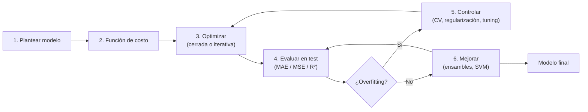
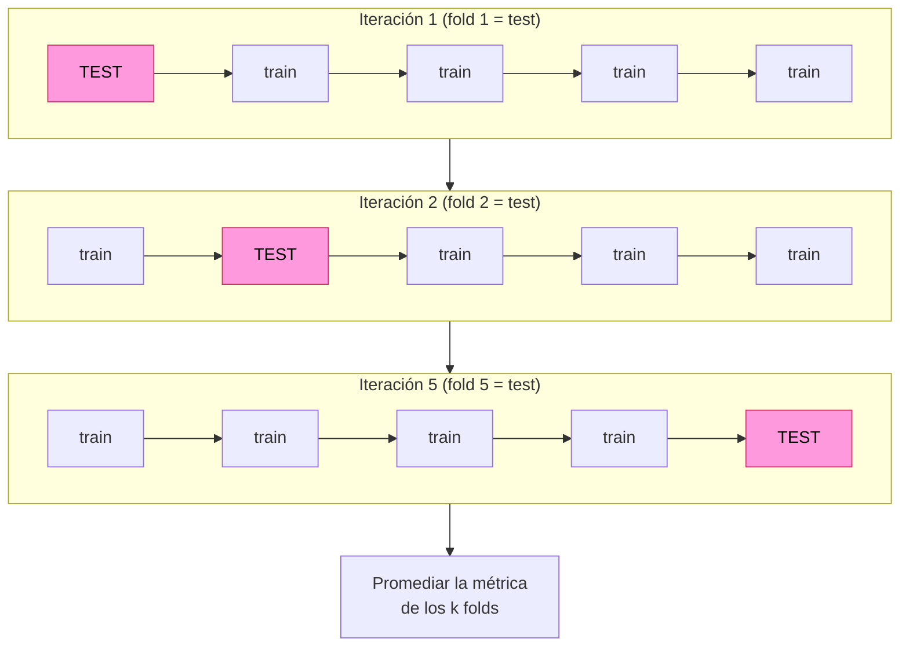
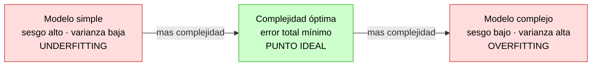
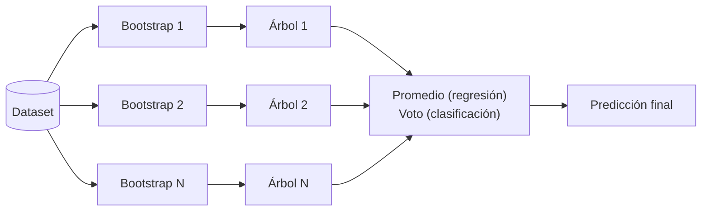
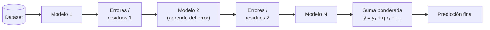
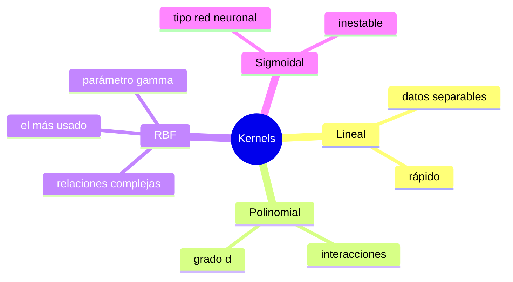
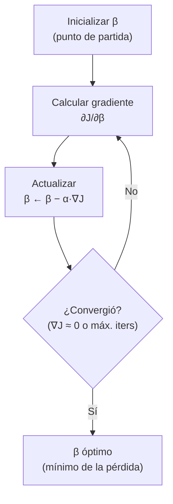
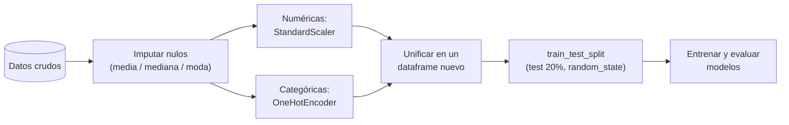
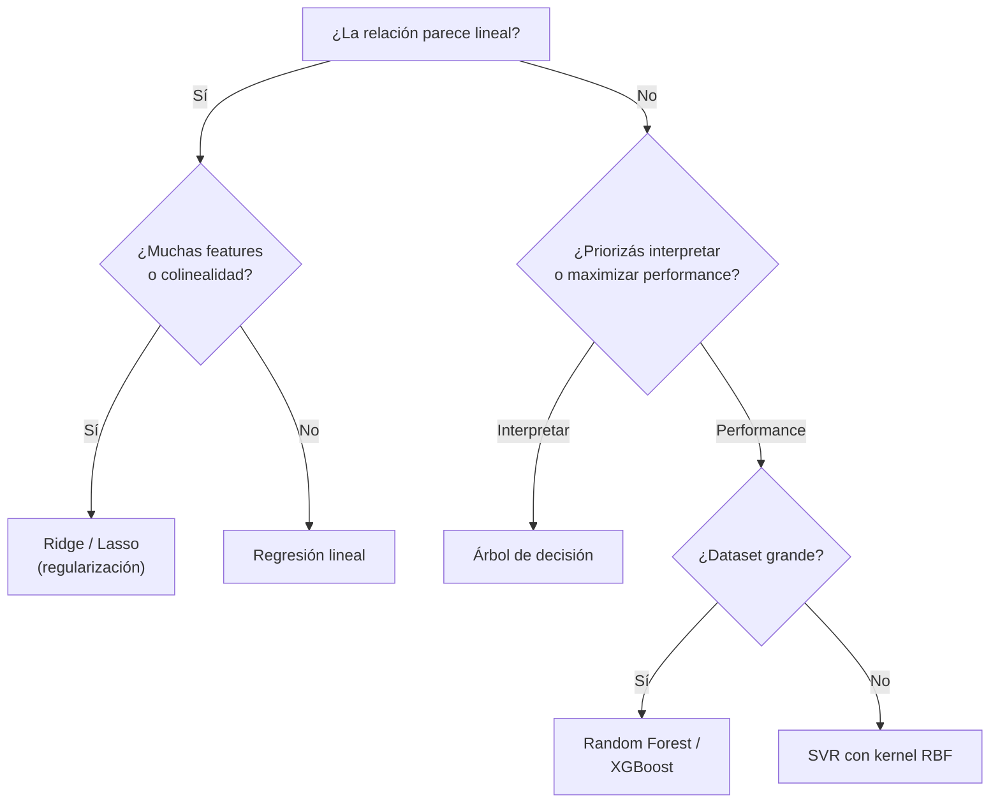

# Guía de estudio — Módulo 03: Modelado avanzado en Machine Learning

> Repaso orientado a examen. Para cada tema: **qué es**, los **conceptos clave** que suelen tomarse, un **ejemplo** y los **errores típicos** en los que se cae. Los apuntes teóricos sintetizados están en [`APUNTES.md`](APUNTES.md); acá se explican con más desarrollo y ejemplos.
>
> Convención de marcas:
> - **Concepto clave** → lo que hay que saber sí o sí.
> - ⚠️ **Ojo** → error típico o trampa de examen.

---

## Mapa del módulo

Todo el módulo es **aprendizaje supervisado**, mayormente **regresión** (target continuo). El hilo conductor es:

1. Plantear un modelo → 2. definir una **función de costo** → 3. **optimizarla** (cerrada o iterativa) → 4. **evaluar** con métricas en test → 5. **controlar el sobreajuste** (validación cruzada, regularización, tuning) → 6. **mejorar** con modelos más potentes (ensambles, SVM).



| Bloque | Temas |
|--------|-------|
| Fundamentos de regresión | Regresión lineal (simple/múltiple), función de costo, métricas, inferencia |
| Generalización | Validación cruzada, sesgo-varianza, regularización (Ridge/Lasso) |
| Modelos potentes | Ensambles (bagging, Random Forest, boosting, XGBoost), SVM/SVR y kernels |
| Optimización y ajuste | Convexidad, descenso del gradiente, tuning de hiperparámetros |
| Práctica | Preprocesamiento (imputación, escalado, encoding) y comparación de modelos |

---

## 1. Regresión lineal

**Qué es.** Predice una respuesta **cuantitativa** `Y` a partir de una o más variables `X`, asumiendo una relación aproximadamente **lineal**.

- **Simple:** `Y = β₀ + β₁·X + ε`
- **Múltiple:** `Y = β₀ + β₁X₁ + … + βₚXₚ + ε`

Donde `β₀` es el **intercepto** (valor esperado de `Y` cuando todas las `X = 0`), `βⱼ` son las **pendientes** (cuánto cambia `Y` por unidad de `Xⱼ`, con las demás fijas) y `ε` es el error. **Entrenar = estimar los coeficientes** `β̂`.

> **Concepto clave.** El **signo del coeficiente** indica la dirección de la relación (positivo: `Y` sube con `X`; negativo: baja). En regresión simple, el signo de la pendiente coincide con el signo del **coeficiente de correlación** `r`. Ej.: si `r = -0.30`, la pendiente es **negativa**.

**Ejemplo.** En el dataset `advertising`, `ventas = β₀ + β₁·TV + β₂·radio + β₃·diario`. Un `β_TV = 0.045` significa que, manteniendo radio y diario constantes, cada unidad extra de inversión en TV suma 0.045 a las ventas.

**Supuestos (para que la inferencia sea válida):**
1. **Linealidad** entre predictores y respuesta.
2. **Independencia** de los errores.
3. **Homocedasticidad**: varianza constante de los residuos.
4. **Normalidad** de los residuos.

⚠️ **Ojo.** La correlación mide relación **lineal**; un `r ≈ 0` no descarta una relación no lineal fuerte. Y correlación no implica causalidad.

---

## 2. Función de costo y mínimos cuadrados (OLS)

**Qué es.** La **función de costo** mide qué tan lejos están las predicciones de los valores reales. Entrenar = **minimizarla**.

- **Residuo:** `eᵢ = yᵢ − ŷᵢ` (real menos predicho).
- **Costo en regresión lineal (RSS):** `RSS = Σ(yᵢ − ŷᵢ)²` — suma de residuos al cuadrado.
- **OLS (mínimos cuadrados ordinarios):** elige los `β̂` que **minimizan RSS**.

**Solución cerrada (ecuación normal):** `β̂ = (Xᵀ·X)⁻¹·Xᵀ·y`. Existe porque la función de costo de la regresión lineal es **convexa** (un único mínimo global).

> **Concepto clave.** Se elevan los residuos **al cuadrado** por dos razones: para que errores positivos y negativos no se cancelen, y para **penalizar más los errores grandes**. Por eso OLS es sensible a outliers.

**Ejemplo.** Con puntos `(1,2), (2,2), (3,4)`, OLS busca la recta que minimiza la suma de las distancias verticales al cuadrado a esos tres puntos.

⚠️ **Ojo.** La ecuación normal requiere invertir `XᵀX`; si hay **colinealidad** severa esa matriz es casi singular y los coeficientes se vuelven inestables (otra razón para regularizar). Cuando no hay solución cerrada práctica, se usa **descenso del gradiente** (sección 11).

---

## 3. Métricas de regresión

| Métrica | Fórmula | Interpretación |
|---------|---------|----------------|
| **MAE** | `(1/n)·Σ|yᵢ − ŷᵢ|` | Error medio absoluto. Misma unidad que `y`. Robusto a outliers. |
| **MSE** | `(1/n)·Σ(yᵢ − ŷᵢ)²` | Penaliza más los errores grandes. Unidad **al cuadrado**. |
| **RMSE** | `√MSE` | Vuelve a la unidad de `y`; más interpretable. |
| **R²** | `1 − RSS/TSS` | Proporción de **varianza explicada** por el modelo. |

- **Descomposición:** `TSS = ESS + RSS` (Total = Explicada + Residual).
- **R²:** `1` = ajuste perfecto · `0` = igual que predecir la media · `< 0` = peor que la media.

> **Concepto clave — RMSE es interpretable.** Un `MSE = 4.0` no se lee como "4% de error" ni como varianza explicada; se interpreta por su raíz: `RMSE = √4 = 2`, o sea que **en promedio las predicciones se desvían ~2 unidades** de `y`.

> **Concepto clave — R² es invariante a la escala de `y`.** Si escalás/estandarizás la variable objetivo, el **R² no cambia** (es un cociente adimensional de varianzas). En cambio, **el intercepto, MSE, RMSE y MAE SÍ cambian** con la escala. Trampa clásica: te dan opciones de intercepto "chicas" (0.27, 0.32…) → señal de que el target está **estandarizado**.

**Ejemplo (MAE vs MSE).** Errores `[1, 1, 1, 5]`: MAE = 2, pero MSE = (1+1+1+25)/4 = 7. El único error grande (5) infla mucho más el MSE que el MAE → si te importan los outliers, mirá MSE/RMSE; si querés robustez, MAE.

⚠️ **Ojo.** No comparar métricas entre modelos con `y` en escalas distintas. Y un R² alto en **train** no dice nada: siempre reportar sobre **test**.

---

## 4. Validación cruzada

**Qué es.** Estima la **capacidad de generalización** a datos no vistos usando mejor los datos disponibles que un único split, y ayuda a detectar sobreajuste.

Idea del **K-Fold** (ejemplo con `k = 5`): cada fila es una iteración; el bloque de test rota y se promedia la métrica de las 5.



- **K-Fold:** se parte el dataset en `k` folds; se entrena en `k−1` y se valida en el restante, **rotando** y **promediando** la métrica sobre los `k` folds.
- **LOOCV** (Leave-One-Out): caso extremo `k = n` (un dato por fold). Muy poco sesgado pero **muy costoso**.
- **Stratified K-Fold:** mantiene la **proporción de clases** en cada fold (clasificación desbalanceada).
- En regresión se promedian MSE / RMSE / R² entre folds.

> **Concepto clave.** Más `k` ⇒ menos **sesgo** en la estimación del error pero más **varianza** y más costo. `k = 5` o `k = 10` es el estándar de compromiso.

**Ejemplo.** Con 10-fold CV se puede comparar XGBoost vs Random Forest promediando el R² de los 10 folds: es más confiable que un único `train_test_split`, que podría haber caído en una partición "afortunada".

⚠️ **Ojo.** Cualquier preprocesamiento que aprenda de los datos (scaler, imputador, selección de features) debe ajustarse **dentro** de cada fold (idealmente con `Pipeline`), no antes de partir, para no filtrar información del validación al entrenamiento (**data leakage**).

---

## 5. Inferencia sobre los coeficientes

Aplica sobre todo con `statsmodels` (OLS), que da p-values e intervalos de confianza.

- **Test F (significación global):** `H₀: β₁ = … = βₚ = 0` vs `H₁: al menos un βⱼ ≠ 0`. Un `Prob (F-statistic)` chico ⇒ el conjunto de predictores **sí** explica `Y`.
- **Test t (significación individual):** `H₀: βⱼ = 0` (la variable no aporta) vs `H₁: βⱼ ≠ 0`. Un **p-value < 0,05** ⇒ se rechaza `H₀`: hay evidencia de que `Xⱼ` se relaciona con `Y`.
- Complementar con **intervalos de confianza** de cada coeficiente.

> **Concepto clave.** Si `β₁ = 0`, el modelo se reduce a `Y = β₀ + ε`: la variable no aporta. El p-value evalúa exactamente esa hipótesis, variable por variable.

**Ejemplo.** En `advertising`, `TV` y `radio` suelen dar p-values ≈ 0 (significativos), mientras que `diario` da un p-value alto ⇒ no aporta y se puede quitar.

⚠️ **Ojo.** No confundir **significación estadística** (p-value chico) con **importancia práctica** (tamaño del efecto). Con muestras enormes, coeficientes minúsculos pueden salir "significativos".

---

## 6. Dilema sesgo-varianza (bias-variance)

El error esperado se descompone en: **sesgo² + varianza + error irreducible**.

- **Sesgo (bias):** error sistemático de un modelo demasiado **simple**. No baja por más datos → **underfitting**.
- **Varianza:** sensibilidad del modelo a la muestra concreta; un modelo demasiado **complejo** ajusta ruido → **overfitting**.
- **Trade-off:** al subir la complejidad, el sesgo baja y la varianza sube. El **error total tiene forma de U**; el mínimo es la **complejidad óptima**.

Al mover la complejidad del modelo, el error de test dibuja una **U**: primero baja (se corrige el sesgo) y luego vuelve a subir (aparece la varianza).



> **Concepto clave — cómo diagnosticar.** Error de train bajo **y** de test alto ⇒ **overfitting** (mucha varianza). Error alto en train **y** test ⇒ **underfitting** (mucho sesgo).

**Ejemplo (regresión polinómica).** Grado 1 sobre datos curvos → underfitting (RMSE alto en train y test). Grado 15 → overfitting (RMSE ~0 en train, altísimo en test). Algún grado intermedio minimiza el RMSE de test: ese es el punto óptimo de la U.

**Cómo mover cada palanca:**
- Reducir **varianza**: más datos, regularización, modelos más simples, bagging/Random Forest.
- Reducir **sesgo**: modelos más flexibles, más features, boosting.

⚠️ **Ojo.** Duplicar la profundidad de un árbol reduce sesgo pero sube varianza: puede mejorar o empeorar en test según dónde estabas en la U. No hay una respuesta universal; depende del caso.

---

## 7. Regularización (Ridge, Lasso, Elastic Net)

**Qué es.** Agrega una **penalidad** a la función de costo para **achicar los coeficientes** y controlar el sobreajuste: `Costo = RSS + α · penalidad(β)`. El hiperparámetro `α` (a veces `λ`) regula la fuerza y se elige por **cross-validation** (`RidgeCV`, `LassoCV`).

| Método | Penalidad | Norma | Efecto |
|--------|-----------|-------|--------|
| **Ridge** | `α·Σβⱼ²` | L2 | Achica los `β` hacia 0 **sin** anularlos; reparte peso entre variables colineales. |
| **Lasso** | `α·Σ|βⱼ|` | L1 | Lleva coeficientes **exactamente a 0** → **selección de variables** (modelos dispersos). |
| **Elastic Net** | `α(‖β‖₁ + ‖β‖₂²)` | L1+L2 | Combina ambas; calibra **dos** hiperparámetros. |

> **Concepto clave — estandarizar antes.** La penalidad depende de la **escala** de cada variable, así que hay que **estandarizar** los regresores antes de regularizar; si no, se penaliza más a las variables con unidades grandes.

> **Concepto clave — L1 vs L2.** Solo **Lasso (L1)** hace selección de variables (pone betas en 0). Ridge (L2) los reduce pero nunca a 0 exacto. Con `α → 0` ambos tienden a OLS; con `α` muy grande, todos los coeficientes tienden a 0 (underfitting).

**Ejemplo.** En `Credit` con variables colineales, Lasso deja en cero las redundantes y conserva las informativas → modelo más simple e interpretable. Ridge, en cambio, reparte el peso entre las colineales.

⚠️ **Ojo.** `α` chico = poca regularización (riesgo de overfitting); `α` grande = mucha (riesgo de underfitting). Es un caso más del trade-off sesgo-varianza.

---

## 8. Modelos de ensamble

**Qué es.** Combinan varios modelos para superar a cualquiera individual. Requieren modelos **poco correlacionados** entre sí para que sumen información. Dos familias:

### 8.1 Averaging (paralelo) — reduce **varianza**

Entrena estimadores **independientes** y promedia (regresión) o vota (clasificación). Base: modelos de alta varianza (árboles profundos). Los modelos se entrenan **en paralelo** sobre muestras bootstrap y se agregan:



- **Bagging** (Bootstrap Aggregation): entrena `N` modelos sobre `N` muestras **bootstrap** (con reemplazo) y agrega. Si cada árbol tiene varianza `S²`, el ensamble tiende a `S²/N`.
- **Random Forest:** bagging de árboles + en cada nodo se considera solo un subconjunto **aleatorio de `M` features** (los descorrelaciona). Reglas empíricas: `M = P/3` (regresión), `M = √P` (clasificación). Bagging es el caso `M = P`.
- **Extra Trees:** además elige los puntos de corte al azar (aún más aleatoriedad, menos varianza).

> **Concepto clave.** El aporte del Random Forest sobre el bagging simple es **descorrelacionar** los árboles restringiendo las features candidatas en cada nodo: árboles menos parecidos ⇒ el promedio baja más la varianza.

**Ejemplo.** En California `housing`, un Random Forest (`max_depth=15`) llega a R² ≈ 0.81, muy por encima de la regresión lineal (~0.63) y de un árbol solo. Y **`latitude`/`longitude`** resultan features muy informativas: al quitarlas, el MAE empeora ~36%.

### 8.2 Boosting (secuencial) — reduce **sesgo**

Entrena modelos **en secuencia**; cada uno corrige los errores del anterior. Combina **weak learners** en uno fuerte:



| Método | Idea | sklearn/lib |
|--------|------|-------------|
| **AdaBoost** | Sube el peso de las observaciones mal predichas; usa *stumps* con voto ponderado según su error. | `AdaBoost…` |
| **Gradient Boosting** | Cada árbol predice los **residuos** del anterior: `ŷ = y₁ + η·r₁ + … + η·r_N`. `η` (learning rate) controla la convergencia (η↓ ⇒ N↑). | `GradientBoosting…` |
| **XGBoost** | Gradient boosting optimizado: **gradientes de 2º orden**, rápido, paraleliza, maneja nulos, hace pruning y regulariza. | `xgboost` |

> **Concepto clave — averaging vs boosting.** Averaging (bagging/RF) ataca la **varianza** entrenando en paralelo; boosting ataca el **sesgo** entrenando en secuencia. Boosting suele dar más precisión pero es más propenso a overfitting y más sensible a hiperparámetros.

⚠️ **Ojo.** En boosting hay un trade-off entre **learning rate** (`η`) y número de estimadores (`N`): bajar `η` mejora la generalización pero exige **más** árboles para converger.

---

## 9. SVM, SVR y kernels

**Qué es.** SVM (Support Vector Machine) es un algoritmo supervisado (clasificación y regresión) que busca el **hiperplano que mejor separa las clases maximizando el margen** (distancia a los puntos más cercanos, los **vectores de soporte**). Más margen ⇒ mejor generalización.

- **Función de costo:** `L(w,b) = ½‖w‖² + C·Σ max(0, 1 − yᵢ(w·xᵢ + b))`. El término `½‖w‖²` **maximiza el margen**; `C` regula el trade-off entre margen y errores.
- **SVM lineal:** sirve cuando las clases son (casi) linealmente separables.
- **SVM no lineal (kernel trick):** un **kernel** calcula el producto escalar en un espacio de mayor dimensión **sin transformar explícitamente los datos**, habilitando fronteras no lineales.
- **SVR:** la versión de **regresión**; los kernels también se usan en **KPCA** (reducción de dimensionalidad no lineal).

**Kernels comunes:**

| Kernel | Fórmula | Cuándo |
|--------|---------|--------|
| Lineal | `K = xᵢ·xⱼ` | Datos linealmente separables. |
| Polinomial | `K = (xᵢ·xⱼ + c)^d` | Interacciones polinómicas. |
| **RBF** (gaussiano) | `K = exp(−γ‖xᵢ−xⱼ‖²)` | Relaciones complejas; el más usado por defecto. |
| Sigmoidal | `K = tanh(α·xᵢ·xⱼ + c)` | Similar a redes neuronales. |



**Hiperparámetros clave:**
- **C:** penalización de errores. `C` alto ⇒ ajusta todo (overfitting); `C` bajo ⇒ más margen y regularización (underfitting).
- **γ (gamma, RBF):** alcance de cada observación. `γ` alto ⇒ frontera muy flexible (overfitting).
- **kernel:** cambia drásticamente el resultado.

> **Concepto clave — escalar siempre.** SVM/SVR trabajan con **distancias**, así que hay que **estandarizar** las variables. Sin escalar, las de mayor rango dominan y el modelo rinde mal.

**Ejemplo.** En California `housing`, un `SVR()` con valores por defecto (kernel RBF) puede superar en R² a un árbol e incluso a una regresión lineal, quedando como uno de los mejores modelos "de caja". En `Hitters`, en cambio, el kernel importa muchísimo: RBF ≈ 0.65 de R² mientras que el sigmoidal da R² negativo.

⚠️ **Ojo.** Elegir kernel y sus parámetros es delicado y **costoso en datasets grandes** (escala mal con `n`). El default de sklearn es RBF, no lineal.

---

## 10. Optimización: convexidad y descenso del gradiente

### 10.1 Convexa vs no convexa

Se refiere a la **función objetivo del modelo** (no a la búsqueda de hiperparámetros).

- **Convexa:** un único **mínimo global**, fácil y garantizado de alcanzar. Ej.: regresión lineal, SVM lineal.
- **No convexa:** múltiples **mínimos locales**; más flexible pero difícil de optimizar. Ej.: redes neuronales, SVM no lineal.

### 10.2 Descenso del gradiente

**Qué es.** Algoritmo de optimización **iterativo** para minimizar la función de costo cuando no hay (o no conviene) solución cerrada. Se parte de un punto y se avanza en la **dirección negativa del gradiente**:

`βⱼ ← βⱼ − α · ∂J/∂βⱼ`



- **Gradiente:** vector de derivadas parciales; apunta al mayor **aumento** de la función y vale 0 en un mínimo/máximo.
- **Learning rate (α):** hiperparámetro clave. Muy grande ⇒ oscila y **no converge**; muy chico ⇒ converge **lento**.
- Variantes: **batch** (todo el dataset por paso), **estocástico/SGD** (un dato por paso) y **mini-batch** (lotes).

> **Concepto clave.** Si la función de costo es **convexa** (regresión lineal), el descenso del gradiente converge al **mínimo global**. Si es **no convexa** (logística, redes), puede quedar atrapado en un **mínimo local**: conviene reiniciar desde distintos puntos y **normalizar** las variables para acelerar y estabilizar la convergencia.

**Ejemplo.** Implementado desde cero para regresión lineal sobre `boston_data`: se ve la **curva de pérdida** bajando iteración a iteración hasta estabilizarse, y el resultado converge al de `LinearRegression` (que usa la solución cerrada).

⚠️ **Ojo.** Sin normalizar las features, el gradiente zigzaguea (curvas de nivel alargadas) y tarda mucho más. Elegir bien `α` es lo que más impacta en si converge o no.

---

## 11. Ajuste de hiperparámetros (tuning)

**Qué es.** Buscar la combinación de hiperparámetros que **mejor generaliza**, balanceando overfitting y underfitting. Se evalúa **siempre con validación cruzada**.

| Método | Idea | Pros / Contras | sklearn |
|--------|------|----------------|---------|
| **Grid Search** | Prueba **todas** las combinaciones de una grilla. | Exhaustivo y simple / muy costoso, no escala. | `GridSearchCV` |
| **Random Search** | Muestrea combinaciones **al azar**. | Rápido, buena cobertura / no garantiza el óptimo. | `RandomizedSearchCV` |
| **Bayesian Optimization** | Modelo probabilístico que usa las iteraciones previas para elegir las próximas. | Eficiente en nº de evaluaciones / más complejo. | `optuna`, `skopt` |

> **Concepto clave — parámetros vs hiperparámetros.** Los **parámetros** (los `β`, los cortes de un árbol) los **aprende** el modelo al entrenar. Los **hiperparámetros** (`max_depth`, `C`, `α`, `n_estimators`) los **fija el usuario** antes de entrenar y son los que se tunean.

⚠️ **Ojo.** Grid Search sufre la **maldición de la dimensionalidad**: el nº de combinaciones crece de forma multiplicativa. Con muchos hiperparámetros, Random Search suele encontrar buenas soluciones en mucho menos tiempo.

---

## 12. Preprocesamiento (parte práctica)

El flujo típico antes de entrenar, tal como se pide en la práctica del módulo:



1. **Valores faltantes:** imputar (p. ej. `total_bedrooms` con la **media**). Alternativas: mediana (robusta a outliers), moda (categóricas), o modelos que manejan nulos (XGBoost).
2. **Escalado de numéricas:** `StandardScaler` (media 0, desvío 1) o `MinMaxScaler` (a `[0,1]`). Necesario para modelos basados en distancias/gradiente (SVM, KNN, regularización, descenso del gradiente); **no** para árboles/ensambles de árboles.
3. **Encoding de categóricas:** `OneHotEncoder` crea una columna binaria por categoría. Evita imponer un orden falso (lo que sí haría un encoding entero).
4. **Unificar** en un único dataframe y **split** train/test (p. ej. 20% test) fijando una **semilla** (`random_state`) para reproducibilidad.

> **Concepto clave — `fit` solo en train.** El scaler/imputador/encoder se **ajusta (`fit`) con los datos de entrenamiento** y se **aplica (`transform`)** a test. Ajustar con todo el dataset filtra información de test (**data leakage**) e infla las métricas.

> **Concepto clave — reproducibilidad.** Fijar `random_state` (en el split y en los modelos aleatorios como árboles/RF) hace que los resultados sean **reproducibles**. Cambiar la semilla cambia levemente las métricas.

⚠️ **Ojo — escalar el target.** Estandarizar también la variable objetivo es válido, pero cambia la escala del **intercepto, MAE, MSE y RMSE** (no el R²). Hay que ser consciente de en qué unidades quedan las métricas al interpretarlas.

---

## 13. ¿Qué modelo usar? (tabla de decisión)

| Modelo | Fortalezas | Debilidades | Escalar |
|--------|------------|-------------|:-------:|
| **Regresión lineal** | Simple, interpretable, rápida, inferencia estadística | Solo relaciones lineales; sensible a outliers y colinealidad | No* |
| **Ridge / Lasso** | Controla overfitting; Lasso selecciona variables | Sigue siendo lineal; hay que tunear `α` | **Sí** |
| **Árbol de decisión** | No lineal, interpretable, sin escalado | Alta varianza, overfitting fácil | No |
| **Random Forest** | Robusto, baja varianza, poco tuning, importancia de features | Menos interpretable, más pesado | No |
| **Boosting / XGBoost** | Suele dar la mejor precisión | Sensible a hiperparámetros, riesgo de overfitting | No |
| **SVR / SVM** | Potente con kernels; efectivo en alta dimensión | Costoso en datasets grandes; elegir kernel/params es delicado | **Sí** |

\* La regresión lineal no requiere escalar para predecir, pero **sí** si vas a comparar la magnitud de los coeficientes.

Guía rápida para arrancar (después igual conviene comparar con CV):



> **Concepto clave.** No hay un "mejor modelo" universal (**No Free Lunch**): depende de los datos. La receta segura es comparar varios con **validación cruzada** sobre las mismas métricas y elegir por evidencia, no por preferencia.

---

## 14. Cómo se evalúa un modelo en la práctica (código)

**Flujo estándar en scikit-learn** (idéntico para casi todos los modelos: `fit` → `predict` → métricas):

```python
from sklearn.model_selection import train_test_split
from sklearn.metrics import r2_score, mean_absolute_error, mean_squared_error
import numpy as np

X_train, X_test, y_train, y_test = train_test_split(X, y, test_size=0.2, random_state=42)

modelo.fit(X_train, y_train)            # 1. entrena (aprende los parámetros)
preds = modelo.predict(X_test)          # 2. predice sobre datos NO vistos

r2   = r2_score(y_test, preds)          # 3. evalúa en TEST
mae  = mean_absolute_error(y_test, preds)
mse  = mean_squared_error(y_test, preds)
rmse = np.sqrt(mse)
```

> **Concepto clave.** La API de sklearn es uniforme: **todo estimador** tiene `.fit(X, y)` y `.predict(X)`. Lo único que cambia entre modelos es la clase que instanciás y sus **hiperparámetros**. Por eso comparar modelos es cambiar una línea.

**Métricas en `sklearn.metrics`:**

| Función | Qué devuelve | Mejor cuando |
|---------|--------------|--------------|
| `r2_score(y, ŷ)` | R² (varianza explicada) | **↑** más alto (máx 1) |
| `mean_absolute_error(y, ŷ)` | MAE | **↓** más bajo |
| `mean_squared_error(y, ŷ)` | MSE | **↓** más bajo |
| `mean_squared_error(y, ŷ, squared=False)` | RMSE directo | **↓** más bajo |

Para **clasificación**: `accuracy_score`, `confusion_matrix`, `classification_report` (precision/recall/f1), `roc_auc_score`.

⚠️ **Ojo.** Evaluar **siempre sobre `X_test`/`y_test`**, nunca sobre train. Y usar el mismo split (misma `random_state`) para que la comparación entre modelos sea justa.

---

## 15. Cross-validation en código

Un único `train_test_split` puede caer en una partición "afortunada". La CV promedia sobre varias particiones:

```python
from sklearn.model_selection import cross_val_score, cross_validate, KFold

kf = KFold(n_splits=10, shuffle=True, random_state=42)

# Una métrica, varios folds
scores = cross_val_score(modelo, X, y, cv=kf, scoring='r2')
print(scores.mean(), scores.std())     # R² promedio ± dispersión entre folds

# Varias métricas a la vez
res = cross_validate(modelo, X, y, cv=kf,
                     scoring=['r2', 'neg_mean_squared_error', 'neg_mean_absolute_error'])
print(res['test_r2'].mean())
```

> **Concepto clave — el `neg_` de sklearn.** El convenio de sklearn es que **mayor score = mejor**, así que las métricas de error se pasan **negadas** (`neg_mean_squared_error`). El MSE real es `-res['test_neg_mean_squared_error']`.

**Evitar data leakage con `Pipeline`** — el scaler se ajusta **dentro** de cada fold, no antes de partir:

```python
from sklearn.pipeline import make_pipeline
from sklearn.preprocessing import StandardScaler
from sklearn.svm import SVR

pipe = make_pipeline(StandardScaler(), SVR())        # scaler + modelo como una unidad
scores = cross_val_score(pipe, X, y, cv=kf, scoring='r2')
```

Valores típicos de `k`: **5 o 10**. Variantes: `StratifiedKFold` (clasificación desbalanceada), `LeaveOneOut` (`k = n`), `TimeSeriesSplit` (series temporales, sin barajar).

⚠️ **Ojo.** Si escalás/imputás **antes** del `cross_val_score`, filtrás información de los folds de validación → métricas infladas. Encapsular en `Pipeline` lo resuelve.

---

## 16. Hiperparámetros por modelo (referencia)

Qué tocar en cada modelo y en qué dirección empuja el trade-off sesgo-varianza.

### Árbol de decisión (`DecisionTreeRegressor`)
| Hiperparámetro | Qué hace | Efecto |
|----------------|----------|--------|
| `max_depth` | Profundidad máxima | ↑ ⇒ más complejo (menos sesgo, más varianza / overfitting) |
| `min_samples_split` | Mín. muestras para dividir un nodo | ↑ ⇒ más simple (regulariza) |
| `min_samples_leaf` | Mín. muestras por hoja | ↑ ⇒ más simple |
| `max_features` | Features consideradas por corte | ↓ ⇒ más aleatoriedad |
| `random_state` | Semilla (reproducibilidad) | fija el resultado |

### Random Forest (`RandomForestRegressor`)
| Hiperparámetro | Qué hace | Efecto |
|----------------|----------|--------|
| `n_estimators` | Nº de árboles | ↑ ⇒ más estable (más cómputo); no sobreajusta por subir |
| `max_depth` | Profundidad de cada árbol | ↑ ⇒ árboles más complejos |
| `max_features` | Features candidatas por nodo | Clave para **descorrelacionar** (`P/3` regresión, `√P` clasif.) |
| `min_samples_leaf` | Mín. por hoja | ↑ ⇒ regulariza |
| `bootstrap` | Muestreo con reemplazo | `True` = bagging |

### Boosting / XGBoost
| Hiperparámetro | Qué hace | Efecto |
|----------------|----------|--------|
| `n_estimators` | Nº de árboles secuenciales | ↑ ⇒ menos sesgo, riesgo de overfitting |
| `learning_rate` (`η`) | Peso de cada árbol | ↓ ⇒ mejor generalización pero exige más árboles |
| `max_depth` | Profundidad de cada weak learner | Chico (3-6) suele bastar |
| `subsample` / `colsample_bytree` | Submuestreo de filas/columnas | < 1 ⇒ regulariza (XGBoost) |
| `reg_alpha` / `reg_lambda` | Regularización L1 / L2 | ↑ ⇒ regulariza (XGBoost) |

> **Concepto clave — el par `learning_rate` ↔ `n_estimators`.** En boosting van de la mano: bajar el learning rate mejora la generalización pero necesita **más** estimadores para converger.

### SVM / SVR (`SVC` / `SVR`)
| Hiperparámetro | Qué hace | Efecto |
|----------------|----------|--------|
| `C` | Penalización de errores | ↑ ⇒ ajusta todo (overfitting); ↓ ⇒ más margen (underfitting) |
| `kernel` | `linear` / `poly` / `rbf` / `sigmoid` | Cambia drásticamente la frontera |
| `gamma` | Alcance de cada punto (RBF) | ↑ ⇒ muy flexible (overfitting) |
| `degree` | Grado (kernel `poly`) | ↑ ⇒ más complejo |
| `epsilon` | Ancho del tubo sin penalización (SVR) | ↑ ⇒ más tolerante al error |

> Recordar: **escalar siempre** antes de SVM/SVR.

### Regularización lineal (`Ridge` / `Lasso` / `ElasticNet`)
| Hiperparámetro | Qué hace | Efecto |
|----------------|----------|--------|
| `alpha` (`α`/`λ`) | Fuerza de la penalidad | ↑ ⇒ más regularización (β→0); ↓ ⇒ tiende a OLS |
| `l1_ratio` | Mezcla L1/L2 (ElasticNet) | 1 = Lasso puro, 0 = Ridge puro |

> Elegir `alpha` por CV con `RidgeCV` / `LassoCV`. Estandarizar antes.

---

## 17. Búsqueda de hiperparámetros en código

```python
from sklearn.model_selection import GridSearchCV, RandomizedSearchCV
from sklearn.ensemble import RandomForestRegressor
from scipy.stats import randint

# Grid Search: prueba TODAS las combinaciones de la grilla
grid = {'max_depth': [10, 15, 20], 'n_estimators': [100, 300]}
gs = GridSearchCV(RandomForestRegressor(random_state=20), grid,
                  cv=5, scoring='r2', n_jobs=-1)
gs.fit(X_train, y_train)
print(gs.best_params_, gs.best_score_)      # mejor combo y su R² promedio en CV
mejor = gs.best_estimator_                  # modelo ya reentrenado con los mejores params

# Random Search: muestrea al azar del espacio (más barato con muchos hiperparámetros)
dist = {'max_depth': randint(5, 25), 'n_estimators': randint(100, 500)}
rs = RandomizedSearchCV(RandomForestRegressor(random_state=20), dist,
                        n_iter=20, cv=5, scoring='r2', n_jobs=-1, random_state=42)
rs.fit(X_train, y_train)
```

> **Concepto clave.** Ambos usan **CV internamente** (`cv=5`) para puntuar cada combinación, y al terminar **reentrenan** el mejor modelo sobre todo el train (`best_estimator_`). Grid es exhaustivo (crece de forma multiplicativa); Random muestrea `n_iter` combinaciones y suele encontrar buenas soluciones mucho más rápido.

⚠️ **Ojo.** Tunear mirando el **test** filtra información y sobreestima la performance. Lo correcto: tunear con CV **sobre train** y usar test solo al final, una vez, para reportar.

---

## 18. Glosario y errores típicos (repaso rápido)

**Conceptos clave para tener frescos:**

- **Supervisado vs no supervisado:** supervisado aprende de datos **con label** (target conocido); no supervisado **no tiene label** y agrupa observaciones (**clustering**).
- **Clasificación vs regresión:** ambos supervisados; clasificación → target **categórico**, regresión → target **continuo**.
- **R² invariante a la escala de `y`**; intercepto/MAE/MSE/RMSE **no** lo son.
- **RMSE = √MSE**, en las unidades de `y` → error promedio interpretable.
- **Signo de `r` = signo de la pendiente.** `r` negativo ⇒ pendiente negativa; `r ≠ 0` ⇒ sí hay correlación (aunque sea débil).
- **La varianza nunca es negativa** (trampa de examen).
- **Averaging reduce varianza; boosting reduce sesgo.**
- **Solo Lasso (L1) anula coeficientes** (selección de variables).
- **Escalar es obligatorio** en SVM/SVR, regularización y descenso del gradiente; **innecesario** en árboles/ensambles de árboles.
- **`fit` solo en train** (evitar data leakage).

**Errores típicos en los que no hay que caer:**

- Interpretar el **MSE como un porcentaje** de error.
- Reportar métricas de **train** en vez de **test**.
- Comparar R²/MSE entre modelos con `y` en **escalas distintas**.
- Confundir **significación estadística** con **importancia práctica**.
- Olvidar **estandarizar** antes de regularizar o de usar SVM.
- Suponer que **más profundidad/complejidad siempre mejora** (depende de la curva en U del sesgo-varianza).
- Ajustar el **scaler/encoder con todo el dataset** antes del split.

---

[← Volver al módulo](README.md) · Teoría sintetizada: [APUNTES.md](APUNTES.md)
