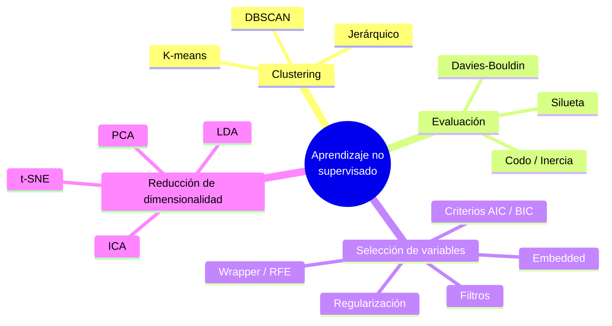

# Referencia Técnica — Aprendizaje no Supervisado (ML3)

> Manual de consulta rápida del módulo. Para cada técnica: **qué es**, **cuándo aplicarla**, **para qué**, **hiperparámetros clave**, **cómo se evalúa** y **snippet** de `scikit-learn`. Pensado como referencia de examen y de trabajo.
>
> Fuentes: las slides convertidas en [`teoria/`](teoria/) y las prácticas en [`notebooks/`](notebooks/). Índice de clases en el [README del módulo](README.md).

---

## 0. Mapa mental del módulo



**Dos grandes familias del aprendizaje no supervisado:**

| Familia | Objetivo | Técnicas |
|---------|----------|----------|
| **Clustering** | Agrupar observaciones similares sin etiquetas | K-means, jerárquico, DBSCAN |
| **Reducción de dimensionalidad** | Bajar el nº de variables preservando información | PCA, LDA, t-SNE, ICA |

Y una familia transversal, **selección de variables**, que se solapa con lo supervisado (filtros, RFE, embedded, regularización).

---

## 1. Clustering

Agrupar datos en **clusters** de forma que los puntos de un mismo grupo sean más parecidos entre sí que con los de otros grupos. No hay variable objetivo.

### 1.1 K-means

| | |
|--|--|
| **Qué es** | Particiona los datos en **k** clusters minimizando la **inercia** (suma de distancias al cuadrado de cada punto a su centroide). |
| **Cómo funciona** | Iterativo: (1) inicializa k centroides, (2) asigna cada punto al centroide más cercano, (3) recalcula centroides como la media del cluster, (4) repite hasta converger. |
| **Cuándo usar** | Sabés (o podés estimar) el número de clusters; los grupos son aproximadamente **esféricos** y de tamaño similar; dataset grande (escala bien). |
| **Cuándo NO** | Formas arbitrarias (anillos, medias lunas), clusters de densidad/tamaño muy distinto, presencia de outliers (los arrastra). |
| **Hiperparámetros** | `n_clusters` (**el** hiperparámetro), `init` (`k-means++` por defecto), `n_init` (nº de reinicios), `max_iter`. |
| **Sensible a escala** | **Sí** → estandarizar antes. |
| **Cómo se evalúa** | Método del **codo** (inercia), coeficiente de **silueta**, Davies-Bouldin (ver §2). |

```python
from sklearn.preprocessing import StandardScaler
from sklearn.cluster import KMeans

X_scaled = StandardScaler().fit_transform(X)
km = KMeans(n_clusters=3, init="k-means++", n_init=10, random_state=42)
labels = km.fit_predict(X_scaled)
km.inertia_          # WCSS, para el método del codo
km.cluster_centers_  # centroides
```

### 1.2 Clustering jerárquico (aglomerativo)

| | |
|--|--|
| **Qué es** | Construye una jerarquía de clusters fusionando iterativamente los más cercanos. Se visualiza con un **dendrograma**. |
| **Cuándo usar** | No sabés cuántos clusters hay (elegís el corte a posteriori); querés entender la **estructura jerárquica**; dataset chico/mediano. |
| **Cuándo NO** | Datasets grandes (costo O(n²) o peor). |
| **Hiperparámetros** | `n_clusters` o `distance_threshold` (dónde cortar), `linkage` (enlace), `metric` (distancia). |
| **Métodos de enlace (`linkage`)** | **simple** (min), **completo** (max), **promedio** (average), **centroide**, **Ward** (minimiza varianza intra-cluster; el más usado). |
| **Cómo se lee el dendrograma** | La altura de cada fusión = distancia entre grupos. Se corta a una altura para obtener k clusters. |

```python
from scipy.cluster.hierarchy import linkage, dendrogram, fcluster
Z = linkage(X_scaled, method="ward", metric="euclidean")
dendrogram(Z)
labels = fcluster(Z, t=3, criterion="maxclust")   # cortar en 3 clusters
```

### 1.3 DBSCAN (clustering por densidad)

| | |
|--|--|
| **Qué es** | Density-Based Spatial Clustering. Define clusters como **regiones densas** separadas por regiones vacías. |
| **Cuándo usar** | Clusters de **forma arbitraria**; hay **ruido/outliers** que querés detectar; **no** querés fijar k de antemano. |
| **Cuándo NO** | Densidad muy variable entre clusters; alta dimensión (las distancias pierden sentido — maldición de la dimensión). |
| **Hiperparámetros** | `eps` (ε: radio de vecindad), `min_samples` (MinPts: mínimo de puntos para ser denso). |
| **Tipos de punto** | **Core** (≥ MinPts dentro de ε), **border** (dentro de ε de un core pero no es core), **noise/outlier** (ni uno ni otro → etiqueta `-1`). |
| **Cómo elegir ε** | Gráfico k-distancia (k = min_samples): buscar el "codo". |

```python
from sklearn.cluster import DBSCAN
db = DBSCAN(eps=0.5, min_samples=5).fit(X_scaled)
labels = db.labels_          # -1 = ruido
```

### 1.4 Comparativa de algoritmos de clustering

| Método | Nº clusters | Formas | Ruido | Escala | Hiperparámetro crítico |
|--------|:-----------:|--------|:-----:|--------|------------------------|
| **K-means** | Hay que fijarlo | Esféricas | Sensible | Rápido, escala bien | `n_clusters` |
| **Jerárquico** | Se decide al cortar | Según enlace | Según método | Pesado en datos grandes | `linkage` |
| **DBSCAN** | Automático | **Arbitrarias** | **Detecta ruido** | Sensible a `eps` | `eps` / `min_samples` |

Prácticas: [clustering_jerarquico_practica](notebooks/clustering_jerarquico_practica.ipynb) · [kmeans_practica](notebooks/kmeans_practica.ipynb) · [dbscan_practica](notebooks/dbscan_practica.ipynb) · [complementaria (wine + GridSearchCV)](notebooks/clustering_practica_complementaria.ipynb).

---

## 2. Evaluación de clusters

Como no hay etiquetas, se usan métricas **internas** (basadas en la geometría de los clusters).

| Método | Qué mide | Cómo se lee | Rango |
|--------|----------|-------------|-------|
| **Método del codo** | Inercia / WCSS (suma de distancias² intra-cluster) vs. k | Elegir el **k del "codo"**: donde la mejora se vuelve marginal | Inercia ↓ con k |
| **Coeficiente de silueta** | Cohesión vs. separación: `s = (b − a) / max(a, b)` con `a` = dist. media intra-cluster, `b` = dist. media al cluster vecino más cercano | Cercano a **+1** bien agrupado; ~0 en la frontera; **negativo** mal asignado | [−1, +1] |
| **Davies-Bouldin** | Relación dispersión intra / separación inter | **Menor = mejor** | ≥ 0 |

> **Buena práctica:** validar con **ambos** (codo y silueta). Es habitual que el codo sugiera un k y la silueta otro — se decide con criterio del dominio. (Visto en la práctica de métodos embedded sobre Iris: codo → 3, silueta → 2.)

```python
from sklearn.metrics import silhouette_score, davies_bouldin_score
silhouette_score(X_scaled, labels)      # más alto mejor
davies_bouldin_score(X_scaled, labels)  # más bajo mejor
```

Práctica: [evaluacion_clusters_practica](notebooks/evaluacion_clusters_practica.ipynb).

---

## 3. Selección de variables

Reducir el nº de features **eligiendo un subconjunto** de las originales (a diferencia de la reducción de dimensionalidad, que **crea** variables nuevas). Mejora rendimiento, interpretabilidad, reduce overfitting y acelera el entrenamiento.

### 3.1 Métodos basados en filtros (filter)

Evalúan cada variable con una **medida estadística**, **sin** entrenar un modelo. Rápidos; se aplican antes de modelar.

| Método | Para qué tipo de problema | Idea |
|--------|---------------------------|------|
| **Correlación (Pearson)** | Regresión | Selecciona features con coef. cercano a **±1** con el target |
| **Chi-cuadrado (χ²)** | Clasificación, variables **categóricas** | Mide dependencia feature-clase; mayor score (menor p-value) = más relevante |
| **ANOVA (F-test)** | Clasificación, features numéricas | Compara varianza entre clases; mayor F = mejor separación |
| **Coeficientes (modelos lineales)** | Regresión/logística | Mayor |coeficiente| = más influyente |

```python
from sklearn.feature_selection import SelectKBest, f_classif, chi2
X_new = SelectKBest(score_func=f_classif, k=5).fit_transform(X, y)  # ANOVA
```

### 3.2 Wrapper — RFE (Eliminación Recursiva de Características)

| | |
|--|--|
| **Qué es** | Entrena un modelo, elimina la feature **menos importante**, reentrena, y repite hasta el nº deseado. |
| **Cuándo usar** | Querés el subconjunto que **maximiza el rendimiento** de un modelo concreto y podés pagar el costo. |
| **Contra** | **Computacionalmente caro** (entrena en cada iteración). |

```python
from sklearn.feature_selection import RFE
from sklearn.svm import SVC
rfe = RFE(estimator=SVC(kernel="linear"), n_features_to_select=5).fit(X, y)
rfe.support_, rfe.ranking_
```

### 3.3 Embedded (la selección ocurre dentro del entrenamiento)

Árboles y Random Forest exponen `feature_importances_`; se eligen las más importantes. Mantiene las features **originales**.

```python
from sklearn.ensemble import RandomForestClassifier
from sklearn.feature_selection import SelectFromModel
rf = RandomForestClassifier().fit(X, y)
rf.feature_importances_
X_sel = SelectFromModel(rf, prefit=True).transform(X)
```

Práctica: [seleccion_variables_embedded_practica](notebooks/seleccion_variables_embedded_practica.ipynb).

### 3.4 Filtros vs RFE — cuándo cada uno

| Criterio | Filtros | RFE |
|----------|---------|-----|
| Depende de un modelo | No | **Sí** |
| Costo | Bajo (rápido) | Alto (iterativo) |
| Cuándo | Screening rápido antes de modelar | Optimizar el modelo final |

---

## 4. Regularización como selección de variables

Añade una **penalización** a la función de costo para controlar la magnitud de los coeficientes: `Costo = RSS + α · penalización`. El hiperparámetro **α (o λ)** regula la fuerza; se elige por **cross-validation**.

| Método | Norma | ¿Anula coeficientes? | Cuándo usar |
|--------|:-----:|:--------------------:|-------------|
| **Ridge** | L2 (`Σβ²`) | **No** (los achica hacia 0) | Colinealidad; querés conservar todas las variables |
| **Lasso** | L1 (`Σ|β|`) | **Sí** (a cero exacto) | **Selección automática** de variables; modelos dispersos |
| **Elastic Net** | L1 + L2 | Sí (parcial) | Combina ambas; muchas features correlacionadas. **2 hiperparámetros** (λ y α) |

> **Recordá estandarizar** antes de regularizar: la penalización depende de la escala de los coeficientes.

```python
from sklearn.linear_model import RidgeCV, LassoCV, ElasticNetCV
lasso = LassoCV(cv=5).fit(X_scaled, y)   # elige alpha por CV
lasso.coef_    # los que quedan en 0 fueron descartados
```

---

## 5. Criterios de selección de modelos (AIC / BIC)

Comparan modelos equilibrando **ajuste vs complejidad** (penalizan el nº de parámetros para evitar overfitting). **Menor valor = mejor.**

| | AIC | BIC |
|--|-----|-----|
| **Fórmula** | `2k − 2·ln(L)` | `ln(n)·k − 2·ln(L)` |
| **Penalización** | `2` por parámetro (fija) | `ln(n)` (crece con la muestra) |
| **Tendencia** | Admite modelos más complejos | Más conservador (modelos simples) |

Donde `k` = nº de parámetros, `n` = nº de observaciones, `L` = máxima verosimilitud. Usos: comparar modelos de regresión, ARIMA (series temporales), o el nº de componentes en un **GMM** (clustering).

---

## 6. La maldición de la dimensión

Problemas al trabajar en **alta dimensión**:

- **Dispersión:** los datos se separan; las distancias se vuelven **uniformes** y pierden significado → degradan K-means y K-NN.
- **Costo computacional** que crece exponencialmente.
- **Overfitting:** con muchas features el modelo aprende ruido.
- **Visualización** imposible más allá de 3D.

**Mitigaciones:** reducción de dimensionalidad (PCA, t-SNE, UMAP), selección de características, regularización (L1/L2), algoritmos eficientes. Es el puente entre la selección de variables (§3-4) y la reducción de dimensionalidad (§7).

---

## 7. Reducción de dimensionalidad

**Crea** nuevas variables (combinaciones de las originales) que preservan la información. Distinto de seleccionar (§3), que conserva las originales.

### 7.1 PCA (Análisis de Componentes Principales)

| | |
|--|--|
| **Qué es** | Técnica **lineal, no supervisada**. Encuentra las direcciones (**componentes principales**) de **máxima varianza**, ortogonales entre sí. |
| **Cuándo usar** | Reducir dimensión conservando varianza; **descorrelacionar** features; visualizar en 2-3D; preprocesar antes de entrenar. |
| **Pasos** | (1) centrar datos, (2) matriz de covarianza, (3) valores/vectores propios, (4) ordenar por valor propio, (5) proyectar sobre los top componentes. |
| **Cómo elegir nº de componentes** | **Scree plot** (codo en los valores propios) o varianza explicada acumulada (ej. retener el 95%). |
| **Sensible a escala** | **Sí** → estandarizar antes. |
| **Ojo** | En preprocesamiento: `fit` solo con train para no filtrar información. |

```python
from sklearn.decomposition import PCA
pca = PCA(n_components=0.95)          # retener 95% de la varianza
X_red = pca.fit_transform(X_scaled)
pca.explained_variance_ratio_        # varianza explicada por componente
```

Prácticas: [aplicaciones_pca_practica](notebooks/aplicaciones_pca_practica.ipynb).

### 7.2 LDA (Análisis Discriminante Lineal)

| | |
|--|--|
| **Qué es** | Técnica **lineal, supervisada**. Busca la proyección que **maximiza la separación entre clases** (razón varianza entre-clases / dentro-de-clase). |
| **Cuándo usar** | Tenés **etiquetas** y querés reducir dimensión **mejorando la separación** entre clases; preprocesamiento para clasificación multiclase; reconocimiento facial. |
| **Límite** | Genera como máximo **(nº de clases − 1)** componentes. |
| **PCA vs LDA** | PCA = máxima varianza, ignora clases. LDA = máxima separación, usa clases. |

```python
from sklearn.discriminant_analysis import LinearDiscriminantAnalysis as LDA
X_lda = LDA(n_components=2).fit_transform(X, y)   # requiere y (supervisado)
```

### 7.3 t-SNE e ICA

| Técnica | Tipo | Para qué |
|---------|------|----------|
| **t-SNE** | No lineal | **Visualización** de datos complejos en 2-3D; preserva la estructura de **vecinos locales**. No usar para preprocesar (no preserva distancias globales ni es determinista). |
| **ICA** | Lineal | Separar señales **estadísticamente independientes** mezcladas (ej. separación de fuentes de audio, "cocktail party"). |

### 7.4 Comparativa de reducción de dimensionalidad

| Técnica | Lineal | Supervisada | Maximiza | Uso principal |
|---------|:------:|:-----------:|----------|---------------|
| **PCA** | Sí | No | Varianza | Compresión / descorrelación / preprocesamiento |
| **LDA** | Sí | **Sí** | Separación entre clases | Preprocesamiento para clasificación |
| **t-SNE** | No | No | Estructura local | **Visualización** |
| **ICA** | Sí | No | Independencia estadística | Separación de fuentes |

---

## 8. Tabla maestra — ¿qué técnica uso?

| Necesito… | Técnica | Sección |
|-----------|---------|:-------:|
| Agrupar sin etiquetas, sé cuántos grupos, son esféricos | **K-means** | §1.1 |
| Agrupar y ver la estructura jerárquica / no sé cuántos grupos | **Jerárquico** | §1.2 |
| Agrupar formas raras y detectar outliers | **DBSCAN** | §1.3 |
| Elegir el nº óptimo de clusters | **Codo + Silueta** | §2 |
| Descartar features rápido, sin modelo | **Filtros (χ², ANOVA, correlación)** | §3.1 |
| El mejor subconjunto para un modelo | **RFE** | §3.2 |
| Selección automática dentro de un lineal | **Lasso / Elastic Net** | §4 |
| Reducir dimensión conservando varianza | **PCA** | §7.1 |
| Reducir dimensión y separar clases (con etiquetas) | **LDA** | §7.2 |
| Visualizar datos de alta dimensión en 2D | **t-SNE** | §7.3 |
| Comparar modelos por ajuste/complejidad | **AIC / BIC** | §5 |

---

## 9. Cheatsheet de código (scikit-learn)

```python
# --- Preprocesamiento (casi siempre primero) ---
from sklearn.preprocessing import StandardScaler
X_scaled = StandardScaler().fit_transform(X)

# --- Clustering ---
from sklearn.cluster import KMeans, DBSCAN
KMeans(n_clusters=3, n_init=10, random_state=42).fit_predict(X_scaled)
DBSCAN(eps=0.5, min_samples=5).fit_predict(X_scaled)
from scipy.cluster.hierarchy import linkage, fcluster
fcluster(linkage(X_scaled, method="ward"), t=3, criterion="maxclust")

# --- Evaluación de clusters ---
from sklearn.metrics import silhouette_score, davies_bouldin_score

# --- Selección de variables ---
from sklearn.feature_selection import SelectKBest, f_classif, RFE, SelectFromModel
from sklearn.linear_model import LassoCV

# --- Reducción de dimensionalidad ---
from sklearn.decomposition import PCA, FastICA
from sklearn.discriminant_analysis import LinearDiscriminantAnalysis
from sklearn.manifold import TSNE
```

**Regla de oro:** estandarizar antes de cualquier método basado en distancias o en magnitud de coeficientes (K-means, DBSCAN, PCA, Ridge/Lasso). En preprocesamiento supervisado, `fit` solo con train.

---

## 10. Glosario rápido

- **Inercia / WCSS:** suma de distancias al cuadrado de cada punto a su centroide. La minimiza K-means.
- **Silueta:** `(b − a)/max(a,b)`; cohesión vs separación de cada punto.
- **Core / border / noise (DBSCAN):** punto denso / en el borde / outlier.
- **Componente principal:** dirección de máxima varianza (PCA); combinación lineal ortogonal de las variables originales.
- **Valor/vector propio:** dirección principal (vector) y cuánta varianza explica (valor).
- **Scree plot:** gráfico de valores propios ordenados; su "codo" indica cuántos componentes retener.
- **Varianza explicada:** proporción de la varianza total capturada por un componente.
- **Norma L1 / L2:** suma de |valores| / raíz de suma de cuadrados; base de Lasso / Ridge.
- **AIC / BIC:** criterios de selección de modelo (ajuste vs complejidad); menor = mejor.
- **Maldición de la dimensión:** degradación de distancias y algoritmos en alta dimensión.

---

[← Volver al README del módulo](README.md) · [← Índice del repositorio](../README.md)
