# Manual de Data Science — Digital House

> Manual de estudio del programa, ordenado **de lo más básico a lo más complejo**: cada parte se apoya en la anterior. No sigue el orden de la cursada — para eso está la [tabla de equivalencia](#equivalencia-con-los-módulos-del-programa) más abajo.
>
> Cada tema combina **dos criterios**: los **apuntes** (la teoría explicada para entender y estudiar) y, en la Parte VIII, la **referencia técnica** (cuándo aplicar cada técnica, hiperparámetros, cómo se evalúa y snippets de `scikit-learn`).
>
> Cada PDF del curso tiene además su conversión 1:1 en un `.md` al lado del archivo, en la carpeta del módulo. Donde el material de origen tenía errores, se corrigen y se marcan con **Nota**. Las notas que dicen **verificado en notebook** contienen resultados medidos, no citados.

## Índice

**[Parte I — Fundamentos](#parte-i--fundamentos)**
[1. ¿Qué es Machine Learning?](#1-qué-es-machine-learning) · [2. Datasets, features y labels](#2-datasets-features-y-labels) · [3. Tipos de aprendizaje](#3-tipos-de-aprendizaje) · [4. El ciclo de vida de un proyecto de ML](#4-el-ciclo-de-vida-de-un-proyecto-de-ml) · [5. Preparación de datos y EDA](#5-preparación-de-datos-y-eda)

**[Parte II — Cómo se evalúa un modelo](#parte-ii--cómo-se-evalúa-un-modelo)**
[6. Train/test y validación cruzada](#6-traintest-y-validación-cruzada) · [7. Sobreajuste, subajuste y sesgo-varianza](#7-sobreajuste-subajuste-y-el-compromiso-sesgo-varianza) · [8. Métricas de clasificación](#8-métricas-de-clasificación) · [9. Métricas de regresión](#9-métricas-de-regresión)

**[Parte III — Modelos lineales](#parte-iii--modelos-lineales)**
[10. Clasificadores lineales](#10-clasificadores-lineales) · [11. Regresión lineal](#11-regresión-lineal) · [12. Inferencia sobre los coeficientes](#12-inferencia-sobre-los-coeficientes)

**[Parte IV — Modelos no lineales](#parte-iv--modelos-no-lineales)**
[13. Árboles de decisión](#13-árboles-de-decisión) · [14. Ensambles y XGBoost](#14-ensambles-y-xgboost)

**[Parte V — Complejidad del modelo y selección](#parte-v--complejidad-del-modelo-y-selección)**
[15. Regularización: Ridge, Lasso y Elastic Net](#15-regularización-ridge-lasso-y-elastic-net) · [16. Selección de variables](#16-selección-de-variables) · [17. Criterios de selección de modelos (AIC y BIC)](#17-criterios-de-selección-de-modelos-aic-y-bic)

**[Parte VI — Aprendizaje no supervisado](#parte-vi--aprendizaje-no-supervisado)**
[18. Clustering con K-means](#18-clustering-con-k-means) · [19. Clustering jerárquico](#19-clustering-jerárquico) · [20. DBSCAN](#20-dbscan-clustering-por-densidad) · [21. Evaluación de clusters](#21-evaluación-de-clusters) · [22. La maldición de la dimensión](#22-la-maldición-de-la-dimensión) · [23. Reducción de dimensionalidad](#23-reducción-de-dimensionalidad)

**[Parte VII — Redes neuronales](#parte-vii--redes-neuronales)**
[24. Fundamentos biológicos](#24-fundamentos-biológicos) · [25. Historia](#25-historia-de-las-redes-neuronales) · [26. El perceptrón](#26-el-perceptrón-estructura-y-fórmulas) · [27. Entrenamiento: la compuerta AND](#27-entrenamiento-del-perceptrón-la-compuerta-and) · [28. Limitaciones](#28-limitaciones-del-perceptrón) · [29. Implementación con scikit-learn](#29-implementación-con-scikit-learn) · [30. El perceptrón multicapa](#30-el-perceptrón-multicapa-mlp) · [31. Grafos y capa densa](#31-grafos-y-capa-densa) · [32. Funciones de activación](#32-funciones-de-activación) · [33. Diseño de la arquitectura](#33-diseño-de-la-arquitectura-de-la-red) · [34. Funciones de pérdida](#34-funciones-de-pérdida) · [35. Optimización y descenso de gradiente](#35-optimización-y-descenso-de-gradiente) · [36. Regularización en redes](#36-regularización-en-redes-neuronales) · [37. Backpropagation](#37-backpropagation) · [38. Persistencia de modelos](#38-persistencia-de-modelos)

**[Parte IX — Deep Learning con frameworks](#parte-ix--deep-learning-con-frameworks)**
[39. Por qué hacen falta TensorFlow y PyTorch](#39-por-qué-hacen-falta-tensorflow-y-pytorch) · [40. TensorFlow y Keras](#40-tensorflow-y-keras) · [41. PyTorch](#41-pytorch) · [42. Keras y PyTorch lado a lado](#42-keras-y-pytorch-lado-a-lado) · [43. Redes convolucionales](#43-redes-convolucionales-cnns) · [44. La capa convolucional](#44-la-capa-convolucional) · [45. Agrupamiento, aplanamiento y densas](#45-agrupamiento-aplanamiento-y-capas-densas) · [46. Redes recurrentes](#46-redes-recurrentes-rnns) · [47. GRU](#47-gru-unidades-recurrentes-con-compuertas) · [48. LSTM](#48-lstm-memoria-a-largo-plazo) · [49. RNNs en la práctica](#49-rnns-en-la-práctica-trabajar-con-texto) · [50. Procesamiento de lenguaje natural](#50-procesamiento-de-lenguaje-natural) · [51. Seq2Seq](#51-seq2seq-y-el-problema-del-cuello-de-botella) · [52. Mecanismos de atención](#52-mecanismos-de-atención) · [53. Transformadores](#53-transformadores)

**[Parte VIII — Referencia técnica](#parte-viii--referencia-técnica)** · **[Desafíos profesionales](#desafíos-profesionales)** · **[Glosario](#glosario-rápido)**

## Equivalencia con los módulos del programa

El manual reordena el contenido por dificultad. Esta tabla mapea cada módulo de la cursada a los capítulos donde quedó su material.

| Módulo del programa | Capítulos |
|---|---|
| **01** — Introducción a Machine Learning | 1-5, 6, 8, 10, 13, 14 |
| **02** — Desafío Profesional (Etapa 1) | [Desafíos profesionales](#desafíos-profesionales) |
| **03** — Modelado avanzado en ML | 9, 11, 12 |
| **04** — Aprendizaje no supervisado | 15, 16, 17, 18-23 |
| **05** — Desafío Profesional (Etapa 2) | [Desafíos profesionales](#desafíos-profesionales) |
| **06** — Fundamentos de redes neuronales | 24-38 |
| **07** — Fundamentos de deep learning | 39-53 (en curso) |
| **08** — Gestión de proyectos de IA | pendiente |

> **Capítulos que no vienen de una slide.** El 7 (sobreajuste y sesgo-varianza) es una ampliación propia: el material del curso lo da por sabido. Los capítulos 5, 6, 10 y 14 están ampliados bastante más allá de lo que cubren las slides.

---

## Parte I — Fundamentos

Antes de tocar un solo algoritmo hace falta el vocabulario mínimo: qué es aprender de datos, cómo se llaman las piezas de un dataset, qué familias de problemas existen y qué pasos sigue un proyecto real de punta a punta. Esta parte no todavía no entrena ningún modelo serio — arma el mapa sobre el que se van a ubicar todas las técnicas de las partes siguientes (clasificadores lineales, árboles, ensambles, clustering, reducción de dimensionalidad, redes neuronales). Cierra con el tema que más tiempo real insume en cualquier proyecto y menos espacio ocupa en los cursos: preparar los datos correctamente, evitando el error silencioso más común del oficio, el data leakage.

### 1. ¿Qué es Machine Learning?

**Machine Learning (ML)** es la rama de la Inteligencia Artificial que crea algoritmos capaces de **aprender una tarea a partir de datos**, sin programar reglas explícitas para cada caso.

| Concepto | Alcance |
|----------|---------|
| **Inteligencia Artificial (IA)** | Campo amplio: que una máquina imite comportamiento inteligente humano. |
| **Machine Learning (ML)** | Subconjunto de la IA: aprender de los datos / experiencia. |
| **Deep Learning** | Subconjunto del ML basado en redes neuronales profundas. |

**Aplicaciones típicas:** visión por computadora (reconocimiento facial, clasificación de imágenes), sistemas de recomendación, vehículos autónomos y robótica, salud (predicción y diagnóstico), NLP, detección de fraude.

### 2. Datasets, features y labels

- **Dataset:** colección estructurada de datos (filas = registros/observaciones, columnas = variables).
- **Features (características):** variables de entrada `X`.
- **Label / target (etiqueta):** variable a predecir `y`.

La **cantidad y calidad** de los datos determinan el techo de desempeño del modelo (*garbage in, garbage out*).

### 3. Tipos de aprendizaje

```
Aprendizaje Automático
├── Supervisado (datos etiquetados)
│   ├── Regresión      → target numérico continuo
│   └── Clasificación  → target categórico
└── No Supervisado (sin etiquetas)
    ├── Clustering              → agrupar por similitud
    └── Reducción de dimensión → comprimir/visualizar
```

Otras variantes: **semi-supervisado** (pocas etiquetas + muchos datos sin etiquetar) y **aprendizaje por refuerzo** (agente que aprende por recompensa).

| | Supervisado | No supervisado |
|---|---|---|
| Datos | Etiquetados (`X`, `y`) | Sin etiquetar (solo `X`) |
| Objetivo | Predecir `y` | Descubrir estructura oculta |
| Ejemplos | Regresión lineal, logística, árboles | K-Means, PCA |

**Panorama del no supervisado.** Sin etiquetas, el objetivo deja de ser predecir y pasa a ser **descubrir patrones/estructura** en los datos:

- **Clustering:** agrupar observaciones similares y separar las distintas. Usos: segmentación de mercado, detección de anomalías. Algoritmo típico: **K-Means** (cap. 18).
- **Reducción de dimensionalidad:** comprimir muchas features en pocas conservando la información relevante; útil para visualizar y reducir ruido. Algoritmo típico: **PCA** (cap. 23).

El desarrollo completo de clustering, reducción de dimensionalidad y selección de variables está más adelante en el manual, una vez cubiertas evaluación y regularización (caps. 15 a 23 según el temario).

### 4. El ciclo de vida de un proyecto de ML

1. **Definición del problema** — entender contexto y negocio, definir la pregunta, objetivos y métricas de éxito, variables de entrada y target.
2. **Preparación de datos** — recolección, EDA, limpieza, selección/ingeniería de features (cap. 5).
3. **Selección y entrenamiento** — elegir algoritmo según datos y requisitos (clasificadores lineales, cap. 10; árboles, cap. 13; ensambles, cap. 14); entrenar y ajustar hiperparámetros.
4. **Evaluación** — medir con métricas acordes al problema: clasificación (cap. 8) vs regresión (cap. 9), usando train/test y validación cruzada (cap. 6).
5. **Optimización y refinamiento** — tuning de hiperparámetros, feature engineering, regularización (cap. 15) para corregir el sobreajuste (cap. 7).
6. **Implementación en producción** — despliegue del modelo.
7. **Monitoreo y mantenimiento** — vigilar *drift* y reentrenar.

> **Nota:** las slides repetían el mismo texto en "Evaluación" y "Optimización". La optimización es iterativa: tras evaluar se ajustan hiperparámetros y features y se vuelve a evaluar.

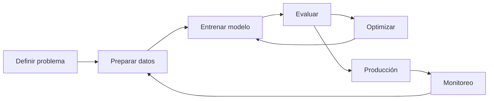

### 5. Preparación de datos y EDA

El **EDA (Análisis Exploratorio de Datos)** combina estadística descriptiva y visualizaciones para entender distribución, relaciones, outliers y valores faltantes antes de entrenar nada. La **selección de features** —quedarse con las variables más relevantes para el target— reduce ruido y overfitting; se retoma en profundidad más adelante (selección de variables). Lo que sigue detalla las tareas concretas que arma un pipeline de preparación de datos: tipos de variable, faltantes, codificación, escalado, outliers y el error más costoso de esta etapa, el data leakage.

**Tipos de variables.**

| Tipo | Ejemplos | Tratamiento típico |
|------|----------|---------------------|
| **Numéricas continuas** | precio, edad, temperatura | escalado, tratamiento de outliers |
| **Numéricas discretas** | cantidad de hijos, nº de habitaciones | igual que continuas, a veces se tratan como categóricas si hay pocos valores |
| **Categóricas nominales** | color, ciudad, tipo de producto | one-hot encoding |
| **Categóricas ordinales** | nivel educativo, talle (S/M/L) | encoding ordinal (respeta el orden) |

**Valores faltantes.** Antes de imputar hay que entender por qué faltan (no siempre es al azar). Estrategias comunes:

| Estrategia | Cuándo usarla |
|------------|----------------|
| Eliminar filas | Pocos faltantes, dataset grande |
| Eliminar columna | La columna tiene demasiados faltantes (ej. > 60-70%) |
| Imputar con media/mediana | Numéricas; mediana si hay outliers |
| Imputar con moda | Categóricas |
| Imputar con un modelo (KNN, regresión) | Cuando el patrón de faltantes es informativo y hay volumen suficiente |
| Crear una columna indicadora de "faltante" | Cuando el hecho de faltar puede ser predictivo en sí mismo |

**Codificación de categóricas: one-hot vs ordinal.**

- **One-hot encoding:** crea una columna binaria por categoría. Usar con **nominales** (sin orden), porque no le impone al modelo una relación de magnitud que no existe.
- **Encoding ordinal:** asigna un número que respeta el orden (ej. `bajo=0, medio=1, alto=2`). Usar solo con **ordinales**; aplicarlo a una nominal introduce un orden falso que el modelo puede interpretar como relación numérica.

```python
from sklearn.preprocessing import OneHotEncoder, OrdinalEncoder

OneHotEncoder(handle_unknown="ignore").fit_transform(X[["ciudad"]])          # nominal
OrdinalEncoder(categories=[["bajo", "medio", "alto"]]).fit_transform(X[["nivel"]])  # ordinal
```

**Escalado: `StandardScaler` vs `MinMaxScaler`.**

| | `StandardScaler` | `MinMaxScaler` |
|---|---|---|
| Transformación | media 0, desvío 1 (`z = (x-μ)/σ`) | rango fijo, típicamente `[0,1]` |
| Sensible a outliers | Menos | Sí (un outlier extremo comprime todo el resto) |
| Cuándo usarlo | Métodos basados en distancias o varianza: K-means, PCA, regresión regularizada (Ridge/Lasso), redes neuronales | Cuando se necesita un rango acotado explícito (ej. entrada de ciertas redes, imágenes) |

> **Nota:** modelos basados en árboles (árboles de decisión, Random Forest, XGBoost) son invariantes a escala — dividen por umbrales, no por distancia — así que no necesitan escalado.

**Outliers.** Se detectan con boxplot/IQR (`Q1 - 1.5·IQR`, `Q3 + 1.5·IQR`) o con z-score (`|z| > 3`). Tratamiento según el caso: eliminarlos si son errores de carga, capearlos (winsorizing), transformarlos (log) o dejarlos si son datos válidos y el modelo los tolera (árboles).

**Data leakage: el error de ajustar el scaler antes del split.** Es el error más frecuente y más difícil de detectar en la preparación de datos: cualquier transformación que "aprenda" algo de los datos (media y desvío de un scaler, la mediana para imputar, las categorías de un encoder) tiene que aprenderlo **solo del conjunto de entrenamiento**. Si se ajusta sobre todo el dataset antes de separar train/test, el conjunto de test "filtra" información hacia el entrenamiento (su media influyó en el escalado que ve el modelo) y las métricas de evaluación quedan artificialmente optimistas — el modelo funciona peor en producción de lo que el test hizo creer.

```python
# INCORRECTO — leakage: el scaler ve el test antes del split
from sklearn.preprocessing import StandardScaler
from sklearn.model_selection import train_test_split

scaler = StandardScaler()
X_scaled = scaler.fit_transform(X)          # usa media/desvío de TODO el dataset
X_tr, X_te, y_tr, y_te = train_test_split(X_scaled, y, test_size=0.2, random_state=42)
```

```python
# CORRECTO — el scaler solo aprende del train
from sklearn.preprocessing import StandardScaler
from sklearn.model_selection import train_test_split

X_tr, X_te, y_tr, y_te = train_test_split(X, y, test_size=0.2, random_state=42)

scaler = StandardScaler().fit(X_tr)         # fit SOLO con train
X_tr_scaled = scaler.transform(X_tr)
X_te_scaled = scaler.transform(X_te)        # transform, no fit, sobre test
```

La forma robusta de garantizar esto en la práctica es un `Pipeline` (se retoma en el cap. 6), que encapsula el `fit` del scaler dentro de cada fold de validación cruzada.

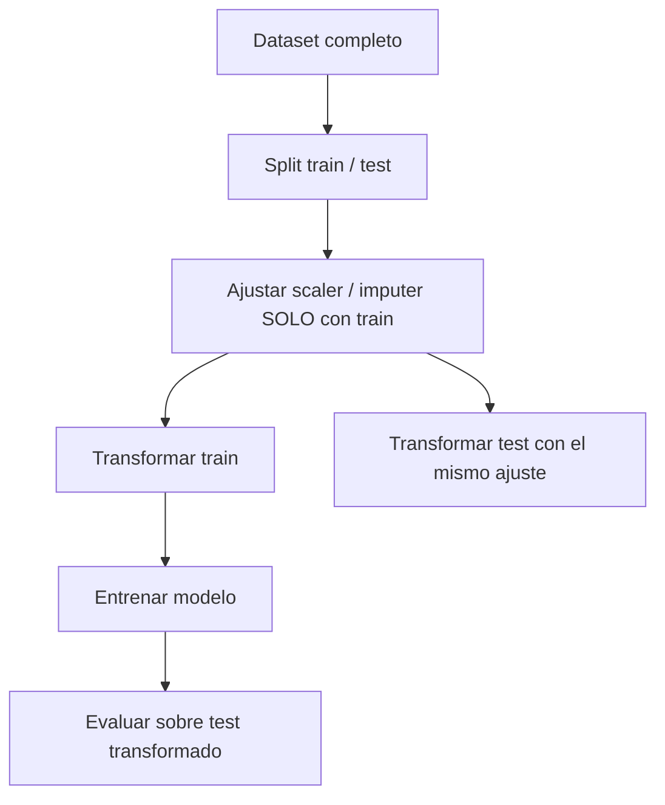

---

## Parte II — Cómo se evalúa un modelo

Tener un modelo entrenado no alcanza: la pregunta que importa es qué tan bien va a funcionar con datos que nunca vio. Esta parte cubre las herramientas para medir eso de forma honesta —train/test y validación cruzada—, el diagnóstico central de por qué un modelo falla —sobreajuste, subajuste y el compromiso sesgo-varianza— y las métricas concretas, separadas por tipo de problema, para poner un número a "qué tan bien". Es la base que hace falta antes de comparar clasificadores lineales, árboles o ensambles entre sí (partes siguientes): sin saber evaluar, no hay forma de decidir qué modelo es mejor.

### 6. Train/test y validación cruzada

**Por qué no alcanza con medir sobre el propio train.** Un modelo evaluado con los mismos datos con los que se entrenó siempre va a mostrar buen desempeño, aunque haya memorizado en vez de aprender — la métrica no distingue generalización de memorización. Por eso el paso mínimo es separar los datos en:

- **Train (entrenamiento):** con lo que el modelo ajusta sus parámetros.
- **Test (prueba):** apartado desde el principio, no se toca hasta la evaluación final; simula datos nuevos.

**Holdout vs k-fold.** El split simple train/test (**holdout**) tiene un problema: el resultado depende de qué observaciones cayeron al azar en cada lado del split, sobre todo con datasets chicos. La **validación cruzada k-fold** lo resuelve dividiendo el dataset en `k` partes (folds): se entrena `k` veces, cada vez dejando un fold distinto afuera como test y promediando el desempeño de las `k` corridas. El resultado es una estimación más estable y menos dependiente de un split particular.

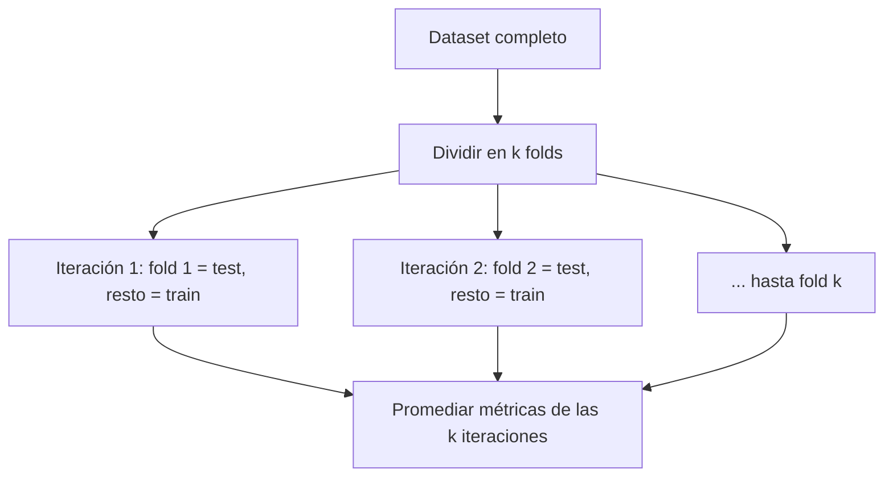

**`StratifiedKFold` y cuándo importa.** El k-fold simple parte los datos sin mirar la proporción de clases; con un target desbalanceado (ej. 90%/10%), un fold puede quedar con casi ninguna observación de la clase minoritaria, distorsionando la métrica de esa iteración. `StratifiedKFold` conserva en cada fold la misma proporción de clases que el dataset completo. Importa siempre en **clasificación** con clases desbalanceadas; en regresión no aplica (no hay clases que estratificar).

```python
from sklearn.model_selection import cross_val_score, StratifiedKFold

skf = StratifiedKFold(n_splits=5, shuffle=True, random_state=42)
scores = cross_val_score(clf, X, y, cv=skf, scoring="f1_macro")
scores.mean(), scores.std()
```

**Por qué el escalado va dentro de un `Pipeline` durante el CV.** El mismo problema de leakage del cap. 5 reaparece en la validación cruzada: si el scaler se ajusta una sola vez sobre todo `X` antes de llamar a `cross_val_score`, cada fold de "test" ya fue visto por el scaler durante el ajuste, y las métricas de CV quedan optimistas. La solución es envolver preprocesamiento y modelo en un `Pipeline`: `cross_val_score` entonces re-ajusta el scaler (y cualquier otro paso) usando solo el train de cada fold.

```python
from sklearn.pipeline import Pipeline
from sklearn.preprocessing import StandardScaler
from sklearn.linear_model import LogisticRegression
from sklearn.model_selection import cross_val_score, StratifiedKFold

pipe = Pipeline([
    ("scaler", StandardScaler()),
    ("model", LogisticRegression()),
])
skf = StratifiedKFold(n_splits=5, shuffle=True, random_state=42)
cross_val_score(pipe, X, y, cv=skf, scoring="f1_macro")   # el scaler se re-ajusta en cada fold
```

### 7. Sobreajuste, subajuste y el compromiso sesgo-varianza

**Sobreajuste (overfitting):** el modelo memoriza particularidades del train —incluido el ruido— y generaliza mal. **Señal diagnóstica:** error de train muy bajo, error de validación/test notablemente más alto (la brecha entre ambos es la pista).

**Subajuste (underfitting):** el modelo es demasiado simple para capturar el patrón real. **Señal diagnóstica:** error de train ya alto, y el error de validación es similar (no hay brecha, pero ambos son malos).

| Diagnóstico | Error de train | Error de validación | Brecha |
|---|---|---|---|
| **Ajuste sano** | Bajo | Bajo | Chica |
| **Overfitting** | Bajo | Alto | Grande |
| **Underfitting** | Alto | Alto (similar al de train) | Chica |

**Descomposición sesgo-varianza, en palabras.** El error de generalización de un modelo se puede pensar como la suma de dos fuentes:

- **Sesgo (bias):** el error que viene de que el modelo es demasiado simple para el problema real — supuestos rígidos que no capturan la verdadera relación. Un modelo con sesgo alto **subajusta**: falla igual en train y en test, porque su límite no es la cantidad de datos sino su propia simpleza.
- **Varianza:** el error que viene de que el modelo es demasiado sensible a los datos particulares de entrenamiento — pequeños cambios en el train producen modelos muy distintos. Un modelo con varianza alta **sobreajusta**: le va muy bien en el train que memorizó y mal ante datos nuevos.

Los dos se mueven en tensión: bajar la complejidad reduce varianza pero sube sesgo, y viceversa. El objetivo no es eliminar ninguno de los dos sino encontrar el punto de **error de generalización mínimo**, que casi nunca coincide con el error de train mínimo.

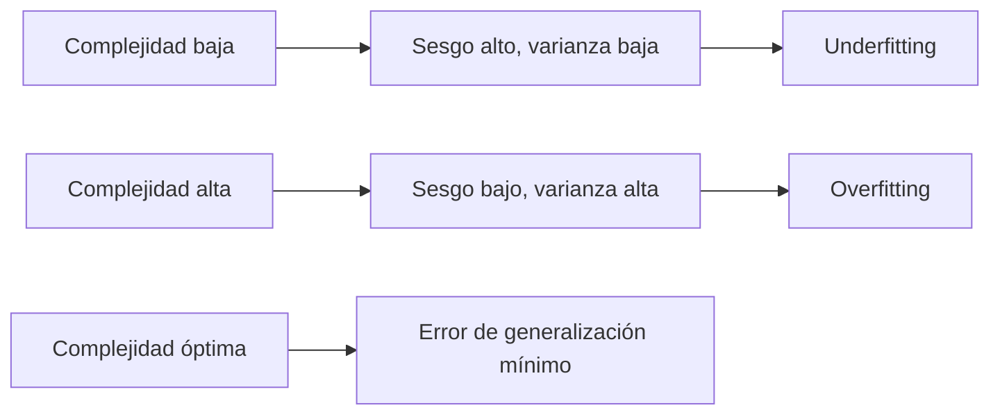

**Curvas de aprendizaje.** Graficar el error de train y el de validación en función de la cantidad de datos de entrenamiento usados es la forma práctica de distinguir un caso del otro:

- Si ambas curvas convergen a un error **alto**: el problema es sesgo (underfitting) — más datos no ayudan por sí solos.
- Si hay una **brecha persistente** entre una curva de train baja y una de validación alta, incluso con mucho dato: el problema es varianza (overfitting).

**Qué palanca tocar en cada caso.**

| Diagnóstico | Palancas típicas |
|---|---|
| **Underfitting (sesgo alto)** | Modelo más complejo (más features, más profundidad, más capas), menos regularización, mejor feature engineering |
| **Overfitting (varianza alta)** | Más datos, **regularización** (cap. 15: Ridge/Lasso), simplificar el modelo, validación cruzada para elegir hiperparámetros, ensambles tipo bagging (cap. 14) |

> **Nota:** la regularización (cap. 15) es la herramienta principal contra el sobreajuste porque ataca directamente la varianza: penaliza la complejidad del modelo (magnitud de los coeficientes) sin necesitar más datos. En árboles, el equivalente es limitar hiperparámetros de crecimiento (cap. 13); en ensambles, el bagging (Random Forest) reduce varianza promediando modelos, y el boosting reduce sesgo entrenando secuencialmente (cap. 14).

### 8. Métricas de clasificación

**Matriz de confusión:**

| | Predicho Positivo | Predicho Negativo |
|---|---|---|
| **Real Positivo** | TP (verdadero positivo) | FN (falso negativo) |
| **Real Negativo** | FP (falso positivo) | TN (verdadero negativo) |

| Métrica | Fórmula | Cuándo importa |
|---------|---------|----------------|
| **Accuracy** | `(TP+TN)/Total` | Exactitud global. Engañosa con clases desbalanceadas. |
| **Precisión** | `TP/(TP+FP)` | Cuando el costo de un FP es alto. |
| **Recall (sensibilidad)** | `TP/(TP+FN)` | Cuando el costo de un FN es alto (ej. diagnóstico). |
| **F1-score** | `2·(P·R)/(P+R)` | Media armónica P/R; equilibrio con datos desbalanceados. |

- **Curva ROC:** TPR (recall) vs FPR variando el umbral.
- **AUC:** área bajo la ROC. `1.0` = perfecto, `0.5` = azar.

> **Nota:** con clases desbalanceadas, priorizar **F1 / AUC / recall** según el caso, no accuracy.

Estas métricas se calculan siempre sobre el conjunto de **test** (o promediadas sobre los folds de CV, cap. 6), nunca sobre el train — de lo contrario se repite el mismo problema de optimismo artificial del cap. 7.

```python
from sklearn.metrics import classification_report, roc_auc_score
print(classification_report(y_te, clf.predict(X_te)))
roc_auc_score(y_te, clf.predict_proba(X_te)[:, 1])
```

### 9. Métricas de regresión

| Métrica | Fórmula | Interpretación |
|---------|---------|----------------|
| **MAE** | `(1/n)·Σ\|yᵢ − ŷᵢ\|` | Error medio absoluto; misma unidad que `y`; robusto a outliers. |
| **MSE** | `(1/n)·Σ(yᵢ − ŷᵢ)²` | Penaliza más los errores grandes. |
| **RMSE** | `√MSE` | Como MSE pero en la unidad de `y`; más interpretable. |
| **R²** | `1 − RSS/TSS` | Proporción de varianza explicada por el modelo. |

**Descomposición de la varianza:** `TSS = ESS + RSS`
(Total = Explicada + Residual).

**Interpretación de R²:**
- `R² = 1` → ajuste perfecto, sin error.
- `R² = 0` → no mejor que predecir la media.
- `R² < 0` → peor que predecir la media.

> **Nota:** R² es invariante a la escala de `y`, pero el intercepto, MAE, MSE y RMSE **no** lo son (dependen de las unidades). RMSE = √MSE es la más interpretable por estar en la unidad de `y`.

Al igual que en clasificación, estas métricas se calculan sobre test (o promediadas por CV), y la comparación entre el error de train y el de test es la forma directa de aplicar el diagnóstico del cap. 7 a un problema de regresión — la mecánica de fondo (regresión lineal, cap. 11; regularización, cap. 15) se desarrolla en las partes siguientes del manual.

## Parte III — Modelos lineales

Antes de entrar acá conviene tener frescos los conceptos de preparación de datos (cap. 5), validación cruzada (cap. 6) y el trade-off sesgo-varianza (cap. 7): un modelo lineal se entrena rápido, pero para juzgarlo bien hace falta separar train/test y mirar más allá del error de entrenamiento. Esta parte cubre la familia de modelos que separan clases o predicen valores con una combinación lineal de las features: primero los clasificadores lineales (regresión logística, SVM, y el propio perceptrón que se retoma en el cap. 26), después la regresión lineal para targets continuos, y por último cómo saber si un coeficiente estimado es real o ruido. Son los cimientos: todo lo que sigue en el manual —árboles, ensambles, regularización, redes— se entiende mejor en contraste con esta base lineal.

### 10. Clasificadores lineales

Los clasificadores lineales toman decisiones a partir de una **combinación lineal** de las features. Función de decisión:

```
f(x) = wᵀx + b
```

- `x`: vector de features · `w`: pesos · `b`: sesgo (bias).
- Clasificación binaria según el signo: `f(x) ≥ 0` → clase A; `f(x) < 0` → clase B.
- Un **hiperplano** es la frontera de decisión (recta en 2D, plano en 3D, etc.).

| Modelo | Idea clave |
|--------|-----------|
| **Perceptrón** | Clasificador lineal más simple; ajusta pesos según errores. Es el mismo tipo de frontera lineal que se retoma en detalle —estructura, entrenamiento manual y limitaciones— en el cap. 26. |
| **Regresión logística** | Pese al nombre, **clasifica**: modela `P(y=1\|X)` con la función logística (sigmoide), acotando la salida a `[0,1]`. |
| **SVM** | Busca el hiperplano que **maximiza el margen** entre clases (optimización cuadrática). |

**¿Por qué no usar regresión lineal para clasificar?** Daría valores fuera de `[0,1]`, imposibles de interpretar como probabilidad. La logística resuelve esto con la sigmoide:

```
σ(z) = 1 / (1 + e^(−z))   con z = wᵀx + b
```

**Regresión logística en detalle.** La salida `σ(z)` se interpreta como probabilidad de pertenecer a la clase positiva. Los coeficientes no se leen como en una regresión lineal (unidades de `y` por unidad de `x`), sino como **log-odds**: el modelo en realidad ajusta

```
log( P(y=1) / (1 − P(y=1)) ) = wᵀx + b
```

de modo que cada `wⱼ` representa el cambio en el **logaritmo de las odds** (la razón entre la probabilidad de la clase positiva y la de la negativa) por unidad de `xⱼ`, manteniendo el resto constante. Exponenciando `wⱼ` se obtiene el **odds ratio**: cuánto se multiplican las odds por cada unidad de la variable. Para decidir la clase final se aplica un **umbral de decisión** sobre `σ(z)` — por defecto `0.5`, pero se puede mover hacia arriba o abajo según el costo relativo de falsos positivos y falsos negativos (cap. 8), sin reentrenar el modelo.

**SVM (Support Vector Machines).** Busca, entre todos los hiperplanos que separan las clases, el que deja el **margen máximo** respecto a los puntos más cercanos de cada clase (los **vectores de soporte**). Cuando las clases no son linealmente separables en el espacio original, el **kernel trick** proyecta los datos a un espacio de mayor dimensión donde sí lo son, sin calcular esa proyección explícitamente — el kernel lineal (`linear`) mantiene la frontera lineal, y kernels como el radial (`rbf`) permiten fronteras curvas.

> **Nota:** perceptrón, regresión logística y SVM lineal comparten la misma forma de frontera de decisión —un hiperplano `wᵀx + b`—; lo que cambia es el criterio de ajuste: el perceptrón corrige por error, la logística maximiza verosimilitud, el SVM maximiza margen.

### 11. Regresión lineal

Predice una respuesta **cuantitativa** `Y` a partir de predictores `X`, asumiendo una relación aproximadamente lineal.

```
Simple:   Y = β₀ + β₁·X + ε
Múltiple: Y = β₀ + β₁X₁ + … + βₚXₚ + ε
```

| Símbolo | Qué es |
|---|---|
| `β₀` | **intercepto**: el valor de `Y` cuando todos los predictores valen 0 |
| `β₁…βₚ` | **pendientes**: cuánto cambia `Y` por cada unidad de `Xⱼ`, con el resto constante |
| `ε` | el **error**: todo lo que el modelo no explica |
| `eᵢ = yᵢ − ŷᵢ` | **residuo**: el error observado en una fila concreta |

**Entrenar es estimar los coeficientes** (`β̂`) que mejor ajustan los datos.

#### Qué significa "mejor": mínimos cuadrados

El método de **mínimos cuadrados ordinarios (OLS)** elige los coeficientes que minimizan la suma de los residuos al cuadrado:

```
RSS = Σ (yᵢ − ŷᵢ)²
```

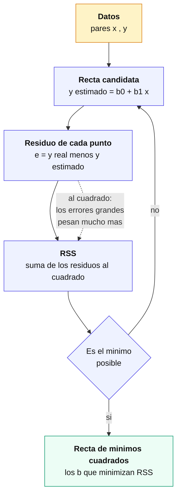

**Por qué al cuadrado y no en valor absoluto.** Elevar al cuadrado hace que los errores grandes pesen desproporcionadamente: un residuo de 10 aporta 100, uno de 1 aporta 1. Eso tiene dos consecuencias — la solución tiene **fórmula cerrada** (no hace falta iterar), y el modelo es **sensible a valores atípicos**, porque un solo punto lejano puede torcer la recta entera.

> Minimizar el valor absoluto en vez del cuadrado da la **regresión cuantílica**, más robusta a outliers pero sin solución analítica. Es la misma distinción entre MSE y MAE del cap. 9.

#### Cómo se interpreta un coeficiente

Esto es lo que distingue a la regresión lineal de casi todos los modelos que vienen después: **los coeficientes se leen**.

Si un modelo que predice el precio de una casa da `β_superficie = 1.200`, la lectura es: *manteniendo todo lo demás constante, cada metro cuadrado adicional se asocia con 1.200 dólares más de precio*.

Tres cuidados con esa frase:

- **"Manteniendo todo lo demás constante"** no es un detalle retórico. En regresión múltiple cada coeficiente mide el efecto de su variable **una vez descontado** lo que explican las otras. El mismo predictor puede tener coeficientes distintos —y hasta de signo opuesto— según qué otras variables estén en el modelo.
- **"Se asocia"**, no "causa". La regresión mide asociación. Para hablar de causalidad hacen falta diseño experimental o supuestos adicionales que el modelo no verifica.
- **Las escalas importan.** Un coeficiente de 1.200 sobre metros cuadrados y otro de 0,003 sobre precio del barrio no son comparables entre sí: dependen de las unidades. Para compararlos hay que estandarizar los predictores primero (cap. 5).

#### Los supuestos

OLS estima coeficientes con cualquier dato que se le dé. Pero para que la **inferencia** del capítulo siguiente sea válida, se apoya en cuatro supuestos:

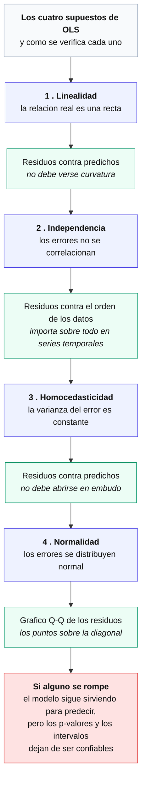

La distinción que conviene retener: si los supuestos se rompen, **el modelo puede seguir prediciendo razonablemente**, pero los p-valores, los intervalos de confianza y los tests dejan de significar lo que dicen significar.

#### Cuando la relación no es una recta

La regresión lineal es lineal **en los coeficientes**, no necesariamente en las variables. Eso deja lugar a dos extensiones que se resuelven con el mismo OLS:

| Extensión | Forma | Para qué |
|---|---|---|
| **Términos polinómicos** | `Y = β₀ + β₁X + β₂X²` | curvatura: el efecto crece o decrece con el nivel de X |
| **Interacciones** | `Y = β₀ + β₁X₁ + β₂X₂ + β₃X₁X₂` | el efecto de `X₁` depende del valor de `X₂` |

```python
from sklearn.linear_model import LinearRegression
from sklearn.preprocessing import PolynomialFeatures
from sklearn.pipeline import make_pipeline

modelo = LinearRegression().fit(X_train, y_train)
modelo.coef_, modelo.intercept_          # los coeficientes, legibles

# Curvatura e interacciones, con el mismo OLS
poly = make_pipeline(PolynomialFeatures(degree=2), LinearRegression())
poly.fit(X_train, y_train)
```

> **Ojo con el grado.** Cada grado que se agrega suma flexibilidad y riesgo de sobreajuste (cap. 7). Un polinomio de grado alto pasa por todos los puntos del entrenamiento y no generaliza nada. Es el caso de manual para regularizar (cap. 15).

Para evaluar el ajuste se usan las métricas del cap. 9 —MAE, MSE, RMSE y R²—. Ninguna dice si un coeficiente en particular es distinto de cero: eso es el capítulo siguiente.

### 12. Inferencia sobre los coeficientes

Las métricas del capítulo anterior dicen **cuánto acierta el modelo en conjunto**. La inferencia responde otra pregunta: **¿esta variable aporta algo, o el coeficiente que estimé es ruido?**

La duda tiene sentido porque los coeficientes se estiman a partir de una **muestra**. Con otra muestra distinta darían valores algo distintos. Un `β̂` de 0,7 puede reflejar una relación real o ser el azar de estos datos en particular.

#### El test t, coeficiente por coeficiente

- **H₀:** `βⱼ = 0` — la variable no aporta.
- **H₁:** `βⱼ ≠ 0` — hay relación.

Si `β₁ = 0`, el modelo se reduce a `Y = β₀ + ε` y `X` no explica nada.

El **p-valor** es la probabilidad de observar un coeficiente al menos tan grande como el estimado **si H₀ fuera cierta**. Chico (< 0,05 por convención) significa que sería raro ver ese valor por azar, y se rechaza H₀.

> **Lo que un p-valor no dice.** No es la probabilidad de que la hipótesis sea cierta, ni mide el **tamaño** del efecto. Con muchos datos, un efecto minúsculo e irrelevante en la práctica puede dar un p-valor bajísimo. Significativo no es sinónimo de importante.

#### El intervalo de confianza dice más

Por eso conviene mirar el **intervalo de confianza** además del p-valor: da el rango de valores plausibles del coeficiente.

| Coeficiente | IC 95% | Lectura |
|---|---|---|
| 1.200 | [1.150 , 1.250] | efecto claro y bien estimado |
| 1.200 | [50 , 2.350] | el signo es claro, la magnitud no: puede ser trivial o enorme |
| 1.200 | [−300 , 2.700] | incluye el cero: no hay evidencia (equivale a p > 0,05) |

Las tres filas tienen el mismo coeficiente estimado y significan cosas muy distintas.

#### El orden en que se mira

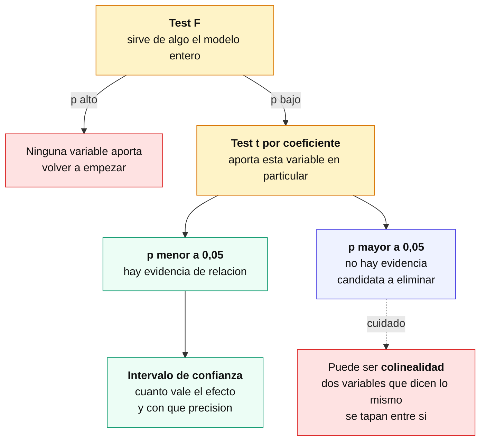

El **test F** va primero y evalúa el modelo completo: ¿al menos una variable aporta? Importa sobre todo con muchos predictores, donde por azar algunos p-valores individuales van a dar bajos aunque ninguna variable sirva — con 100 predictores inútiles y umbral 0,05, unos 5 aparecerán "significativos".

#### La trampa: colinealidad

Un coeficiente **no significativo no siempre significa que la variable no importe**. Cuando dos predictores están muy correlacionados —dicen casi lo mismo— el modelo no puede repartir el crédito entre ellos y **los dos** salen con p-valores altos, aunque juntos expliquen mucho.

La señal típica: el test F da significativo pero ningún coeficiente individual lo es. Se detecta con el **VIF** (*variance inflation factor*); valores por encima de 5 o 10 son sospechosos. La salida es sacar una de las dos variables, combinarlas, o usar **Ridge** (cap. 15), que está pensada justamente para este caso.

```python
import statsmodels.api as sm

X_c = sm.add_constant(X)          # statsmodels no agrega el intercepto solo
modelo = sm.OLS(y, X_c).fit()
print(modelo.summary())           # coeficientes, p-valores, IC, R2, test F
```

> **`scikit-learn` no da p-valores.** Está pensado para predicción, no para inferencia: `LinearRegression` devuelve `coef_` y nada más. Para inferencia se usa **`statsmodels`**, cuyo `summary()` trae todo junto. Es una diferencia de filosofía entre las dos bibliotecas, no una carencia.

Esta inferencia es la base para decidir qué variables conservar (**selección de variables**, cap. 16) y para comparar modelos completos con **AIC/BIC** (cap. 17): un coeficiente no significativo es candidato a eliminarse — con el cuidado de la colinealidad recién mencionado.

## Parte IV — Modelos no lineales

Los modelos lineales de la Parte III trazan fronteras rectas (o hiperplanos); cuando la relación entre features y target no es lineal, hace falta otra familia de modelos. Esta parte cubre los árboles de decisión —que particionan el espacio con preguntas sucesivas— y los ensambles que se construyen combinando muchos árboles (u otros modelos débiles) para ganar precisión y estabilidad. Conviene tener frescos el sobreajuste y el trade-off sesgo-varianza (cap. 7) y las métricas de clasificación (cap. 8), porque son la vara con la que se juzga si un árbol o un ensamble realmente mejora las cosas.

### 13. Árboles de decisión

Modelo predictivo con estructura jerárquica: **nodo raíz → nodos internos (preguntas) → ramas (respuestas) → hojas (predicción)**. Sirve para clasificación y regresión (**CART**).

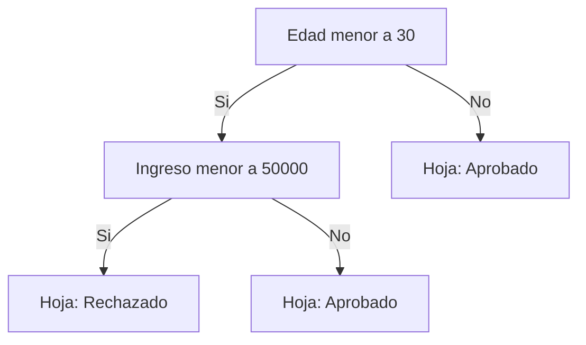

**Cómo decide dónde ramificar:** prueba dividir por cada variable y elige la que produce subnodos más **homogéneos** (puros) respecto al target. Criterios de impureza para clasificación:

- **Índice de Gini** ∈ `[0, 1]`: `Gini(D) = 1 − Σ pᵢ²`.
- **Entropía** ∈ `[0, 1]` (binaria): `H(D) = −Σ pᵢ·log₂(pᵢ)`.

> **Corrección importante:** las slides decían *"a mayor índice de Gini, mayor homogeneidad"* — **es al revés**. Un nodo **puro/homogéneo tiene Gini = 0** (y entropía = 0); el valor crece cuanto **más mezcladas** están las clases. El árbol elige divisiones que **minimizan** la impureza (o maximizan la *ganancia de información*).

**Hiperparámetros** (controlan crecimiento y overfitting): profundidad máxima (`max_depth`), mínimo de observaciones para dividir (`min_samples_split`), mínimo en hoja (`min_samples_leaf`), criterio (gini/entropy).

| Ventajas | Desventajas |
|----------|-------------|
| Fáciles de interpretar | Tendencia al **sobreajuste** |
| Útiles en EDA (importancia de variables) | Inestables (pequeños cambios → árbol distinto) |
| Poca limpieza previa (toleran outliers/faltantes) | Menor precisión que ensambles/SVM |
| Soportan numéricas y categóricas | Pérdida de info al discretizar continuas |
| No paramétricos | |

El sobreajuste y la inestabilidad se mitigan con **ensambles** (Random Forest, Gradient Boosting / XGBoost), tema del capítulo siguiente.

### 14. Ensambles y XGBoost

**Qué es un ensamble y por qué funciona.** Un ensamble combina las predicciones de **varios modelos débiles** (típicamente árboles poco profundos) para producir un modelo fuerte. Funciona porque los errores de modelos distintos, entrenados de forma distinta, tienden a no estar perfectamente correlacionados: al promediar (o combinar) sus predicciones, los errores individuales se cancelan parcialmente y queda una señal más estable. Es la misma lógica que "el promedio de muchas estimaciones ruidosas es más preciso que una sola estimación": reduce la varianza del conjunto, mejora el sesgo, o ambas cosas, según cómo se combinen los modelos.

**Bagging vs boosting — la diferencia conceptual.**

- **Bagging** (*bootstrap aggregating*, ej. Random Forest): entrena **muchos árboles en paralelo**, cada uno sobre una muestra bootstrap distinta (con reemplazo) del dataset original, y promedia sus predicciones (o vota, en clasificación). Como los árboles se entrenan de forma independiente y se promedian, lo que se gana es **reducción de varianza**: un árbol individual sobreajusta fácil, pero el promedio de muchos árboles distintos generaliza mejor.
- **Boosting** (ej. Gradient Boosting, XGBoost): entrena los árboles **secuencialmente**, y cada árbol nuevo se enfoca en corregir los **errores (residuos)** que dejó el árbol anterior. Como cada paso ataca específicamente lo que el modelo acumulado todavía no explica, lo que se gana es **reducción de sesgo**: modelos individuales simples (poco profundos) se van sumando hasta capturar relaciones complejas que ninguno por separado podría.

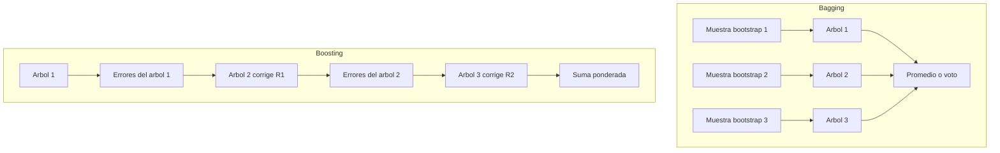

**Random Forest.** Ensamble por bagging de árboles de decisión, con un ingrediente extra: en cada split, en vez de considerar todas las features, elige la mejor división entre un **subconjunto aleatorio** de ellas (`max_features`). Esto decorrelaciona más los árboles entre sí (si una feature es muy fuerte, sin este truco todos los árboles la usarían primero y se parecerían demasiado), lo que mejora aún más la reducción de varianza. Da además `feature_importances_` como subproducto útil para EDA.

**Gradient Boosting y XGBoost.** El *gradient boosting* generaliza la idea de boosting: cada árbol nuevo se ajusta al **gradiente** de la función de pérdida respecto a las predicciones actuales (en el caso más simple, ajusta directamente los residuos). **XGBoost** (*Extreme Gradient Boosting*) es una implementación optimizada de gradient boosting: agrega regularización incorporada (evita que los árboles individuales crezcan demasiado y sobreajusten), maneja datos faltantes de forma nativa, y está optimizado en velocidad y uso de memoria. Es el estándar de facto en problemas tabulares (competencias, producción).

**Hiperparámetros principales de XGBoost / Gradient Boosting:**

| Hiperparámetro | Qué controla |
|---|---|
| `n_estimators` | Cantidad de árboles secuenciales. Más árboles → más capacidad, pero más riesgo de sobreajuste y más tiempo de entrenamiento. |
| `learning_rate` | Cuánto pesa la corrección de cada árbol nuevo sobre el total. Valores chicos (ej. 0.01-0.1) generalizan mejor pero necesitan más `n_estimators` para compensar. |
| `max_depth` | Profundidad máxima de cada árbol individual. En boosting suele mantenerse bajo (3-8): los árboles son "débiles" a propósito; la fuerza viene de sumarlos, no de que cada uno sea complejo. |
| `subsample` | Fracción de las filas usada para entrenar cada árbol (muestreo sin reemplazo). Menor a 1 agrega aleatoriedad tipo bagging dentro del boosting, reduce varianza y overfitting. |

> **Nota:** `learning_rate` y `n_estimators` interactúan: bajar el `learning_rate` casi siempre exige subir `n_estimators` para llegar al mismo nivel de ajuste, a cambio de un modelo final más robusto.

**Cuándo un ensamble no se justifica.** Un ensamble agrega costo de entrenamiento, tiempo de inferencia y pérdida casi total de interpretabilidad (cap. 13 lista la interpretabilidad como ventaja del árbol simple; se pierde acá). No conviene cuando: el dataset es muy chico (no hay margen para que el ensamble generalice mejor que un modelo simple bien regularizado); se necesita explicar cada predicción a un humano (auditoría, decisiones regulatorias) y no alcanza con `feature_importances_` o SHAP; el problema ya es linealmente separable y un modelo lineal (cap. 10-11) alcanza el mismo desempeño con muchísima menos complejidad; o los recursos de cómputo/latencia en producción son muy limitados (un árbol único o un modelo lineal responden en microsegundos; un ensamble grande, no siempre).

---

## Parte V — Complejidad del modelo y selección

Con modelos lineales y no lineales ya cubiertos, queda una pregunta transversal a ambas familias: ¿cuántas variables usar, y cuánto restringir los coeficientes para que el modelo generalice? Esta parte conecta directamente con el sobreajuste (cap. 7): regularización y selección de variables son las dos herramientas principales para controlar la complejidad de un modelo lineal, y los criterios AIC/BIC dan una forma numérica de comparar modelos completos entre sí. También son la base conceptual de temas posteriores del manual: k-means y reducción de dimensionalidad (cap. 18 y 23) enfrentan el mismo problema de "cuántas dimensiones conservar" desde el lado no supervisado, y la regularización en redes neuronales (cap. 36) reutiliza exactamente las ideas de norma L1/L2 que se explican acá.

### 15. Regularización: Ridge, Lasso y Elastic Net

Añade una **penalización** al costo de entrenamiento: `Costo = RSS + α·penalización`. El hiperparámetro **α (o λ)** regula la fuerza de la penalización y se elige por **cross-validation** (cap. 6). Es imprescindible **estandarizar** las variables antes de regularizar, porque la penalización actúa sobre la magnitud de los coeficientes, y esa magnitud depende de la escala de cada variable.

**La idea central — norma L1 vs L2.** La penalización se calcula como una norma sobre el vector de coeficientes `β`, y el tipo de norma determina qué le hace al modelo:

- **Norma L2** (`Σβ²`, usada por **Ridge**): penaliza el cuadrado de cada coeficiente. Como el cuadrado crece muy rápido cuando el coeficiente es grande y muy poco cuando ya es chico, el efecto es **achicar todos los coeficientes de forma proporcional**, acercándolos a cero sin llegar nunca exactamente a cero. Ridge no elimina variables: las atenúa a todas.
- **Norma L1** (`Σ|β|`, usada por **Lasso**): penaliza el valor absoluto de cada coeficiente. A diferencia del cuadrado, la penalización L1 crece de forma lineal y tiene una "esquina" en cero que hace que, al optimizar, algunos coeficientes terminen exactamente en **cero** — no solo chicos, sino eliminados del modelo. Por eso Lasso hace **selección automática de variables** como efecto colateral de regularizar.
- **Elastic Net** combina ambas penalizaciones (`α₁·L1 + α₂·L2`, o parametrizado como una mezcla `l1_ratio`): captura algo de la selección de Lasso y algo de la estabilidad de Ridge, útil cuando hay variables correlacionadas entre sí (Lasso tiende a elegir arbitrariamente una de un grupo correlacionado; Elastic Net reparte entre ellas).

| Método | Norma | ¿Anula coeficientes? | Cuándo usar |
|--------|:-----:|:--------------------:|-------------|
| **Ridge** | L2 (`Σβ²`) | **No** (los achica) | Colinealidad; conservar todas las variables |
| **Lasso** | L1 (`Σ\|β\|`) | **Sí** (a cero exacto) | **Selección automática**; modelos dispersos |
| **Elastic Net** | L1 + L2 | Sí (parcial) | Combina ambas; **2 hiperparámetros** (λ, α) |

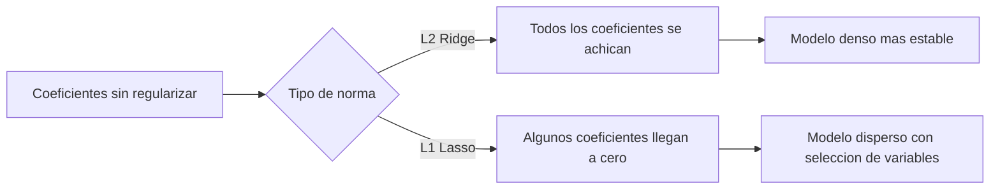

```python
from sklearn.linear_model import LassoCV
lasso = LassoCV(cv=5).fit(X_scaled, y)   # elige alpha por CV
lasso.coef_    # los que quedan en 0 fueron descartados
```

> **Esta es la explicación canónica de regularización en el manual.** El cap. 36 (regularización en redes neuronales) parte de esta misma idea de norma L1/L2 sobre los pesos y agrega solo lo específico de las redes (dropout, early stopping); la lógica de fondo —L2 achica, L1 elimina— es la misma acá y ahí.

### 16. Selección de variables

Elegir un **subconjunto** de las features originales. Mejora rendimiento, interpretabilidad, reduce overfitting y acelera el entrenamiento. A diferencia de la regularización (cap. 15), que penaliza coeficientes dentro del entrenamiento, estos métodos deciden qué variables entran al modelo antes o durante el ajuste, con distintos criterios.

**Filtros (filter)** — medida estadística, sin entrenar modelo (rápidos, antes de modelar):

| Método | Problema | Idea |
|--------|----------|------|
| **Correlación (Pearson)** | Regresión | features con coef. cercano a ±1 con el target |
| **Chi-cuadrado (χ²)** | Clasificación, categóricas | mayor dependencia feature-clase = más relevante |
| **ANOVA (F-test)** | Clasificación, numéricas | mayor F = mejor separa clases |
| **Coeficientes lineales** | Regresión/logística | mayor \|coef\| = más influyente |

**Wrapper — RFE (Eliminación Recursiva):** entrena un modelo, elimina la feature menos importante, reentrena y repite. Preciso pero **caro** (entrena en cada iteración).

**Embedded:** la selección ocurre dentro del entrenamiento (árboles/Random Forest vía `feature_importances_`, cap. 13-14; o Lasso, cap. 15, que anula coeficientes). Mantiene las features originales, a diferencia de técnicas que crean nuevas variables combinando las originales (reducción de dimensionalidad, cap. 23).

```python
from sklearn.feature_selection import SelectKBest, f_classif, RFE, SelectFromModel
X_new = SelectKBest(f_classif, k=5).fit_transform(X, y)   # filtro ANOVA
```

| Criterio | Filtros | RFE |
|----------|---------|-----|
| Depende de un modelo | No | **Sí** |
| Costo | Bajo | Alto (iterativo) |
| Cuándo | Screening rápido | Optimizar modelo final |

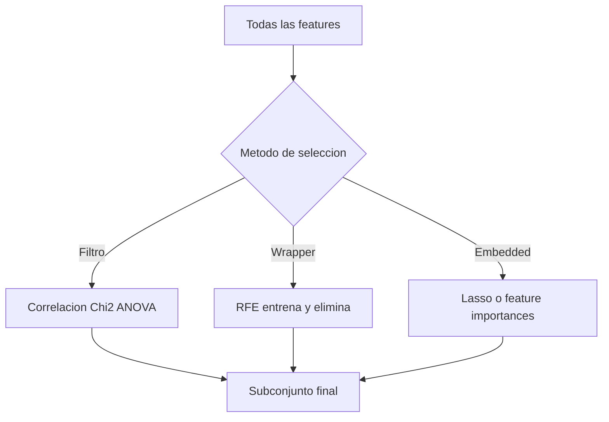

### 17. Criterios de selección de modelos (AIC y BIC)

Comparan modelos equilibrando **ajuste vs complejidad** (penalizan el número de parámetros). **Menor = mejor.** Mientras que la regularización (cap. 15) y la selección de variables (cap. 16) actúan **dentro** del proceso de ajuste de un modelo, AIC y BIC sirven para comparar **modelos ya ajustados entre sí** —por ejemplo, para decidir entre dos regresiones con distinto número de predictores, sin necesidad de un set de test separado.

| | AIC | BIC |
|--|-----|-----|
| **Fórmula** | `2k − 2·ln(L)` | `ln(n)·k − 2·ln(L)` |
| **Penalización** | `2` por parámetro (fija) | `ln(n)` (crece con la muestra) |
| **Tendencia** | Admite más complejidad | Más conservador (modelos simples) |

`k` = nº parámetros, `n` = nº observaciones, `L` = máxima verosimilitud. Usos: comparar modelos de regresión, ARIMA, o el nº de componentes en un **GMM**.

> **Nota:** con `n` grande, la penalización de BIC (`ln(n)`) supera a la de AIC (constante `2`), por lo que BIC tiende a preferir modelos más simples que AIC a medida que crece el dataset.

## Parte VI — Aprendizaje no supervisado

Hasta acá todo el manual asumió que había un `y` para entrenar y evaluar (cap. 8 y 9). Esta parte cambia esa premisa: no hay etiquetas, y el objetivo es encontrar estructura en los datos por su cuenta. Para aprovecharla hace falta tener asimilada la preparación de datos (cap. 5) — en particular el escalado, porque casi todo lo que sigue trabaja con distancias o con varianza — y conviene tener presente el problema de sobreajuste y sesgo-varianza (cap. 7), porque reaparece bajo otra forma cuando no hay `y` para chequear contra el mundo real.

### 18. Clustering con K-means

**Apuntes.** Particiona los datos en **k** clusters minimizando la **inercia** (suma de distancias² de cada punto a su centroide). Iterativo: inicializa k centroides → asigna cada punto al más cercano → recalcula centroides como la media → repite hasta converger.

**Referencia técnica.**

| | |
|--|--|
| **Cuándo usar** | Sabés (o estimás) k; grupos aproximadamente **esféricos** y de tamaño similar; dataset grande (escala bien). |
| **Cuándo NO** | Formas arbitrarias, densidades/tamaños muy distintos, outliers (los arrastra). |
| **Hiperparámetros** | `n_clusters` (**el** clave), `init` (`k-means++`), `n_init`, `max_iter`. |
| **Escala** | Sensible → estandarizar antes (cap. 5). |
| **Evaluación** | Codo (inercia), silueta, Davies-Bouldin (cap. 21). |

```python
from sklearn.preprocessing import StandardScaler
from sklearn.cluster import KMeans
X_scaled = StandardScaler().fit_transform(X)
km = KMeans(n_clusters=3, init="k-means++", n_init=10, random_state=42)
labels = km.fit_predict(X_scaled)
km.inertia_   # WCSS para el método del codo
```

### 19. Clustering jerárquico

Construye una **jerarquía completa** de agrupamientos en lugar de una sola partición. Es la diferencia de fondo con K-means: no hay que decidir `k` antes de empezar.

El algoritmo **aglomerativo** —el habitual— arranca con cada punto como su propio cluster y va fusionando de a dos:

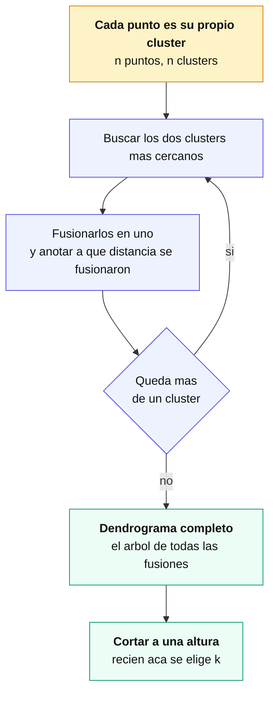

El resultado es un **dendrograma**: un árbol donde la **altura de cada fusión es la distancia a la que ocurrió**. Cortarlo a una altura da una partición; cortarlo más abajo da más clusters, más arriba da menos. La decisión de `k` se toma **mirando el árbol ya construido**, y esa es la ventaja práctica del método.

#### Cómo se lee un dendrograma

- **Fusiones a poca altura** = grupos muy parecidos entre sí.
- **Un salto grande de altura** entre dos fusiones sugiere un corte natural: ahí se juntaron cosas que en realidad no se parecen tanto.
- **Ramas largas sin fusionar** hasta arriba señalan puntos atípicos.

La heurística habitual es cortar en el salto vertical más largo del árbol, que es el equivalente al método del codo (cap. 21).

#### El `linkage` cambia la forma de los clusters

`linkage` define **cómo se mide la distancia entre dos clusters**, no entre dos puntos. Es la decisión que más afecta el resultado:

| Enlace | Distancia entre clusters | Efecto |
|---|---|---|
| **Simple** (min) | el par de puntos **más cercanos** | encadena: produce clusters alargados; sensible al ruido |
| **Completo** (max) | el par **más lejano** | clusters compactos y de tamaño parejo; sensible a outliers |
| **Promedio** | promedio de todas las distancias | intermedio entre los dos anteriores |
| **Ward** | el que **menos aumenta la varianza intra** al fusionar | clusters compactos y equilibrados; **el más usado**, y el default razonable |

> **Ward solo funciona con distancia euclídea.** Si el problema pide otra métrica —coseno para texto, Manhattan— hay que usar otro enlace.

#### Cuándo conviene y cuándo no

| | |
|---|---|
| **Usarlo** | No se sabe cuántos clusters hay; interesa ver la estructura jerárquica; el dataset es chico o mediano; se quiere un resultado **determinista** (no depende de inicialización aleatoria como K-means). |
| **Evitarlo** | Datasets grandes: el costo es **O(n²)** en memoria y peor en tiempo. Con decenas de miles de puntos se vuelve impracticable. |

Y una limitación que conviene tener presente: **las fusiones son irreversibles**. Si dos puntos se unieron temprano por error, nada los vuelve a separar más arriba en el árbol.

```python
from scipy.cluster.hierarchy import linkage, dendrogram, fcluster
import matplotlib.pyplot as plt

Z = linkage(X_scaled, method="ward", metric="euclidean")

plt.figure(figsize=(12, 5))
dendrogram(Z, truncate_mode="lastp", p=30)   # ultimas 30 fusiones, para que se lea
plt.show()

labels = fcluster(Z, t=3, criterion="maxclust")     # cortar en 3 clusters
labels = fcluster(Z, t=8.5, criterion="distance")   # o cortar a una altura
```

> **Escalar antes, siempre.** El método se basa en distancias, así que una variable en miles domina a otra en decimales. Vale lo mismo que para K-means (cap. 18) y lo del cap. 5.

### 20. DBSCAN: clustering por densidad

**Apuntes.** Define clusters como **regiones densas** separadas por regiones vacías. No requiere fijar k, detecta clusters de forma arbitraria y marca **outliers** (etiqueta `-1`).

- **Core:** ≥ `min_samples` puntos dentro del radio `eps`.
- **Border:** dentro de `eps` de un core, pero no es core.
- **Noise:** ni core ni border → outlier.

**Referencia técnica.**

| | |
|--|--|
| **Cuándo usar** | Formas arbitrarias; hay ruido/outliers a detectar; no querés fijar k. |
| **Cuándo NO** | Densidad muy variable entre clusters; alta dimensión. |
| **Hiperparámetros** | `eps` (ε, radio), `min_samples` (MinPts). |
| **Elegir `eps`** | Gráfico k-distancia (k = min_samples): buscar el codo. |

```python
from sklearn.cluster import DBSCAN
labels = DBSCAN(eps=0.5, min_samples=5).fit_predict(X_scaled)  # -1 = ruido
```

**Comparativa de clustering:**

| Método | Nº clusters | Formas | Ruido | Escala |
|--------|:-----------:|--------|:-----:|--------|
| **K-means** | Hay que fijarlo | Esféricas | Sensible | Rápido |
| **Jerárquico** | Se decide al cortar | Según enlace | Según método | Pesado en grandes |
| **DBSCAN** | Automático | **Arbitrarias** | **Detecta** | Sensible a `eps` |

Un árbol de decisión rápido para elegir entre los tres, según la forma de los datos y si conocés k de antemano:

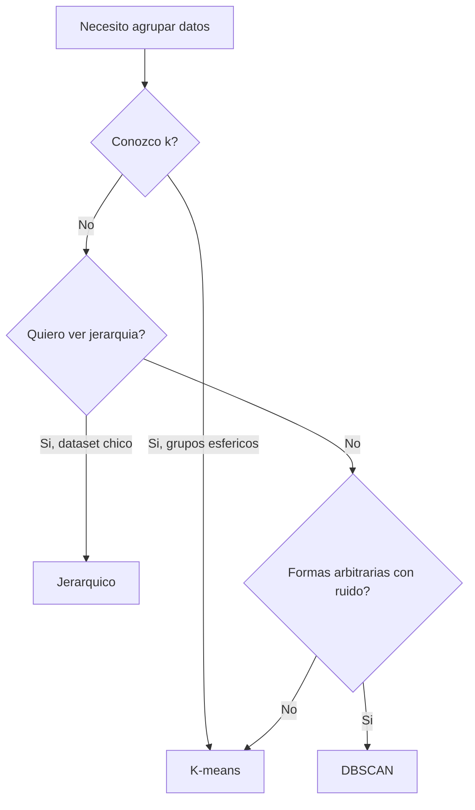

### 21. Evaluación de clusters

En clustering **no hay etiquetas contra las cuales comparar**, así que no se puede hablar de aciertos. Lo que se mide es la **geometría** del resultado: qué tan juntos están los puntos de un mismo grupo y qué tan separados los de grupos distintos.

| Método | Qué mide | Cómo se lee | Rango |
|---|---|---|---|
| **Método del codo** | Inercia (WCSS) contra `k` | El `k` donde la mejora se vuelve marginal | la inercia siempre baja con `k` |
| **Silueta** | `s = (b − a) / max(a, b)` — cohesión contra separación | +1 bien agrupado · ~0 en la frontera · negativo mal asignado | [−1, +1] |
| **Davies-Bouldin** | dispersión intra sobre separación inter | **menor es mejor** | ≥ 0 |
| **Calinski-Harabasz** | varianza entre grupos sobre varianza intra | **mayor es mejor** | ≥ 0 |

#### Por qué el codo no alcanza solo

La **inercia siempre baja** al aumentar `k` — con `k = n` cada punto es su propio cluster y la inercia es cero. Por eso no se puede elegir el `k` que la minimiza: hay que buscar el **punto de quiebre**, donde agregar un cluster más deja de compensar. Y ese punto muchas veces no es evidente: la curva baja suave y el "codo" queda a criterio de quien mira.

La **silueta** no tiene ese problema porque **sí tiene un máximo**: mide para cada punto qué tan cerca está de su propio grupo (`a`) contra el grupo vecino más cercano (`b`). Un valor negativo significa que el punto está más cerca de otro cluster que del suyo — está mal asignado.

> **Nota (verificado en notebook, Iris):** el codo sugiere **k = 3** y la silueta **k = 2**. No es contradicción: Iris tiene tres especies, pero dos de ellas —*versicolor* y *virginica*— se solapan tanto que geométricamente forman un solo grupo. **El codo encuentra la estructura que hay; la silueta, la que está bien separada.** Cuál elegir depende de qué se busca, y ahí entra el criterio del dominio.

#### Mirar la silueta por punto, no solo el promedio

El `silhouette_score` devuelve un promedio, y un promedio de 0,55 puede esconder que un cluster entero tiene valores negativos. El **gráfico de silueta** —cada punto como una barra, agrupados por cluster— muestra el detalle: si un grupo tiene barras cortas o negativas, ese grupo está mal formado aunque el promedio general se vea bien.

Es el mismo argumento que la matriz de confusión frente a la exactitud (cap. 8): **el número agregado oculta dónde falla**.

#### Qué algoritmo para qué caso

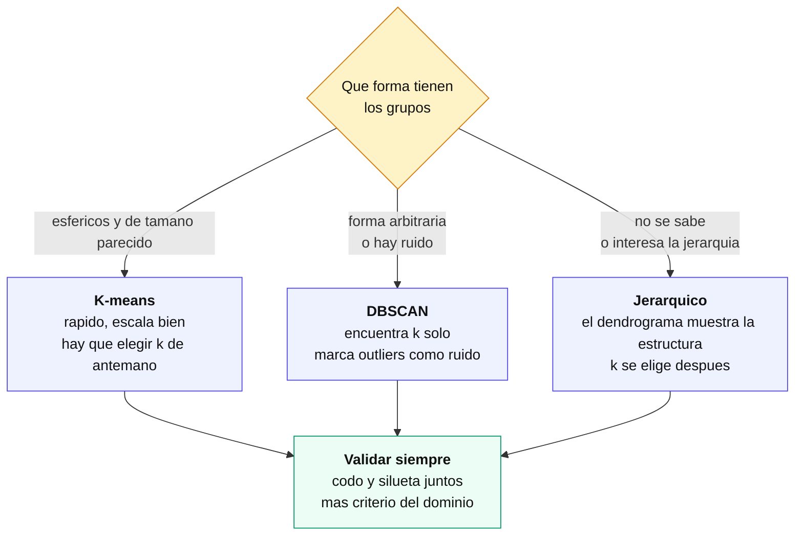

```python
from sklearn.metrics import silhouette_score, silhouette_samples, davies_bouldin_score

silhouette_score(X_scaled, labels)        # promedio, mas alto mejor
silhouette_samples(X_scaled, labels)      # valor por punto, para el grafico
davies_bouldin_score(X_scaled, labels)    # mas bajo mejor
```

#### Lo que ninguna métrica dice

Todas estas medidas evalúan **geometría**, no utilidad. Un clustering con silueta alta puede ser inservible si los grupos que encontró no significan nada para el problema; y uno con silueta mediocre puede ser justo el que separa a los clientes que se van de los que se quedan.

La validación final siempre es la misma pregunta: **¿estos grupos me sirven para algo?** Las métricas ayudan a descartar resultados malos, no a confirmar que un resultado es bueno.

### 22. La maldición de la dimensión

Problemas en **alta dimensión**: los datos se **dispersan**, las distancias se vuelven **uniformes** y pierden significado (degradan K-means/K-NN, cap. 10); el costo crece exponencialmente; sube el riesgo de **overfitting** (cap. 7); la visualización se vuelve imposible.

**Mitigaciones:** reducción de dimensionalidad (cap. 23), selección de variables, regularización (cap. 15). Es el puente entre selección de variables y reducción de dimensionalidad.

### 23. Reducción de dimensionalidad

**Crean** nuevas variables que preservan información (distinto de seleccionar un subconjunto de las originales).

**PCA (Análisis de Componentes Principales)** — lineal, **no supervisado**. Encuentra las direcciones de **máxima varianza** (componentes principales), ortogonales entre sí.
- **Pasos:** centrar → matriz de covarianza → valores/vectores propios → ordenar por valor propio → proyectar sobre los top componentes.
- **Nº de componentes:** scree plot (codo en los valores propios) o varianza explicada acumulada (ej. retener 95%).
- **Cuándo:** conservar varianza, descorrelacionar features, visualizar 2-3D, preprocesar. Sensible a escala → estandarizar; `fit` solo con train.

**LDA (Análisis Discriminante Lineal)** — lineal, **supervisado**. Busca la proyección que **maximiza la separación entre clases**. Genera hasta **(nº clases − 1)** componentes.

**t-SNE** — no lineal; preserva la **estructura de vecinos locales** minimizando la divergencia **KL**. Ideal para **visualización** en 2-3D (no para preprocesar). Costoso en datasets grandes; la estructura **global** (distancias entre clusters) puede no ser fiable.

**UMAP** — no lineal (geometría/topología); construye un **grafo de vecindad** y preserva estructura **local y global**. **Más rápido y escalable que t-SNE**; ajustable con `n_neighbors` / `min_dist`. No viene en sklearn: `pip install umap-learn`.

**ICA** — separa componentes **estadísticamente independientes** (ej. separación de fuentes de audio).

| Técnica | Lineal | Supervisada | Maximiza / preserva | Uso principal |
|---------|:------:|:-----------:|----------|---------------|
| **PCA** | Sí | No | Varianza | Compresión / preprocesamiento |
| **LDA** | Sí | **Sí** | Separación entre clases | Preproc. para clasificación |
| **t-SNE** | No | No | Estructura **local** | **Visualización** (datasets chicos/medianos) |
| **UMAP** | No | No | Estructura **local y global** | **Visualización** (datasets grandes) |
| **ICA** | Sí | No | Independencia estadística | Separación de fuentes |

**Elección rápida:** preprocesar/comprimir → **PCA**; separar clases con etiquetas → **LDA**; visualizar estructura local (dataset chico) → **t-SNE**; visualizar dataset grande preservando local + global → **UMAP**.

```python
from sklearn.decomposition import PCA
pca = PCA(n_components=0.95)                 # retener 95% de la varianza
X_red = pca.fit_transform(X_scaled)
pca.explained_variance_ratio_

from sklearn.discriminant_analysis import LinearDiscriminantAnalysis as LDA
X_lda = LDA(n_components=2).fit_transform(X, y)   # supervisado (usa y)

from sklearn.manifold import TSNE
X_tsne = TSNE(n_components=2, perplexity=30).fit_transform(X_scaled)  # visualización

import umap                                   # pip install umap-learn
X_umap = umap.UMAP(n_neighbors=15, min_dist=0.1).fit_transform(X_scaled)
```

**Tabla maestra — ¿qué técnica uso?**

| Necesito… | Técnica | Cap. |
|-----------|---------|:-:|
| Agrupar, sé k, grupos esféricos | K-means | 18 |
| Agrupar y ver estructura jerárquica | Jerárquico | 19 |
| Agrupar formas raras + detectar outliers | DBSCAN | 20 |
| Elegir nº óptimo de clusters | Codo + Silueta | 21 |
| Reducir dimensión conservando varianza | PCA | 23 |
| Reducir dimensión separando clases | LDA | 23 |
| Visualizar alta dimensión en 2D (dataset chico) | t-SNE | 23 |
| Visualizar alta dimensión en 2D (dataset grande) | UMAP | 23 |

## Parte VII — Redes neuronales

Esta parte deja atrás los modelos clásicos (regresión, árboles, clustering) para entrar en redes neuronales, que necesitan del resto del manual como base: los clasificadores lineales (cap. 10) para entender qué es exactamente el perceptrón y por qué es un caso particular de ellos, la regularización Ridge/Lasso (cap. 15) porque reaparece igual en las redes, y el sobreajuste (cap. 7) porque es el riesgo central de un MLP. El recorrido va de lo biológico y lo histórico hasta el mecanismo interno de entrenamiento — backpropagation y descenso de gradiente — pasando por el perceptrón simple, sus límites, y el perceptrón multicapa que los supera.

> **Nota:** la teoría del curso está documentada hasta la Clase 24 del programa (backpropagation y persistencia de modelos). Solo restan los checkpoints y la evaluación integral.

### Mapa de la parte

Todo lo que sigue, en orden, y cómo se encadena: de los datos crudos al modelo guardado y servido.

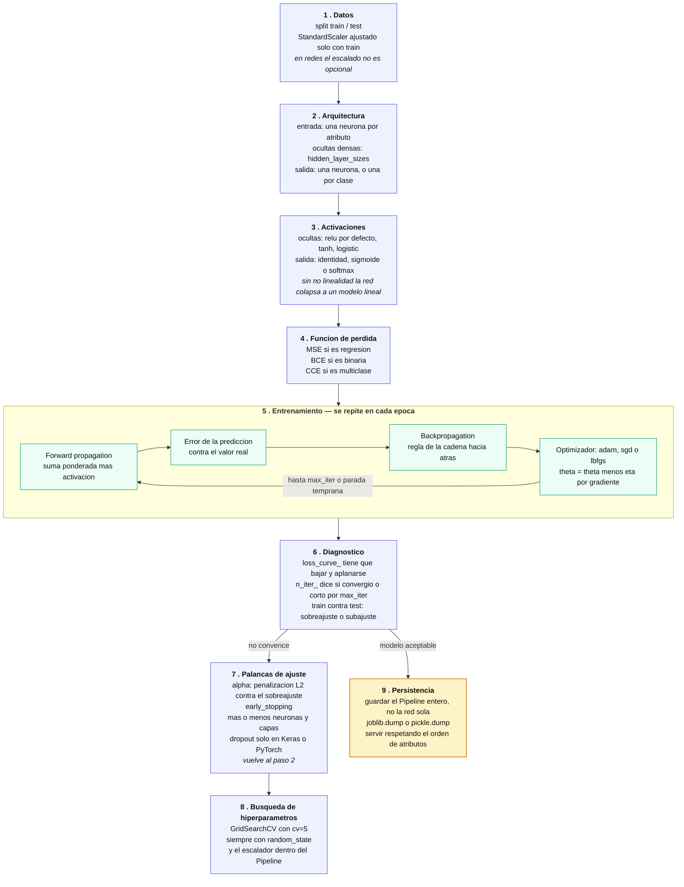

Los capítulos 24 a 30 recorren **cómo se llegó hasta acá** —la neurona biológica, el perceptrón, sus límites— y los capítulos 31 a 38, **cada casillero de ese mapa**: la estructura (31), las activaciones (32), la arquitectura (33), la pérdida (34), la optimización (35), la regularización (36), backpropagation (37) y la persistencia (38).

### Qué función va en cada problema

Las tres decisiones que dependen del tipo de problema —activación de salida, función de pérdida y métrica— se resuelven juntas, porque van atadas. La activación de las capas ocultas, en cambio, no depende del problema.

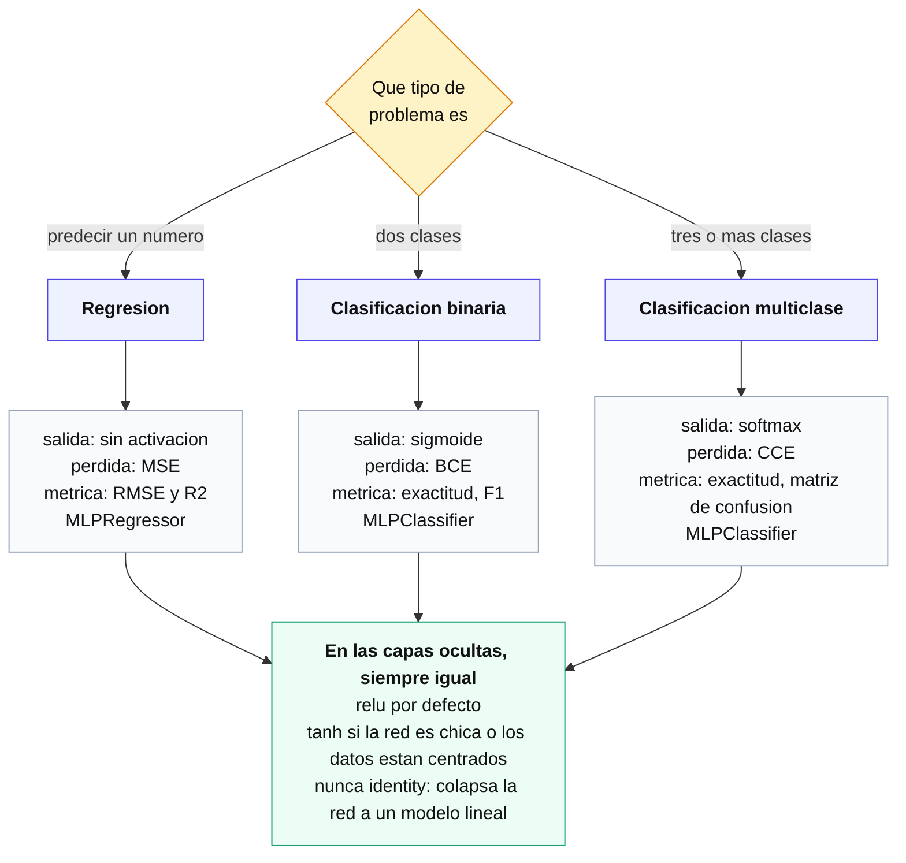

### 24. Fundamentos biológicos

**Apuntes.** Las **redes neuronales artificiales (RNA)** están inspiradas en el cerebro humano (~86 mil millones de neuronas conectadas por **sinapsis**). Cada neurona biológica **recibe** señales por las **dendritas**, las **procesa** en el **cuerpo celular (soma)** y las **transmite** por el **axón**.

Paralelismo biológico → artificial:

| Elemento biológico | Elemento artificial |
|---|---|
| Dendritas | Entradas (x₁, x₂, …, xₙ) |
| Fuerza de la sinapsis | Pesos (w₁, w₂, …, wₙ) |
| Cuerpo celular (integración) | Sumatoria ponderada (Σ) |
| Umbral de disparo | Función de activación (Φ) |
| Axón (señal transmitida) | Salida (y) |

Las neuronas artificiales se organizan en **capas**: capa de entrada, una o más **capas ocultas**, y capa de salida. El aprendizaje biológico fortalece/debilita sinapsis; el de una RNA **ajusta pesos** — analogía conceptual, no una réplica: el mecanismo real (backpropagation + optimización numérica) es matemáticamente distinto, y una RNA profunda consume muchísima más energía que el cerebro para tareas equivalentes.

### 25. Historia de las redes neuronales

**Apuntes.** Recorrido por décadas, con avances y un freno prolongado:

| Período | Hito | Impacto |
|---|---|---|
| 1940 (1943) | Modelo matemático de neurona (**McCulloch-Pitts**) | Sienta las bases teóricas: neuronas que hacen cálculos lógicos con entradas binarias |
| 1950 (1958) | **Perceptrón** (Rosenblatt) | Primer modelo capaz de aprender a clasificar datos linealmente separables |
| 1960 (1969) | Libro *"Perceptrons"* (**Minsky y Papert**) | Expone las limitaciones del perceptrón simple ante problemas no lineales → **invierno de la IA** (cae el financiamiento e interés) |
| 1980 | **Backpropagation** | Reactiva el campo: permite entrenar redes multicapa ajustando pesos para minimizar el error |
| 1990-2000 | **CNN** (datos con estructura espacial, imágenes) y **RNN** (datos secuenciales) | Especialización de arquitecturas según el tipo de dato |
| Era moderna | **Deep learning** | Datos masivos + poder de cómputo + mejores algoritmos → redes de decenas/cientos de capas |

> **Nota:** las etiquetas de década (1940, 1950, 1960) son aproximaciones del material original; los años puntuales son 1943 (McCulloch-Pitts), 1958 (Rosenblatt) y 1969 (Minsky y Papert).

### 26. El perceptrón: estructura y fórmulas

**Apuntes.** El **perceptrón** (Rosenblatt, 1957/58) es un algoritmo de **aprendizaje supervisado** para **clasificación binaria**, el modelo más simple de red neuronal. Es un **clasificador lineal** (cap. 10): solo puede aprender correctamente cuando las clases son **linealmente separables** (se pueden dividir con una única recta/hiperplano).

**Estructura:**

- **Entradas** `x1, x2, …, xn`.
- **Pesos** `w1, w2, …, wn`: importancia relativa de cada entrada.
- **Umbral / bias** `θ`: término independiente.
- **Suma ponderada** `Σ`, **función de activación** `Φ` y **salida** `y`.

Flujo: `x1…xn` (con pesos `w1…wn`) y `θ` → suma ponderada `z` → activación `Φ` → salida `y`.

**Fórmulas:**

```
Suma ponderada:         z = w1*x1 + w2*x2 + ... + wn*xn + θ   =   Σ (i=1 a n) wi*xi + θ

Función de activación (escalón):
Φ(z) = 1  si z > 0
Φ(z) = 0  en caso contrario

Salida:                 y = Φ(z)

Actualización de pesos:  Δwi = n * (y_real - y) * xi     →  wi_nuevo = wi_anterior + Δwi
Actualización del umbral: Δθ = n * (y_real - y)          →  θ_nuevo  = θ_anterior + Δθ
```

`n` (eta) es la **tasa de aprendizaje**: regula cuánto se ajusta cada peso en cada actualización. Ambas actualizaciones (pesos y umbral) se aplican en cada iteración en la que la predicción `y` difiere del valor real `y_real`; si coinciden, el ajuste es nulo (`Δw = Δθ = 0`).

**Ejemplo canónico — compuerta lógica AND** (`x1 AND x2`, tabla de verdad con un único caso positivo en `(1,1)`): al graficar los 4 puntos, `(1,1)` queda separado del resto por una recta → es **linealmente separable**, condición necesaria para que el perceptrón la aprenda.

### 27. Entrenamiento del perceptrón: la compuerta AND

**Apuntes.** Entrenamiento manual, paso a paso, de un perceptrón para aprender `x1 AND x2`.

**Parámetros iniciales:** `w1 = 0.381`, `w2 = 0.245`, `θ = 0.196`, tasa de aprendizaje `n = 0.045`.

El procedimiento se repite en cada iteración recorriendo las 4 filas de la tabla de verdad `(0,0)→0`, `(0,1)→0`, `(1,0)→0`, `(1,1)→1`, calculando `z`, aplicando la función escalón para obtener `y`, y actualizando `wi` y `θ` cuando `y ≠ y_real`.

**Resumen de las 6 iteraciones hasta la convergencia:**

| Iteración | Parámetros al cierre | ¿Hubo error en alguna fila? |
|:--:|---|---|
| Inicio | `w1=0.381`, `w2=0.245`, `θ=0.196` | — |
| 1ª | `w1=0.336`, `w2=0.2`, `θ=0.061` | Sí (filas 1, 2 y 3) |
| 2ª | `w1=0.291`, `w2=0.155`, `θ=-0.074` | Sí (filas 1, 2 y 3) |
| 3ª | `w1=0.246`, `w2=0.11`, `θ=-0.164` | Sí (filas 2 y 3) |
| 4ª | `w1=0.201`, `w2=0.11`, `θ=-0.209` | Sí (solo fila 3) |
| 5ª | `w1=0.201`, `w2=0.11`, `θ=-0.209` (sin cambios) | No — el perceptrón ya clasifica bien las 4 filas |
| 6ª (verificación) | `w1=0.201`, `w2=0.11`, `θ=-0.209` | No — error `0` confirmado en las 4 filas; converge |

**Pesos finales:** `w1 = 0.201`, `w2 = 0.11`, `θ (bias) = -0.209`. Con estos valores, `y = Φ(w1*x1 + w2*x2 + θ)` da `0` para `(0,0)`, `(0,1)` y `(1,0)`, y `1` para `(1,1)` — reproduce exactamente la compuerta AND.

> **Nota:** en la 5ª iteración ya no hubo ningún error, pero recién se confirma la convergencia con una 6ª pasada de verificación (error `e = y_real - y = 0` en las 4 filas) antes de dar por finalizado el entrenamiento.

### 28. Limitaciones del perceptrón

**Apuntes.**

- **Separabilidad lineal:** el perceptrón simple **solo** resuelve problemas **linealmente separables**. El caso clásico que no puede resolver es el **XOR**, cuyas clases no se pueden separar con una única recta/hiperplano.
- **Convergencia no garantizada:** si los datos no son linealmente separables, el algoritmo puede no converger nunca en un número finito de pasos.
- **Capacidad limitada:** poca capacidad para capturar relaciones y patrones complejos (al ser un modelo lineal de una sola capa).
- **Ajuste de hiperparámetros:** aunque tiene menos hiperparámetros que modelos más complejos, calibrar la tasa de aprendizaje sigue siendo un desafío (muy alta → inestabilidad/oscilación; muy baja → convergencia lenta).

Esta limitación (XOR) es históricamente la que originó el "invierno de la IA" (cap. 25): se resuelve con perceptrones **multicapa** (MLP) y **backpropagation**, contenido de los capítulos siguientes.

### 29. Implementación con scikit-learn

**Apuntes.**

- **Scikit-Learn** es una de las librerías más usadas del ecosistema Python para **aprendizaje automático**.
- Ofrece una **amplia gama de algoritmos y utilidades** que cubren **todo el flujo de trabajo**: desde la preparación de los datos hasta la evaluación del modelo.
- **Se integra** con el resto del ecosistema Python, incluidas las librerías de aprendizaje profundo como **TensorFlow** y **PyTorch**.

Aplicado a este módulo: el entrenamiento manual de la compuerta AND (cap. 27) queda encapsulado en `sklearn.linear_model.Perceptron`, que implementa la misma regla delta detrás de la API uniforme `fit` / `predict` (ver ejemplo en la referencia técnica de más abajo). La implementación manual sirve para entender la mecánica; scikit-learn, para trabajar en la práctica con validación, métricas y preprocesamiento integrados. Para redes profundas (varias capas, backpropagation) se pasa a TensorFlow o PyTorch.

### 30. El perceptrón multicapa (MLP)

**Apuntes.**

Un **perceptrón multicapa (MLP)** es una red neuronal artificial que aborda problemas complejos de **clasificación** y **regresión**. A diferencia del perceptrón simple, que solo resuelve problemas **linealmente separables** (cap. 28), el MLP maneja **relaciones no lineales** entre las características de entrada y la salida.

Los cuatro puntos de la slide:

- El entrenamiento se realiza mediante el algoritmo de **retropropagación** (backpropagation, ver cap. 37).
- Su capacidad para aprender relaciones complejas viene de la **estructura de capas** y de las **funciones de activación no lineales**.
- Las redes multicapa son **sensibles a la calidad y la naturaleza de los datos** de entrada.
- Necesitan **muchos datos** para entrenar eficazmente y tienen **riesgo de sobreajuste** (cap. 7).

**Arquitectura.**

| Capa | Rol |
|---|---|
| **Entrada** | una neurona por característica; no calcula, solo recibe |
| **Ocultas** (1 o más) | dan la capacidad de representar relaciones no lineales; cada neurona hace `z = Σ wᵢ·xᵢ + b` y le aplica una activación no lineal |
| **Salida** | una neurona en regresión; una por clase en clasificación |

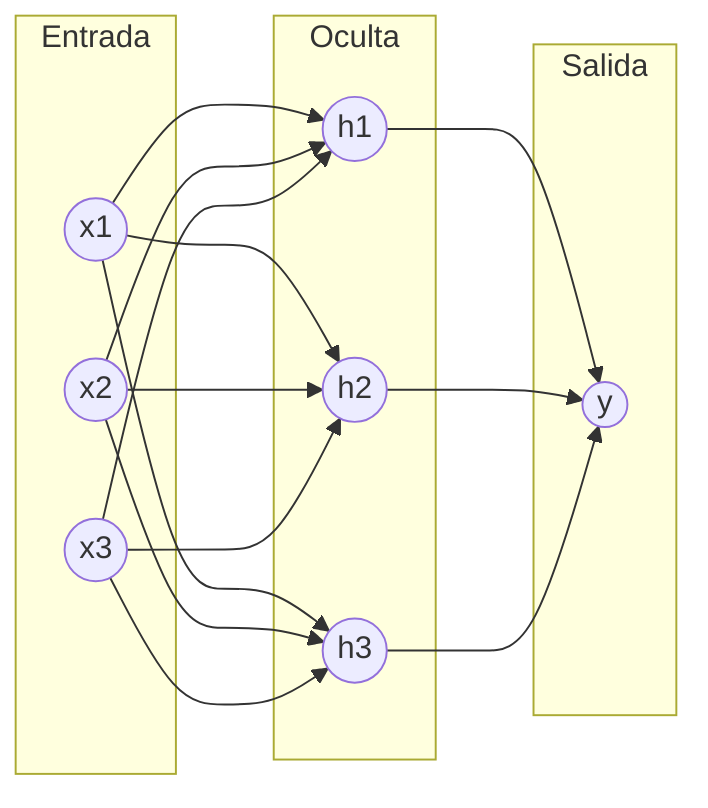

Sobre esa arquitectura corren dos procesos:

- **Forward propagation:** los datos de entrada se transforman a través de las capas hasta producir la **salida final**.
- **Backpropagation:** ajuste de **pesos y sesgos** para **minimizar la función de pérdida**. Es la generalización a varias capas de la regla delta del entrenamiento manual (cap. 27). Se desarrolla en detalle en el cap. 37.

**Por qué la activación oculta debe ser no lineal.** Es el punto que justifica toda la arquitectura: si las capas ocultas solo hicieran la suma ponderada, la composición de varias capas lineales **seguiría siendo lineal** y la red colapsaría al equivalente de un perceptrón simple, con la misma limitación. La no linealidad (ReLU, tanh, logística — ver cap. 32) es lo que hace que apilar capas agregue capacidad real, y con eso resolver el **XOR**.

**Qué se paga respecto del perceptrón simple.**

| | Perceptrón simple | MLP |
|---|---|---|
| Problemas | solo linealmente separables | también no lineales |
| Interpretabilidad | alta: 2 pesos y un sesgo legibles | baja: miles de pesos sin lectura directa |
| Datos necesarios | pocos | muchos |
| Sobreajuste | bajo (modelo rígido) | alto: requiere regularización (`alpha`, cap. 36) y validación |
| Escalado de entradas | tolerable | **necesario** |
| Costo de entrenamiento | trivial | significativo |

> **Nota (verificado en notebook):** sobre Iris con 2 atributos y las 3 clases, el perceptrón simple llega a **76,7%** de exactitud y el MLP a **93,3%** — la diferencia es exactamente el solapamiento entre *versicolor* y *virginica*, que ninguna recta separa. En el mismo experimento, una red de **20** neuronas iguala a una de **250** usando dos órdenes de magnitud menos parámetros, mientras que una de **5** se queda corta (80%): el tamaño de la red es un hiperparámetro **a buscar**, no a maximizar.

### 31. Grafos y capa densa

**Apuntes.**

Un **grafo** describe cómo están conectadas las unidades: **nodos** (neuronas) y **aristas** (conexiones, cada una con su peso). En una **capa densa** o **totalmente conectada**, **cada neurona está conectada a todas las neuronas de la capa anterior**.

Consecuencia práctica: entre una capa de `n` neuronas y una densa de `m` hay `n × m` pesos más `m` sesgos. Por eso los parámetros crecen como un **producto**, no como una suma, al agrandar la red.

El diagrama del curso rotula cada neurona oculta como **`Σf`**, y el rótulo es literal: **suma ponderada** (`Σ`) seguida de la **función de activación** (`f`). Es decir, cada nodo es un perceptrón (cap. 26); la red es muchos de ellos conectados. En `scikit-learn`, `hidden_layer_sizes=(100, 150)` describe exactamente ese grafo, y los pesos quedan en `mlp.coefs_` y los sesgos en `mlp.intercepts_`.

### 32. Funciones de activación

**Apuntes.**

La **función de activación** determina la salida de una neurona. Sin ella, la red es una **combinación lineal de las entradas** y apilar capas no agrega nada (cap. 30). Sus cuatro roles según la slide: introducen **no linealidad**, deciden si la neurona **se activa** (pasa información a la siguiente capa), algunas **normalizan la salida a un rango**, y **afectan cómo se actualizan los pesos** —porque la retropropagación usa su derivada—.

| Función | Fórmula | Rango | Nota |
|---|---|---|---|
| **Sigmoide (logística)** | `1 / (1 + e^(−x))` | (0, 1) | salida legible como probabilidad; **satura** en los extremos |
| **Tanh** | `(e^z − e^(−z)) / (e^z + e^(−z))` | (−1, 1) | igual forma pero **centrada en 0**; converge más rápido; también satura |
| **ReLU** | `0 si x < 0; x si x ≥ 0` | [0, ∞) | derivada 1 en el lado positivo: **no satura**; barata; default en capas ocultas |

> **Errata del material:** la slide escribe la sigmoide como `1/(1 − e^(−x))`. Es un error tipográfico: va **más**. Con el signo menos la función se indefine en `x = 0` y no coincide con la curva dibujada en la misma slide.

**Saturación y gradiente desvaneciente.** En los extremos, sigmoide y tanh son casi planas: su derivada tiende a 0. Como la retropropagación **multiplica** derivadas capa por capa (cap. 37), en redes profundas el gradiente se apaga y las primeras capas dejan de aprender. ReLU no tiene ese problema por el lado positivo; a cambio, una neurona cuya entrada queda siempre negativa tiene gradiente 0 y muere (*dying ReLU*).

> **Nota (verificado en notebook):** la derivada en `x = 6` vale **0,0025** para la sigmoide y **0,00002** para tanh, contra **1** para ReLU: la saturación es medible, no una figura retórica. Y sobre el XOR, un `MLPClassifier` con `activation='identity'` se queda en **50%** de exactitud —no lo resuelve—, mientras que con `tanh` o `relu` llega a **100%**. La no linealidad es lo único que cambia entre esos tres casos.

**Qué usar:** ReLU en capas ocultas por defecto; **sigmoide** en la salida binaria; **softmax** en la salida multiclase; **ninguna** (identidad) en la salida de regresión. En `scikit-learn`, `activation` aplica **solo a las capas ocultas** —la de salida la elige el estimador según el problema— y acepta `'relu'` (default), `'tanh'`, `'logistic'`, `'identity'`.

### 33. Diseño de la arquitectura de la red

**Apuntes.**

Elegir el **número de capas** y de **neuronas** afecta directamente la **capacidad de aprendizaje**, el **poder de generalización** y el **rendimiento computacional**.

| Decisión | Si se pasa | Si se queda corto |
|---|---|---|
| **Capas** | más complejidad y más tiempo de entrenamiento | no aprende representaciones complejas |
| **Neuronas** | **sobreajuste** (cap. 7): memoriza el train | **capacidad insuficiente** para la complejidad de los datos |

No hay fórmula: la arquitectura es un **hiperparámetro** y se busca comparando en validación (cap. 6), nunca en train.

> **Nota (verificado en notebook, Iris con 2 atributos, `relu`):** `(2,)` da 46,7% de train y 56,7% de test con 15 parámetros —**underfitting** de manual: no ajusta ni el entrenamiento—; `(100,)` llega a 100% de test con 603 parámetros; y `(100, 100)`, con **10.703** parámetros (~17 veces más), **no mejora nada**: baja a 96,7%. La lectura honesta es "capacidad de sobra sin beneficio" más que sobreajuste probado, porque con **30 muestras de test** un acierto vale 3,3 puntos y las diferencias chicas no son concluyentes.

> **Nota (verificado en notebook):** escalar con `StandardScaler` **bajó la pérdida final en las tres activaciones** (tanh 0,243 → 0,161; relu 0,197 → 0,177), pero el efecto sobre la exactitud fue **mixto**: `logistic` anduvo mejor *sin* escalar (100% contra 90%). Ninguna de las seis corridas convergió dentro de `max_iter=300`. El escalado es buena práctica por lo que le hace al entrenamiento, no porque garantice mejor exactitud en un dataset chico. Método práctico: arrancar simple (una capa oculta), agrandar solo si el error de *entrenamiento* sigue alto, y si el error de train es bajo pero el de test alto, achicar o regularizar (`alpha`, cap. 36) antes que agregar capas. Verificar lo que realmente quedó entrenado con `mlp.n_layers_`, `mlp.coefs_` y `mlp.loss_curve_`.

### 34. Funciones de pérdida

**Apuntes.**

La **función de pérdida** (o **función de costo**) cuantifica la **discrepancia entre lo que el modelo predijo y los valores reales**, produciendo **un único valor**. Ese valor es la **señal para ajustar pesos y sesgos**: es lo que la retropropagación deriva (cap. 37). En `scikit-learn` es la curva `mlp.loss_curve_`. La elección **depende del tipo de problema**.

**Regresión.**

```
MAE = (1/n) · Σ |yᵢ − ŷᵢ|          MSE = (1/n) · Σ (yᵢ − ŷᵢ)²
```

El MSE eleva al cuadrado: castiga mucho más los errores grandes y es **sensible a outliers**; el MAE es más **robusto**. A cambio, el MSE es derivable en todo su dominio, lo que lo hace más cómodo para el descenso de gradiente. `MLPRegressor` minimiza MSE. (Ver métricas de regresión, cap. 9.)

**Clasificación.**

```
BCE:  L = −(1/N) · Σᵢ ( yᵢ·log(ŷᵢ) + (1 − yᵢ)·log(1 − ŷᵢ) )
CCE:  L = −(1/N) · Σⱼ Σᵢ  yⱼᵢ·log(ŷⱼᵢ)
```

La **entropía binaria cruzada (BCE)** se usa en clasificación **binaria**; la **entropía cruzada categórica (CCE)**, en **multiclase**. Ambas miden la diferencia entre la distribución verdadera y la predicha. Con `y` en formato *one-hot*, en la CCE solo sobrevive el término de la clase correcta: la pérdida es `−log` de la probabilidad que el modelo le asignó a esa clase. `MLPClassifier` **no expone el parámetro**: usa log-loss siempre, que es BCE en el caso binario y CCE en el multiclase. (Ver métricas de clasificación, cap. 8.)

**Pérdida ≠ métrica de evaluación.** La pérdida es lo que se **minimiza** durante el entrenamiento y debe ser derivable; la métrica (exactitud, R², RMSE) es lo que se **reporta**. A veces coinciden (MSE) y a veces no: nadie entrena minimizando exactitud, porque no es derivable.

### 35. Optimización y descenso de gradiente

**Apuntes.**

**Optimizar** es ajustar pesos y sesgos para **minimizar la función de pérdida** (cap. 34). El método es el **descenso de gradiente**: se calcula el **gradiente** —la derivada de la función de error respecto de *todos* los parámetros de la red, calculada con backpropagation (cap. 37)— y se avanza en sentido contrario.

**La regla de actualización**, que es toda la idea en una línea:

```
θ = θ − η · ∇θ J(θ)
```

donde `θ` son los parámetros (pesos y sesgos), `η` la **tasa de aprendizaje** y `∇θ J(θ)` el gradiente de la pérdida respecto de `θ`. El **signo menos** es el punto: el gradiente apunta hacia donde la pérdida *crece*, así que minimizar es moverse al revés. Visualmente, la pérdida es una superficie con forma de cuenco y entrenar es bajar hasta el fondo.

**La tasa de aprendizaje es el hiperparámetro más sensible.**

| `η` | Qué pasa |
|---|---|
| **Muy chica** | converge, pero lento: puede agotar `max_iter` sin llegar |
| **Adecuada** | pocos pasos, convergencia estable |
| **Muy grande** | salta de un lado al otro del valle y **diverge**: la pérdida oscila o explota |

**Tres modos de descenso**, según cada cuánto se actualizan los pesos:

| Modo | Actualiza | Característica |
|---|---|---|
| **Estocástico (SGD)** | cada vez que se evalúa **una muestra** | muy frecuente y ruidoso |
| **En lotes (batch)** | al terminar **una época** (todo el train) | estable, pero pocas actualizaciones y caro en memoria |
| **En mini-lotes** | al terminar cada **minilote**, con la media del gradiente del lote | el compromiso: es lo que se usa en la práctica |

> **Ojo con el nombre:** `solver='sgd'` en `scikit-learn` trabaja en **mini-lotes** (`batch_size`), no de a una muestra. El nombre es histórico.

El flujo completo de una época de entrenamiento, de los datos a la actualización de pesos:

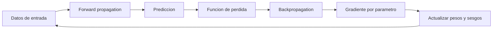

**Dónde encaja:** la **regla delta** del perceptrón (cap. 27) es este mismo mecanismo en su versión mínima; **backpropagation** (cap. 37) es el algoritmo que calcula ese gradiente para todas las capas aplicando la regla de la cadena hacia atrás; y la **saturación** de las activaciones (cap. 32) es lo que lo rompe, porque multiplica el gradiente por números casi nulos.

### 36. Regularización en redes neuronales

**Apuntes.**

La explicación canónica de regularización —qué es la norma L1 y L2, y qué le hace cada una a los coeficientes— ya se desarrolló para modelos lineales en el cap. 15 (Ridge y Lasso). En redes neuronales es la **misma matemática** aplicada a los pesos de las capas, y solo cambia lo que aporta cada método frente a las particularidades de un MLP:

| Técnica | Penalización | Efecto sobre los pesos |
|---|---|---|
| **L1** | `L(X, w) + λ · Σ \|wᵢ\|` — suma de **valores absolutos** | lleva pesos **a cero**: selecciona variables, red rala |
| **L2** | `L(X, w) + λ · Σ wᵢ²` — suma de **cuadrados** | los **encoge** hacia cero sin anularlos |
| **Dropout** | — | **apaga neuronas al azar** durante el entrenamiento |

**Dropout** es lo propio de las redes, sin equivalente en regresión lineal: no toca la función de pérdida sino la arquitectura durante el entrenamiento, y al apagar neuronas al azar impide que la red dependa de una neurona en particular.

| Ventajas | Desventajas |
|---|---|
| previene el sobreajuste | más costo computacional |
| controla la complejidad | suma hiperparámetros que hay que elegir |
| puede acelerar la convergencia | posible pérdida parcial de información |

**En `scikit-learn` solo hay L2**, vía `alpha` (la `λ` de la fórmula del cap. 15), con default `0.0001`. **No hay L1 ni dropout** para redes: eso requiere Keras o PyTorch. Sí está disponible la **parada temprana** (`early_stopping=True`), que es regularización de hecho y es propia del entrenamiento iterativo de una red (no tiene equivalente directo en Ridge/Lasso, que se resuelven en una sola pasada): cortar cuando la validación deja de mejorar evita seguir ajustando ruido.

**Cómo se busca `alpha`:** con validación cruzada (cap. 6), graficando exactitud de **train y de validación** contra `alpha`. La señal de sobreajuste es la **brecha** entre las dos curvas; el buen `alpha` la cierra sin hundir las dos.

> **Nota (verificado en el recurso de clase):** un barrido de `alpha` sobre un problema demasiado fácil **no muestra nada**. En `OD_RN1_ESP_M03_S10`, cinco valores de `alpha` que cubren cinco órdenes de magnitud (de 0,00001 a 1,0) dan **todos la misma exactitud, 0,97**, y los tres solvers también. Con Iris de 2 atributos y 30 muestras de test, la exactitud solo puede valer 29/30 o 30/30: no hay resolución para distinguir configuraciones. Para ver el efecto de la regularización hace falta un problema que efectivamente sobreajuste.

### 37. Backpropagation


**La idea.** Entrenar una red es encontrar los pesos que minimizan la función de pérdida (cap. 34). Para eso hace falta el gradiente de la pérdida respecto de *cada* peso de *cada* capa (cap. 35). El problema es que la salida de la red es una composición de funciones —capa tras capa— y un peso de una capa temprana afecta la pérdida solo indirectamente, a través de todas las capas que vienen después. **Backpropagation** es el algoritmo que calcula ese gradiente completo de forma eficiente, propagando el error desde la salida hacia atrás, capa por capa, hasta la entrada.

**La regla de la cadena.** Es la herramienta matemática que lo hace posible. Si la pérdida `L` depende de la salida `y`, que depende de `z` (la suma ponderada), que depende de un peso `w`, entonces:

```
∂L/∂w = ∂L/∂y · ∂y/∂z · ∂z/∂w
```

Cada capa aporta un factor a esa cadena de derivadas. Para un peso de una capa intermedia, la cadena simplemente se hace más larga: incluye un factor por cada capa que hay entre ese peso y la salida.

**Dos pasadas por la red.**

| Paso | Dirección | Qué hace | Qué guarda |
|---|---|---|---|
| **Forward** | entrada → salida | calcula `z` y la activación de cada neurona, capa por capa, hasta la predicción | las activaciones intermedias de cada capa (hacen falta después) |
| **Backward** | salida → entrada | calcula el error en la salida y lo propaga hacia atrás, capa por capa, usando la regla de la cadena y las activaciones guardadas en el forward | el gradiente de la pérdida respecto de cada peso y cada sesgo |

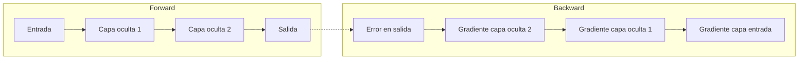

**La derivación del curso, sobre una red concreta.** El material desarrolla el cálculo sobre una red de 2 entradas (`x₁`, `x₂`), 2 neuronas ocultas (`O₁`, `O₂`) y 1 salida (`S`), con **sigmoide** en todas las activaciones y **error cuadrático** como pérdida. De esos dos supuestos salen los dos factores que se repiten en todas las fórmulas: la derivada del error, `(ŷ − y)`, y la de la sigmoide, `ŷ(1 − ŷ)`.

Para un peso de la **capa de salida**, la cadena tiene tres factores:

```
∂E/∂p₂₁ = (∂E/∂ŷ) · (∂ŷ/∂sumaₛ) · (∂sumaₛ/∂p₂₁) = (ŷ − y) · ŷ(1 − ŷ) · salida₀₁ = δₛ · salida₀₁
```

Los dos primeros factores se agrupan bajo el nombre **`δₛ`**, y ese agrupamiento es el corazón del algoritmo: sirve para todos los parámetros de esa capa (`∂E/∂p₂₂ = δₛ·salida₀₂`, `∂E/∂sesgo₂₁ = δₛ·1`) y se **reutiliza** para las capas de más atrás. El sesgo se deriva como un peso cuya entrada vale siempre 1.

Para un peso de la **capa oculta**, la cadena se alarga a cinco factores:

```
∂E/∂p₁₁ = (ŷ − y) · ŷ(1 − ŷ) · p₂₁ · salida₀₁(1 − salida₀₁) · x₁
           └────── δₛ ──────┘   └── cruza el peso ──┘  └─ activación de O₁ ─┘  └ entrada
```

Leída de izquierda a derecha, la fórmula **es** el recorrido del error hacia atrás: sale del error, atraviesa la activación de salida, cruza el peso `p₂₁` hacia la capa oculta, atraviesa la activación de `O₁` y termina en la entrada `x₁`. Los demás pesos siguen el mismo patrón cambiando qué neurona oculta y qué entrada intervienen.

Con los gradientes calculados, cada parámetro se actualiza con la regla del descenso de gradiente (cap. 35):

```
p₁₁^nuevo = p₁₁^viejo − η · (∂E/∂p₁₁)
```

> **De dónde sale el 0,25.** La derivada de la sigmoide, `salida(1 − salida)`, vale **como máximo 0,25** (en `salida = 0,5`). Cada capa que el error atraviesa hacia atrás multiplica por un factor de ese tipo, así que el gradiente se achica al menos a la cuarta parte por capa aunque ninguna neurona esté saturada. Ese es el mecanismo exacto del gradiente desvaneciente.

**Por qué es eficiente.** La alternativa ingenua sería derivar la pérdida respecto de cada peso por separado, desde cero, recorriendo toda la red cada vez. Backpropagation evita ese trabajo repetido: calcula el gradiente de la última capa una sola vez y lo **reutiliza** para calcular el de la capa anterior, y así sucesivamente. Cada capa reaprovecha el resultado ya calculado de la capa siguiente en lugar de recomputar la cadena completa desde la salida. Esa reutilización es lo que hace viable entrenar redes de muchas capas: el costo crece linealmente con la cantidad de capas, no exponencialmente.

**Por qué la saturación lo rompe.** El gradiente que llega a una capa temprana es un **producto** de todas las derivadas locales de las capas posteriores (esa es justamente la regla de la cadena). Si la activación usada es sigmoide o tanh (cap. 32), su derivada es casi 0 en los extremos donde la neurona satura. Multiplicar varios números casi nulos entre sí da un número todavía más chico: el gradiente que llega a las primeras capas se **desvanece**, y esas capas dejan de actualizarse aunque el error en la salida siga siendo grande. Es la misma razón por la que ReLU —que no satura del lado positivo— se volvió la activación por defecto en redes con varias capas ocultas.


### 38. Persistencia de modelos

Entrenar es caro; predecir es barato. **Persistir** un modelo es guardarlo entrenado en disco para poder usarlo después sin volver a entrenarlo. Lo que la slide destaca:

- **Evita reentrenar** cada vez, ahorrando tiempo y recursos.
- Permite **servirlo desde un servidor**, procesando datos en tiempo real.
- Permite **desplegar varias instancias** en distintos nodos, bajando la latencia.
- Permite **versionar** el modelo y **revertir** si una actualización rompe algo.

**Las dos librerías.**

| | `joblib` | `pickle` |
|---|---|---|
| Origen | externa (viene con scikit-learn) | estándar de Python |
| Fuerte en | **objetos grandes** con arrays de NumPy | objetos Python en general |
| Compresión | sí, `compress=0..9` | no directamente |
| Recomendada para sklearn | **sí** | funciona, pero es la segunda opción |

```python
import joblib
joblib.dump(mlp, 'mi_modelo.joblib')                        # guardar
mlp = joblib.load('mi_modelo.joblib')                       # cargar
joblib.dump(mlp, 'comprimido.joblib', compress=3)           # guardar comprimido

import pickle
with open('mi_modelo.pkl', 'wb') as f:                      # 'wb' = escritura binaria
    pickle.dump(mlp, f)
with open('mi_modelo.pkl', 'rb') as f:                      # 'rb' = lectura binaria
    mlp = pickle.load(f)
```

> **Nota (medido con el modelo del notebook de clase):** el `.joblib` sin comprimir pesa 392.276 bytes y el comprimido 375.378 — un **4% menos**. Con un MLP chico la compresión casi no aporta y agrega tiempo de guardado y carga; rinde en modelos grandes.

**Tres cosas que el material no menciona y que importan más que la sintaxis.**

- **Seguridad.** Deserializar un pickle **ejecuta código arbitrario**: un archivo malicioso corre lo que quiera al abrirse. Nunca cargar un modelo de origen desconocido. `joblib` usa pickle por debajo, así que hereda el riesgo. Para modelos que viajan entre organizaciones existen formatos de intercambio como **ONNX** o **PMML**, que describen el modelo sin serializar objetos de Python.
- **Compatibilidad de versiones.** Un modelo guardado con una versión de scikit-learn puede fallar al cargarse con otra o, peor, cargar sin error y comportarse distinto. Guardar junto al modelo la versión de scikit-learn, de Python y de las dependencias.
- **Guardar el `Pipeline`, no el estimador suelto.** `joblib.dump(mlp, ...)` serializa solo los pesos e hiperparámetros del estimador: **no** guarda el `StandardScaler` (cap. 5). Si el modelo se entrenó con datos escalados y al cargarlo recibe datos crudos, las predicciones salen mal **sin ningún error visible**.

> **Nota (verificado, Iris con 2 atributos, `sklearn 1.9.0`):** el mismo `MLPClassifier` cargado desde disco da **96,67%** de exactitud con los datos escalados y **36,67%** con los datos crudos — peor que predecir la clase mayoritaria. No se lanza ninguna excepción: el modelo acepta la entrada, la procesa y devuelve predicciones con toda normalidad. Guardado como `Pipeline`, en cambio, recibe los datos crudos y devuelve el 96,67% correcto. Es un error que solo se detecta comparando métricas contra las del entrenamiento.

```python
from sklearn.pipeline import make_pipeline
pipe = make_pipeline(StandardScaler(), MLPClassifier(random_state=42)).fit(X_train, y_train)
joblib.dump(pipe, 'modelo_completo.joblib')   # el escalado viaja con la red
```

Del mismo modo, el **orden de los atributos** al predecir debe ser el mismo del entrenamiento: el modelo recibe posiciones, no nombres de columna. Y la entrada va como matriz 2D — de ahí el `.reshape(1, -1)` para predecir sobre una sola muestra.

## Parte IX — Deep Learning con frameworks

Hasta acá las redes se construyeron con `scikit-learn`, que las resuelve en tres líneas pero no deja tocar nada por dentro. Esta parte pasa a **TensorFlow** y **PyTorch**, los dos frameworks con los que se construye deep learning de verdad: permiten redes profundas, entrenamiento en GPU y arquitecturas que `MLPClassifier` no puede expresar. Requiere la Parte VII entera, porque los conceptos son los mismos —capas, activaciones, pérdida, optimizador, backpropagation— y lo que cambia es quién los escribe: acá, uno.

### Mapa de la parte

Los dos frameworks recorren exactamente los mismos cinco pasos. Lo que cambia es cuánto código hay que escribir en cada uno.

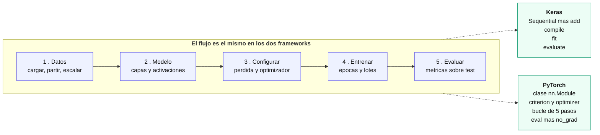

### 39. Por qué hacen falta TensorFlow y PyTorch

`MLPClassifier` alcanza para un MLP sobre datos tabulares y nada más. Lo que no puede hacer:

| Limitación de scikit-learn | Qué habilita un framework |
|---|---|
| Solo capas densas | **Convolucionales** para imágenes, **recurrentes** para secuencias, atención para texto |
| Solo CPU | Entrenamiento en **GPU**, uno o dos órdenes de magnitud más rápido |
| Pérdidas y optimizadores fijos | Funciones de pérdida a medida, optimizadores configurables |
| `fit()` cerrado | Control del bucle: entrenamiento adversario, múltiples modelos, pasos personalizados |
| Sin autograd expuesto | Derivadas automáticas de cualquier expresión |

La pieza común es el **tensor**: un arreglo multidimensional, como un `ndarray` de NumPy, pero con dos capacidades que lo cambian todo — puede vivir en la GPU y registra las operaciones que se le aplican para poder derivarlas después (*autograd*). Sobre esa estructura se apoyan los dos frameworks.

**La diferencia histórica entre ambos** fue cómo construyen el grafo de cómputo:

```mermaid
flowchart TD
    subgraph EST["<b>Grafo estatico &mdash; TensorFlow 1.x</b>"]
        direction TB
        E1[Definir el grafo completo] --> E2[Compilarlo y optimizarlo]
        E2 --> E3[Recien ahi correr los datos]
        E3 --> E4["Rapido en produccion<br/>dificil de depurar"]
    end
    subgraph DIN["<b>Grafo dinamico &mdash; PyTorch y TF 2.x</b>"]
        direction TB
        D1[Cada operacion se ejecuta al escribirla] --> D2[El grafo se arma sobre la marcha]
        D2 --> D3["Se puede usar print y debugger<br/>se puede cambiar la red segun los datos"]
    end
    classDef est fill:#fef3c7,stroke:#d97706,color:#111
    classDef din fill:#ecfdf5,stroke:#059669,color:#111
    class E1,E2,E3,E4 est
    class D1,D2,D3 din
```

TensorFlow 1.x obligaba a definir el grafo completo antes de correr nada: rápido para producción, incómodo para depurar. PyTorch nació con grafo **dinámico** y eso explica su adopción en investigación. Hoy la distinción se diluyó: **TensorFlow 2.x usa modo dinámico (*eager*) por defecto**, y el grafo estático es opcional con `@tf.function`.

> Ojo con el material del curso, que describe el grafo estático de TF como si fuera la única forma. Corresponde a TensorFlow 1.x.

### 40. TensorFlow y Keras

**TensorFlow** es el framework de Google: flexible, escalable, con un ecosistema grande y herramientas de despliegue en producción. **Keras** es su API de alto nivel — desde TF 2.0 dejó de ser un proyecto externo para integrarse como `tf.keras`, y con Keras 3 volvió a ser multi-backend (TensorFlow, PyTorch o JAX).

En la práctica, escribir TensorFlow es escribir Keras.

```python
from tensorflow.keras import layers, models

# 1. Definir: una pila lineal de capas
model = models.Sequential()
model.add(layers.Dense(64, activation='relu', input_shape=(4,)))
model.add(layers.Dense(128, activation='relu'))
model.add(layers.Dense(3, activation='softmax'))

model.summary()          # arquitectura y cantidad de parametros

# 2. Configurar como se entrena
model.compile(optimizer='adam',
              loss='categorical_crossentropy',
              metrics=['accuracy'])

# 3. Entrenar
history = model.fit(X_train, y_train, epochs=10, batch_size=16,
                    validation_data=(X_test, y_test))

# 4. Evaluar
test_loss, test_acc = model.evaluate(X_test, y_test)
```

**`Sequential` vs API funcional.** `Sequential` es una pila lineal: cada capa recibe la salida de la anterior. Cuando la red tiene varias entradas, varias salidas o conexiones que saltean capas, hace falta la **API funcional**: `Model(inputs, outputs)`.

**Las tres pérdidas de clasificación**, y cuál usar:

| Pérdida | Etiquetas | Cuándo |
|---|---|---|
| `binary_crossentropy` | 0 o 1 | dos clases |
| `categorical_crossentropy` | **one-hot** | multiclase, con `to_categorical` |
| `sparse_categorical_crossentropy` | **enteros** | multiclase, sin convertir |

Las dos últimas son matemáticamente idénticas; cambia solo el formato de entrada.

**`history`** es lo que devuelve `fit`, y guarda la evolución de cada métrica por época en `history.history`, con las claves `loss`, `accuracy`, `val_loss` y `val_accuracy`. Es lo que se grafica para ver si el modelo sobreajusta (cap. 7).

### 41. PyTorch

**PyTorch** es el framework de Meta, abierto en 2017 y bajo la PyTorch Foundation desde 2022. Su marca registrada es el grafo dinámico y un estilo más explícito: nada ocurre por detrás.

Un modelo es una **clase que hereda de `nn.Module`**, con dos métodos:

```python
import torch.nn as nn

class MLP(nn.Module):
    def __init__(self):
        super().__init__()
        self.layer1 = nn.Linear(4, 64)      # las capas
        self.layer2 = nn.Linear(64, 128)
        self.layer3 = nn.Linear(128, 3)

    def forward(self, x):                    # como fluyen los datos
        x = torch.relu(self.layer1(x))
        x = torch.relu(self.layer2(x))
        return self.layer3(x)                # sin activacion final

criterion = nn.CrossEntropyLoss()
optimizer = optim.Adam(model.parameters(), lr=0.001)
```

**Los datos** pasan por dos objetos: `TensorDataset`, que empareja features con etiquetas, y `DataLoader`, que los sirve por lotes con `batch_size` y `shuffle`. Para imágenes, `torchvision` agrega datasets y transformaciones (`ToTensor`, `Resize`, `Normalize`), encadenables con `transforms.Compose`.

**El entrenamiento se escribe a mano**, y ahí está la diferencia visible con Keras:

```mermaid
flowchart LR
    subgraph KERAS["<b>Keras</b>"]
        K1["model.fit(X, y, epochs=10)"]
        K2["Keras resuelve todo por dentro"]
        K1 --> K2
    end
    subgraph TORCH["<b>PyTorch &mdash; el mismo trabajo, explicito</b>"]
        direction TB
        T1["optimizer.zero_grad()<br/>limpiar gradientes"] --> T2["outputs = model(x)<br/>forward"]
        T2 --> T3["loss = criterion(outputs, y)<br/>calcular el error"]
        T3 --> T4["loss.backward()<br/>backpropagation"]
        T4 --> T5["optimizer.step()<br/>actualizar pesos"]
        T5 -->|siguiente lote| T1
    end
    KERAS -.->|es lo mismo que| TORCH
    classDef k fill:#eef2ff,stroke:#4f46e5,color:#111
    classDef t fill:#ecfdf5,stroke:#059669,color:#111
    class K1,K2 k
    class T1,T2,T3,T4,T5 t
```

Los cinco pasos, con lo que pasa si falta cada uno:

| Paso | Qué hace | Si falta |
|---|---|---|
| `optimizer.zero_grad()` | Limpia los gradientes | PyTorch los **acumula** entre lotes: el entrenamiento se rompe |
| `outputs = model(x)` | Forward | — |
| `loss = criterion(outputs, y)` | Calcula el error | — |
| `loss.backward()` | Backpropagation (cap. 37) | No hay gradientes que aplicar |
| `optimizer.step()` | Actualiza los pesos | Se calculan gradientes pero **la red nunca aprende** |

Ninguno de los cinco lanza una excepción si se omite: el modelo entrena mal y ya.

**Para evaluar**, tres piezas: `model.eval()` cambia el modo (importa con `Dropout` o `BatchNorm`), `torch.no_grad()` desactiva el registro de gradientes, y `torch.max(outputs, 1)` convierte los logits en la clase predicha quedándose con el índice del máximo.

### 42. Keras y PyTorch lado a lado

Las tres decisiones que **van encadenadas** y que son la fuente de error más común al pasar de un framework al otro:

```mermaid
flowchart TD
    Q{"Que framework"}
    Q -->|Keras| K1["Etiquetas en one-hot<br/>to_categorical"]
    K1 --> K2["Ultima capa CON softmax"]
    K2 --> K3["Perdida categorical_crossentropy"]
    Q -->|PyTorch| P1["Etiquetas enteras<br/>dtype long"]
    P1 --> P2["Ultima capa SIN activacion<br/>devuelve logits"]
    P2 --> P3["Perdida CrossEntropyLoss<br/>aplica log_softmax por dentro"]
    K3 --> W["<b>Las tres decisiones van juntas</b><br/>mezclar convenciones de los dos<br/>no da error, entrena mal y ya"]
    P3 --> W
    classDef k fill:#eef2ff,stroke:#4f46e5,color:#111
    classDef p fill:#ecfdf5,stroke:#059669,color:#111
    classDef w fill:#fee2e2,stroke:#dc2626,color:#111
    class K1,K2,K3 k
    class P1,P2,P3 p
    class W w
```

La comparación completa, sobre el mismo problema:

| | Keras | PyTorch |
|---|---|---|
| Definir el modelo | `Sequential()` + `.add()` | clase que hereda de `nn.Module` |
| Etiquetas | one-hot (`to_categorical`) | enteros (`long`) |
| Última capa | **con** `softmax` | **sin** activación (logits) |
| Pérdida | `categorical_crossentropy` | `CrossEntropyLoss` |
| Datos | arrays de NumPy directo | `TensorDataset` + `DataLoader` |
| Entrenar | `model.fit()` | bucle de 5 pasos |
| Métricas por época | automáticas en `history` | hay que acumularlas a mano |
| Ver la arquitectura | `model.summary()` | `torchsummary` / `torchinfo`, aparte |
| Líneas de código | ~15 | ~30 |

> **Nota (verificado en los recursos de clase, Iris con 4 atributos):** la **misma** arquitectura 4 → 64 → 128 → 3 da **9.027 parámetros** en los dos frameworks. Keras llegó a **93,33%** de exactitud y PyTorch a **96,67%** — un acierto de diferencia sobre 30 muestras de test. Ninguno de los dos notebooks fija la semilla de inicialización, así que esa diferencia es ruido, no evidencia de que un framework aprenda mejor.

**Cuál conviene.** Sobre un problema tabular como Iris, ninguno de los dos aporta nada frente a `MLPClassifier`, que lo resuelve en tres líneas. La diferencia aparece después:

- **Keras** es más rápido de escribir y trae resuelto lo repetitivo. Conviene para arquitecturas estándar y para prototipar.
- **PyTorch** obliga a escribir el bucle, y esa verbosidad es lo que permite intervenir en cada paso: pérdidas a medida, entrenamiento adversario, arquitecturas que no son una pila de capas. Es el estándar en investigación.

El curso enseña los dos a propósito, y el resto del módulo —CNNs, RNNs, Transformadores, autoencoders y GANs— los va alternando.

### 43. Redes convolucionales (CNNs)

Una imagen de 32×32 en color son **3.072 valores**; una de 224×224, más de 150.000. Conectar eso a una capa densa da millones de pesos en una sola capa, y además el modelo tendría que aprender cada objeto **en cada posición por separado**, porque un MLP recibe los píxeles como una lista plana sin noción de vecindad.

Las **CNN** resuelven las dos cosas con una idea: aplicar el **mismo filtro** a toda la imagen. Los pesos se reutilizan en cada posición —así que son pocos— y el patrón se detecta esté donde esté.

La red se parte en dos mitades con roles distintos:

```mermaid
flowchart LR
    IM["<b>Imagen</b><br/>32x32x3<br/>3.072 valores"]
    subgraph EXT["<b>Extraccion de caracteristicas</b> &mdash; aprende QUE mirar"]
        direction LR
        C1["conv 32 filtros<br/>+ pool"] --> C2["conv 64 filtros<br/>+ pool"]
        C2 --> C3["conv 128 filtros<br/>+ pool"]
    end
    FL["<b>Aplanamiento</b><br/>128 x 4 x 4 = 2.048"]
    subgraph CLA["<b>Clasificacion</b> &mdash; el MLP de siempre"]
        direction LR
        D1["densa 512"] --> D2["densa 256"] --> D3["densa 10"]
    end
    OUT["<b>softmax</b><br/>una probabilidad<br/>por clase"]
    IM --> EXT --> FL --> CLA --> OUT
    classDef img fill:#fef3c7,stroke:#d97706,color:#111
    classDef conv fill:#ecfdf5,stroke:#059669,color:#111
    classDef dense fill:#eef2ff,stroke:#4f46e5,color:#111
    class IM,OUT img
    class C1,C2,C3,FL conv
    class D1,D2,D3 dense
```

La primera mitad **aprende qué mirar**; la segunda **decide**, y es exactamente el MLP del capítulo 30. Lo nuevo es todo lo que pasa antes.

### 44. La capa convolucional

Un **filtro** (o *kernel*) es una matriz chica de pesos que se desliza sobre la imagen. En cada posición se multiplica elemento a elemento con la región que tiene debajo y se suma todo en un único valor. El resultado de recorrer la imagen entera es un **mapa de características**.

El ejemplo del curso, con una imagen de 4×4 y un filtro de 3×3 detector de bordes verticales:

| Filtro | | |
|---|---|---|
| 1 | 0 | −1 |
| 1 | 0 | −1 |
| 1 | 0 | −1 |

Ese filtro resta la columna derecha de la izquierda: da valores altos donde hay un cambio brusco de intensidad y cerca de cero donde la región es uniforme. **Los pesos del filtro no se diseñan a mano: se aprenden durante el entrenamiento**, igual que cualquier otro peso de la red.

**Los tres parámetros que controlan la operación:**

| Parámetro | Qué hace |
|---|---|
| **Kernel** (`K`) | tamaño de la ventana, típicamente 3×3 |
| **Stride** (`S`) | cuántos píxeles se desplaza por paso |
| **Padding** (`P`) | borde de ceros que se agrega alrededor |

El padding tiene tres variantes: **valid** (ninguno, la salida se achica), **same** (el justo para conservar el tamaño) y **full** (la salida crece).

**La fórmula que resume todo**, y que conviene tener a mano:

```
tamaño_salida = (W − K + 2P) / S + 1
```

> **Nota (verificado contra los notebooks del curso):** `Conv2d(kernel_size=3, padding=1)` con stride 1 sobre una entrada de 32×32 da `(32 − 3 + 2)/1 + 1 = 32` — **conserva el tamaño**. Es la razón por la que en la CNN del curso el tamaño va 32 → 16 → 8 → 4: las convoluciones no achican nada, **el que divide por dos es el pooling**.

**Cuántos pesos tiene un filtro:** `kernel × kernel × canales_de_entrada + 1` (el sesgo). Para la primera capa de la CNN del curso: 3×3×3+1 = 28 por filtro, por 32 filtros = **896 parámetros**, que es exactamente lo que reporta el `summary`.

### 45. Agrupamiento, aplanamiento y capas densas

**El agrupamiento** (*pooling*) reduce el tamaño espacial tomando un valor por ventana. Con `MaxPool2d(2, 2)` cada ventana de 2×2 se reemplaza por su máximo, así que alto y ancho se dividen por dos.

| | Qué conserva |
|---|---|
| **Max pooling** | la activación **más fuerte** de la región: si el filtro detectó un rasgo, sobrevive |
| **Average pooling** | el promedio, que **diluye** el rasgo entre los valores vecinos |

Por eso el max pooling es el habitual en clasificación. Y algo que conviene notar: **el pooling no tiene parámetros**. Es una operación fija, no algo que se aprenda.

El recorrido completo de tamaños, que es donde se traba todo el mundo la primera vez:

```mermaid
flowchart TD
    A["Entrada 32x32<br/>3 canales"]
    A -->|"conv 3x3 padding 1<br/>NO cambia el tamano"| B["32x32<br/>32 canales"]
    B -->|"maxpool 2x2<br/>divide por dos"| C["16x16<br/>32 canales"]
    C -->|conv| D["16x16<br/>64 canales"]
    D -->|pool| E["8x8<br/>64 canales"]
    E -->|conv| F["8x8<br/>128 canales"]
    F -->|pool| G["4x4<br/>128 canales"]
    G --> H["<b>128 x 4 x 4 = 2.048</b><br/>este es el numero que hay que<br/>escribir a mano en PyTorch"]
    classDef sz fill:#ecfdf5,stroke:#059669,color:#111
    classDef fin fill:#fee2e2,stroke:#dc2626,color:#111
    class A,B,C,D,E,F,G sz
    class H fin
```

**El aplanamiento** (*flattening*) convierte los mapas en un vector para que puedan entrar a las capas densas. En Keras es `Flatten()` y lo calcula solo; en PyTorch hay que escribir `x.view(-1, 128*4*4)` **a mano**, y recalcularlo si cambia la arquitectura. Es el error más frecuente al armar una CNN en PyTorch, y falla sin dar un mensaje claro.

**Dónde terminan los parámetros**, medido sobre la CNN del curso (1.276.234 en total):

| Bloque | Parámetros | % |
|---|---:|---:|
| Las 3 convoluciones | 93.248 | 7% |
| Las 3 densas | 1.182.986 | **93%** |
| — solo la primera densa | 1.049.088 | **82%** |

**Es el argumento entero de las CNNs en un número.** Un filtro de 3×3 tiene 9 pesos que se reutilizan sobre toda la imagen; una capa densa necesita un peso por cada conexión. Las convoluciones hacen el trabajo pesado con el 7% de los parámetros.

> **Nota (verificado en los notebooks, CIFAR-10, 2 épocas):** la misma arquitectura da **1.276.234 parámetros** en PyTorch y en Keras — la cantidad depende de la arquitectura, no del framework. Las exactitudes fueron 58,85% y 63,03%, pero la diferencia viene del optimizador (SGD con momentum contra Adam) y de la normalización ([−1, 1] contra [0, 1]), no del framework. La exactitud por clase va de **76,9%** en avión a **38,7%** en ciervo: los objetos artificiales tienen formas rígidas y fondos característicos, los animales aparecen en poses variadas y se parecen entre sí en 32×32 píxeles.

### 46. Redes recurrentes (RNNs)

Una CNN explota la estructura **espacial** —píxeles vecinos tienen que ver entre sí—. Una **RNN** explota la estructura **temporal**: cada paso de una secuencia depende de los anteriores. Las dos son formas de meterle al modelo una suposición sobre la forma de los datos, en lugar de tratar todo como un vector plano.

**La idea central es el estado oculto.** La red mantiene un vector `h` que se pasa de un paso al siguiente, así que la salida no depende solo de la entrada actual sino de todo lo visto antes. Eso le permite procesar secuencias de **largo variable** con la misma cantidad de pesos.

```mermaid
flowchart LR
    subgraph COMPACTA["<b>Vista compacta</b>"]
        X["entrada x"] --> H["estado oculto h"] --> Y["salida y"]
        H -.->|"se realimenta"| H
    end
    subgraph DESPLEGADA["<b>Desplegada en el tiempo</b>"]
        direction LR
        H0["h inicial"] --> H1["h en t=1"]
        X1["x en t=1"] --> H1
        H1 --> H2["h en t=2"]
        X2["x en t=2"] --> H2
        H2 --> H3["h en t=3"]
        X3["x en t=3"] --> H3
        H1 --> Y1["y en t=1"]
        H2 --> Y2["y en t=2"]
        H3 --> Y3["y en t=3"]
    end
    COMPACTA -.->|"es lo mismo que"| DESPLEGADA
    classDef e fill:#fef3c7,stroke:#d97706,color:#111
    classDef h fill:#ecfdf5,stroke:#059669,color:#111
    classDef s fill:#eef2ff,stroke:#4f46e5,color:#111
    class X,X1,X2,X3 e
    class H,H0,H1,H2,H3 h
    class Y,Y1,Y2,Y3 s
```

Las dos vistas son el mismo objeto: la compacta tiene un bucle, la desplegada lo estira en el tiempo. **Los pesos son los mismos en todos los pasos** — no hay un juego de parámetros por instante.

Las ecuaciones de la celda básica:

```
a_t = V·h_{t-1} + U·x_t + b        # combina el estado previo con la entrada actual
h_t = tanh(a_t)                    # nuevo estado oculto
o_t = softmax(c + W·h_t)           # salida
```

**Por qué `tanh` y no ReLU.** El estado oculto se realimenta en cada paso, así que se multiplica por los mismos pesos una y otra vez. Con una activación no acotada como ReLU los valores pueden **explotar** al cabo de varios pasos; `tanh` los mantiene en (−1, 1).

**El problema que define el tema.** Al retropropagar a través de muchos pasos temporales, el gradiente se multiplica una vez por paso — el mismo mecanismo del cap. 37, ahora en el eje del tiempo. Con derivadas menores a 1 el gradiente **se apaga** antes de llegar a los primeros pasos, así que la red no aprende dependencias largas: no relaciona el final de un párrafo con su comienzo.

#### Los cuatro tipos, según la forma de entrada y salida

Lo que hace versátil a la arquitectura es que la secuencia puede estar en la entrada, en la salida, o en las dos:

| Tipo | Forma | Ejemplo |
|---|---|---|
| **Uno a uno** | una entrada, una salida | no es realmente recurrente: es una red común |
| **Uno a muchos** | una entrada, secuencia de salida | describir una imagen con una frase (*image captioning*) |
| **Muchos a uno** | secuencia de entrada, una salida | clasificar el sentimiento de una reseña |
| **Muchos a muchos, mismo largo** | secuencia a secuencia alineada | etiquetar cada palabra de una oración |
| **Muchos a muchos, distinto largo** | secuencia a secuencia libre | traducción automática |

El último caso —cuando la entrada y la salida tienen largos distintos— necesita una estructura **encoder-decoder**: una red lee toda la secuencia y la comprime en un vector, otra la genera desde ahí. Es lo que desarrolla la Clase 22 del programa, y el punto de partida de los Transformadores.

#### La activación y el problema de la escala

Además de `tanh` en el estado oculto, la salida usa **softmax** cuando hay que elegir entre clases. Y como el estado se realimenta, existe el problema simétrico al gradiente desvaneciente: el **gradiente explosivo**, cuando los valores crecen sin control. La solución habitual es el ***gradient clipping***: recortar el gradiente cuando su norma supera un umbral, antes de aplicar la actualización.

Eso es exactamente lo que viene a resolver la **GRU**, que es el capítulo siguiente.

### 47. GRU: unidades recurrentes con compuertas

La RNN simple tiene un problema estructural: **en cada paso reescribe el estado oculto por completo**. Al retropropagar, el gradiente se multiplica una vez por paso y se apaga antes de llegar lejos, así que la red no aprende dependencias largas (cap. 46).

La **GRU** (*Gated Recurrent Unit*) lo resuelve con una idea simple: en lugar de reescribir el estado entero, dejar que la red **decida cuánto conservar y cuánto actualizar**.

```mermaid
flowchart LR
    subgraph SIMPLE["<b>RNN simple</b> &mdash; el estado se reescribe entero"]
        direction LR
        A1["h anterior"] --> A2["tanh"] --> A3["h nuevo"]
        A3 -.->|"el gradiente se multiplica<br/>en CADA paso y se apaga"| A1
    end
    subgraph GRU["<b>GRU</b> &mdash; una compuerta decide cuanto se reescribe"]
        direction LR
        B1["h anterior"] --> B2{"compuerta z<br/>entre 0 y 1"}
        B2 -->|"z cerca de 0<br/>conservar"| B3["h nuevo casi igual<br/>al anterior"]
        B2 -->|"z cerca de 1<br/>actualizar"| B4["h nuevo toma<br/>el candidato"]
    end
    SIMPLE -.->|"el problema"| GRU
    classDef s fill:#fee2e2,stroke:#dc2626,color:#111
    classDef g fill:#ecfdf5,stroke:#059669,color:#111
    classDef q fill:#fef3c7,stroke:#d97706,color:#111
    class A1,A2,A3 s
    class B1,B3,B4 g
    class B2 q
```

#### Qué es una compuerta

Una **compuerta** es un vector de valores entre 0 y 1, producido por una **sigmoide**, que se multiplica elemento a elemento con otro vector. Funciona como una válvula: en 0 no deja pasar nada, en 1 deja pasar todo, y en el medio filtra parcialmente.

Lo importante es que **esos valores se aprenden**. La red aprende *cuándo* conviene recordar y cuándo olvidar, en lugar de tener una regla fija.

La GRU tiene dos:

| Compuerta | Símbolo | Qué decide |
|---|---|---|
| **Reinicio** (*reset*) | `r` | cuánto del pasado **ignorar** al calcular el candidato de estado nuevo |
| **Actualización** (*update*) | `z` | cuánto del estado viejo **conservar** frente al candidato nuevo |

```mermaid
flowchart TD
    X["entrada x en t"] --> R{"<b>compuerta de reinicio r</b><br/>sigmoide<br/>cuanto del pasado ignoro"}
    H["estado anterior h"] --> R
    X --> Z{"<b>compuerta de actualizacion z</b><br/>sigmoide<br/>cuanto conservo del viejo"}
    H --> Z
    R --> C["<b>candidato</b><br/>tanh sobre x y el pasado filtrado por r"]
    X --> C
    H --> C
    C --> M["<b>mezcla final</b><br/>h nuevo = 1 menos z por h viejo<br/>mas z por candidato"]
    Z --> M
    M --> OUT["<b>h en t</b><br/>pasa al siguiente paso"]
    classDef e fill:#fef3c7,stroke:#d97706,color:#111
    classDef g fill:#eef2ff,stroke:#4f46e5,color:#111
    classDef c fill:#ecfdf5,stroke:#059669,color:#111
    class X,H e
    class R,Z g
    class C,M,OUT c
```

Las ecuaciones, en el orden en que se calculan:

```
r_t = σ(W_r · [h_{t-1}, x_t])            # cuanto del pasado ignoro
z_t = σ(W_z · [h_{t-1}, x_t])            # cuanto conservo
h̃_t = tanh(W · [r_t * h_{t-1}, x_t])     # candidato, con el pasado ya filtrado por r
h_t = (1 − z_t) * h_{t-1} + z_t * h̃_t    # mezcla final
```

La última línea es el corazón del mecanismo. Si `z_t ≈ 0`, el estado nuevo es **casi idéntico** al anterior: la información se conserva intacta a través del paso. Si `z_t ≈ 1`, se reemplaza por el candidato.

#### Por qué esto arregla el gradiente

Cuando `z_t` es chico, `h_t ≈ h_{t-1}`, y esa relación de casi-identidad crea un **camino directo** para que el gradiente fluya hacia atrás **sin multiplicarse por derivadas menores a uno en cada paso**. La red puede aprender a dejar esa vía abierta durante muchos pasos y así conectar el final de una secuencia con su comienzo.

Es la misma idea que las **conexiones residuales** de las redes profundas: dar al gradiente una ruta que lo saltee todo.

#### GRU frente a LSTM

| | **GRU** | **LSTM** |
|---|---|---|
| Compuertas | 2 (reinicio, actualización) | 3 (olvido, entrada, salida) |
| Estado | solo `h` | `h` **más** un estado de celda `c` separado |
| Parámetros | menos | más (~33% más) |
| Velocidad | entrena más rápido | más lenta |
| Rendimiento | equivalente en la mayoría de los casos | suele ganar en secuencias muy largas |

No hay un ganador universal. La recomendación práctica es **empezar por GRU** —menos parámetros, entrena más rápido— y probar LSTM si las dependencias son muy largas.

```python
import torch.nn as nn

gru = nn.GRU(input_size=10, hidden_size=64, num_layers=2, batch_first=True)
lstm = nn.LSTM(input_size=10, hidden_size=64, num_layers=2, batch_first=True)

# En Keras es igual de directo
# layers.GRU(64, return_sequences=True)
# layers.LSTM(64)
```

> **Nota (inconsistencia en el material):** la tabla de ecuaciones de la slide del curso **omite el `r_t` multiplicando a `h_{t-1}`** dentro del cálculo del candidato, aunque el diagrama de la misma slide sí lo muestra. Sin esa multiplicación, la compuerta de reinicio no cumpliría ninguna función. La versión correcta es la de arriba. La slide además escribe `x̄_t` con barra en la ecuación de `z_t`, que parece un error tipográfico.

### 48. LSTM: memoria a largo plazo

La **LSTM** (*Long Short-Term Memory*) ataca el mismo problema que la GRU —el gradiente que se apaga al retropropagar en el tiempo— con más maquinaria. Es **anterior**: la propusieron Hochreiter y Schmidhuber en **1997**, casi veinte años antes que la GRU (2014), aunque el curso la presente después.

**Su diferencia estructural es tener dos estados separados**, donde la GRU tiene uno:

| Estado | Rol |
|---|---|
| **`c`** — estado de celda | la **memoria de largo plazo**. Fluye a lo largo de la secuencia con modificaciones mínimas |
| **`h`** — estado oculto | lo que la celda **expone hacia afuera** en cada paso |

El estado de celda es lo que le da el nombre a la red. Funciona como una **cinta transportadora**: la información puede viajar muchos pasos casi sin tocarse, y por esa vía el gradiente llega hasta el principio de la secuencia sin apagarse. Es el mismo mecanismo que en GRU logra la compuerta de actualización cuando `z` es chico (cap. 47), pero con un canal dedicado.

#### Las tres compuertas

```mermaid
flowchart TD
    CIN["<b>estado de celda anterior c</b><br/>la memoria de largo plazo"]
    HIN["estado oculto anterior h"]
    X["entrada x en t"]
    X --> F{"<b>1 . compuerta de olvido</b><br/>sigmoide<br/>que borro de la memoria"}
    HIN --> F
    X --> I{"<b>2 . compuerta de entrada</b><br/>sigmoide<br/>que informacion nueva guardo"}
    HIN --> I
    X --> G["<b>candidato</b><br/>tanh<br/>que podria guardarse"]
    HIN --> G
    CIN --> MUL["c viejo por la compuerta de olvido"]
    F --> MUL
    I --> ADD["mas el candidato filtrado por la de entrada"]
    G --> ADD
    MUL --> C2["<b>estado de celda nuevo c</b>"]
    ADD --> C2
    X --> O{"<b>3 . compuerta de salida</b><br/>sigmoide<br/>que parte de la memoria expongo"}
    HIN --> O
    C2 --> H2["<b>estado oculto nuevo h</b><br/>tanh de c, filtrado por la de salida"]
    O --> H2
    classDef mem fill:#fef3c7,stroke:#d97706,color:#111
    classDef gate fill:#eef2ff,stroke:#4f46e5,color:#111
    classDef op fill:#ecfdf5,stroke:#059669,color:#111
    class CIN,C2 mem
    class F,I,O gate
    class G,MUL,ADD,H2,HIN,X op
```

| Compuerta | Decide |
|---|---|
| **Olvido** (*forget*) | qué se **borra** del estado de celda |
| **Entrada** (*input*) | qué información nueva se **guarda** |
| **Salida** (*output*) | qué parte del estado de celda se **expone** como estado oculto |

Las tres son sigmoides, o sea vectores entre 0 y 1 que se multiplican elemento a elemento, y sus valores **se aprenden**. La red aprende cuándo conviene recordar, cuándo olvidar y cuánto mostrar.

Las ecuaciones, en el orden en que se calculan:

```
f_t = σ(W_f · [h_{t-1}, x_t])        # olvido
i_t = σ(W_i · [h_{t-1}, x_t])        # entrada
g_t = tanh(W_g · [h_{t-1}, x_t])     # candidato
o_t = σ(W_o · [h_{t-1}, x_t])        # salida

c_t = f_t * c_{t-1} + i_t * g_t      # la memoria: se borra un poco y se agrega un poco
h_t = o_t * tanh(c_t)                # lo que se expone
```

La línea de `c_t` es el corazón: **el estado viejo se multiplica por la compuerta de olvido y se le suma el candidato filtrado por la de entrada**. Si `f_t ≈ 1` e `i_t ≈ 0`, la memoria pasa intacta.

#### Las tres celdas, lado a lado

```mermaid
flowchart LR
    A["<b>RNN simple</b><br/>1 estado: h<br/>0 compuertas<br/>reescribe todo en cada paso"]
    B["<b>GRU</b> &mdash; 2014<br/>1 estado: h<br/>2 compuertas: reinicio, actualizacion<br/>menos parametros, entrena rapido"]
    C["<b>LSTM</b> &mdash; 1997<br/>2 estados: h y c<br/>3 compuertas: olvido, entrada, salida<br/>mas parametros, mejor en secuencias largas"]
    A -->|"no aprende<br/>dependencias largas"| B
    B -->|"mas control:<br/>memoria separada"| C
    A -.->|"historicamente<br/>LSTM vino antes"| C
    classDef mala fill:#fee2e2,stroke:#dc2626,color:#111
    classDef buena fill:#ecfdf5,stroke:#059669,color:#111
    class A mala
    class B,C buena
```

| | RNN simple | GRU | LSTM |
|---|---|---|---|
| Estados | `h` | `h` | **`h` y `c`** |
| Compuertas | ninguna | 2 | 3 |
| Parámetros | pocos | intermedio | más (~33% sobre GRU) |
| Dependencias largas | no aprende | bien | **mejor** |
| Velocidad | la más rápida | rápida | la más lenta |

**Cuál elegir.** En la práctica GRU y LSTM rinden parecido en la mayoría de las tareas. La recomendación es empezar por **GRU** —menos parámetros, entrena más rápido— y probar LSTM si las secuencias son muy largas o el resultado no alcanza.

> **Nota (inconsistencia del material):** el diagrama de la slide numera las compuertas (2), (1), (3) sin seguir el orden espacial ni el de cómputo, y la lista de ecuaciones las presenta en un cuarto orden distinto. Las fórmulas en sí son correctas — a diferencia de la slide de GRU, donde faltaba un término.

### 49. RNNs en la práctica: trabajar con texto

Los notebooks de las Clases 18 y 19 resuelven el mismo problema —clasificar el sentimiento de reseñas de IMDb— en los dos frameworks, y traen los tres pasos propios del texto que no aparecían con tablas ni imágenes.

```mermaid
flowchart LR
    T["<b>texto crudo</b><br/>esta pelicula fue excelente"]
    T --> ID["<b>IDs de palabra</b><br/>segun un vocabulario fijo<br/>14, 20, 16, 777"]
    ID --> PAD["<b>padding</b><br/>todas al mismo largo<br/>ceros adelante, trunca adelante"]
    PAD --> EMB["<b>Embedding</b><br/>cada ID a un vector denso<br/>que se aprende"]
    EMB --> RNN["<b>LSTM o GRU</b><br/>recorre la secuencia<br/>guarda estado"]
    RNN --> OUT["<b>Dense</b><br/>una probabilidad"]
    ID -.->|"<b>el paso critico</b><br/>al predecir hay que usar<br/>EL MISMO vocabulario<br/>del entrenamiento"| ID
    classDef t fill:#fef3c7,stroke:#d97706,color:#111
    classDef p fill:#eef2ff,stroke:#4f46e5,color:#111
    classDef r fill:#ecfdf5,stroke:#059669,color:#111
    class T,OUT t
    class ID,PAD p
    class EMB,RNN r
```

#### 1. De texto a números

Una red no procesa palabras: procesa números. Hace falta un **vocabulario** que asigne un entero a cada palabra, típicamente **ordenado por frecuencia** y recortado a las N más comunes.

IMDb viene con eso resuelto: `load_data(num_words=10000)` devuelve las reseñas ya como listas de enteros.

> **El detalle que rompe todo:** ese vocabulario es **parte del modelo**. Al predecir sobre texto nuevo hay que usar exactamente el mismo, o los números que entran significan otras palabras.

#### 2. Padding: emparejar los largos

Las secuencias tienen largos distintos y la red necesita entradas uniformes. `pad_sequences(maxlen=N)` rellena las cortas y trunca las largas — por defecto **por adelante** en ambos casos.

Que el relleno vaya adelante no es casual: así lo último que la red procesa es el final real del texto, no una fila de ceros.

**`maxlen` es un hiperparámetro con consecuencias grandes.** Truncar a 50 tokens conserva solo las últimas 50 palabras de cada reseña.

> **Nota (verificado en los notebooks del curso):** las dos versiones del mismo problema difieren en `max_len` — **1.000** en TensorFlow contra **50** en PyTorch — y sus exactitudes son **86,64%** y **74,65%**. Los doce puntos salen mayormente de ese recorte, no del framework. (El notebook de PyTorch además tiene el output de una sola época pese a pedir 20 en el código.)

#### 3. Embeddings

La capa **`Embedding`** convierte cada ID en un **vector denso** que se aprende durante el entrenamiento. Es la alternativa al *one-hot*: con 10.000 palabras, one-hot da vectores de 10.000 posiciones casi todas en cero; un embedding de 128 dimensiones las representa con 128 números que además **codifican similitud** — palabras que aparecen en contextos parecidos terminan cerca en ese espacio.

```python
# Keras
model.add(Embedding(10000, 128))
model.add(LSTM(128))                       # return_sequences=False: solo el estado final
model.add(Dense(1, activation='sigmoid'))

# PyTorch
self.embedding = nn.Embedding(vocab_size, 100)
self.lstm = nn.LSTM(100, 128, num_layers=2, batch_first=True)
# ...
lstm_out, (hidden, cell) = self.lstm(embedded)
hidden = hidden[-1, :, :]                  # el estado de la ultima capa apilada
```

**Dos detalles de PyTorch que cuestan:** `batch_first=True` cambia el orden de las dimensiones a `(lote, tiempo, features)` —el default es `(tiempo, lote, features)`—, y la LSTM devuelve **los dos estados** (`hidden` y `cell`), a diferencia de una GRU que devuelve uno solo.

#### El error silencioso que hay que conocer

> **Nota (verificado ejecutando el recurso de clase):** el notebook de TensorFlow, al predecir sobre frases nuevas, crea un **`Tokenizer` nuevo ajustado solo con esas frases** en lugar de usar el vocabulario de IMDb. El resultado: al modelo le entran los IDs `[1, 2, 3, 4]` donde correspondería `[14, 20, 16, 777]`. La palabra *"fantastic"* es el **4** para el tokenizer nuevo y el **777** para el modelo.
>
> Dos de las tres predicciones salen invertidas —dice que *"worst mistake of my life"* es positiva— **en un modelo con 86,6% de exactitud**. Y no lanza ninguna excepción: corre, imprime con formato prolijo y cuatro decimales, y todo parece funcionar.

Es el mismo patrón que persistir un modelo sin su escalador (cap. 38), y deja una regla general:

**Toda transformación aprendida de los datos —tokenizer, escalador, encoder, vocabulario— es parte del modelo. Se guarda con él y se reusa idéntica al predecir.**

### 50. Procesamiento de lenguaje natural

El **PLN** es la rama del aprendizaje automático que busca que las computadoras comprendan y manipulen el lenguaje humano. Es uno de los campos que más se desarrolló en los últimos años, y el cap. 49 ya mostró su pieza central: los **embeddings**.

Antes de los embeddings hay un paso previo que decide mucho: **cómo se parte el texto**.

#### Tokenización: las tres estrategias

| Estrategia | Vocabulario | Secuencias | Problema |
|---|---|---|---|
| **Por palabra** | enorme (100.000+) | cortas | toda palabra no vista es `<UNK>`; "correr" y "corriendo" son símbolos sin relación |
| **Por carácter** | mínimo (~100) | larguísimas | el modelo tiene que aprender qué es una palabra desde cero |
| **Por subpalabra** | intermedio (~30.000) | intermedias | — |

La **subpalabra** es lo que usan todos los modelos modernos. Algoritmos como **BPE** (*Byte Pair Encoding*) y **WordPiece** parten de caracteres y van fusionando los pares más frecuentes hasta llegar al tamaño de vocabulario deseado. El resultado: las palabras comunes quedan enteras y las raras se parten en piezas conocidas — `tokenización` puede quedar como `token` + `##ización`.

Eso resuelve el problema del **fuera de vocabulario** (OOV): ya no hace falta un `<UNK>` que descarta información, porque cualquier palabra nueva se puede armar con piezas.

#### Embeddings: estáticos y contextuales

Un **embedding** es un vector denso que representa una palabra, y la distancia entre vectores captura similitud de significado.

| Tipo | Ejemplos | Característica |
|---|---|---|
| **Estáticos** | Word2Vec, GloVe | una palabra, **un** vector, siempre el mismo |
| **Contextuales** | BERT, GPT | una palabra, **un vector distinto según el contexto** |

La diferencia se ve en una frase: en *"el banco de la plaza"* y *"el banco me cobró comisión"*, un embedding estático le da a "banco" exactamente el mismo vector. Uno contextual le da dos vectores distintos, porque mira las palabras que la rodean.

Esa es, en una línea, la razón de ser de los Transformadores.

### 51. Seq2Seq y el problema del cuello de botella

Una RNN sola no resuelve el caso donde **la entrada y la salida tienen largos distintos** — traducir una frase de 8 palabras a uno de 12, por ejemplo. Es el cuarto tipo de RNN del cap. 46, y necesita una estructura propia.

**Seq2Seq** la resuelve con dos redes:

- El **encoder** lee toda la entrada y la comprime en un **vector de contexto**.
- El **decoder** genera la salida a partir de ese vector, token por token.

```
h_t = f(x_t, h_{t-1})              # encoder: acumula la entrada
s_t = g(y_{t-1}, s_{t-1}, C)       # decoder: genera usando el contexto C
```

Durante el entrenamiento se usa **teacher forcing**: en lugar de alimentar al decoder con lo que él mismo predijo —que al principio es ruido—, se le da la palabra correcta del ejemplo. Acelera la convergencia, a costa de una diferencia entre cómo se entrena y cómo se usa después.

#### El cuello de botella

**Todo lo que el decoder sabe de la entrada está en un único vector de tamaño fijo.** Con una frase de cinco palabras alcanza; con un párrafo de cincuenta, no. La información del principio se diluye antes de llegar al final.

```mermaid
flowchart TD
    subgraph S2S["<b>Seq2Seq clasico</b> &mdash; el cuello de botella"]
        direction LR
        E1["el"] --> E2["perro"] --> E3["ladro"] --> C["<b>vector de contexto</b><br/>toda la frase comprimida<br/>en un vector de tamano fijo"]
        C --> D1["the"] --> D2["dog"] --> D3["barked"]
    end
    subgraph ATT["<b>Con atencion</b> &mdash; el decoder mira todo"]
        direction LR
        A1["el"] --> H["<b>todos los estados<br/>del encoder quedan disponibles</b>"]
        A2["perro"] --> H
        A3["ladro"] --> H
        H --> B1["en cada palabra que genera,<br/>el decoder <b>pondera</b><br/>cuales estados importan"]
    end
    S2S -->|"problema: una frase larga<br/>no entra en un vector fijo"| ATT
    classDef n fill:#eef2ff,stroke:#4f46e5,color:#111
    classDef mal fill:#fee2e2,stroke:#dc2626,color:#111
    classDef bien fill:#ecfdf5,stroke:#059669,color:#111
    class E1,E2,E3,D1,D2,D3,A1,A2,A3 n
    class C mal
    class H,B1 bien
```

### 52. Mecanismos de atención

La **atención** elimina ese cuello de botella con una idea directa: en vez de comprimir todo en un vector, **conservar todos los estados del encoder** y dejar que el decoder decida, en cada palabra que genera, cuáles mirar.

El mecanismo, en tres pasos:

1. **Scores** — se compara el estado actual del decoder contra cada estado del encoder.
2. **Softmax** — esos scores se normalizan en pesos que suman 1.
3. **Contexto dinámico** — se promedian los estados del encoder ponderados por esos pesos.

La diferencia con seq2seq es que ahora el contexto **cambia en cada paso** de la generación: al traducir "gato" el modelo mira la palabra "cat"; al traducir "negro", mira "black".

**Y hay un beneficio extra: interpretabilidad.** Los pesos de atención se pueden graficar, y muestran a qué parte de la entrada miró el modelo para producir cada parte de la salida. Es una ventana poco común en deep learning, donde casi todo es opaco.

### 53. Transformadores

El paso siguiente fue radical: **si la atención resuelve el problema, ¿hace falta la recurrencia?** La respuesta —el paper *Attention is All You Need*, 2017— fue que no.

#### Autoatención: Q, K y V

En lugar de que el decoder atienda al encoder, en la **autoatención** cada token de una secuencia atiende a **todos los tokens de esa misma secuencia**, incluido él mismo. De cada token se derivan tres vectores:

| | Nombre | Analogía de búsqueda |
|---|---|---|
| **Q** | *Query* | lo que este token **pregunta** |
| **K** | *Key* | lo que cada token **ofrece** como etiqueta |
| **V** | *Value* | la **información** que aporta si resulta relevante |

```mermaid
flowchart TD
    X["<b>cada token</b> genera tres vectores"]
    X --> Q["<b>Query</b><br/>lo que este token pregunta"]
    X --> K["<b>Key</b><br/>lo que cada token ofrece"]
    X --> V["<b>Value</b><br/>la informacion que aporta"]
    Q --> S["<b>score</b> = Q por K transpuesta<br/>cuanto le importa cada token a cada token"]
    K --> S
    S --> D["<b>dividir por raiz de d_k</b><br/>sin esto el softmax satura<br/>y el gradiente se apaga"]
    D --> SM["<b>softmax</b><br/>pesos que suman 1"]
    SM --> O["<b>salida</b> = promedio de los Value<br/>ponderado por esos pesos"]
    V --> O
    classDef x fill:#fef3c7,stroke:#d97706,color:#111
    classDef qkv fill:#eef2ff,stroke:#4f46e5,color:#111
    classDef op fill:#ecfdf5,stroke:#059669,color:#111
    classDef warn fill:#fee2e2,stroke:#dc2626,color:#111
    class X x
    class Q,K,V qkv
    class S,SM,O op
    class D warn
```

La fórmula completa:

```
Atención(Q, K, V) = softmax( Q·Kᵀ / √d_k ) · V
```

> **Por qué se divide por `√d_k`.** Sin esa división, con dimensiones grandes el producto punto `Q·Kᵀ` da valores de magnitud creciente. El softmax de valores grandes **satura**: concentra casi todo el peso en un único token y deja gradientes prácticamente nulos para el resto. Es el mismo problema de saturación de la sigmoide del cap. 32, en otro contexto. La raíz de `d_k` normaliza esa escala.

#### Múltiples cabezas

Una sola atención aprende **un** tipo de relación. La **atención multi-cabeza** corre varias en paralelo, cada una con sus propias matrices Q/K/V, y concatena los resultados.

Cada cabeza termina especializándose: una sigue relaciones sintácticas, otra correferencias, otra proximidad posicional. **Es exactamente la misma idea que los múltiples filtros de una capa convolucional** (cap. 44): en vez de un detector, muchos, cada uno atento a algo distinto.

#### Codificación posicional

Acá aparece el precio de haber eliminado la recurrencia. Una RNN conoce el orden porque procesa token por token; **la autoatención es invariante a permutaciones** — para ella, "el perro mordió al hombre" y "el hombre mordió al perro" son el mismo conjunto.

La solución es **sumar al embedding de cada palabra un vector que codifica su posición**. El paper usa senos y cosenos de distintas frecuencias; BERT y GPT usan posiciones aprendidas. Las dos funcionan.

#### Residuales y normalización

Cada sub-capa va envuelta en el patrón **`Add & Normalize`**:

```
salida = LayerNorm( entrada + SubCapa(entrada) )
```

La **conexión residual** (`entrada + ...`) le da al gradiente un camino directo que saltea la sub-capa, y es lo que permite apilar seis o doce bloques sin que se pierda. **Es el mismo mecanismo que el estado de celda de la LSTM** (cap. 48) y que la compuerta de actualización de la GRU cuando deja pasar el estado casi intacto.

`LayerNorm` normaliza cada vector de token por separado y estabiliza el entrenamiento.

#### El decoder

Genera la salida **token a token** (autorregresivamente), con dos diferencias respecto del encoder:

- **Atención enmascarada**: al predecir la palabra *i* no puede mirar las posiciones posteriores, porque en inferencia todavía no existen. La máscara lo fuerza durante el entrenamiento.
- **Atención cruzada**: una segunda capa de atención donde las Q vienen del decoder y las K/V del **encoder**. Es la atención del cap. 52, ahora como una pieza más dentro de la arquitectura.

#### La ventaja decisiva: paralelismo

```mermaid
flowchart LR
    subgraph RNN["<b>RNN o LSTM</b> &mdash; secuencial"]
        direction LR
        R1["token 1"] --> R2["token 2"] --> R3["token 3"] --> R4["token 4"]
        R4 --> RT["cada paso espera al anterior<br/><b>no se puede paralelizar</b><br/>9 minutos por epoca en el notebook<br/>de la Clase 18"]
    end
    subgraph TR["<b>Transformer</b> &mdash; paralelo"]
        direction TB
        T1["token 1"]
        T2["token 2"]
        T3["token 3"]
        T4["token 4"]
        TA["<b>todos a la vez</b><br/>cada uno mira a todos<br/>via autoatencion"]
        T1 --> TA
        T2 --> TA
        T3 --> TA
        T4 --> TA
        TA --> TP["se paraleliza en GPU<br/>pero el costo crece con el<br/><b>cuadrado</b> de la longitud<br/>y hay que inyectar el orden a mano"]
    end
    classDef r fill:#fef3c7,stroke:#d97706,color:#111
    classDef t fill:#ecfdf5,stroke:#059669,color:#111
    class R1,R2,R3,R4,RT r
    class T1,T2,T3,T4,TA,TP t
```

Una LSTM **no puede paralelizar** el recorrido temporal: el paso *t* necesita el estado del *t−1*. El Transformer procesa todos los tokens a la vez, lo que aprovecha la GPU por completo. Es lo que hizo posible entrenar modelos de miles de millones de parámetros.

A cambio paga dos cosas: **el costo de la atención crece con el cuadrado de la longitud** —cada token se compara con todos— y hay que inyectar el orden a mano.

> **Nota (verificado en los notebooks del curso, todos sobre IMDb):**
>
> | Clase | Arquitectura | `maxlen` | Épocas | Exactitud |
> |---|---|---|---|---|
> | 18 | LSTM (Keras) | 1.000 | 10 | **86,64%** |
> | 19 | LSTM (PyTorch) | 50 | 1 | 74,65% |
> | 25 | **Transformer** | 250 | 100 | **82,84%** |
>
> El Transformer queda **por debajo** de la LSTM, y no por la arquitectura: entrenó 100 épocas sin *early stopping* y se sobreajustó hasta exactitud **1,0000** en entrenamiento con pérdida 0,0000079, mientras la de validación subía de 0,29 a **3,08**. Su mejor época fue la **primera**. Cortando ahí habría dado ~88,6%, el mejor de los tres, en dos minutos en lugar de dos horas.
>
> **Una arquitectura mejor, mal entrenada, rinde menos que una más simple bien entrenada.**

## Parte VIII — Referencia técnica

Las partes anteriores explican **qué es** cada técnica y **por qué** funciona. Esta es la parte de consulta: para cada familia de modelos, cuándo aplicarla, sus hiperparámetros, cómo se evalúa y el snippet de `scikit-learn` listo para usar. No se lee de corrido.

### Modelos clásicos de clasificación

**Modelos supervisados: cuándo usar cada uno + hiperparámetros clave**

| Modelo | Cuándo usar | Hiperparámetros clave |
|--------|-------------|-----------------------|
| **Regresión logística** | Baseline de clasificación; interpretable; querés probabilidades | `C` (inverso de la regularización), `penalty` (l1/l2), `class_weight` |
| **SVM** (`SVC`) | Márgenes claros; fronteras no lineales (kernels); datasets chicos/medianos | `C`, `kernel` (linear/rbf), `gamma` |
| **Árbol de decisión** | Interpretabilidad, no linealidad, EDA de importancia | `max_depth`, `min_samples_leaf`, `min_samples_split`, `criterion` |
| **Random Forest** | Robusto, poca config, da importancia de features | `n_estimators`, `max_depth`, `max_features` |
| **XGBoost** | Máxima performance en datos tabulares | `n_estimators`, `learning_rate`, `max_depth`, `subsample` |

**Cómo se evalúa** (ver §8): matriz de confusión, `accuracy` / `precision` / `recall` / `F1`, `ROC-AUC`. Con clases desbalanceadas priorizar F1/AUC/recall. Estimar el desempeño real con **split train/test** + **validación cruzada** (§10).

```python
from sklearn.model_selection import train_test_split, cross_val_score
from sklearn.linear_model import LogisticRegression
from sklearn.ensemble import RandomForestClassifier
from sklearn.metrics import classification_report, roc_auc_score

X_tr, X_te, y_tr, y_te = train_test_split(X, y, test_size=0.2, stratify=y, random_state=42)
clf = RandomForestClassifier(n_estimators=300, max_depth=None, random_state=42).fit(X_tr, y_tr)
print(classification_report(y_te, clf.predict(X_te)))
cross_val_score(clf, X, y, cv=5, scoring="f1_macro")     # desempeño robusto
clf.feature_importances_                                  # importancia de variables
```

---

### Regresión lineal

**Flujo de trabajo típico + herramientas**

| Necesito… | Herramienta | Notas |
|-----------|-------------|-------|
| Ajustar una regresión | `LinearRegression` (OLS) | Sin hiperparámetros; base de comparación |
| Evaluar regresión | `mean_absolute_error`, `mean_squared_error`, `r2_score` | RMSE = `√MSE`; R² invariante a escala de `y` (§13) |
| Estimar desempeño real | `cross_val_score`, `KFold` | Promediar métricas sobre los folds; evita sobreestimar |
| Buscar hiperparámetros | `GridSearchCV` (exhaustivo) / `RandomizedSearchCV` (muestreo) | Combinar con CV; `scoring` acorde al problema |
| Encadenar preproceso + modelo | `Pipeline` | Evita fuga de datos (el `fit` del scaler queda dentro de cada fold) |
| Regularizar / seleccionar variables | `RidgeCV`, `LassoCV`, `ElasticNetCV` | Ver §21 (Módulo 04) para el detalle |

**Cómo se evalúa:** para regresión, **RMSE** (interpretable, en la unidad de `y`) y **R²** (varianza explicada). Vigilar el **trade-off sesgo-varianza** (§10): comparar error de train vs test para detectar over/underfitting.

```python
from sklearn.pipeline import Pipeline
from sklearn.preprocessing import StandardScaler
from sklearn.linear_model import Ridge
from sklearn.model_selection import GridSearchCV, KFold
from sklearn.metrics import mean_squared_error, r2_score
import numpy as np

pipe = Pipeline([("scaler", StandardScaler()), ("model", Ridge())])
grid = GridSearchCV(pipe, {"model__alpha": [0.1, 1, 10]},
                    cv=KFold(5, shuffle=True, random_state=42),
                    scoring="neg_root_mean_squared_error")
grid.fit(X_tr, y_tr)
pred = grid.predict(X_te)
print("RMSE:", np.sqrt(mean_squared_error(y_te, pred)), "R2:", r2_score(y_te, pred))
```

---

### Redes neuronales

**Cuándo aplica un perceptrón simple:** problema de **clasificación binaria** con clases **linealmente separables**; sirve como bloque base para entender MLP, pero en la práctica rara vez se usa solo (no resuelve XOR ni problemas no lineales).

**Hiperparámetros clave:**

| Hiperparámetro | Rol | Notas |
|---|---|---|
| Tasa de aprendizaje (`eta0` en sklearn) | Magnitud del ajuste de pesos en cada actualización | Muy alta → oscila sin converger; muy baja → converge lento |
| Inicialización de pesos/bias | Punto de partida del entrenamiento | En el ejemplo manual se parte de valores pequeños no nulos (`w1=0.381`, `w2=0.245`, `θ=0.196`); en la práctica suele inicializarse en 0 o con valores aleatorios chicos |
| Número máximo de iteraciones (`max_iter`) | Corte si no converge | Relevante cuando los datos no son linealmente separables (§29) |

```python
from sklearn.linear_model import Perceptron
import numpy as np

X = np.array([[0, 0], [0, 1], [1, 0], [1, 1]])   # x1, x2
y = np.array([0, 0, 0, 1])                        # x1 AND x2

clf = Perceptron(max_iter=1000, eta0=0.045, random_state=42)
clf.fit(X, y)

clf.predict(X)        # array([0, 0, 0, 1]) → aprende la compuerta AND
clf.coef_, clf.intercept_   # pesos (w1, w2) y bias (equivalente a -θ)
```

**Flujo completo sobre un dataset real (Iris, setosa vs versicolor):**

```python
from sklearn.datasets import load_iris
from sklearn.model_selection import train_test_split
from sklearn.linear_model import Perceptron
from sklearn.metrics import accuracy_score, confusion_matrix

iris = load_iris()
mask = iris.target < 2                       # solo clases 0 y 1 (binario)
X = iris.data[mask][:, [0, 2]]               # sepal length, petal length
y = iris.target[mask]

X_train, X_test, y_train, y_test = train_test_split(
    X, y, test_size=0.2, random_state=42, stratify=y)

clf = Perceptron(max_iter=10, eta0=0.05, random_state=42).fit(X_train, y_train)

y_pred = clf.predict(X_test)
accuracy_score(y_test, y_pred)               # 1.00 (clases linealmente separables)
clf.n_iter_                                  # 7 → convergió antes de max_iter
```

**Puntos de atención del flujo:**

- `random_state` en el split **y** en el modelo: sin eso cada corrida da pesos y métricas distintos y los resultados no son comparables.
- `stratify=y` mantiene la proporción de clases en train y test; importa con particiones chicas.
- `accuracy_score(y_verdadero, y_predicho)` — ese orden. Invertirlo no cambia la exactitud pero sí transpone la matriz de confusión.
- `n_iter_ < max_iter` significa que **convergió**: dejó de haber errores y el algoritmo cortó solo.
- **Frontera de decisión** en 2D: de `w1·x1 + w2·x2 + b = 0` se despeja `x2 = -(w1/w2)·x1 - b/w2`. El perceptrón se queda con la primera recta sin errores, **no** con la de mayor margen (esa es la diferencia con SVM).
- Comparar magnitudes de pesos solo tiene sentido si los atributos están en escalas parecidas; si no, estandarizar antes (`StandardScaler`).
- `decision_function(X)` devuelve `z` **antes** del escalón: el signo da la clase y la magnitud, la distancia relativa a la frontera.

#### Perceptrón multicapa — `MLPClassifier` / `MLPRegressor`

**Cuándo aplica:** relaciones **no lineales** entre atributos y salida, con suficientes datos. Si el problema es linealmente separable o hay pocas muestras, un modelo lineal es preferible: más barato, interpretable y con menos riesgo de sobreajuste.

**Diferencias entre los dos estimadores:**

| | `MLPClassifier` | `MLPRegressor` |
|---|---|---|
| Predice | clase discreta | valor continuo |
| Capa de salida | una neurona por clase | una sola, sin activación |
| Pérdida | log-loss | error cuadrático medio |
| Métricas | exactitud, precision, recall, F1 | MSE, RMSE, MAE, R² |

Todo lo demás —capas ocultas, activación no lineal, backpropagation— es idéntico.

**Hiperparámetros clave (comunes a ambos):**

| Hiperparámetro | Rol | Notas |
|---|---|---|
| `hidden_layer_sizes` | arquitectura, ej. `(100, 150)` = dos capas ocultas | **a buscar, no a maximizar**: hay un mínimo por debajo del cual subajusta, y a partir de cierto punto solo suma costo y sobreajuste |
| `activation` | no linealidad de las ocultas: `relu` (default), `tanh`, `logistic`, `identity` | con `identity` la red colapsa a un modelo lineal — las fronteras vuelven a ser rectas |
| `alpha` | regularización L2 | subirlo suaviza las fronteras y contiene el sobreajuste |
| `max_iter` | tope de épocas | si salta `ConvergenceWarning`, el modelo sirve pero podría mejorar con más épocas |
| `early_stopping` | corta cuando deja de mejorar sobre un split de validación | evita gastar épocas de más |

**Diagnóstico del entrenamiento** (no omitirlo): `n_iter_` dice si realmente convergió o si se cortó por `max_iter`; `loss_curve_` debe **bajar y aplanarse** (estancada alto = poca capacidad; cayendo aún al final = faltaron épocas; oscilando = tasa de aprendizaje alta). Ojo: esa curva es la pérdida **de entrenamiento** — que baje a cero puede ser justamente la señal de que memorizó.

```python
from sklearn.neural_network import MLPClassifier, MLPRegressor
from sklearn.preprocessing import StandardScaler

# El escalado NO es opcional: fit_transform en train, solo transform en test
scaler = StandardScaler()
X_train_s = scaler.fit_transform(X_train)
X_test_s  = scaler.transform(X_test)          # nunca fit sobre test -> data leakage

# Clasificación
clf = MLPClassifier(hidden_layer_sizes=(20,), activation="relu",
                    max_iter=2000, random_state=42).fit(X_train_s, y_train)
clf.n_iter_, clf.loss_curve_[-1]

# Regresión
reg = MLPRegressor(hidden_layer_sizes=(100, 100), alpha=0.001,
                   max_iter=1000, random_state=42).fit(X_train_s, y_train)
```

**Evaluación en regresión:** el **RMSE** es la métrica interpretable, porque vuelve a las unidades del objetivo; el **MSE** sirve para comparar modelos entre sí; el **MAE** es más robusto a valores extremos; el **R²** dice qué proporción de la varianza se explica (0 = equivale a predecir la media, negativo = peor que la media).

**Una métrica sola no alcanza:** compararla siempre contra un **baseline** (predecir la media, y un modelo lineal). Si el MLP no le gana a una regresión lineal, su complejidad no se justifica.

> **Nota (verificado en notebook, California Housing):** predecir la media da R² = 0; la regresión lineal, 0,576; el `MLPRegressor`, **0,799** (RMSE 0,513 ≈ 51.000 dólares). El MLP se justifica porque las relaciones del dataset no son lineales.

**Antes de culpar al modelo, mirar los datos.** En California Housing el objetivo está **truncado** artificialmente en 5.00001 (500.000 dólares): 992 distritos —casi el 5% del dataset— comparten ese valor. Eso pone un techo al rendimiento alcanzable y aparece como una banda vertical en el gráfico de reales vs predicciones. No se descubre mirando métricas agregadas; se descubre mirando los datos. Los gráficos de **reales vs predicciones** y de **residuos** muestran *dónde* falla el modelo, cosa que un número agregado nunca dice.

#### Optimización: solvers y tasa de aprendizaje

| `solver` | Qué es | Cuándo conviene |
|---|---|---|
| `adam` (default) | SGD con tasa de aprendizaje **adaptativa por parámetro** | opción por defecto en datasets chicos y medianos |
| `sgd` | descenso por gradiente en mini-lotes, con `momentum` | cuando se quiere control fino; **requiere ajustar `learning_rate_init`** |
| `lbfgs` | método cuasi-Newton (segundo orden), sin mini-lotes | **datasets chicos**: converge en pocas iteraciones y suele ganar; no escala a datos grandes |

**Parámetros que solo aplican a `sgd` / `adam`** (con `lbfgs` se ignoran):

| Parámetro | Rol |
|---|---|
| `learning_rate_init` | la `η` de la fórmula: tamaño del paso inicial |
| `learning_rate` | `'constant'`, `'invscaling'` o `'adaptive'` — cómo evoluciona `η` (solo `sgd`) |
| `momentum` | inercia que acelera en la dirección sostenida y amortigua el zigzag (solo `sgd`) |
| `batch_size` | tamaño del mini-lote; default `min(200, n_muestras)` |
| `n_iter_no_change` + `tol` | parada temprana: cuántas épocas sin mejorar mayor a `tol` se toleran |

```python
MLPClassifier(hidden_layer_sizes=(100,), solver='sgd', learning_rate='adaptive',
              learning_rate_init=0.01, momentum=0.9, batch_size=50,
              n_iter_no_change=20, tol=1e-4, random_state=42)
```

#### Búsqueda de hiperparámetros

```python
from sklearn.model_selection import GridSearchCV

grid = {
    'hidden_layer_sizes': [(50, 50, 50), (50, 100, 50), (100,)],
    'activation': ['tanh', 'relu'],
    'solver': ['adam', 'sgd'],
    'alpha': [0.0001, 0.05],
    'learning_rate': ['constant', 'adaptive'],
}
gs = GridSearchCV(MLPClassifier(max_iter=1000), grid, cv=5, n_jobs=-1)
gs.fit(X_train_s, y_train)
gs.best_params_, gs.best_score_
```

**Tres trampas de esta celda:**

- **Sin `random_state`, el resultado no es reproducible.** Es el error más costoso, porque no avisa: el estimador devuelve una combinación ganadora con toda seriedad y a la corrida siguiente devuelve otra.
- **`max_iter` bajo invalida la comparación.** Si los candidatos no convergen (`ConvergenceWarning`), el "mejor" resultado dice cuál **arranca más rápido**, no cuál es mejor. Darle margen a `max_iter` o el ranking es ruido.
- **La grilla explota.** El ejemplo son 3 × 2 × 2 × 2 × 2 = **48 combinaciones**, por `cv=5` = **240 entrenamientos**. Para grillas grandes, `RandomizedSearchCV` cubre más espacio con el mismo presupuesto.
- **Escalar dentro del CV, no antes.** Si se estandariza sobre todo el train antes de partirlo, cada pliegue de validación ve estadísticas calculadas con sus propios datos: eso es **fuga de información** y el score sale optimista. La forma correcta es un `Pipeline(StandardScaler(), MLPClassifier())` como estimador del grid.

#### Diagnóstico: qué mirar cuando el resultado no cierra

| Síntoma | Causa probable | Qué hacer |
|---|---|---|
| `ConvergenceWarning`, `n_iter_ == max_iter` | no terminó de entrenar | subir `max_iter`; revisar escalado |
| `loss_curve_` estancada alto | capacidad insuficiente o `η` muy chica | más neuronas/capas; subir `learning_rate_init` |
| `loss_curve_` oscilando | `η` demasiado grande | bajar `learning_rate_init`; `learning_rate='adaptive'` |
| Pérdida de train cae a ~0 y el test empeora | **sobreajuste** | subir `alpha`, achicar la red, `early_stopping=True` |
| Train y test igual de malos | **subajuste** | agrandar la red, bajar `alpha`, más atributos |
| Resultados que cambian en cada corrida | falta `random_state` | fijarlo en el split **y** en el estimador |
| Métricas raras con clases desbalanceadas | la exactitud engaña | mirar matriz de confusión, precision/recall, F1 |

> **Nota (verificado, recurso `OD_RN1_ESP_M03_S10`):** el `GridSearchCV` de ese notebook usa `MLPClassifier(max_iter=100)` sin `random_state`. Ejecutado **cuatro veces seguidas** devuelve **cuatro combinaciones ganadoras distintas**, con scores entre 0,950 y 0,967, y ninguna coincide con la que quedó guardada en el notebook. Lo único estable es `solver='adam'`. Cuando los candidatos empatan dentro del ruido, la búsqueda no está eligiendo hiperparámetros: está sorteando semillas.

**Antes de creerle a una comparación**, revisar dos cosas: que el conjunto de test tenga **tamaño suficiente** —con 30 muestras, un acierto vale 3,3 puntos y casi nada es concluyente— y que todas las configuraciones hayan **convergido**. Sin eso, la tabla de resultados mide ruido.

---

---

## Desafíos profesionales

Los módulos 02, 05 y 09 del programa no son teóricos: son proyectos integradores end-to-end. Cada uno tiene sus apuntes propios en la carpeta del módulo.

### Etapa 1 — Exploración y limpieza

Proyecto integrador end-to-end. Etapas:

1. **Exploración visual de los datos** (EDA).
2. **Limpieza y transformación de datos.**

**Casos de negocio disponibles** (elegir uno y resolverlo aplicando todo el pipeline de ML):

| Caso | Dominio | Tipo de problema sugerido |
|------|---------|---------------------------|
| **Subtes** | Movilidad urbana (CABA) | Series temporales / regresión de demanda |
| **Airbnb** | Precios de alojamiento | Regresión de precio |
| **Cambio Climático** | Ambiental | Regresión / análisis de tendencias |
| **Diabetes** | Salud | Clasificación binaria |

> Los datasets de estos casos (ZIPs pesados) **no están versionados** en el repo por superar el límite de 100 MB de GitHub. Ver `README` para su origen.

---

---

## Glosario rápido

| Término | Definición |
|---------|-----------|
| **Feature** | Variable de entrada (`X`). |
| **Label / Target** | Variable a predecir (`y`). |
| **Hiperparámetro** | Configuración fijada antes de entrenar (ej. `max_depth`, `n_clusters`). |
| **Overfitting** | Memoriza el train, generaliza mal (alta varianza). |
| **Underfitting** | Demasiado simple, no captura el patrón (alto sesgo). |
| **Hiperplano** | Frontera de decisión lineal. |
| **Impureza (Gini/Entropía)** | Mezcla de clases en un nodo; 0 = puro. |
| **Ensamble** | Combinación de varios modelos (bagging/boosting). |
| **OLS** | Mínimos cuadrados ordinarios. |
| **RSS / TSS / ESS** | Suma de cuadrados Residual / Total / Explicada. |
| **Inercia / WCSS** | Suma de distancias² de cada punto a su centroide; la minimiza K-means. |
| **Silueta** | `(b−a)/max(a,b)`; cohesión vs separación de cada punto. |
| **Core / border / noise** | En DBSCAN: punto denso / de borde / outlier. |
| **Componente principal** | Dirección de máxima varianza (PCA); combinación lineal ortogonal de las variables. |
| **Valor / vector propio** | Dirección principal (vector) y cuánta varianza explica (valor). |
| **Scree plot** | Gráfico de valores propios ordenados; su codo indica cuántos componentes retener. |
| **Varianza explicada** | Proporción de la varianza total capturada por un componente. |
| **Norma L1 / L2** | `Σ\|β\|` / `√Σβ²`; base de Lasso / Ridge. |
| **AIC / BIC** | Criterios de selección de modelo (ajuste vs complejidad); menor = mejor. |
| **Maldición de la dimensión** | Degradación de distancias y algoritmos en alta dimensión. |
| **Función de activación** | No linealidad que aplica cada neurona tras la suma ponderada (ReLU, tanh, sigmoide). |
| **Saturación** | Zona plana de una activación donde su derivada tiende a 0 y el aprendizaje se frena. |
| **Gradiente desvaneciente** | Gradiente que se apaga al propagarse hacia atrás por multiplicar derivadas chicas. |
| **Capa densa** | Capa totalmente conectada: cada neurona se conecta a todas las de la capa anterior. |
| **Función de pérdida / costo** | Valor único que cuantifica el error de las predicciones; es lo que se minimiza. |
| **BCE / CCE** | Entropía cruzada binaria / categórica; pérdidas de clasificación. |
| **Descenso de gradiente** | `θ = θ − η·∇θJ(θ)`: mover los parámetros en contra del gradiente. |
| **Tasa de aprendizaje (η)** | Tamaño del paso en cada actualización; muy alta diverge, muy baja va lenta. |
| **Época** | Una pasada completa por todo el conjunto de entrenamiento. |
| **Mini-lote (batch)** | Subconjunto de muestras tras el cual se actualizan los pesos. |
| **Solver** | Algoritmo que optimiza los pesos: `adam`, `sgd`, `lbfgs`. |
| **Momentum** | Inercia que acumula dirección entre pasos para acelerar y estabilizar el SGD. |
| **Dropout** | Regularización que apaga neuronas al azar durante el entrenamiento. |
| **Parada temprana** | Cortar el entrenamiento cuando la validación deja de mejorar. |
| **alpha (sklearn)** | Coeficiente de regularización L2 en `MLPClassifier`/`MLPRegressor`. |
