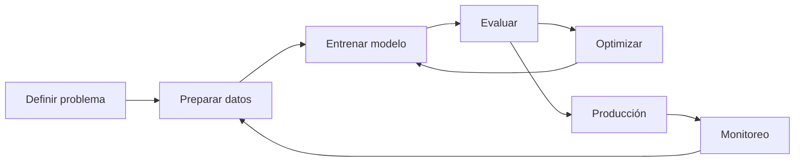
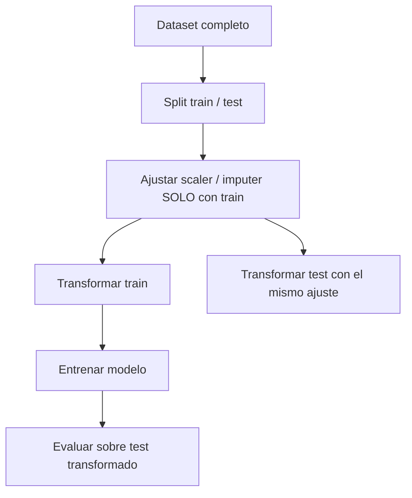

[Índice](README.md) · [Siguiente →](02-como-se-evalua-un-modelo.md)

# Parte I — Fundamentos

Antes de tocar un solo algoritmo hace falta el vocabulario mínimo: qué es aprender de datos, cómo se llaman las piezas de un dataset, qué familias de problemas existen y qué pasos sigue un proyecto real de punta a punta. Esta parte no todavía no entrena ningún modelo serio — arma el mapa sobre el que se van a ubicar todas las técnicas de las partes siguientes (clasificadores lineales, árboles, ensambles, clustering, reducción de dimensionalidad, redes neuronales). Cierra con el tema que más tiempo real insume en cualquier proyecto y menos espacio ocupa en los cursos: preparar los datos correctamente, evitando el error silencioso más común del oficio, el data leakage.

### 1. ¿Qué es Machine Learning?

**Machine Learning (ML)** es la rama de la Inteligencia Artificial que crea algoritmos capaces de **aprender una tarea a partir de datos**, sin programar reglas explícitas para cada caso.

| Concepto | Alcance |
|----------|---------|
| **Inteligencia Artificial (IA)** | Campo amplio: que una máquina imite comportamiento inteligente humano. |
| **Machine Learning (ML)** | Subconjunto de la IA: aprender de los datos / experiencia. |
| **Deep Learning** | Subconjunto del ML basado en redes neuronales profundas. |

**Aplicaciones típicas:** visión por computadora (reconocimiento facial, clasificación de imágenes), sistemas de recomendación, vehículos autónomos y robótica, salud (predicción y diagnóstico), NLP, detección de fraude.

### 2. Datasets, features y labels

- **Dataset:** colección estructurada de datos (filas = registros/observaciones, columnas = variables).
- **Features (características):** variables de entrada `X`.
- **Label / target (etiqueta):** variable a predecir `y`.

La **cantidad y calidad** de los datos determinan el techo de desempeño del modelo (*garbage in, garbage out*).

### 3. Tipos de aprendizaje

```
Aprendizaje Automático
├── Supervisado (datos etiquetados)
│   ├── Regresión      → target numérico continuo
│   └── Clasificación  → target categórico
└── No Supervisado (sin etiquetas)
    ├── Clustering              → agrupar por similitud
    └── Reducción de dimensión → comprimir/visualizar
```

Otras variantes: **semi-supervisado** (pocas etiquetas + muchos datos sin etiquetar) y **aprendizaje por refuerzo** (agente que aprende por recompensa).

| | Supervisado | No supervisado |
|---|---|---|
| Datos | Etiquetados (`X`, `y`) | Sin etiquetar (solo `X`) |
| Objetivo | Predecir `y` | Descubrir estructura oculta |
| Ejemplos | Regresión lineal, logística, árboles | K-Means, PCA |

**Panorama del no supervisado.** Sin etiquetas, el objetivo deja de ser predecir y pasa a ser **descubrir patrones/estructura** en los datos:

- **Clustering:** agrupar observaciones similares y separar las distintas. Usos: segmentación de mercado, detección de anomalías. Algoritmo típico: **K-Means** (cap. 18).
- **Reducción de dimensionalidad:** comprimir muchas features en pocas conservando la información relevante; útil para visualizar y reducir ruido. Algoritmo típico: **PCA** (cap. 23).

El desarrollo completo de clustering, reducción de dimensionalidad y selección de variables está más adelante en el manual, una vez cubiertas evaluación y regularización (caps. 15 a 23 según el temario).

### 4. El ciclo de vida de un proyecto de ML

1. **Definición del problema** — entender contexto y negocio, definir la pregunta, objetivos y métricas de éxito, variables de entrada y target.
2. **Preparación de datos** — recolección, EDA, limpieza, selección/ingeniería de features (cap. 5).
3. **Selección y entrenamiento** — elegir algoritmo según datos y requisitos (clasificadores lineales, cap. 10; árboles, cap. 13; ensambles, cap. 14); entrenar y ajustar hiperparámetros.
4. **Evaluación** — medir con métricas acordes al problema: clasificación (cap. 8) vs regresión (cap. 9), usando train/test y validación cruzada (cap. 6).
5. **Optimización y refinamiento** — tuning de hiperparámetros, feature engineering, regularización (cap. 15) para corregir el sobreajuste (cap. 7).
6. **Implementación en producción** — despliegue del modelo.
7. **Monitoreo y mantenimiento** — vigilar *drift* y reentrenar.

> **Nota:** las slides repetían el mismo texto en "Evaluación" y "Optimización". La optimización es iterativa: tras evaluar se ajustan hiperparámetros y features y se vuelve a evaluar.



### 5. Preparación de datos y EDA

El **EDA (Análisis Exploratorio de Datos)** combina estadística descriptiva y visualizaciones para entender distribución, relaciones, outliers y valores faltantes antes de entrenar nada. La **selección de features** —quedarse con las variables más relevantes para el target— reduce ruido y overfitting; se retoma en profundidad más adelante (selección de variables). Lo que sigue detalla las tareas concretas que arma un pipeline de preparación de datos: tipos de variable, faltantes, codificación, escalado, outliers y el error más costoso de esta etapa, el data leakage.

**Tipos de variables.**

| Tipo | Ejemplos | Tratamiento típico |
|------|----------|---------------------|
| **Numéricas continuas** | precio, edad, temperatura | escalado, tratamiento de outliers |
| **Numéricas discretas** | cantidad de hijos, nº de habitaciones | igual que continuas, a veces se tratan como categóricas si hay pocos valores |
| **Categóricas nominales** | color, ciudad, tipo de producto | one-hot encoding |
| **Categóricas ordinales** | nivel educativo, talle (S/M/L) | encoding ordinal (respeta el orden) |

**Valores faltantes.** Antes de imputar hay que entender por qué faltan (no siempre es al azar). Estrategias comunes:

| Estrategia | Cuándo usarla |
|------------|----------------|
| Eliminar filas | Pocos faltantes, dataset grande |
| Eliminar columna | La columna tiene demasiados faltantes (ej. > 60-70%) |
| Imputar con media/mediana | Numéricas; mediana si hay outliers |
| Imputar con moda | Categóricas |
| Imputar con un modelo (KNN, regresión) | Cuando el patrón de faltantes es informativo y hay volumen suficiente |
| Crear una columna indicadora de "faltante" | Cuando el hecho de faltar puede ser predictivo en sí mismo |

**Codificación de categóricas: one-hot vs ordinal.**

- **One-hot encoding:** crea una columna binaria por categoría. Usar con **nominales** (sin orden), porque no le impone al modelo una relación de magnitud que no existe.
- **Encoding ordinal:** asigna un número que respeta el orden (ej. `bajo=0, medio=1, alto=2`). Usar solo con **ordinales**; aplicarlo a una nominal introduce un orden falso que el modelo puede interpretar como relación numérica.

```python
from sklearn.preprocessing import OneHotEncoder, OrdinalEncoder

OneHotEncoder(handle_unknown="ignore").fit_transform(X[["ciudad"]])          # nominal
OrdinalEncoder(categories=[["bajo", "medio", "alto"]]).fit_transform(X[["nivel"]])  # ordinal
```

**Escalado: `StandardScaler` vs `MinMaxScaler`.**

| | `StandardScaler` | `MinMaxScaler` |
|---|---|---|
| Transformación | media 0, desvío 1 (`z = (x-μ)/σ`) | rango fijo, típicamente `[0,1]` |
| Sensible a outliers | Menos | Sí (un outlier extremo comprime todo el resto) |
| Cuándo usarlo | Métodos basados en distancias o varianza: K-means, PCA, regresión regularizada (Ridge/Lasso), redes neuronales | Cuando se necesita un rango acotado explícito (ej. entrada de ciertas redes, imágenes) |

> **Nota:** modelos basados en árboles (árboles de decisión, Random Forest, XGBoost) son invariantes a escala — dividen por umbrales, no por distancia — así que no necesitan escalado.

**Outliers.** Se detectan con boxplot/IQR (`Q1 - 1.5·IQR`, `Q3 + 1.5·IQR`) o con z-score (`|z| > 3`). Tratamiento según el caso: eliminarlos si son errores de carga, capearlos (winsorizing), transformarlos (log) o dejarlos si son datos válidos y el modelo los tolera (árboles).

**Data leakage: el error de ajustar el scaler antes del split.** Es el error más frecuente y más difícil de detectar en la preparación de datos: cualquier transformación que "aprenda" algo de los datos (media y desvío de un scaler, la mediana para imputar, las categorías de un encoder) tiene que aprenderlo **solo del conjunto de entrenamiento**. Si se ajusta sobre todo el dataset antes de separar train/test, el conjunto de test "filtra" información hacia el entrenamiento (su media influyó en el escalado que ve el modelo) y las métricas de evaluación quedan artificialmente optimistas — el modelo funciona peor en producción de lo que el test hizo creer.

```python
# INCORRECTO — leakage: el scaler ve el test antes del split
from sklearn.preprocessing import StandardScaler
from sklearn.model_selection import train_test_split

scaler = StandardScaler()
X_scaled = scaler.fit_transform(X)          # usa media/desvío de TODO el dataset
X_tr, X_te, y_tr, y_te = train_test_split(X_scaled, y, test_size=0.2, random_state=42)
```

```python
# CORRECTO — el scaler solo aprende del train
from sklearn.preprocessing import StandardScaler
from sklearn.model_selection import train_test_split

X_tr, X_te, y_tr, y_te = train_test_split(X, y, test_size=0.2, random_state=42)

scaler = StandardScaler().fit(X_tr)         # fit SOLO con train
X_tr_scaled = scaler.transform(X_tr)
X_te_scaled = scaler.transform(X_te)        # transform, no fit, sobre test
```

La forma robusta de garantizar esto en la práctica es un `Pipeline` (se retoma en el cap. 6), que encapsula el `fit` del scaler dentro de cada fold de validación cruzada.


