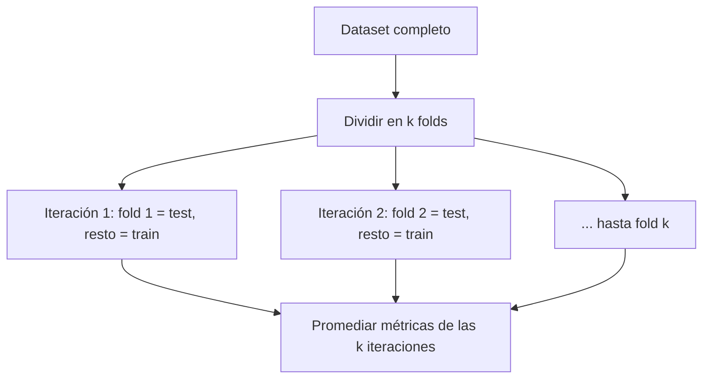
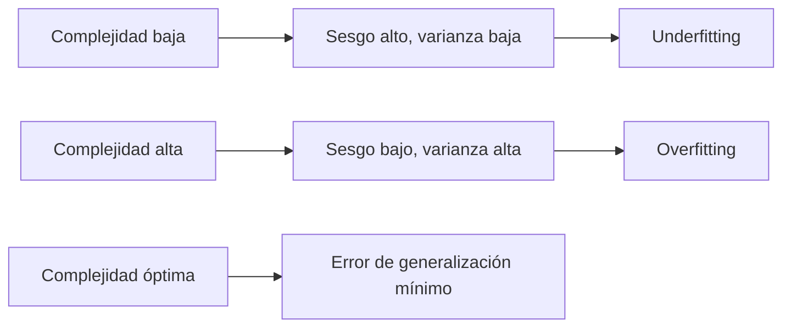

[Índice](README.md) · [← Anterior](01-fundamentos.md) · [Siguiente →](03-modelos-lineales.md)

# Parte II — Cómo se evalúa un modelo

Tener un modelo entrenado no alcanza: la pregunta que importa es qué tan bien va a funcionar con datos que nunca vio. Esta parte cubre las herramientas para medir eso de forma honesta —train/test y validación cruzada—, el diagnóstico central de por qué un modelo falla —sobreajuste, subajuste y el compromiso sesgo-varianza— y las métricas concretas, separadas por tipo de problema, para poner un número a "qué tan bien". Es la base que hace falta antes de comparar clasificadores lineales, árboles o ensambles entre sí (partes siguientes): sin saber evaluar, no hay forma de decidir qué modelo es mejor.

### 6. Train/test y validación cruzada

**Por qué no alcanza con medir sobre el propio train.** Un modelo evaluado con los mismos datos con los que se entrenó siempre va a mostrar buen desempeño, aunque haya memorizado en vez de aprender — la métrica no distingue generalización de memorización. Por eso el paso mínimo es separar los datos en:

- **Train (entrenamiento):** con lo que el modelo ajusta sus parámetros.
- **Test (prueba):** apartado desde el principio, no se toca hasta la evaluación final; simula datos nuevos.

**Holdout vs k-fold.** El split simple train/test (**holdout**) tiene un problema: el resultado depende de qué observaciones cayeron al azar en cada lado del split, sobre todo con datasets chicos. La **validación cruzada k-fold** lo resuelve dividiendo el dataset en `k` partes (folds): se entrena `k` veces, cada vez dejando un fold distinto afuera como test y promediando el desempeño de las `k` corridas. El resultado es una estimación más estable y menos dependiente de un split particular.



**`StratifiedKFold` y cuándo importa.** El k-fold simple parte los datos sin mirar la proporción de clases; con un target desbalanceado (ej. 90%/10%), un fold puede quedar con casi ninguna observación de la clase minoritaria, distorsionando la métrica de esa iteración. `StratifiedKFold` conserva en cada fold la misma proporción de clases que el dataset completo. Importa siempre en **clasificación** con clases desbalanceadas; en regresión no aplica (no hay clases que estratificar).

```python
from sklearn.model_selection import cross_val_score, StratifiedKFold

skf = StratifiedKFold(n_splits=5, shuffle=True, random_state=42)
scores = cross_val_score(clf, X, y, cv=skf, scoring="f1_macro")
scores.mean(), scores.std()
```

**Por qué el escalado va dentro de un `Pipeline` durante el CV.** El mismo problema de leakage del cap. 5 reaparece en la validación cruzada: si el scaler se ajusta una sola vez sobre todo `X` antes de llamar a `cross_val_score`, cada fold de "test" ya fue visto por el scaler durante el ajuste, y las métricas de CV quedan optimistas. La solución es envolver preprocesamiento y modelo en un `Pipeline`: `cross_val_score` entonces re-ajusta el scaler (y cualquier otro paso) usando solo el train de cada fold.

```python
from sklearn.pipeline import Pipeline
from sklearn.preprocessing import StandardScaler
from sklearn.linear_model import LogisticRegression
from sklearn.model_selection import cross_val_score, StratifiedKFold

pipe = Pipeline([
    ("scaler", StandardScaler()),
    ("model", LogisticRegression()),
])
skf = StratifiedKFold(n_splits=5, shuffle=True, random_state=42)
cross_val_score(pipe, X, y, cv=skf, scoring="f1_macro")   # el scaler se re-ajusta en cada fold
```

### 7. Sobreajuste, subajuste y el compromiso sesgo-varianza

**Sobreajuste (overfitting):** el modelo memoriza particularidades del train —incluido el ruido— y generaliza mal. **Señal diagnóstica:** error de train muy bajo, error de validación/test notablemente más alto (la brecha entre ambos es la pista).

**Subajuste (underfitting):** el modelo es demasiado simple para capturar el patrón real. **Señal diagnóstica:** error de train ya alto, y el error de validación es similar (no hay brecha, pero ambos son malos).

| Diagnóstico | Error de train | Error de validación | Brecha |
|---|---|---|---|
| **Ajuste sano** | Bajo | Bajo | Chica |
| **Overfitting** | Bajo | Alto | Grande |
| **Underfitting** | Alto | Alto (similar al de train) | Chica |

**Descomposición sesgo-varianza, en palabras.** El error de generalización de un modelo se puede pensar como la suma de dos fuentes:

- **Sesgo (bias):** el error que viene de que el modelo es demasiado simple para el problema real — supuestos rígidos que no capturan la verdadera relación. Un modelo con sesgo alto **subajusta**: falla igual en train y en test, porque su límite no es la cantidad de datos sino su propia simpleza.
- **Varianza:** el error que viene de que el modelo es demasiado sensible a los datos particulares de entrenamiento — pequeños cambios en el train producen modelos muy distintos. Un modelo con varianza alta **sobreajusta**: le va muy bien en el train que memorizó y mal ante datos nuevos.

Los dos se mueven en tensión: bajar la complejidad reduce varianza pero sube sesgo, y viceversa. El objetivo no es eliminar ninguno de los dos sino encontrar el punto de **error de generalización mínimo**, que casi nunca coincide con el error de train mínimo.



**Curvas de aprendizaje.** Graficar el error de train y el de validación en función de la cantidad de datos de entrenamiento usados es la forma práctica de distinguir un caso del otro:

- Si ambas curvas convergen a un error **alto**: el problema es sesgo (underfitting) — más datos no ayudan por sí solos.
- Si hay una **brecha persistente** entre una curva de train baja y una de validación alta, incluso con mucho dato: el problema es varianza (overfitting).

**Qué palanca tocar en cada caso.**

| Diagnóstico | Palancas típicas |
|---|---|
| **Underfitting (sesgo alto)** | Modelo más complejo (más features, más profundidad, más capas), menos regularización, mejor feature engineering |
| **Overfitting (varianza alta)** | Más datos, **regularización** (cap. 15: Ridge/Lasso), simplificar el modelo, validación cruzada para elegir hiperparámetros, ensambles tipo bagging (cap. 14) |

> **Nota:** la regularización (cap. 15) es la herramienta principal contra el sobreajuste porque ataca directamente la varianza: penaliza la complejidad del modelo (magnitud de los coeficientes) sin necesitar más datos. En árboles, el equivalente es limitar hiperparámetros de crecimiento (cap. 13); en ensambles, el bagging (Random Forest) reduce varianza promediando modelos, y el boosting reduce sesgo entrenando secuencialmente (cap. 14).

### 8. Métricas de clasificación

**Matriz de confusión:**

| | Predicho Positivo | Predicho Negativo |
|---|---|---|
| **Real Positivo** | TP (verdadero positivo) | FN (falso negativo) |
| **Real Negativo** | FP (falso positivo) | TN (verdadero negativo) |

| Métrica | Fórmula | Cuándo importa |
|---------|---------|----------------|
| **Accuracy** | `(TP+TN)/Total` | Exactitud global. Engañosa con clases desbalanceadas. |
| **Precisión** | `TP/(TP+FP)` | Cuando el costo de un FP es alto. |
| **Recall (sensibilidad)** | `TP/(TP+FN)` | Cuando el costo de un FN es alto (ej. diagnóstico). |
| **F1-score** | `2·(P·R)/(P+R)` | Media armónica P/R; equilibrio con datos desbalanceados. |

- **Curva ROC:** TPR (recall) vs FPR variando el umbral.
- **AUC:** área bajo la ROC. `1.0` = perfecto, `0.5` = azar.

> **Nota:** con clases desbalanceadas, priorizar **F1 / AUC / recall** según el caso, no accuracy.

Estas métricas se calculan siempre sobre el conjunto de **test** (o promediadas sobre los folds de CV, cap. 6), nunca sobre el train — de lo contrario se repite el mismo problema de optimismo artificial del cap. 7.

```python
from sklearn.metrics import classification_report, roc_auc_score
print(classification_report(y_te, clf.predict(X_te)))
roc_auc_score(y_te, clf.predict_proba(X_te)[:, 1])
```

### 9. Métricas de regresión

| Métrica | Fórmula | Interpretación |
|---------|---------|----------------|
| **MAE** | `(1/n)·Σ\|yᵢ − ŷᵢ\|` | Error medio absoluto; misma unidad que `y`; robusto a outliers. |
| **MSE** | `(1/n)·Σ(yᵢ − ŷᵢ)²` | Penaliza más los errores grandes. |
| **RMSE** | `√MSE` | Como MSE pero en la unidad de `y`; más interpretable. |
| **R²** | `1 − RSS/TSS` | Proporción de varianza explicada por el modelo. |

**Descomposición de la varianza:** `TSS = ESS + RSS`
(Total = Explicada + Residual).

**Interpretación de R²:**
- `R² = 1` → ajuste perfecto, sin error.
- `R² = 0` → no mejor que predecir la media.
- `R² < 0` → peor que predecir la media.

> **Nota:** R² es invariante a la escala de `y`, pero el intercepto, MAE, MSE y RMSE **no** lo son (dependen de las unidades). RMSE = √MSE es la más interpretable por estar en la unidad de `y`.

Al igual que en clasificación, estas métricas se calculan sobre test (o promediadas por CV), y la comparación entre el error de train y el de test es la forma directa de aplicar el diagnóstico del cap. 7 a un problema de regresión — la mecánica de fondo (regresión lineal, cap. 11; regularización, cap. 15) se desarrolla en las partes siguientes del manual.
