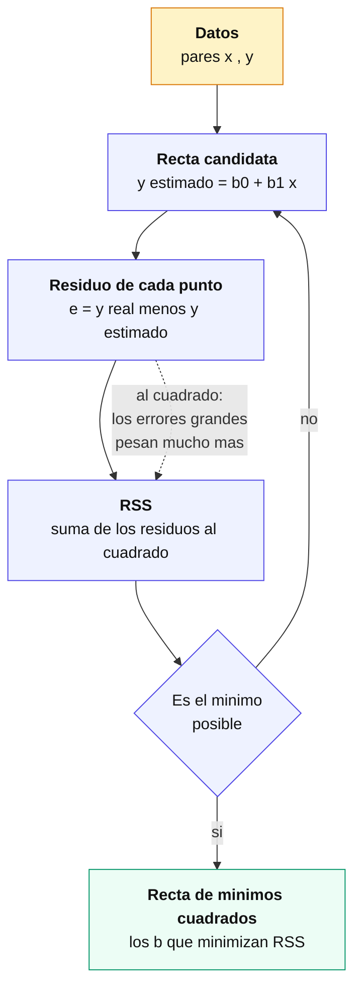
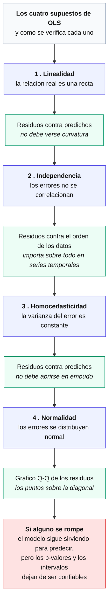
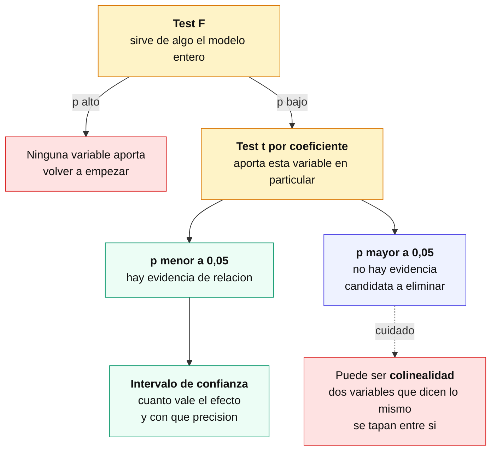

[Índice](README.md) · [← Anterior](02-como-se-evalua-un-modelo.md) · [Siguiente →](04-modelos-no-lineales.md)

# Parte III — Modelos lineales

Antes de entrar acá conviene tener frescos los conceptos de preparación de datos (cap. 5), validación cruzada (cap. 6) y el trade-off sesgo-varianza (cap. 7): un modelo lineal se entrena rápido, pero para juzgarlo bien hace falta separar train/test y mirar más allá del error de entrenamiento. Esta parte cubre la familia de modelos que separan clases o predicen valores con una combinación lineal de las features: primero los clasificadores lineales (regresión logística, SVM, y el propio perceptrón que se retoma en el cap. 26), después la regresión lineal para targets continuos, y por último cómo saber si un coeficiente estimado es real o ruido. Son los cimientos: todo lo que sigue en el manual —árboles, ensambles, regularización, redes— se entiende mejor en contraste con esta base lineal.

### 10. Clasificadores lineales

Los clasificadores lineales toman decisiones a partir de una **combinación lineal** de las features. Función de decisión:

```
f(x) = wᵀx + b
```

- `x`: vector de features · `w`: pesos · `b`: sesgo (bias).
- Clasificación binaria según el signo: `f(x) ≥ 0` → clase A; `f(x) < 0` → clase B.
- Un **hiperplano** es la frontera de decisión (recta en 2D, plano en 3D, etc.).

| Modelo | Idea clave |
|--------|-----------|
| **Perceptrón** | Clasificador lineal más simple; ajusta pesos según errores. Es el mismo tipo de frontera lineal que se retoma en detalle —estructura, entrenamiento manual y limitaciones— en el cap. 26. |
| **Regresión logística** | Pese al nombre, **clasifica**: modela `P(y=1\|X)` con la función logística (sigmoide), acotando la salida a `[0,1]`. |
| **SVM** | Busca el hiperplano que **maximiza el margen** entre clases (optimización cuadrática). |

**¿Por qué no usar regresión lineal para clasificar?** Daría valores fuera de `[0,1]`, imposibles de interpretar como probabilidad. La logística resuelve esto con la sigmoide:

```
σ(z) = 1 / (1 + e^(−z))   con z = wᵀx + b
```

**Regresión logística en detalle.** La salida `σ(z)` se interpreta como probabilidad de pertenecer a la clase positiva. Los coeficientes no se leen como en una regresión lineal (unidades de `y` por unidad de `x`), sino como **log-odds**: el modelo en realidad ajusta

```
log( P(y=1) / (1 − P(y=1)) ) = wᵀx + b
```

de modo que cada `wⱼ` representa el cambio en el **logaritmo de las odds** (la razón entre la probabilidad de la clase positiva y la de la negativa) por unidad de `xⱼ`, manteniendo el resto constante. Exponenciando `wⱼ` se obtiene el **odds ratio**: cuánto se multiplican las odds por cada unidad de la variable. Para decidir la clase final se aplica un **umbral de decisión** sobre `σ(z)` — por defecto `0.5`, pero se puede mover hacia arriba o abajo según el costo relativo de falsos positivos y falsos negativos (cap. 8), sin reentrenar el modelo.

**SVM (Support Vector Machines).** Busca, entre todos los hiperplanos que separan las clases, el que deja el **margen máximo** respecto a los puntos más cercanos de cada clase (los **vectores de soporte**). Cuando las clases no son linealmente separables en el espacio original, el **kernel trick** proyecta los datos a un espacio de mayor dimensión donde sí lo son, sin calcular esa proyección explícitamente — el kernel lineal (`linear`) mantiene la frontera lineal, y kernels como el radial (`rbf`) permiten fronteras curvas.

> **Nota:** perceptrón, regresión logística y SVM lineal comparten la misma forma de frontera de decisión —un hiperplano `wᵀx + b`—; lo que cambia es el criterio de ajuste: el perceptrón corrige por error, la logística maximiza verosimilitud, el SVM maximiza margen.

### 11. Regresión lineal

Predice una respuesta **cuantitativa** `Y` a partir de predictores `X`, asumiendo una relación aproximadamente lineal.

```
Simple:   Y = β₀ + β₁·X + ε
Múltiple: Y = β₀ + β₁X₁ + … + βₚXₚ + ε
```

| Símbolo | Qué es |
|---|---|
| `β₀` | **intercepto**: el valor de `Y` cuando todos los predictores valen 0 |
| `β₁…βₚ` | **pendientes**: cuánto cambia `Y` por cada unidad de `Xⱼ`, con el resto constante |
| `ε` | el **error**: todo lo que el modelo no explica |
| `eᵢ = yᵢ − ŷᵢ` | **residuo**: el error observado en una fila concreta |

**Entrenar es estimar los coeficientes** (`β̂`) que mejor ajustan los datos.

#### Qué significa "mejor": mínimos cuadrados

El método de **mínimos cuadrados ordinarios (OLS)** elige los coeficientes que minimizan la suma de los residuos al cuadrado:

```
RSS = Σ (yᵢ − ŷᵢ)²
```



**Por qué al cuadrado y no en valor absoluto.** Elevar al cuadrado hace que los errores grandes pesen desproporcionadamente: un residuo de 10 aporta 100, uno de 1 aporta 1. Eso tiene dos consecuencias — la solución tiene **fórmula cerrada** (no hace falta iterar), y el modelo es **sensible a valores atípicos**, porque un solo punto lejano puede torcer la recta entera.

> Minimizar el valor absoluto en vez del cuadrado da la **regresión cuantílica**, más robusta a outliers pero sin solución analítica. Es la misma distinción entre MSE y MAE del cap. 9.

#### Cómo se interpreta un coeficiente

Esto es lo que distingue a la regresión lineal de casi todos los modelos que vienen después: **los coeficientes se leen**.

Si un modelo que predice el precio de una casa da `β_superficie = 1.200`, la lectura es: *manteniendo todo lo demás constante, cada metro cuadrado adicional se asocia con 1.200 dólares más de precio*.

Tres cuidados con esa frase:

- **"Manteniendo todo lo demás constante"** no es un detalle retórico. En regresión múltiple cada coeficiente mide el efecto de su variable **una vez descontado** lo que explican las otras. El mismo predictor puede tener coeficientes distintos —y hasta de signo opuesto— según qué otras variables estén en el modelo.
- **"Se asocia"**, no "causa". La regresión mide asociación. Para hablar de causalidad hacen falta diseño experimental o supuestos adicionales que el modelo no verifica.
- **Las escalas importan.** Un coeficiente de 1.200 sobre metros cuadrados y otro de 0,003 sobre precio del barrio no son comparables entre sí: dependen de las unidades. Para compararlos hay que estandarizar los predictores primero (cap. 5).

#### Los supuestos

OLS estima coeficientes con cualquier dato que se le dé. Pero para que la **inferencia** del capítulo siguiente sea válida, se apoya en cuatro supuestos:



La distinción que conviene retener: si los supuestos se rompen, **el modelo puede seguir prediciendo razonablemente**, pero los p-valores, los intervalos de confianza y los tests dejan de significar lo que dicen significar.

#### Cuando la relación no es una recta

La regresión lineal es lineal **en los coeficientes**, no necesariamente en las variables. Eso deja lugar a dos extensiones que se resuelven con el mismo OLS:

| Extensión | Forma | Para qué |
|---|---|---|
| **Términos polinómicos** | `Y = β₀ + β₁X + β₂X²` | curvatura: el efecto crece o decrece con el nivel de X |
| **Interacciones** | `Y = β₀ + β₁X₁ + β₂X₂ + β₃X₁X₂` | el efecto de `X₁` depende del valor de `X₂` |

```python
from sklearn.linear_model import LinearRegression
from sklearn.preprocessing import PolynomialFeatures
from sklearn.pipeline import make_pipeline

modelo = LinearRegression().fit(X_train, y_train)
modelo.coef_, modelo.intercept_          # los coeficientes, legibles

# Curvatura e interacciones, con el mismo OLS
poly = make_pipeline(PolynomialFeatures(degree=2), LinearRegression())
poly.fit(X_train, y_train)
```

> **Ojo con el grado.** Cada grado que se agrega suma flexibilidad y riesgo de sobreajuste (cap. 7). Un polinomio de grado alto pasa por todos los puntos del entrenamiento y no generaliza nada. Es el caso de manual para regularizar (cap. 15).

Para evaluar el ajuste se usan las métricas del cap. 9 —MAE, MSE, RMSE y R²—. Ninguna dice si un coeficiente en particular es distinto de cero: eso es el capítulo siguiente.

### 12. Inferencia sobre los coeficientes

Las métricas del capítulo anterior dicen **cuánto acierta el modelo en conjunto**. La inferencia responde otra pregunta: **¿esta variable aporta algo, o el coeficiente que estimé es ruido?**

La duda tiene sentido porque los coeficientes se estiman a partir de una **muestra**. Con otra muestra distinta darían valores algo distintos. Un `β̂` de 0,7 puede reflejar una relación real o ser el azar de estos datos en particular.

#### El test t, coeficiente por coeficiente

- **H₀:** `βⱼ = 0` — la variable no aporta.
- **H₁:** `βⱼ ≠ 0` — hay relación.

Si `β₁ = 0`, el modelo se reduce a `Y = β₀ + ε` y `X` no explica nada.

El **p-valor** es la probabilidad de observar un coeficiente al menos tan grande como el estimado **si H₀ fuera cierta**. Chico (< 0,05 por convención) significa que sería raro ver ese valor por azar, y se rechaza H₀.

> **Lo que un p-valor no dice.** No es la probabilidad de que la hipótesis sea cierta, ni mide el **tamaño** del efecto. Con muchos datos, un efecto minúsculo e irrelevante en la práctica puede dar un p-valor bajísimo. Significativo no es sinónimo de importante.

#### El intervalo de confianza dice más

Por eso conviene mirar el **intervalo de confianza** además del p-valor: da el rango de valores plausibles del coeficiente.

| Coeficiente | IC 95% | Lectura |
|---|---|---|
| 1.200 | [1.150 , 1.250] | efecto claro y bien estimado |
| 1.200 | [50 , 2.350] | el signo es claro, la magnitud no: puede ser trivial o enorme |
| 1.200 | [−300 , 2.700] | incluye el cero: no hay evidencia (equivale a p > 0,05) |

Las tres filas tienen el mismo coeficiente estimado y significan cosas muy distintas.

#### El orden en que se mira



El **test F** va primero y evalúa el modelo completo: ¿al menos una variable aporta? Importa sobre todo con muchos predictores, donde por azar algunos p-valores individuales van a dar bajos aunque ninguna variable sirva — con 100 predictores inútiles y umbral 0,05, unos 5 aparecerán "significativos".

#### La trampa: colinealidad

Un coeficiente **no significativo no siempre significa que la variable no importe**. Cuando dos predictores están muy correlacionados —dicen casi lo mismo— el modelo no puede repartir el crédito entre ellos y **los dos** salen con p-valores altos, aunque juntos expliquen mucho.

La señal típica: el test F da significativo pero ningún coeficiente individual lo es. Se detecta con el **VIF** (*variance inflation factor*); valores por encima de 5 o 10 son sospechosos. La salida es sacar una de las dos variables, combinarlas, o usar **Ridge** (cap. 15), que está pensada justamente para este caso.

```python
import statsmodels.api as sm

X_c = sm.add_constant(X)          # statsmodels no agrega el intercepto solo
modelo = sm.OLS(y, X_c).fit()
print(modelo.summary())           # coeficientes, p-valores, IC, R2, test F
```

> **`scikit-learn` no da p-valores.** Está pensado para predicción, no para inferencia: `LinearRegression` devuelve `coef_` y nada más. Para inferencia se usa **`statsmodels`**, cuyo `summary()` trae todo junto. Es una diferencia de filosofía entre las dos bibliotecas, no una carencia.

Esta inferencia es la base para decidir qué variables conservar (**selección de variables**, cap. 16) y para comparar modelos completos con **AIC/BIC** (cap. 17): un coeficiente no significativo es candidato a eliminarse — con el cuidado de la colinealidad recién mencionado.
