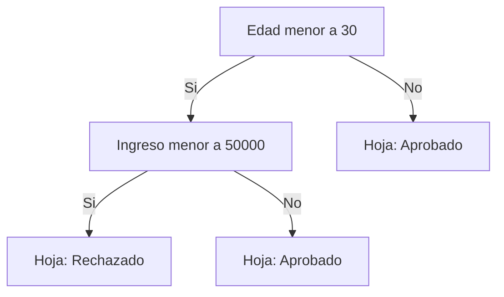
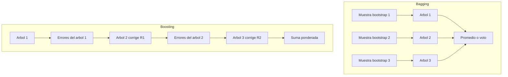

[Índice](README.md) · [← Anterior](03-modelos-lineales.md) · [Siguiente →](05-complejidad-del-modelo-y-seleccion.md)

# Parte IV — Modelos no lineales

Los modelos lineales de la Parte III trazan fronteras rectas (o hiperplanos); cuando la relación entre features y target no es lineal, hace falta otra familia de modelos. Esta parte cubre los árboles de decisión —que particionan el espacio con preguntas sucesivas— y los ensambles que se construyen combinando muchos árboles (u otros modelos débiles) para ganar precisión y estabilidad. Conviene tener frescos el sobreajuste y el trade-off sesgo-varianza (cap. 7) y las métricas de clasificación (cap. 8), porque son la vara con la que se juzga si un árbol o un ensamble realmente mejora las cosas.

### 13. Árboles de decisión

Modelo predictivo con estructura jerárquica: **nodo raíz → nodos internos (preguntas) → ramas (respuestas) → hojas (predicción)**. Sirve para clasificación y regresión (**CART**).

**Cómo decide dónde ramificar:** prueba dividir por cada variable y elige la que produce subnodos más **homogéneos** (puros) respecto al target. Criterios de impureza para clasificación:

- **Índice de Gini** ∈ `[0, 1]`: `Gini(D) = 1 − Σ pᵢ²`.
- **Entropía** ∈ `[0, 1]` (binaria): `H(D) = −Σ pᵢ·log₂(pᵢ)`.

> **Corrección importante:** las slides decían *"a mayor índice de Gini, mayor homogeneidad"* — **es al revés**. Un nodo **puro/homogéneo tiene Gini = 0** (y entropía = 0); el valor crece cuanto **más mezcladas** están las clases. El árbol elige divisiones que **minimizan** la impureza (o maximizan la *ganancia de información*).

**Hiperparámetros** (controlan crecimiento y overfitting): profundidad máxima (`max_depth`), mínimo de observaciones para dividir (`min_samples_split`), mínimo en hoja (`min_samples_leaf`), criterio (gini/entropy).

| Ventajas | Desventajas |
|----------|-------------|
| Fáciles de interpretar | Tendencia al **sobreajuste** |
| Útiles en EDA (importancia de variables) | Inestables (pequeños cambios → árbol distinto) |
| Poca limpieza previa (toleran outliers/faltantes) | Menor precisión que ensambles/SVM |
| Soportan numéricas y categóricas | Pérdida de info al discretizar continuas |
| No paramétricos | |

El sobreajuste y la inestabilidad se mitigan con **ensambles** (Random Forest, Gradient Boosting / XGBoost), tema del capítulo siguiente.

### 14. Ensambles y XGBoost

**Qué es un ensamble y por qué funciona.** Un ensamble combina las predicciones de **varios modelos débiles** (típicamente árboles poco profundos) para producir un modelo fuerte. Funciona porque los errores de modelos distintos, entrenados de forma distinta, tienden a no estar perfectamente correlacionados: al promediar (o combinar) sus predicciones, los errores individuales se cancelan parcialmente y queda una señal más estable. Es la misma lógica que "el promedio de muchas estimaciones ruidosas es más preciso que una sola estimación": reduce la varianza del conjunto, mejora el sesgo, o ambas cosas, según cómo se combinen los modelos.

**Bagging vs boosting — la diferencia conceptual.**

- **Bagging** (*bootstrap aggregating*, ej. Random Forest): entrena **muchos árboles en paralelo**, cada uno sobre una muestra bootstrap distinta (con reemplazo) del dataset original, y promedia sus predicciones (o vota, en clasificación). Como los árboles se entrenan de forma independiente y se promedian, lo que se gana es **reducción de varianza**: un árbol individual sobreajusta fácil, pero el promedio de muchos árboles distintos generaliza mejor.
- **Boosting** (ej. Gradient Boosting, XGBoost): entrena los árboles **secuencialmente**, y cada árbol nuevo se enfoca en corregir los **errores (residuos)** que dejó el árbol anterior. Como cada paso ataca específicamente lo que el modelo acumulado todavía no explica, lo que se gana es **reducción de sesgo**: modelos individuales simples (poco profundos) se van sumando hasta capturar relaciones complejas que ninguno por separado podría.

**Random Forest.** Ensamble por bagging de árboles de decisión, con un ingrediente extra: en cada split, en vez de considerar todas las features, elige la mejor división entre un **subconjunto aleatorio** de ellas (`max_features`). Esto decorrelaciona más los árboles entre sí (si una feature es muy fuerte, sin este truco todos los árboles la usarían primero y se parecerían demasiado), lo que mejora aún más la reducción de varianza. Da además `feature_importances_` como subproducto útil para EDA.

**Gradient Boosting y XGBoost.** El *gradient boosting* generaliza la idea de boosting: cada árbol nuevo se ajusta al **gradiente** de la función de pérdida respecto a las predicciones actuales (en el caso más simple, ajusta directamente los residuos). **XGBoost** (*Extreme Gradient Boosting*) es una implementación optimizada de gradient boosting: agrega regularización incorporada (evita que los árboles individuales crezcan demasiado y sobreajusten), maneja datos faltantes de forma nativa, y está optimizado en velocidad y uso de memoria. Es el estándar de facto en problemas tabulares (competencias, producción).

**Hiperparámetros principales de XGBoost / Gradient Boosting:**

| Hiperparámetro | Qué controla |
|---|---|
| `n_estimators` | Cantidad de árboles secuenciales. Más árboles → más capacidad, pero más riesgo de sobreajuste y más tiempo de entrenamiento. |
| `learning_rate` | Cuánto pesa la corrección de cada árbol nuevo sobre el total. Valores chicos (ej. 0.01-0.1) generalizan mejor pero necesitan más `n_estimators` para compensar. |
| `max_depth` | Profundidad máxima de cada árbol individual. En boosting suele mantenerse bajo (3-8): los árboles son "débiles" a propósito; la fuerza viene de sumarlos, no de que cada uno sea complejo. |
| `subsample` | Fracción de las filas usada para entrenar cada árbol (muestreo sin reemplazo). Menor a 1 agrega aleatoriedad tipo bagging dentro del boosting, reduce varianza y overfitting. |

> **Nota:** `learning_rate` y `n_estimators` interactúan: bajar el `learning_rate` casi siempre exige subir `n_estimators` para llegar al mismo nivel de ajuste, a cambio de un modelo final más robusto.

**Cuándo un ensamble no se justifica.** Un ensamble agrega costo de entrenamiento, tiempo de inferencia y pérdida casi total de interpretabilidad (cap. 13 lista la interpretabilidad como ventaja del árbol simple; se pierde acá). No conviene cuando: el dataset es muy chico (no hay margen para que el ensamble generalice mejor que un modelo simple bien regularizado); se necesita explicar cada predicción a un humano (auditoría, decisiones regulatorias) y no alcanza con `feature_importances_` o SHAP; el problema ya es linealmente separable y un modelo lineal (cap. 10-11) alcanza el mismo desempeño con muchísima menos complejidad; o los recursos de cómputo/latencia en producción son muy limitados (un árbol único o un modelo lineal responden en microsegundos; un ensamble grande, no siempre).
