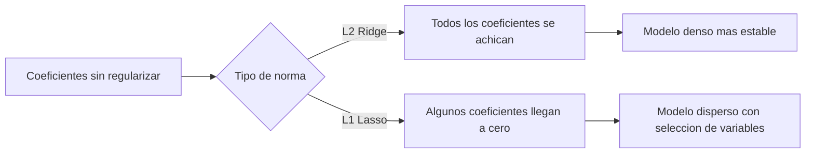
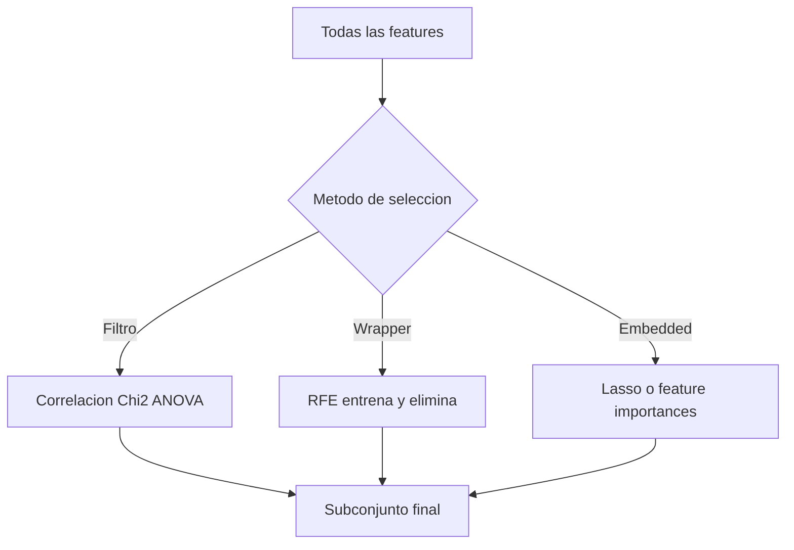

[Índice](README.md) · [← Anterior](04-modelos-no-lineales.md) · [Siguiente →](06-aprendizaje-no-supervisado.md)

# Parte V — Complejidad del modelo y selección

Con modelos lineales y no lineales ya cubiertos, queda una pregunta transversal a ambas familias: ¿cuántas variables usar, y cuánto restringir los coeficientes para que el modelo generalice? Esta parte conecta directamente con el sobreajuste (cap. 7): regularización y selección de variables son las dos herramientas principales para controlar la complejidad de un modelo lineal, y los criterios AIC/BIC dan una forma numérica de comparar modelos completos entre sí. También son la base conceptual de temas posteriores del manual: k-means y reducción de dimensionalidad (cap. 18 y 23) enfrentan el mismo problema de "cuántas dimensiones conservar" desde el lado no supervisado, y la regularización en redes neuronales (cap. 36) reutiliza exactamente las ideas de norma L1/L2 que se explican acá.

### 15. Regularización: Ridge, Lasso y Elastic Net

Añade una **penalización** al costo de entrenamiento: `Costo = RSS + α·penalización`. El hiperparámetro **α (o λ)** regula la fuerza de la penalización y se elige por **cross-validation** (cap. 6). Es imprescindible **estandarizar** las variables antes de regularizar, porque la penalización actúa sobre la magnitud de los coeficientes, y esa magnitud depende de la escala de cada variable.

**La idea central — norma L1 vs L2.** La penalización se calcula como una norma sobre el vector de coeficientes `β`, y el tipo de norma determina qué le hace al modelo:

- **Norma L2** (`Σβ²`, usada por **Ridge**): penaliza el cuadrado de cada coeficiente. Como el cuadrado crece muy rápido cuando el coeficiente es grande y muy poco cuando ya es chico, el efecto es **achicar todos los coeficientes de forma proporcional**, acercándolos a cero sin llegar nunca exactamente a cero. Ridge no elimina variables: las atenúa a todas.
- **Norma L1** (`Σ|β|`, usada por **Lasso**): penaliza el valor absoluto de cada coeficiente. A diferencia del cuadrado, la penalización L1 crece de forma lineal y tiene una "esquina" en cero que hace que, al optimizar, algunos coeficientes terminen exactamente en **cero** — no solo chicos, sino eliminados del modelo. Por eso Lasso hace **selección automática de variables** como efecto colateral de regularizar.
- **Elastic Net** combina ambas penalizaciones (`α₁·L1 + α₂·L2`, o parametrizado como una mezcla `l1_ratio`): captura algo de la selección de Lasso y algo de la estabilidad de Ridge, útil cuando hay variables correlacionadas entre sí (Lasso tiende a elegir arbitrariamente una de un grupo correlacionado; Elastic Net reparte entre ellas).

| Método | Norma | ¿Anula coeficientes? | Cuándo usar |
|--------|:-----:|:--------------------:|-------------|
| **Ridge** | L2 (`Σβ²`) | **No** (los achica) | Colinealidad; conservar todas las variables |
| **Lasso** | L1 (`Σ\|β\|`) | **Sí** (a cero exacto) | **Selección automática**; modelos dispersos |
| **Elastic Net** | L1 + L2 | Sí (parcial) | Combina ambas; **2 hiperparámetros** (λ, α) |



```python
from sklearn.linear_model import LassoCV
lasso = LassoCV(cv=5).fit(X_scaled, y)   # elige alpha por CV
lasso.coef_    # los que quedan en 0 fueron descartados
```

> **Esta es la explicación canónica de regularización en el manual.** El cap. 36 (regularización en redes neuronales) parte de esta misma idea de norma L1/L2 sobre los pesos y agrega solo lo específico de las redes (dropout, early stopping); la lógica de fondo —L2 achica, L1 elimina— es la misma acá y ahí.

### 16. Selección de variables

Elegir un **subconjunto** de las features originales. Mejora rendimiento, interpretabilidad, reduce overfitting y acelera el entrenamiento. A diferencia de la regularización (cap. 15), que penaliza coeficientes dentro del entrenamiento, estos métodos deciden qué variables entran al modelo antes o durante el ajuste, con distintos criterios.

**Filtros (filter)** — medida estadística, sin entrenar modelo (rápidos, antes de modelar):

| Método | Problema | Idea |
|--------|----------|------|
| **Correlación (Pearson)** | Regresión | features con coef. cercano a ±1 con el target |
| **Chi-cuadrado (χ²)** | Clasificación, categóricas | mayor dependencia feature-clase = más relevante |
| **ANOVA (F-test)** | Clasificación, numéricas | mayor F = mejor separa clases |
| **Coeficientes lineales** | Regresión/logística | mayor \|coef\| = más influyente |

**Wrapper — RFE (Eliminación Recursiva):** entrena un modelo, elimina la feature menos importante, reentrena y repite. Preciso pero **caro** (entrena en cada iteración).

**Embedded:** la selección ocurre dentro del entrenamiento (árboles/Random Forest vía `feature_importances_`, cap. 13-14; o Lasso, cap. 15, que anula coeficientes). Mantiene las features originales, a diferencia de técnicas que crean nuevas variables combinando las originales (reducción de dimensionalidad, cap. 23).

```python
from sklearn.feature_selection import SelectKBest, f_classif, RFE, SelectFromModel
X_new = SelectKBest(f_classif, k=5).fit_transform(X, y)   # filtro ANOVA
```

| Criterio | Filtros | RFE |
|----------|---------|-----|
| Depende de un modelo | No | **Sí** |
| Costo | Bajo | Alto (iterativo) |
| Cuándo | Screening rápido | Optimizar modelo final |



### 17. Criterios de selección de modelos (AIC y BIC)

Comparan modelos equilibrando **ajuste vs complejidad** (penalizan el número de parámetros). **Menor = mejor.** Mientras que la regularización (cap. 15) y la selección de variables (cap. 16) actúan **dentro** del proceso de ajuste de un modelo, AIC y BIC sirven para comparar **modelos ya ajustados entre sí** —por ejemplo, para decidir entre dos regresiones con distinto número de predictores, sin necesidad de un set de test separado.

| | AIC | BIC |
|--|-----|-----|
| **Fórmula** | `2k − 2·ln(L)` | `ln(n)·k − 2·ln(L)` |
| **Penalización** | `2` por parámetro (fija) | `ln(n)` (crece con la muestra) |
| **Tendencia** | Admite más complejidad | Más conservador (modelos simples) |

`k` = nº parámetros, `n` = nº observaciones, `L` = máxima verosimilitud. Usos: comparar modelos de regresión, ARIMA, o el nº de componentes en un **GMM**.

> **Nota:** con `n` grande, la penalización de BIC (`ln(n)`) supera a la de AIC (constante `2`), por lo que BIC tiende a preferir modelos más simples que AIC a medida que crece el dataset.
