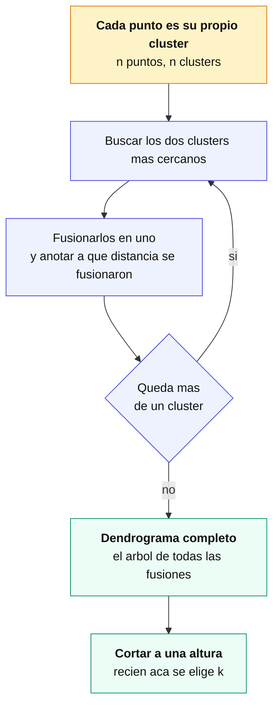
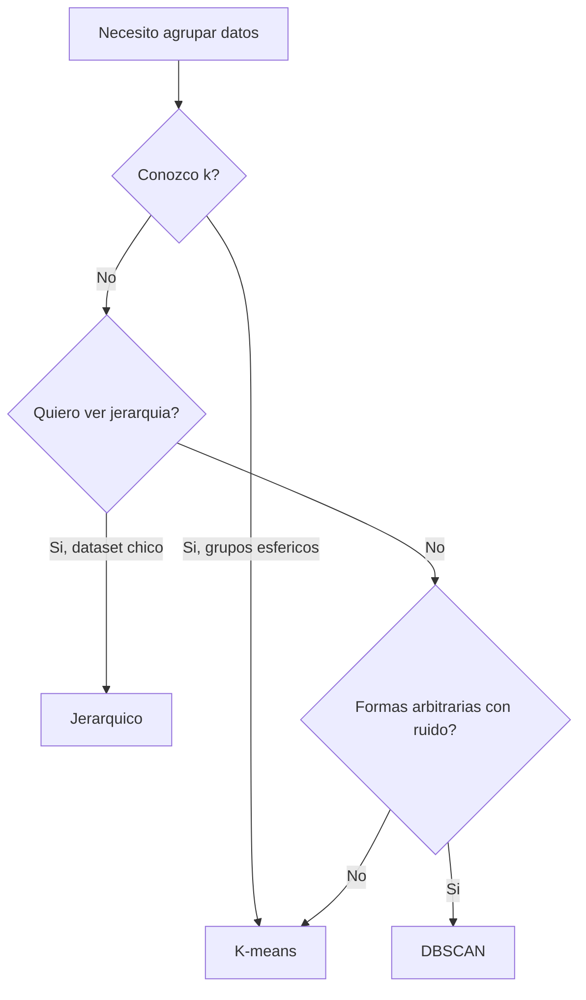
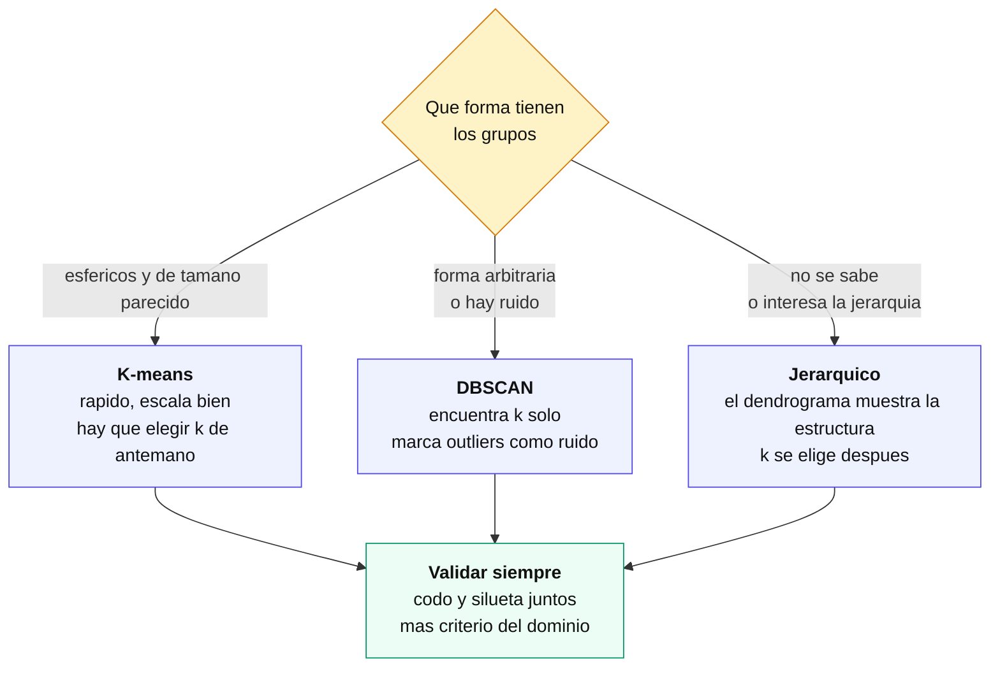

[Índice](README.md) · [← Anterior](05-complejidad-del-modelo-y-seleccion.md) · [Siguiente →](07-redes-neuronales.md)

# Parte VI — Aprendizaje no supervisado

Hasta acá todo el manual asumió que había un `y` para entrenar y evaluar (cap. 8 y 9). Esta parte cambia esa premisa: no hay etiquetas, y el objetivo es encontrar estructura en los datos por su cuenta. Para aprovecharla hace falta tener asimilada la preparación de datos (cap. 5) — en particular el escalado, porque casi todo lo que sigue trabaja con distancias o con varianza — y conviene tener presente el problema de sobreajuste y sesgo-varianza (cap. 7), porque reaparece bajo otra forma cuando no hay `y` para chequear contra el mundo real.

### 18. Clustering con K-means

**Apuntes.** Particiona los datos en **k** clusters minimizando la **inercia** (suma de distancias² de cada punto a su centroide). Iterativo: inicializa k centroides → asigna cada punto al más cercano → recalcula centroides como la media → repite hasta converger.

**Referencia técnica.**

| | |
|--|--|
| **Cuándo usar** | Sabés (o estimás) k; grupos aproximadamente **esféricos** y de tamaño similar; dataset grande (escala bien). |
| **Cuándo NO** | Formas arbitrarias, densidades/tamaños muy distintos, outliers (los arrastra). |
| **Hiperparámetros** | `n_clusters` (**el** clave), `init` (`k-means++`), `n_init`, `max_iter`. |
| **Escala** | Sensible → estandarizar antes (cap. 5). |
| **Evaluación** | Codo (inercia), silueta, Davies-Bouldin (cap. 21). |

```python
from sklearn.preprocessing import StandardScaler
from sklearn.cluster import KMeans
X_scaled = StandardScaler().fit_transform(X)
km = KMeans(n_clusters=3, init="k-means++", n_init=10, random_state=42)
labels = km.fit_predict(X_scaled)
km.inertia_   # WCSS para el método del codo
```

### 19. Clustering jerárquico

Construye una **jerarquía completa** de agrupamientos en lugar de una sola partición. Es la diferencia de fondo con K-means: no hay que decidir `k` antes de empezar.

El algoritmo **aglomerativo** —el habitual— arranca con cada punto como su propio cluster y va fusionando de a dos:



El resultado es un **dendrograma**: un árbol donde la **altura de cada fusión es la distancia a la que ocurrió**. Cortarlo a una altura da una partición; cortarlo más abajo da más clusters, más arriba da menos. La decisión de `k` se toma **mirando el árbol ya construido**, y esa es la ventaja práctica del método.

#### Cómo se lee un dendrograma

- **Fusiones a poca altura** = grupos muy parecidos entre sí.
- **Un salto grande de altura** entre dos fusiones sugiere un corte natural: ahí se juntaron cosas que en realidad no se parecen tanto.
- **Ramas largas sin fusionar** hasta arriba señalan puntos atípicos.

La heurística habitual es cortar en el salto vertical más largo del árbol, que es el equivalente al método del codo (cap. 21).

#### El `linkage` cambia la forma de los clusters

`linkage` define **cómo se mide la distancia entre dos clusters**, no entre dos puntos. Es la decisión que más afecta el resultado:

| Enlace | Distancia entre clusters | Efecto |
|---|---|---|
| **Simple** (min) | el par de puntos **más cercanos** | encadena: produce clusters alargados; sensible al ruido |
| **Completo** (max) | el par **más lejano** | clusters compactos y de tamaño parejo; sensible a outliers |
| **Promedio** | promedio de todas las distancias | intermedio entre los dos anteriores |
| **Ward** | el que **menos aumenta la varianza intra** al fusionar | clusters compactos y equilibrados; **el más usado**, y el default razonable |

> **Ward solo funciona con distancia euclídea.** Si el problema pide otra métrica —coseno para texto, Manhattan— hay que usar otro enlace.

#### Cuándo conviene y cuándo no

| | |
|---|---|
| **Usarlo** | No se sabe cuántos clusters hay; interesa ver la estructura jerárquica; el dataset es chico o mediano; se quiere un resultado **determinista** (no depende de inicialización aleatoria como K-means). |
| **Evitarlo** | Datasets grandes: el costo es **O(n²)** en memoria y peor en tiempo. Con decenas de miles de puntos se vuelve impracticable. |

Y una limitación que conviene tener presente: **las fusiones son irreversibles**. Si dos puntos se unieron temprano por error, nada los vuelve a separar más arriba en el árbol.

```python
from scipy.cluster.hierarchy import linkage, dendrogram, fcluster
import matplotlib.pyplot as plt

Z = linkage(X_scaled, method="ward", metric="euclidean")

plt.figure(figsize=(12, 5))
dendrogram(Z, truncate_mode="lastp", p=30)   # ultimas 30 fusiones, para que se lea
plt.show()

labels = fcluster(Z, t=3, criterion="maxclust")     # cortar en 3 clusters
labels = fcluster(Z, t=8.5, criterion="distance")   # o cortar a una altura
```

> **Escalar antes, siempre.** El método se basa en distancias, así que una variable en miles domina a otra en decimales. Vale lo mismo que para K-means (cap. 18) y lo del cap. 5.

### 20. DBSCAN: clustering por densidad

**Apuntes.** Define clusters como **regiones densas** separadas por regiones vacías. No requiere fijar k, detecta clusters de forma arbitraria y marca **outliers** (etiqueta `-1`).

- **Core:** ≥ `min_samples` puntos dentro del radio `eps`.
- **Border:** dentro de `eps` de un core, pero no es core.
- **Noise:** ni core ni border → outlier.

**Referencia técnica.**

| | |
|--|--|
| **Cuándo usar** | Formas arbitrarias; hay ruido/outliers a detectar; no querés fijar k. |
| **Cuándo NO** | Densidad muy variable entre clusters; alta dimensión. |
| **Hiperparámetros** | `eps` (ε, radio), `min_samples` (MinPts). |
| **Elegir `eps`** | Gráfico k-distancia (k = min_samples): buscar el codo. |

```python
from sklearn.cluster import DBSCAN
labels = DBSCAN(eps=0.5, min_samples=5).fit_predict(X_scaled)  # -1 = ruido
```

**Comparativa de clustering:**

| Método | Nº clusters | Formas | Ruido | Escala |
|--------|:-----------:|--------|:-----:|--------|
| **K-means** | Hay que fijarlo | Esféricas | Sensible | Rápido |
| **Jerárquico** | Se decide al cortar | Según enlace | Según método | Pesado en grandes |
| **DBSCAN** | Automático | **Arbitrarias** | **Detecta** | Sensible a `eps` |

Un árbol de decisión rápido para elegir entre los tres, según la forma de los datos y si conocés k de antemano:



### 21. Evaluación de clusters

En clustering **no hay etiquetas contra las cuales comparar**, así que no se puede hablar de aciertos. Lo que se mide es la **geometría** del resultado: qué tan juntos están los puntos de un mismo grupo y qué tan separados los de grupos distintos.

| Método | Qué mide | Cómo se lee | Rango |
|---|---|---|---|
| **Método del codo** | Inercia (WCSS) contra `k` | El `k` donde la mejora se vuelve marginal | la inercia siempre baja con `k` |
| **Silueta** | `s = (b − a) / max(a, b)` — cohesión contra separación | +1 bien agrupado · ~0 en la frontera · negativo mal asignado | [−1, +1] |
| **Davies-Bouldin** | dispersión intra sobre separación inter | **menor es mejor** | ≥ 0 |
| **Calinski-Harabasz** | varianza entre grupos sobre varianza intra | **mayor es mejor** | ≥ 0 |

#### Por qué el codo no alcanza solo

La **inercia siempre baja** al aumentar `k` — con `k = n` cada punto es su propio cluster y la inercia es cero. Por eso no se puede elegir el `k` que la minimiza: hay que buscar el **punto de quiebre**, donde agregar un cluster más deja de compensar. Y ese punto muchas veces no es evidente: la curva baja suave y el "codo" queda a criterio de quien mira.

La **silueta** no tiene ese problema porque **sí tiene un máximo**: mide para cada punto qué tan cerca está de su propio grupo (`a`) contra el grupo vecino más cercano (`b`). Un valor negativo significa que el punto está más cerca de otro cluster que del suyo — está mal asignado.

> **Nota (verificado en notebook, Iris):** el codo sugiere **k = 3** y la silueta **k = 2**. No es contradicción: Iris tiene tres especies, pero dos de ellas —*versicolor* y *virginica*— se solapan tanto que geométricamente forman un solo grupo. **El codo encuentra la estructura que hay; la silueta, la que está bien separada.** Cuál elegir depende de qué se busca, y ahí entra el criterio del dominio.

#### Mirar la silueta por punto, no solo el promedio

El `silhouette_score` devuelve un promedio, y un promedio de 0,55 puede esconder que un cluster entero tiene valores negativos. El **gráfico de silueta** —cada punto como una barra, agrupados por cluster— muestra el detalle: si un grupo tiene barras cortas o negativas, ese grupo está mal formado aunque el promedio general se vea bien.

Es el mismo argumento que la matriz de confusión frente a la exactitud (cap. 8): **el número agregado oculta dónde falla**.

#### Qué algoritmo para qué caso



```python
from sklearn.metrics import silhouette_score, silhouette_samples, davies_bouldin_score

silhouette_score(X_scaled, labels)        # promedio, mas alto mejor
silhouette_samples(X_scaled, labels)      # valor por punto, para el grafico
davies_bouldin_score(X_scaled, labels)    # mas bajo mejor
```

#### Lo que ninguna métrica dice

Todas estas medidas evalúan **geometría**, no utilidad. Un clustering con silueta alta puede ser inservible si los grupos que encontró no significan nada para el problema; y uno con silueta mediocre puede ser justo el que separa a los clientes que se van de los que se quedan.

La validación final siempre es la misma pregunta: **¿estos grupos me sirven para algo?** Las métricas ayudan a descartar resultados malos, no a confirmar que un resultado es bueno.

### 22. La maldición de la dimensión

Problemas en **alta dimensión**: los datos se **dispersan**, las distancias se vuelven **uniformes** y pierden significado (degradan K-means/K-NN, cap. 10); el costo crece exponencialmente; sube el riesgo de **overfitting** (cap. 7); la visualización se vuelve imposible.

**Mitigaciones:** reducción de dimensionalidad (cap. 23), selección de variables, regularización (cap. 15). Es el puente entre selección de variables y reducción de dimensionalidad.

### 23. Reducción de dimensionalidad

**Crean** nuevas variables que preservan información (distinto de seleccionar un subconjunto de las originales).

**PCA (Análisis de Componentes Principales)** — lineal, **no supervisado**. Encuentra las direcciones de **máxima varianza** (componentes principales), ortogonales entre sí.
- **Pasos:** centrar → matriz de covarianza → valores/vectores propios → ordenar por valor propio → proyectar sobre los top componentes.
- **Nº de componentes:** scree plot (codo en los valores propios) o varianza explicada acumulada (ej. retener 95%).
- **Cuándo:** conservar varianza, descorrelacionar features, visualizar 2-3D, preprocesar. Sensible a escala → estandarizar; `fit` solo con train.

**LDA (Análisis Discriminante Lineal)** — lineal, **supervisado**. Busca la proyección que **maximiza la separación entre clases**. Genera hasta **(nº clases − 1)** componentes.

**t-SNE** — no lineal; preserva la **estructura de vecinos locales** minimizando la divergencia **KL**. Ideal para **visualización** en 2-3D (no para preprocesar). Costoso en datasets grandes; la estructura **global** (distancias entre clusters) puede no ser fiable.

**UMAP** — no lineal (geometría/topología); construye un **grafo de vecindad** y preserva estructura **local y global**. **Más rápido y escalable que t-SNE**; ajustable con `n_neighbors` / `min_dist`. No viene en sklearn: `pip install umap-learn`.

**ICA** — separa componentes **estadísticamente independientes** (ej. separación de fuentes de audio).

| Técnica | Lineal | Supervisada | Maximiza / preserva | Uso principal |
|---------|:------:|:-----------:|----------|---------------|
| **PCA** | Sí | No | Varianza | Compresión / preprocesamiento |
| **LDA** | Sí | **Sí** | Separación entre clases | Preproc. para clasificación |
| **t-SNE** | No | No | Estructura **local** | **Visualización** (datasets chicos/medianos) |
| **UMAP** | No | No | Estructura **local y global** | **Visualización** (datasets grandes) |
| **ICA** | Sí | No | Independencia estadística | Separación de fuentes |

**Elección rápida:** preprocesar/comprimir → **PCA**; separar clases con etiquetas → **LDA**; visualizar estructura local (dataset chico) → **t-SNE**; visualizar dataset grande preservando local + global → **UMAP**.

```python
from sklearn.decomposition import PCA
pca = PCA(n_components=0.95)                 # retener 95% de la varianza
X_red = pca.fit_transform(X_scaled)
pca.explained_variance_ratio_

from sklearn.discriminant_analysis import LinearDiscriminantAnalysis as LDA
X_lda = LDA(n_components=2).fit_transform(X, y)   # supervisado (usa y)

from sklearn.manifold import TSNE
X_tsne = TSNE(n_components=2, perplexity=30).fit_transform(X_scaled)  # visualización

import umap                                   # pip install umap-learn
X_umap = umap.UMAP(n_neighbors=15, min_dist=0.1).fit_transform(X_scaled)
```

**Tabla maestra — ¿qué técnica uso?**

| Necesito… | Técnica | Cap. |
|-----------|---------|:-:|
| Agrupar, sé k, grupos esféricos | K-means | 18 |
| Agrupar y ver estructura jerárquica | Jerárquico | 19 |
| Agrupar formas raras + detectar outliers | DBSCAN | 20 |
| Elegir nº óptimo de clusters | Codo + Silueta | 21 |
| Reducir dimensión conservando varianza | PCA | 23 |
| Reducir dimensión separando clases | LDA | 23 |
| Visualizar alta dimensión en 2D (dataset chico) | t-SNE | 23 |
| Visualizar alta dimensión en 2D (dataset grande) | UMAP | 23 |
