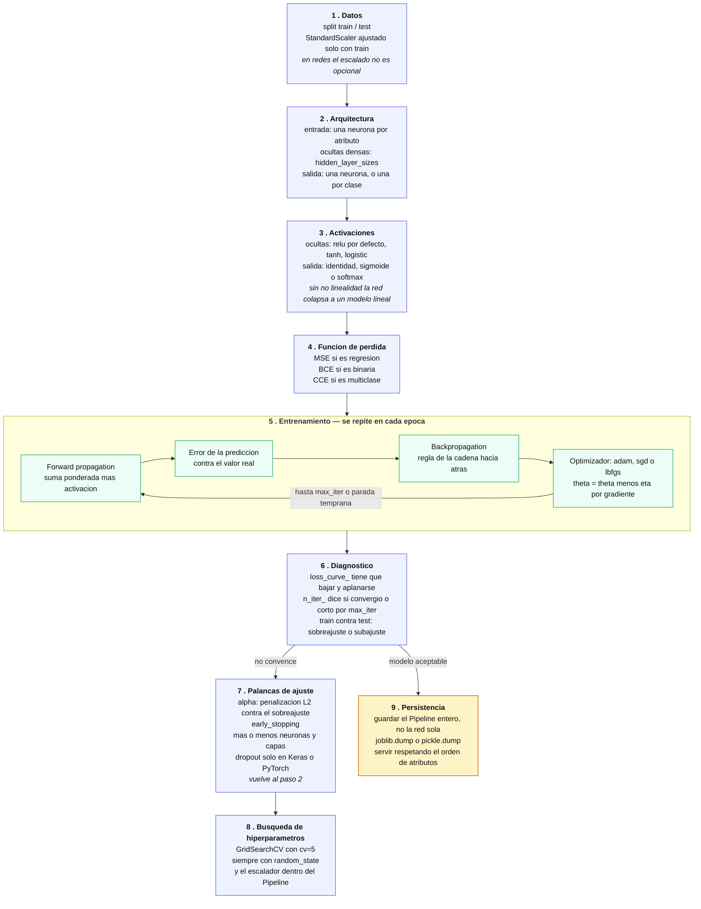
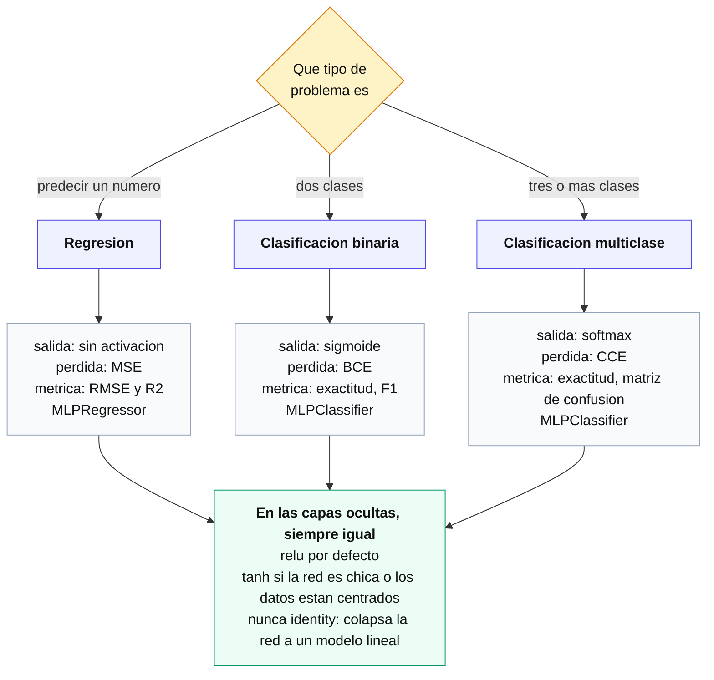
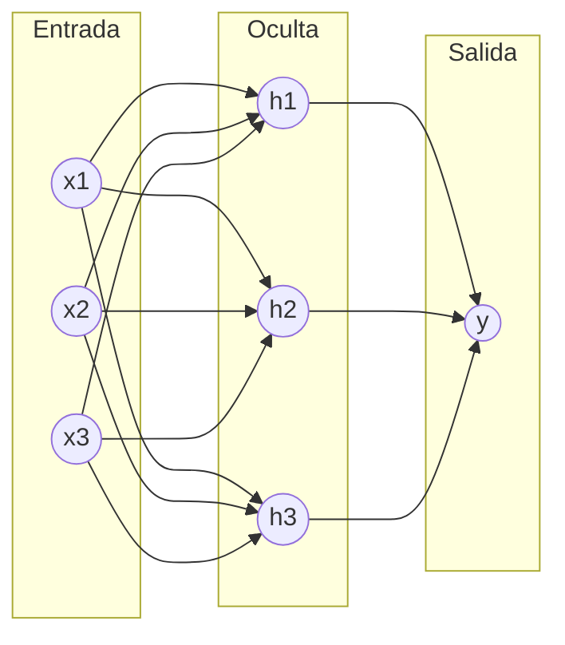
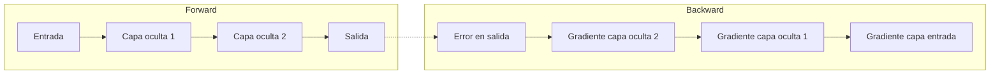

[Índice](README.md) · [← Anterior](06-aprendizaje-no-supervisado.md) · [Siguiente →](08-deep-learning-con-frameworks.md)

# Parte VII — Redes neuronales

Esta parte deja atrás los modelos clásicos (regresión, árboles, clustering) para entrar en redes neuronales, que necesitan del resto del manual como base: los clasificadores lineales (cap. 10) para entender qué es exactamente el perceptrón y por qué es un caso particular de ellos, la regularización Ridge/Lasso (cap. 15) porque reaparece igual en las redes, y el sobreajuste (cap. 7) porque es el riesgo central de un MLP. El recorrido va de lo biológico y lo histórico hasta el mecanismo interno de entrenamiento — backpropagation y descenso de gradiente — pasando por el perceptrón simple, sus límites, y el perceptrón multicapa que los supera.

> **Nota:** la teoría del curso está documentada hasta la Clase 24 del programa (backpropagation y persistencia de modelos). Solo restan los checkpoints y la evaluación integral.

### Mapa de la parte

Todo lo que sigue, en orden, y cómo se encadena: de los datos crudos al modelo guardado y servido.



Los capítulos 24 a 30 recorren **cómo se llegó hasta acá** —la neurona biológica, el perceptrón, sus límites— y los capítulos 31 a 38, **cada casillero de ese mapa**: la estructura (31), las activaciones (32), la arquitectura (33), la pérdida (34), la optimización (35), la regularización (36), backpropagation (37) y la persistencia (38).

### Qué función va en cada problema

Las tres decisiones que dependen del tipo de problema —activación de salida, función de pérdida y métrica— se resuelven juntas, porque van atadas. La activación de las capas ocultas, en cambio, no depende del problema.



### 24. Fundamentos biológicos

**Apuntes.** Las **redes neuronales artificiales (RNA)** están inspiradas en el cerebro humano (~86 mil millones de neuronas conectadas por **sinapsis**). Cada neurona biológica **recibe** señales por las **dendritas**, las **procesa** en el **cuerpo celular (soma)** y las **transmite** por el **axón**.

Paralelismo biológico → artificial:

| Elemento biológico | Elemento artificial |
|---|---|
| Dendritas | Entradas (x₁, x₂, …, xₙ) |
| Fuerza de la sinapsis | Pesos (w₁, w₂, …, wₙ) |
| Cuerpo celular (integración) | Sumatoria ponderada (Σ) |
| Umbral de disparo | Función de activación (Φ) |
| Axón (señal transmitida) | Salida (y) |

Las neuronas artificiales se organizan en **capas**: capa de entrada, una o más **capas ocultas**, y capa de salida. El aprendizaje biológico fortalece/debilita sinapsis; el de una RNA **ajusta pesos** — analogía conceptual, no una réplica: el mecanismo real (backpropagation + optimización numérica) es matemáticamente distinto, y una RNA profunda consume muchísima más energía que el cerebro para tareas equivalentes.

### 25. Historia de las redes neuronales

**Apuntes.** Recorrido por décadas, con avances y un freno prolongado:

| Período | Hito | Impacto |
|---|---|---|
| 1940 (1943) | Modelo matemático de neurona (**McCulloch-Pitts**) | Sienta las bases teóricas: neuronas que hacen cálculos lógicos con entradas binarias |
| 1950 (1958) | **Perceptrón** (Rosenblatt) | Primer modelo capaz de aprender a clasificar datos linealmente separables |
| 1960 (1969) | Libro *"Perceptrons"* (**Minsky y Papert**) | Expone las limitaciones del perceptrón simple ante problemas no lineales → **invierno de la IA** (cae el financiamiento e interés) |
| 1980 | **Backpropagation** | Reactiva el campo: permite entrenar redes multicapa ajustando pesos para minimizar el error |
| 1990-2000 | **CNN** (datos con estructura espacial, imágenes) y **RNN** (datos secuenciales) | Especialización de arquitecturas según el tipo de dato |
| Era moderna | **Deep learning** | Datos masivos + poder de cómputo + mejores algoritmos → redes de decenas/cientos de capas |

> **Nota:** las etiquetas de década (1940, 1950, 1960) son aproximaciones del material original; los años puntuales son 1943 (McCulloch-Pitts), 1958 (Rosenblatt) y 1969 (Minsky y Papert).

### 26. El perceptrón: estructura y fórmulas

**Apuntes.** El **perceptrón** (Rosenblatt, 1957/58) es un algoritmo de **aprendizaje supervisado** para **clasificación binaria**, el modelo más simple de red neuronal. Es un **clasificador lineal** (cap. 10): solo puede aprender correctamente cuando las clases son **linealmente separables** (se pueden dividir con una única recta/hiperplano).

**Estructura:**

- **Entradas** `x1, x2, …, xn`.
- **Pesos** `w1, w2, …, wn`: importancia relativa de cada entrada.
- **Umbral / bias** `θ`: término independiente.
- **Suma ponderada** `Σ`, **función de activación** `Φ` y **salida** `y`.

Flujo: `x1…xn` (con pesos `w1…wn`) y `θ` → suma ponderada `z` → activación `Φ` → salida `y`.

**Fórmulas:**

```
Suma ponderada:         z = w1*x1 + w2*x2 + ... + wn*xn + θ   =   Σ (i=1 a n) wi*xi + θ

Función de activación (escalón):
Φ(z) = 1  si z > 0
Φ(z) = 0  en caso contrario

Salida:                 y = Φ(z)

Actualización de pesos:  Δwi = n * (y_real - y) * xi     →  wi_nuevo = wi_anterior + Δwi
Actualización del umbral: Δθ = n * (y_real - y)          →  θ_nuevo  = θ_anterior + Δθ
```

`n` (eta) es la **tasa de aprendizaje**: regula cuánto se ajusta cada peso en cada actualización. Ambas actualizaciones (pesos y umbral) se aplican en cada iteración en la que la predicción `y` difiere del valor real `y_real`; si coinciden, el ajuste es nulo (`Δw = Δθ = 0`).

**Ejemplo canónico — compuerta lógica AND** (`x1 AND x2`, tabla de verdad con un único caso positivo en `(1,1)`): al graficar los 4 puntos, `(1,1)` queda separado del resto por una recta → es **linealmente separable**, condición necesaria para que el perceptrón la aprenda.

### 27. Entrenamiento del perceptrón: la compuerta AND

**Apuntes.** Entrenamiento manual, paso a paso, de un perceptrón para aprender `x1 AND x2`.

**Parámetros iniciales:** `w1 = 0.381`, `w2 = 0.245`, `θ = 0.196`, tasa de aprendizaje `n = 0.045`.

El procedimiento se repite en cada iteración recorriendo las 4 filas de la tabla de verdad `(0,0)→0`, `(0,1)→0`, `(1,0)→0`, `(1,1)→1`, calculando `z`, aplicando la función escalón para obtener `y`, y actualizando `wi` y `θ` cuando `y ≠ y_real`.

**Resumen de las 6 iteraciones hasta la convergencia:**

| Iteración | Parámetros al cierre | ¿Hubo error en alguna fila? |
|:--:|---|---|
| Inicio | `w1=0.381`, `w2=0.245`, `θ=0.196` | — |
| 1ª | `w1=0.336`, `w2=0.2`, `θ=0.061` | Sí (filas 1, 2 y 3) |
| 2ª | `w1=0.291`, `w2=0.155`, `θ=-0.074` | Sí (filas 1, 2 y 3) |
| 3ª | `w1=0.246`, `w2=0.11`, `θ=-0.164` | Sí (filas 2 y 3) |
| 4ª | `w1=0.201`, `w2=0.11`, `θ=-0.209` | Sí (solo fila 3) |
| 5ª | `w1=0.201`, `w2=0.11`, `θ=-0.209` (sin cambios) | No — el perceptrón ya clasifica bien las 4 filas |
| 6ª (verificación) | `w1=0.201`, `w2=0.11`, `θ=-0.209` | No — error `0` confirmado en las 4 filas; converge |

**Pesos finales:** `w1 = 0.201`, `w2 = 0.11`, `θ (bias) = -0.209`. Con estos valores, `y = Φ(w1*x1 + w2*x2 + θ)` da `0` para `(0,0)`, `(0,1)` y `(1,0)`, y `1` para `(1,1)` — reproduce exactamente la compuerta AND.

> **Nota:** en la 5ª iteración ya no hubo ningún error, pero recién se confirma la convergencia con una 6ª pasada de verificación (error `e = y_real - y = 0` en las 4 filas) antes de dar por finalizado el entrenamiento.

### 28. Limitaciones del perceptrón

**Apuntes.**

- **Separabilidad lineal:** el perceptrón simple **solo** resuelve problemas **linealmente separables**. El caso clásico que no puede resolver es el **XOR**, cuyas clases no se pueden separar con una única recta/hiperplano.
- **Convergencia no garantizada:** si los datos no son linealmente separables, el algoritmo puede no converger nunca en un número finito de pasos.
- **Capacidad limitada:** poca capacidad para capturar relaciones y patrones complejos (al ser un modelo lineal de una sola capa).
- **Ajuste de hiperparámetros:** aunque tiene menos hiperparámetros que modelos más complejos, calibrar la tasa de aprendizaje sigue siendo un desafío (muy alta → inestabilidad/oscilación; muy baja → convergencia lenta).

Esta limitación (XOR) es históricamente la que originó el "invierno de la IA" (cap. 25): se resuelve con perceptrones **multicapa** (MLP) y **backpropagation**, contenido de los capítulos siguientes.

### 29. Implementación con scikit-learn

**Apuntes.**

- **Scikit-Learn** es una de las librerías más usadas del ecosistema Python para **aprendizaje automático**.
- Ofrece una **amplia gama de algoritmos y utilidades** que cubren **todo el flujo de trabajo**: desde la preparación de los datos hasta la evaluación del modelo.
- **Se integra** con el resto del ecosistema Python, incluidas las librerías de aprendizaje profundo como **TensorFlow** y **PyTorch**.

Aplicado a este módulo: el entrenamiento manual de la compuerta AND (cap. 27) queda encapsulado en `sklearn.linear_model.Perceptron`, que implementa la misma regla delta detrás de la API uniforme `fit` / `predict` (ver ejemplo en la referencia técnica de más abajo). La implementación manual sirve para entender la mecánica; scikit-learn, para trabajar en la práctica con validación, métricas y preprocesamiento integrados. Para redes profundas (varias capas, backpropagation) se pasa a TensorFlow o PyTorch.

### 30. El perceptrón multicapa (MLP)

**Apuntes.**

Un **perceptrón multicapa (MLP)** es una red neuronal artificial que aborda problemas complejos de **clasificación** y **regresión**. A diferencia del perceptrón simple, que solo resuelve problemas **linealmente separables** (cap. 28), el MLP maneja **relaciones no lineales** entre las características de entrada y la salida.

Los cuatro puntos de la slide:

- El entrenamiento se realiza mediante el algoritmo de **retropropagación** (backpropagation, ver cap. 37).
- Su capacidad para aprender relaciones complejas viene de la **estructura de capas** y de las **funciones de activación no lineales**.
- Las redes multicapa son **sensibles a la calidad y la naturaleza de los datos** de entrada.
- Necesitan **muchos datos** para entrenar eficazmente y tienen **riesgo de sobreajuste** (cap. 7).

**Arquitectura.**

| Capa | Rol |
|---|---|
| **Entrada** | una neurona por característica; no calcula, solo recibe |
| **Ocultas** (1 o más) | dan la capacidad de representar relaciones no lineales; cada neurona hace `z = Σ wᵢ·xᵢ + b` y le aplica una activación no lineal |
| **Salida** | una neurona en regresión; una por clase en clasificación |



Sobre esa arquitectura corren dos procesos:

- **Forward propagation:** los datos de entrada se transforman a través de las capas hasta producir la **salida final**.
- **Backpropagation:** ajuste de **pesos y sesgos** para **minimizar la función de pérdida**. Es la generalización a varias capas de la regla delta del entrenamiento manual (cap. 27). Se desarrolla en detalle en el cap. 37.

**Por qué la activación oculta debe ser no lineal.** Es el punto que justifica toda la arquitectura: si las capas ocultas solo hicieran la suma ponderada, la composición de varias capas lineales **seguiría siendo lineal** y la red colapsaría al equivalente de un perceptrón simple, con la misma limitación. La no linealidad (ReLU, tanh, logística — ver cap. 32) es lo que hace que apilar capas agregue capacidad real, y con eso resolver el **XOR**.

**Qué se paga respecto del perceptrón simple.**

| | Perceptrón simple | MLP |
|---|---|---|
| Problemas | solo linealmente separables | también no lineales |
| Interpretabilidad | alta: 2 pesos y un sesgo legibles | baja: miles de pesos sin lectura directa |
| Datos necesarios | pocos | muchos |
| Sobreajuste | bajo (modelo rígido) | alto: requiere regularización (`alpha`, cap. 36) y validación |
| Escalado de entradas | tolerable | **necesario** |
| Costo de entrenamiento | trivial | significativo |

> **Nota (verificado en notebook):** sobre Iris con 2 atributos y las 3 clases, el perceptrón simple llega a **76,7%** de exactitud y el MLP a **93,3%** — la diferencia es exactamente el solapamiento entre *versicolor* y *virginica*, que ninguna recta separa. En el mismo experimento, una red de **20** neuronas iguala a una de **250** usando dos órdenes de magnitud menos parámetros, mientras que una de **5** se queda corta (80%): el tamaño de la red es un hiperparámetro **a buscar**, no a maximizar.

### 31. Grafos y capa densa

**Apuntes.**

Un **grafo** describe cómo están conectadas las unidades: **nodos** (neuronas) y **aristas** (conexiones, cada una con su peso). En una **capa densa** o **totalmente conectada**, **cada neurona está conectada a todas las neuronas de la capa anterior**.

Consecuencia práctica: entre una capa de `n` neuronas y una densa de `m` hay `n × m` pesos más `m` sesgos. Por eso los parámetros crecen como un **producto**, no como una suma, al agrandar la red.

El diagrama del curso rotula cada neurona oculta como **`Σf`**, y el rótulo es literal: **suma ponderada** (`Σ`) seguida de la **función de activación** (`f`). Es decir, cada nodo es un perceptrón (cap. 26); la red es muchos de ellos conectados. En `scikit-learn`, `hidden_layer_sizes=(100, 150)` describe exactamente ese grafo, y los pesos quedan en `mlp.coefs_` y los sesgos en `mlp.intercepts_`.

### 32. Funciones de activación

**Apuntes.**

La **función de activación** determina la salida de una neurona. Sin ella, la red es una **combinación lineal de las entradas** y apilar capas no agrega nada (cap. 30). Sus cuatro roles según la slide: introducen **no linealidad**, deciden si la neurona **se activa** (pasa información a la siguiente capa), algunas **normalizan la salida a un rango**, y **afectan cómo se actualizan los pesos** —porque la retropropagación usa su derivada—.

| Función | Fórmula | Rango | Nota |
|---|---|---|---|
| **Sigmoide (logística)** | `1 / (1 + e^(−x))` | (0, 1) | salida legible como probabilidad; **satura** en los extremos |
| **Tanh** | `(e^z − e^(−z)) / (e^z + e^(−z))` | (−1, 1) | igual forma pero **centrada en 0**; converge más rápido; también satura |
| **ReLU** | `0 si x < 0; x si x ≥ 0` | [0, ∞) | derivada 1 en el lado positivo: **no satura**; barata; default en capas ocultas |

> **Errata del material:** la slide escribe la sigmoide como `1/(1 − e^(−x))`. Es un error tipográfico: va **más**. Con el signo menos la función se indefine en `x = 0` y no coincide con la curva dibujada en la misma slide.

**Saturación y gradiente desvaneciente.** En los extremos, sigmoide y tanh son casi planas: su derivada tiende a 0. Como la retropropagación **multiplica** derivadas capa por capa (cap. 37), en redes profundas el gradiente se apaga y las primeras capas dejan de aprender. ReLU no tiene ese problema por el lado positivo; a cambio, una neurona cuya entrada queda siempre negativa tiene gradiente 0 y muere (*dying ReLU*).

> **Nota (verificado en notebook):** la derivada en `x = 6` vale **0,0025** para la sigmoide y **0,00002** para tanh, contra **1** para ReLU: la saturación es medible, no una figura retórica. Y sobre el XOR, un `MLPClassifier` con `activation='identity'` se queda en **50%** de exactitud —no lo resuelve—, mientras que con `tanh` o `relu` llega a **100%**. La no linealidad es lo único que cambia entre esos tres casos.

**Qué usar:** ReLU en capas ocultas por defecto; **sigmoide** en la salida binaria; **softmax** en la salida multiclase; **ninguna** (identidad) en la salida de regresión. En `scikit-learn`, `activation` aplica **solo a las capas ocultas** —la de salida la elige el estimador según el problema— y acepta `'relu'` (default), `'tanh'`, `'logistic'`, `'identity'`.

### 33. Diseño de la arquitectura de la red

**Apuntes.**

Elegir el **número de capas** y de **neuronas** afecta directamente la **capacidad de aprendizaje**, el **poder de generalización** y el **rendimiento computacional**.

| Decisión | Si se pasa | Si se queda corto |
|---|---|---|
| **Capas** | más complejidad y más tiempo de entrenamiento | no aprende representaciones complejas |
| **Neuronas** | **sobreajuste** (cap. 7): memoriza el train | **capacidad insuficiente** para la complejidad de los datos |

No hay fórmula: la arquitectura es un **hiperparámetro** y se busca comparando en validación (cap. 6), nunca en train.

> **Nota (verificado en notebook, Iris con 2 atributos, `relu`):** `(2,)` da 46,7% de train y 56,7% de test con 15 parámetros —**underfitting** de manual: no ajusta ni el entrenamiento—; `(100,)` llega a 100% de test con 603 parámetros; y `(100, 100)`, con **10.703** parámetros (~17 veces más), **no mejora nada**: baja a 96,7%. La lectura honesta es "capacidad de sobra sin beneficio" más que sobreajuste probado, porque con **30 muestras de test** un acierto vale 3,3 puntos y las diferencias chicas no son concluyentes.

> **Nota (verificado en notebook):** escalar con `StandardScaler` **bajó la pérdida final en las tres activaciones** (tanh 0,243 → 0,161; relu 0,197 → 0,177), pero el efecto sobre la exactitud fue **mixto**: `logistic` anduvo mejor *sin* escalar (100% contra 90%). Ninguna de las seis corridas convergió dentro de `max_iter=300`. El escalado es buena práctica por lo que le hace al entrenamiento, no porque garantice mejor exactitud en un dataset chico. Método práctico: arrancar simple (una capa oculta), agrandar solo si el error de *entrenamiento* sigue alto, y si el error de train es bajo pero el de test alto, achicar o regularizar (`alpha`, cap. 36) antes que agregar capas. Verificar lo que realmente quedó entrenado con `mlp.n_layers_`, `mlp.coefs_` y `mlp.loss_curve_`.

### 34. Funciones de pérdida

**Apuntes.**

La **función de pérdida** (o **función de costo**) cuantifica la **discrepancia entre lo que el modelo predijo y los valores reales**, produciendo **un único valor**. Ese valor es la **señal para ajustar pesos y sesgos**: es lo que la retropropagación deriva (cap. 37). En `scikit-learn` es la curva `mlp.loss_curve_`. La elección **depende del tipo de problema**.

**Regresión.**

```
MAE = (1/n) · Σ |yᵢ − ŷᵢ|          MSE = (1/n) · Σ (yᵢ − ŷᵢ)²
```

El MSE eleva al cuadrado: castiga mucho más los errores grandes y es **sensible a outliers**; el MAE es más **robusto**. A cambio, el MSE es derivable en todo su dominio, lo que lo hace más cómodo para el descenso de gradiente. `MLPRegressor` minimiza MSE. (Ver métricas de regresión, cap. 9.)

**Clasificación.**

```
BCE:  L = −(1/N) · Σᵢ ( yᵢ·log(ŷᵢ) + (1 − yᵢ)·log(1 − ŷᵢ) )
CCE:  L = −(1/N) · Σⱼ Σᵢ  yⱼᵢ·log(ŷⱼᵢ)
```

La **entropía binaria cruzada (BCE)** se usa en clasificación **binaria**; la **entropía cruzada categórica (CCE)**, en **multiclase**. Ambas miden la diferencia entre la distribución verdadera y la predicha. Con `y` en formato *one-hot*, en la CCE solo sobrevive el término de la clase correcta: la pérdida es `−log` de la probabilidad que el modelo le asignó a esa clase. `MLPClassifier` **no expone el parámetro**: usa log-loss siempre, que es BCE en el caso binario y CCE en el multiclase. (Ver métricas de clasificación, cap. 8.)

**Pérdida ≠ métrica de evaluación.** La pérdida es lo que se **minimiza** durante el entrenamiento y debe ser derivable; la métrica (exactitud, R², RMSE) es lo que se **reporta**. A veces coinciden (MSE) y a veces no: nadie entrena minimizando exactitud, porque no es derivable.

### 35. Optimización y descenso de gradiente

**Apuntes.**

**Optimizar** es ajustar pesos y sesgos para **minimizar la función de pérdida** (cap. 34). El método es el **descenso de gradiente**: se calcula el **gradiente** —la derivada de la función de error respecto de *todos* los parámetros de la red, calculada con backpropagation (cap. 37)— y se avanza en sentido contrario.

**La regla de actualización**, que es toda la idea en una línea:

```
θ = θ − η · ∇θ J(θ)
```

donde `θ` son los parámetros (pesos y sesgos), `η` la **tasa de aprendizaje** y `∇θ J(θ)` el gradiente de la pérdida respecto de `θ`. El **signo menos** es el punto: el gradiente apunta hacia donde la pérdida *crece*, así que minimizar es moverse al revés. Visualmente, la pérdida es una superficie con forma de cuenco y entrenar es bajar hasta el fondo.

**La tasa de aprendizaje es el hiperparámetro más sensible.**

| `η` | Qué pasa |
|---|---|
| **Muy chica** | converge, pero lento: puede agotar `max_iter` sin llegar |
| **Adecuada** | pocos pasos, convergencia estable |
| **Muy grande** | salta de un lado al otro del valle y **diverge**: la pérdida oscila o explota |

**Tres modos de descenso**, según cada cuánto se actualizan los pesos:

| Modo | Actualiza | Característica |
|---|---|---|
| **Estocástico (SGD)** | cada vez que se evalúa **una muestra** | muy frecuente y ruidoso |
| **En lotes (batch)** | al terminar **una época** (todo el train) | estable, pero pocas actualizaciones y caro en memoria |
| **En mini-lotes** | al terminar cada **minilote**, con la media del gradiente del lote | el compromiso: es lo que se usa en la práctica |

> **Ojo con el nombre:** `solver='sgd'` en `scikit-learn` trabaja en **mini-lotes** (`batch_size`), no de a una muestra. El nombre es histórico.

El flujo completo de una época de entrenamiento, de los datos a la actualización de pesos:


**Dónde encaja:** la **regla delta** del perceptrón (cap. 27) es este mismo mecanismo en su versión mínima; **backpropagation** (cap. 37) es el algoritmo que calcula ese gradiente para todas las capas aplicando la regla de la cadena hacia atrás; y la **saturación** de las activaciones (cap. 32) es lo que lo rompe, porque multiplica el gradiente por números casi nulos.

### 36. Regularización en redes neuronales

**Apuntes.**

La explicación canónica de regularización —qué es la norma L1 y L2, y qué le hace cada una a los coeficientes— ya se desarrolló para modelos lineales en el cap. 15 (Ridge y Lasso). En redes neuronales es la **misma matemática** aplicada a los pesos de las capas, y solo cambia lo que aporta cada método frente a las particularidades de un MLP:

| Técnica | Penalización | Efecto sobre los pesos |
|---|---|---|
| **L1** | `L(X, w) + λ · Σ \|wᵢ\|` — suma de **valores absolutos** | lleva pesos **a cero**: selecciona variables, red rala |
| **L2** | `L(X, w) + λ · Σ wᵢ²` — suma de **cuadrados** | los **encoge** hacia cero sin anularlos |
| **Dropout** | — | **apaga neuronas al azar** durante el entrenamiento |

**Dropout** es lo propio de las redes, sin equivalente en regresión lineal: no toca la función de pérdida sino la arquitectura durante el entrenamiento, y al apagar neuronas al azar impide que la red dependa de una neurona en particular.

| Ventajas | Desventajas |
|---|---|
| previene el sobreajuste | más costo computacional |
| controla la complejidad | suma hiperparámetros que hay que elegir |
| puede acelerar la convergencia | posible pérdida parcial de información |

**En `scikit-learn` solo hay L2**, vía `alpha` (la `λ` de la fórmula del cap. 15), con default `0.0001`. **No hay L1 ni dropout** para redes: eso requiere Keras o PyTorch. Sí está disponible la **parada temprana** (`early_stopping=True`), que es regularización de hecho y es propia del entrenamiento iterativo de una red (no tiene equivalente directo en Ridge/Lasso, que se resuelven en una sola pasada): cortar cuando la validación deja de mejorar evita seguir ajustando ruido.

**Cómo se busca `alpha`:** con validación cruzada (cap. 6), graficando exactitud de **train y de validación** contra `alpha`. La señal de sobreajuste es la **brecha** entre las dos curvas; el buen `alpha` la cierra sin hundir las dos.

> **Nota (verificado en el recurso de clase):** un barrido de `alpha` sobre un problema demasiado fácil **no muestra nada**. En `OD_RN1_ESP_M03_S10`, cinco valores de `alpha` que cubren cinco órdenes de magnitud (de 0,00001 a 1,0) dan **todos la misma exactitud, 0,97**, y los tres solvers también. Con Iris de 2 atributos y 30 muestras de test, la exactitud solo puede valer 29/30 o 30/30: no hay resolución para distinguir configuraciones. Para ver el efecto de la regularización hace falta un problema que efectivamente sobreajuste.

### 37. Backpropagation


**La idea.** Entrenar una red es encontrar los pesos que minimizan la función de pérdida (cap. 34). Para eso hace falta el gradiente de la pérdida respecto de *cada* peso de *cada* capa (cap. 35). El problema es que la salida de la red es una composición de funciones —capa tras capa— y un peso de una capa temprana afecta la pérdida solo indirectamente, a través de todas las capas que vienen después. **Backpropagation** es el algoritmo que calcula ese gradiente completo de forma eficiente, propagando el error desde la salida hacia atrás, capa por capa, hasta la entrada.

**La regla de la cadena.** Es la herramienta matemática que lo hace posible. Si la pérdida `L` depende de la salida `y`, que depende de `z` (la suma ponderada), que depende de un peso `w`, entonces:

```
∂L/∂w = ∂L/∂y · ∂y/∂z · ∂z/∂w
```

Cada capa aporta un factor a esa cadena de derivadas. Para un peso de una capa intermedia, la cadena simplemente se hace más larga: incluye un factor por cada capa que hay entre ese peso y la salida.

**Dos pasadas por la red.**

| Paso | Dirección | Qué hace | Qué guarda |
|---|---|---|---|
| **Forward** | entrada → salida | calcula `z` y la activación de cada neurona, capa por capa, hasta la predicción | las activaciones intermedias de cada capa (hacen falta después) |
| **Backward** | salida → entrada | calcula el error en la salida y lo propaga hacia atrás, capa por capa, usando la regla de la cadena y las activaciones guardadas en el forward | el gradiente de la pérdida respecto de cada peso y cada sesgo |



**La derivación del curso, sobre una red concreta.** El material desarrolla el cálculo sobre una red de 2 entradas (`x₁`, `x₂`), 2 neuronas ocultas (`O₁`, `O₂`) y 1 salida (`S`), con **sigmoide** en todas las activaciones y **error cuadrático** como pérdida. De esos dos supuestos salen los dos factores que se repiten en todas las fórmulas: la derivada del error, `(ŷ − y)`, y la de la sigmoide, `ŷ(1 − ŷ)`.

Para un peso de la **capa de salida**, la cadena tiene tres factores:

```
∂E/∂p₂₁ = (∂E/∂ŷ) · (∂ŷ/∂sumaₛ) · (∂sumaₛ/∂p₂₁) = (ŷ − y) · ŷ(1 − ŷ) · salida₀₁ = δₛ · salida₀₁
```

Los dos primeros factores se agrupan bajo el nombre **`δₛ`**, y ese agrupamiento es el corazón del algoritmo: sirve para todos los parámetros de esa capa (`∂E/∂p₂₂ = δₛ·salida₀₂`, `∂E/∂sesgo₂₁ = δₛ·1`) y se **reutiliza** para las capas de más atrás. El sesgo se deriva como un peso cuya entrada vale siempre 1.

Para un peso de la **capa oculta**, la cadena se alarga a cinco factores:

```
∂E/∂p₁₁ = (ŷ − y) · ŷ(1 − ŷ) · p₂₁ · salida₀₁(1 − salida₀₁) · x₁
           └────── δₛ ──────┘   └── cruza el peso ──┘  └─ activación de O₁ ─┘  └ entrada
```

Leída de izquierda a derecha, la fórmula **es** el recorrido del error hacia atrás: sale del error, atraviesa la activación de salida, cruza el peso `p₂₁` hacia la capa oculta, atraviesa la activación de `O₁` y termina en la entrada `x₁`. Los demás pesos siguen el mismo patrón cambiando qué neurona oculta y qué entrada intervienen.

Con los gradientes calculados, cada parámetro se actualiza con la regla del descenso de gradiente (cap. 35):

```
p₁₁^nuevo = p₁₁^viejo − η · (∂E/∂p₁₁)
```

> **De dónde sale el 0,25.** La derivada de la sigmoide, `salida(1 − salida)`, vale **como máximo 0,25** (en `salida = 0,5`). Cada capa que el error atraviesa hacia atrás multiplica por un factor de ese tipo, así que el gradiente se achica al menos a la cuarta parte por capa aunque ninguna neurona esté saturada. Ese es el mecanismo exacto del gradiente desvaneciente.

**Por qué es eficiente.** La alternativa ingenua sería derivar la pérdida respecto de cada peso por separado, desde cero, recorriendo toda la red cada vez. Backpropagation evita ese trabajo repetido: calcula el gradiente de la última capa una sola vez y lo **reutiliza** para calcular el de la capa anterior, y así sucesivamente. Cada capa reaprovecha el resultado ya calculado de la capa siguiente en lugar de recomputar la cadena completa desde la salida. Esa reutilización es lo que hace viable entrenar redes de muchas capas: el costo crece linealmente con la cantidad de capas, no exponencialmente.

**Por qué la saturación lo rompe.** El gradiente que llega a una capa temprana es un **producto** de todas las derivadas locales de las capas posteriores (esa es justamente la regla de la cadena). Si la activación usada es sigmoide o tanh (cap. 32), su derivada es casi 0 en los extremos donde la neurona satura. Multiplicar varios números casi nulos entre sí da un número todavía más chico: el gradiente que llega a las primeras capas se **desvanece**, y esas capas dejan de actualizarse aunque el error en la salida siga siendo grande. Es la misma razón por la que ReLU —que no satura del lado positivo— se volvió la activación por defecto en redes con varias capas ocultas.


### 38. Persistencia de modelos

Entrenar es caro; predecir es barato. **Persistir** un modelo es guardarlo entrenado en disco para poder usarlo después sin volver a entrenarlo. Lo que la slide destaca:

- **Evita reentrenar** cada vez, ahorrando tiempo y recursos.
- Permite **servirlo desde un servidor**, procesando datos en tiempo real.
- Permite **desplegar varias instancias** en distintos nodos, bajando la latencia.
- Permite **versionar** el modelo y **revertir** si una actualización rompe algo.

**Las dos librerías.**

| | `joblib` | `pickle` |
|---|---|---|
| Origen | externa (viene con scikit-learn) | estándar de Python |
| Fuerte en | **objetos grandes** con arrays de NumPy | objetos Python en general |
| Compresión | sí, `compress=0..9` | no directamente |
| Recomendada para sklearn | **sí** | funciona, pero es la segunda opción |

```python
import joblib
joblib.dump(mlp, 'mi_modelo.joblib')                        # guardar
mlp = joblib.load('mi_modelo.joblib')                       # cargar
joblib.dump(mlp, 'comprimido.joblib', compress=3)           # guardar comprimido

import pickle
with open('mi_modelo.pkl', 'wb') as f:                      # 'wb' = escritura binaria
    pickle.dump(mlp, f)
with open('mi_modelo.pkl', 'rb') as f:                      # 'rb' = lectura binaria
    mlp = pickle.load(f)
```

> **Nota (medido con el modelo del notebook de clase):** el `.joblib` sin comprimir pesa 392.276 bytes y el comprimido 375.378 — un **4% menos**. Con un MLP chico la compresión casi no aporta y agrega tiempo de guardado y carga; rinde en modelos grandes.

**Tres cosas que el material no menciona y que importan más que la sintaxis.**

- **Seguridad.** Deserializar un pickle **ejecuta código arbitrario**: un archivo malicioso corre lo que quiera al abrirse. Nunca cargar un modelo de origen desconocido. `joblib` usa pickle por debajo, así que hereda el riesgo. Para modelos que viajan entre organizaciones existen formatos de intercambio como **ONNX** o **PMML**, que describen el modelo sin serializar objetos de Python.
- **Compatibilidad de versiones.** Un modelo guardado con una versión de scikit-learn puede fallar al cargarse con otra o, peor, cargar sin error y comportarse distinto. Guardar junto al modelo la versión de scikit-learn, de Python y de las dependencias.
- **Guardar el `Pipeline`, no el estimador suelto.** `joblib.dump(mlp, ...)` serializa solo los pesos e hiperparámetros del estimador: **no** guarda el `StandardScaler` (cap. 5). Si el modelo se entrenó con datos escalados y al cargarlo recibe datos crudos, las predicciones salen mal **sin ningún error visible**.

> **Nota (verificado, Iris con 2 atributos, `sklearn 1.9.0`):** el mismo `MLPClassifier` cargado desde disco da **96,67%** de exactitud con los datos escalados y **36,67%** con los datos crudos — peor que predecir la clase mayoritaria. No se lanza ninguna excepción: el modelo acepta la entrada, la procesa y devuelve predicciones con toda normalidad. Guardado como `Pipeline`, en cambio, recibe los datos crudos y devuelve el 96,67% correcto. Es un error que solo se detecta comparando métricas contra las del entrenamiento.

```python
from sklearn.pipeline import make_pipeline
pipe = make_pipeline(StandardScaler(), MLPClassifier(random_state=42)).fit(X_train, y_train)
joblib.dump(pipe, 'modelo_completo.joblib')   # el escalado viaja con la red
```

Del mismo modo, el **orden de los atributos** al predecir debe ser el mismo del entrenamiento: el modelo recibe posiciones, no nombres de columna. Y la entrada va como matriz 2D — de ahí el `.reshape(1, -1)` para predecir sobre una sola muestra.

**`skops`: el formato que scikit-learn recomienda por sobre pickle.**

El problema de fondo no es de sintaxis: es que **deserializar un pickle ejecuta código arbitrario**. El formato de pickle no solo guarda datos — guarda instrucciones de cómo reconstruir objetos, y el `Unpickler` las ejecuta al leerlas. Un archivo `.pkl` (o `.joblib`, que usa pickle por debajo) armado a mano puede, al cargarse, borrar archivos, abrir una conexión de red o instalar lo que sea, sin que la víctima haga nada más que `pickle.load(f)`. No es una vulnerabilidad teórica: es el comportamiento documentado del formato. Por eso scikit-learn advierte desde su propia documentación que nunca hay que cargar un pickle de origen no confiable, y por eso el proyecto mantiene [`skops`](https://skops.readthedocs.io/), pensado específicamente para no tener ese problema.

> **Verificado (`pip index versions skops`, `sklearn.__version__`):** al momento de escribir esto, `skops` está en la versión **0.14.0** y scikit-learn en **1.9.0** — la misma versión de sklearn ya citada en la nota de compatibilidad de este capítulo. La API que sigue se confirmó leyendo el código fuente de `skops/io/_persist.py` de esa versión, no de memoria.

`skops.io` reemplaza `pickle`/`joblib` solo para la parte de **serializar el modelo**, con la misma forma de uso:

```python
import skops.io as sio

sio.dump(pipe, 'modelo.skops')                       # guardar (pipe = Pipeline con scaler + modelo)

untrusted = sio.get_untrusted_types(file='modelo.skops')   # ANTES de cargar: qué tipos no son de confianza
print(untrusted)                                      # lista vacía si el modelo es 100% sklearn/numpy/scipy

modelo = sio.load('modelo.skops', trusted=untrusted)  # cargar sin ejecutar nada más que reconstruir el árbol
```

La diferencia con `pickle.load` no es cosmética: `skops.load` no ejecuta el `__reduce__` de cada objeto. En cambio, guarda el árbol del modelo como un `schema.json` (tipos, parámetros, arrays de NumPy) dentro de un `.zip`, y al cargar **reconstruye** cada nodo del árbol comparando su tipo contra una lista de tipos conocidos de scikit-learn/NumPy/SciPy (`NODE_TYPE_MAPPING`, verificado en `skops/io/_audit.py`). Si aparece un tipo que no está en esa lista —por ejemplo, un objeto Python cualquiera pegado al modelo—, `load` no lo ejecuta de una: lo reporta como **no confiable**, y hay que pasarlo explícitamente en `trusted=[...]` para que se cargue. `get_untrusted_types` es el paso previo obligatorio: lista qué tipos aparecen en el archivo para poder revisarlos antes de decidir confiar en ellos.

> **Nota de versión.** Hasta la 0.9, `trusted` aceptaba `True` para "confiar en todo". Se removió en la 0.10 para forzar a inspeccionar los datos antes de cargarlos: pasar `trusted=True` hoy tira `TypeError` a propósito. La API actual obliga a pasar la lista puntual de tipos (o el resultado de `get_untrusted_types` ya revisado), nunca un blanqueo total.

**Sus límites, para no venderlo de más:**

- **No sirve para objetos Python arbitrarios.** `skops` reconoce los tipos de scikit-learn, NumPy, SciPy y algunas librerías compatibles (como `quantile-forest`). Un objeto propio, una función lambda o una clase custom sin registrar caen en "no confiable" y hay que auditarlos a mano con `trusted=`, o simplemente no se pueden reconstruir de forma segura. No es un reemplazo general de pickle: es un formato **acotado a lo que scikit-learn necesita**.
- **No reemplaza a ONNX (ni a PMML)** para producción multi-lenguaje. `skops` sigue siendo Python: el archivo se carga con la misma versión conceptual de scikit-learn/NumPy que lo generó y se consume desde Python. ONNX describe el modelo en un formato independiente del lenguaje, pensado para servir desde C++, Java o un runtime embebido sin depender del intérprete de Python. Si el consumidor del modelo no es Python, `skops` no resuelve ese problema.
- Sigue aplicando todo lo demás de este capítulo: guardar el `Pipeline` completo (no el estimador suelto) y anotar las versiones de las dependencias.

**Cuándo usar cada uno:**

| Escenario | Formato |
|---|---|
| Prototipo propio, mismo entorno que entrena y sirve | `joblib` (más simple, ya integrado) |
| Modelo que puede llegar de otra persona/repo, o se publica para terceros | `skops` (deserialización sin ejecución de código) |
| Servir el modelo desde otro lenguaje o un runtime sin Python | `ONNX` / `PMML` |
