[Índice](README.md) · [← Anterior](07-redes-neuronales.md) · [Siguiente →](09-referencia-tecnica.md)

# Parte IX — Deep Learning con frameworks

Hasta acá las redes se construyeron con `scikit-learn`, que las resuelve en tres líneas pero no deja tocar nada por dentro. Esta parte pasa a **TensorFlow** y **PyTorch**, los dos frameworks con los que se construye deep learning de verdad: permiten redes profundas, entrenamiento en GPU y arquitecturas que `MLPClassifier` no puede expresar. Requiere la Parte VII entera, porque los conceptos son los mismos —capas, activaciones, pérdida, optimizador, backpropagation— y lo que cambia es quién los escribe: acá, uno.

### Mapa de la parte

Los dos frameworks recorren exactamente los mismos cinco pasos. Lo que cambia es cuánto código hay que escribir en cada uno.

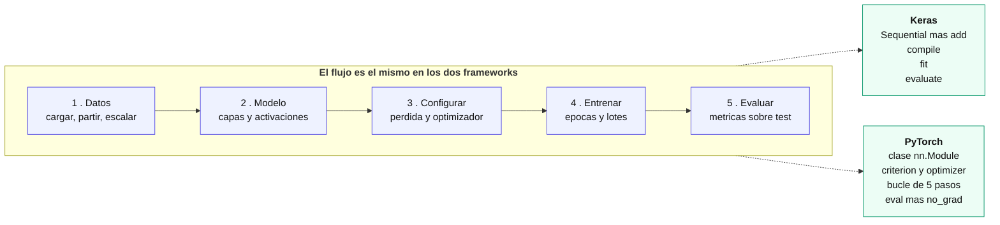

### 39. Por qué hacen falta TensorFlow y PyTorch

`MLPClassifier` alcanza para un MLP sobre datos tabulares y nada más. Lo que no puede hacer:

| Limitación de scikit-learn | Qué habilita un framework |
|---|---|
| Solo capas densas | **Convolucionales** para imágenes, **recurrentes** para secuencias, atención para texto |
| Solo CPU | Entrenamiento en **GPU**, uno o dos órdenes de magnitud más rápido |
| Pérdidas y optimizadores fijos | Funciones de pérdida a medida, optimizadores configurables |
| `fit()` cerrado | Control del bucle: entrenamiento adversario, múltiples modelos, pasos personalizados |
| Sin autograd expuesto | Derivadas automáticas de cualquier expresión |

La pieza común es el **tensor**: un arreglo multidimensional, como un `ndarray` de NumPy, pero con dos capacidades que lo cambian todo — puede vivir en la GPU y registra las operaciones que se le aplican para poder derivarlas después (*autograd*). Sobre esa estructura se apoyan los dos frameworks.

**La diferencia histórica entre ambos** fue cómo construyen el grafo de cómputo:

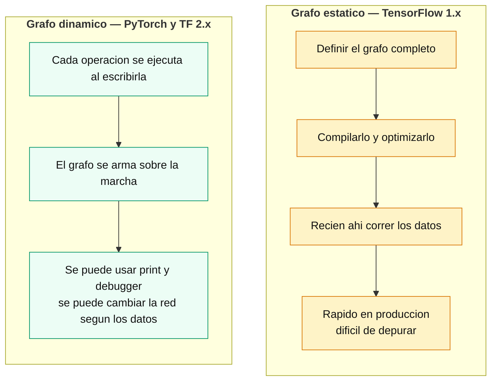

TensorFlow 1.x obligaba a definir el grafo completo antes de correr nada: rápido para producción, incómodo para depurar. PyTorch nació con grafo **dinámico** y eso explica su adopción en investigación. Hoy la distinción se diluyó: **TensorFlow 2.x usa modo dinámico (*eager*) por defecto**, y el grafo estático es opcional con `@tf.function`.

> Ojo con el material del curso, que describe el grafo estático de TF como si fuera la única forma. Corresponde a TensorFlow 1.x.

### 40. TensorFlow y Keras

**TensorFlow** es el framework de Google: flexible, escalable, con un ecosistema grande y herramientas de despliegue en producción. **Keras** es su API de alto nivel — desde TF 2.0 dejó de ser un proyecto externo para integrarse como `tf.keras`, y con Keras 3 volvió a ser multi-backend (TensorFlow, PyTorch o JAX).

En la práctica, escribir TensorFlow es escribir Keras.

```python
from tensorflow.keras import layers, models

# 1. Definir: una pila lineal de capas
model = models.Sequential()
model.add(layers.Dense(64, activation='relu', input_shape=(4,)))
model.add(layers.Dense(128, activation='relu'))
model.add(layers.Dense(3, activation='softmax'))

model.summary()          # arquitectura y cantidad de parametros

# 2. Configurar como se entrena
model.compile(optimizer='adam',
              loss='categorical_crossentropy',
              metrics=['accuracy'])

# 3. Entrenar
history = model.fit(X_train, y_train, epochs=10, batch_size=16,
                    validation_data=(X_test, y_test))

# 4. Evaluar
test_loss, test_acc = model.evaluate(X_test, y_test)
```

**`Sequential` vs API funcional.** `Sequential` es una pila lineal: cada capa recibe la salida de la anterior. Cuando la red tiene varias entradas, varias salidas o conexiones que saltean capas, hace falta la **API funcional**: `Model(inputs, outputs)`.

**Las tres pérdidas de clasificación**, y cuál usar:

| Pérdida | Etiquetas | Cuándo |
|---|---|---|
| `binary_crossentropy` | 0 o 1 | dos clases |
| `categorical_crossentropy` | **one-hot** | multiclase, con `to_categorical` |
| `sparse_categorical_crossentropy` | **enteros** | multiclase, sin convertir |

Las dos últimas son matemáticamente idénticas; cambia solo el formato de entrada.

**`history`** es lo que devuelve `fit`, y guarda la evolución de cada métrica por época en `history.history`, con las claves `loss`, `accuracy`, `val_loss` y `val_accuracy`. Es lo que se grafica para ver si el modelo sobreajusta (cap. 7).

### 41. PyTorch

**PyTorch** es el framework de Meta, abierto en 2017 y bajo la PyTorch Foundation desde 2022. Su marca registrada es el grafo dinámico y un estilo más explícito: nada ocurre por detrás.

Un modelo es una **clase que hereda de `nn.Module`**, con dos métodos:

```python
import torch.nn as nn

class MLP(nn.Module):
    def __init__(self):
        super().__init__()
        self.layer1 = nn.Linear(4, 64)      # las capas
        self.layer2 = nn.Linear(64, 128)
        self.layer3 = nn.Linear(128, 3)

    def forward(self, x):                    # como fluyen los datos
        x = torch.relu(self.layer1(x))
        x = torch.relu(self.layer2(x))
        return self.layer3(x)                # sin activacion final

criterion = nn.CrossEntropyLoss()
optimizer = optim.Adam(model.parameters(), lr=0.001)
```

**Los datos** pasan por dos objetos: `TensorDataset`, que empareja features con etiquetas, y `DataLoader`, que los sirve por lotes con `batch_size` y `shuffle`. Para imágenes, `torchvision` agrega datasets y transformaciones (`ToTensor`, `Resize`, `Normalize`), encadenables con `transforms.Compose`.

**El entrenamiento se escribe a mano**, y ahí está la diferencia visible con Keras:

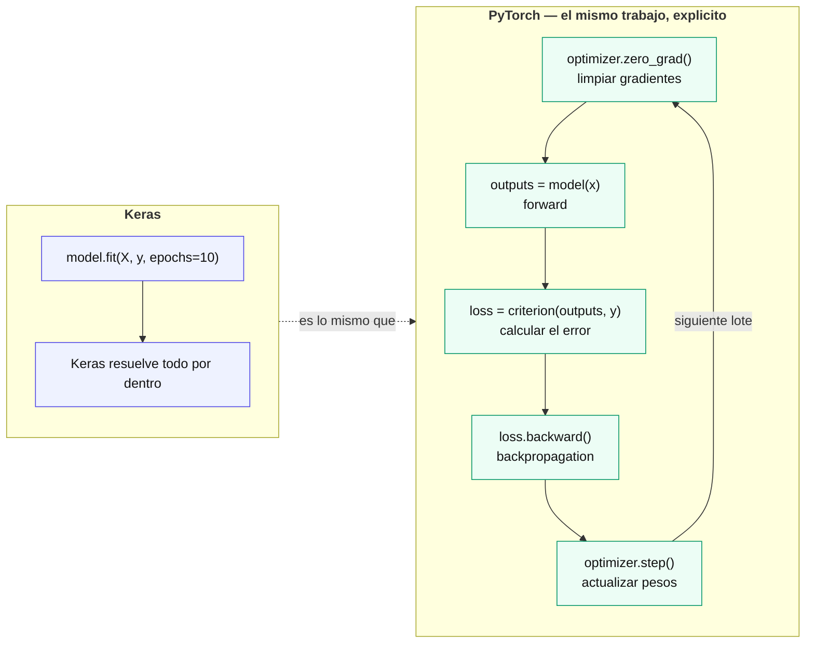

Los cinco pasos, con lo que pasa si falta cada uno:

| Paso | Qué hace | Si falta |
|---|---|---|
| `optimizer.zero_grad()` | Limpia los gradientes | PyTorch los **acumula** entre lotes: el entrenamiento se rompe |
| `outputs = model(x)` | Forward | — |
| `loss = criterion(outputs, y)` | Calcula el error | — |
| `loss.backward()` | Backpropagation (cap. 37) | No hay gradientes que aplicar |
| `optimizer.step()` | Actualiza los pesos | Se calculan gradientes pero **la red nunca aprende** |

Ninguno de los cinco lanza una excepción si se omite: el modelo entrena mal y ya.

**Para evaluar**, tres piezas: `model.eval()` cambia el modo (importa con `Dropout` o `BatchNorm`), `torch.no_grad()` desactiva el registro de gradientes, y `torch.max(outputs, 1)` convierte los logits en la clase predicha quedándose con el índice del máximo.

### 42. Keras y PyTorch lado a lado

Las tres decisiones que **van encadenadas** y que son la fuente de error más común al pasar de un framework al otro:

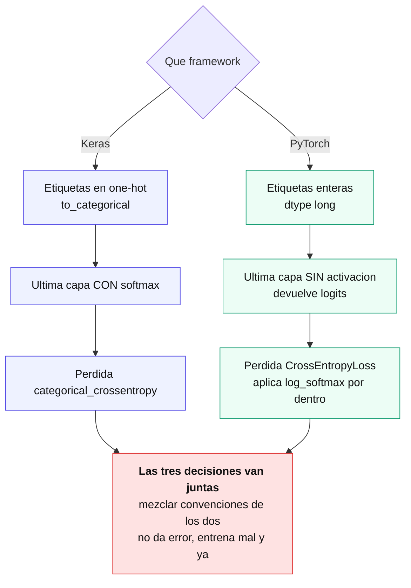

La comparación completa, sobre el mismo problema:

| | Keras | PyTorch |
|---|---|---|
| Definir el modelo | `Sequential()` + `.add()` | clase que hereda de `nn.Module` |
| Etiquetas | one-hot (`to_categorical`) | enteros (`long`) |
| Última capa | **con** `softmax` | **sin** activación (logits) |
| Pérdida | `categorical_crossentropy` | `CrossEntropyLoss` |
| Datos | arrays de NumPy directo | `TensorDataset` + `DataLoader` |
| Entrenar | `model.fit()` | bucle de 5 pasos |
| Métricas por época | automáticas en `history` | hay que acumularlas a mano |
| Ver la arquitectura | `model.summary()` | `torchsummary` / `torchinfo`, aparte |
| Líneas de código | ~15 | ~30 |

> **Nota (verificado en los recursos de clase, Iris con 4 atributos):** la **misma** arquitectura 4 → 64 → 128 → 3 da **9.027 parámetros** en los dos frameworks. Keras llegó a **93,33%** de exactitud y PyTorch a **96,67%** — un acierto de diferencia sobre 30 muestras de test. Ninguno de los dos notebooks fija la semilla de inicialización, así que esa diferencia es ruido, no evidencia de que un framework aprenda mejor.

**Cuál conviene.** Sobre un problema tabular como Iris, ninguno de los dos aporta nada frente a `MLPClassifier`, que lo resuelve en tres líneas. La diferencia aparece después:

- **Keras** es más rápido de escribir y trae resuelto lo repetitivo. Conviene para arquitecturas estándar y para prototipar.
- **PyTorch** obliga a escribir el bucle, y esa verbosidad es lo que permite intervenir en cada paso: pérdidas a medida, entrenamiento adversario, arquitecturas que no son una pila de capas. Es el estándar en investigación.

El curso enseña los dos a propósito, y el resto del módulo —CNNs, RNNs, Transformadores, autoencoders y GANs— los va alternando.

### 43. Redes convolucionales (CNNs)

Una imagen de 32×32 en color son **3.072 valores**; una de 224×224, más de 150.000. Conectar eso a una capa densa da millones de pesos en una sola capa, y además el modelo tendría que aprender cada objeto **en cada posición por separado**, porque un MLP recibe los píxeles como una lista plana sin noción de vecindad.

Las **CNN** resuelven las dos cosas con una idea: aplicar el **mismo filtro** a toda la imagen. Los pesos se reutilizan en cada posición —así que son pocos— y el patrón se detecta esté donde esté.

La red se parte en dos mitades con roles distintos:

```mermaid
flowchart LR
    IM["<b>Imagen</b><br/>32x32x3<br/>3.072 valores"]
    subgraph EXT["<b>Extraccion de caracteristicas</b> &mdash; aprende QUE mirar"]
        direction LR
        C1["conv 32 filtros<br/>+ pool"] --> C2["conv 64 filtros<br/>+ pool"]
        C2 --> C3["conv 128 filtros<br/>+ pool"]
    end
    FL["<b>Aplanamiento</b><br/>128 x 4 x 4 = 2.048"]
    subgraph CLA["<b>Clasificacion</b> &mdash; el MLP de siempre"]
        direction LR
        D1["densa 512"] --> D2["densa 256"] --> D3["densa 10"]
    end
    OUT["<b>softmax</b><br/>una probabilidad<br/>por clase"]
    IM --> EXT --> FL --> CLA --> OUT
    classDef img fill:#fef3c7,stroke:#d97706,color:#111
    classDef conv fill:#ecfdf5,stroke:#059669,color:#111
    classDef dense fill:#eef2ff,stroke:#4f46e5,color:#111
    class IM,OUT img
    class C1,C2,C3,FL conv
    class D1,D2,D3 dense
```

La primera mitad **aprende qué mirar**; la segunda **decide**, y es exactamente el MLP del capítulo 30. Lo nuevo es todo lo que pasa antes.

### 44. La capa convolucional

Un **filtro** (o *kernel*) es una matriz chica de pesos que se desliza sobre la imagen. En cada posición se multiplica elemento a elemento con la región que tiene debajo y se suma todo en un único valor. El resultado de recorrer la imagen entera es un **mapa de características**.

El ejemplo del curso, con una imagen de 4×4 y un filtro de 3×3 detector de bordes verticales:

| Filtro | | |
|---|---|---|
| 1 | 0 | −1 |
| 1 | 0 | −1 |
| 1 | 0 | −1 |

Ese filtro resta la columna derecha de la izquierda: da valores altos donde hay un cambio brusco de intensidad y cerca de cero donde la región es uniforme. **Los pesos del filtro no se diseñan a mano: se aprenden durante el entrenamiento**, igual que cualquier otro peso de la red.

**Los tres parámetros que controlan la operación:**

| Parámetro | Qué hace |
|---|---|
| **Kernel** (`K`) | tamaño de la ventana, típicamente 3×3 |
| **Stride** (`S`) | cuántos píxeles se desplaza por paso |
| **Padding** (`P`) | borde de ceros que se agrega alrededor |

El padding tiene tres variantes: **valid** (ninguno, la salida se achica), **same** (el justo para conservar el tamaño) y **full** (la salida crece).

**La fórmula que resume todo**, y que conviene tener a mano:

```
tamaño_salida = (W − K + 2P) / S + 1
```

> **Nota (verificado contra los notebooks del curso):** `Conv2d(kernel_size=3, padding=1)` con stride 1 sobre una entrada de 32×32 da `(32 − 3 + 2)/1 + 1 = 32` — **conserva el tamaño**. Es la razón por la que en la CNN del curso el tamaño va 32 → 16 → 8 → 4: las convoluciones no achican nada, **el que divide por dos es el pooling**.

**Cuántos pesos tiene un filtro:** `kernel × kernel × canales_de_entrada + 1` (el sesgo). Para la primera capa de la CNN del curso: 3×3×3+1 = 28 por filtro, por 32 filtros = **896 parámetros**, que es exactamente lo que reporta el `summary`.

### 45. Agrupamiento, aplanamiento y capas densas

**El agrupamiento** (*pooling*) reduce el tamaño espacial tomando un valor por ventana. Con `MaxPool2d(2, 2)` cada ventana de 2×2 se reemplaza por su máximo, así que alto y ancho se dividen por dos.

| | Qué conserva |
|---|---|
| **Max pooling** | la activación **más fuerte** de la región: si el filtro detectó un rasgo, sobrevive |
| **Average pooling** | el promedio, que **diluye** el rasgo entre los valores vecinos |

Por eso el max pooling es el habitual en clasificación. Y algo que conviene notar: **el pooling no tiene parámetros**. Es una operación fija, no algo que se aprenda.

El recorrido completo de tamaños, que es donde se traba todo el mundo la primera vez:

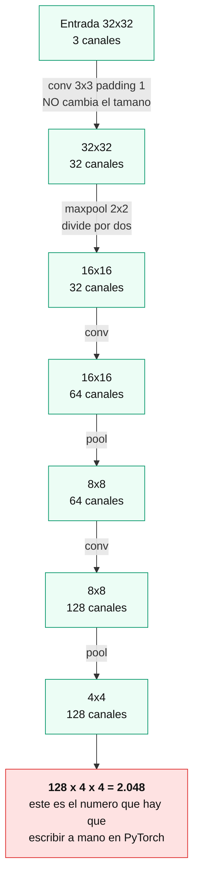

**El aplanamiento** (*flattening*) convierte los mapas en un vector para que puedan entrar a las capas densas. En Keras es `Flatten()` y lo calcula solo; en PyTorch hay que escribir `x.view(-1, 128*4*4)` **a mano**, y recalcularlo si cambia la arquitectura. Es el error más frecuente al armar una CNN en PyTorch, y falla sin dar un mensaje claro.

**Dónde terminan los parámetros**, medido sobre la CNN del curso (1.276.234 en total):

| Bloque | Parámetros | % |
|---|---:|---:|
| Las 3 convoluciones | 93.248 | 7% |
| Las 3 densas | 1.182.986 | **93%** |
| — solo la primera densa | 1.049.088 | **82%** |

**Es el argumento entero de las CNNs en un número.** Un filtro de 3×3 tiene 9 pesos que se reutilizan sobre toda la imagen; una capa densa necesita un peso por cada conexión. Las convoluciones hacen el trabajo pesado con el 7% de los parámetros.

> **Nota (verificado en los notebooks, CIFAR-10, 2 épocas):** la misma arquitectura da **1.276.234 parámetros** en PyTorch y en Keras — la cantidad depende de la arquitectura, no del framework. Las exactitudes fueron 58,85% y 63,03%, pero la diferencia viene del optimizador (SGD con momentum contra Adam) y de la normalización ([−1, 1] contra [0, 1]), no del framework. La exactitud por clase va de **76,9%** en avión a **38,7%** en ciervo: los objetos artificiales tienen formas rígidas y fondos característicos, los animales aparecen en poses variadas y se parecen entre sí en 32×32 píxeles.

### 46. Transfer learning: reutilizar una red ya entrenada

> **Fuera del programa del curso, pero de uso constante en la práctica:** entrenar una CNN desde cero como la del capítulo 45 requiere miles de imágenes por clase. La mayoría de los proyectos reales no las tiene. **Transfer learning** es la respuesta: partir de una red ya entrenada sobre un dataset enorme (típicamente ImageNet, 1,2 millones de imágenes y 1.000 clases) y adaptarla al problema propio con una fracción de los datos y del tiempo de entrenamiento.

**Por qué funciona.** La mitad de extracción de características del capítulo 43 aprende, capa tras capa, una jerarquía de patrones cada vez más específicos:

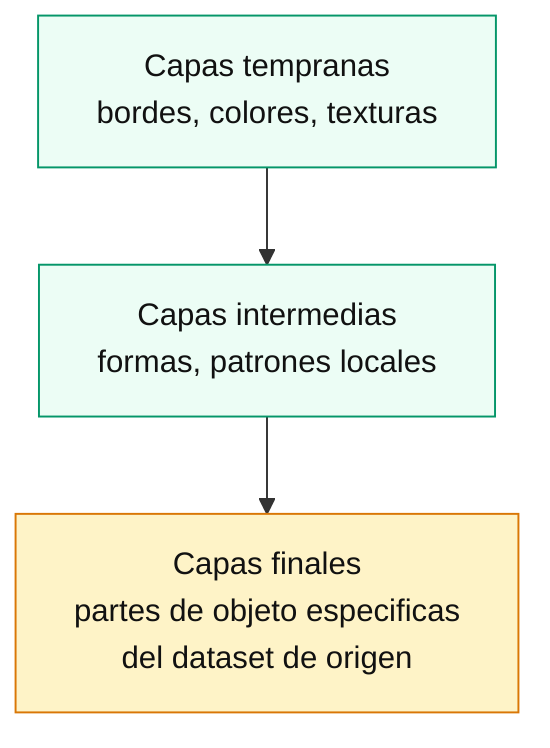

Los bordes y las texturas que detectan las primeras capas no son propios de "gatos" o "autos": son **genéricos**, aparecen en cualquier imagen natural. Lo específico del dataset de origen se concentra en las últimas capas convolucionales y, sobre todo, en el clasificador denso final. Esa jerarquía es la que permite reaprovechar la red: lo genérico sirve tal cual, lo específico hay que reemplazarlo o reajustarlo.

**Las dos estrategias.**

| | Feature extraction | Fine-tuning |
|---|---|---|
| Qué se congela | toda la base convolucional | solo las primeras capas (o nada) |
| Qué se entrena | únicamente el clasificador nuevo | clasificador nuevo + parte de la base |
| Cuándo conviene | dataset propio chico, parecido al de origen | dataset propio grande, o distinto al de origen |
| Riesgo | ninguno (los pesos preentrenados no se tocan) | sobreajuste u "olvido" de lo aprendido, si se hace mal |

**Feature extraction** trata la red preentrenada como un extractor de vectores fijo: se le saca el clasificador original, se **congelan** todos los pesos de la base (`layer.trainable = False` en Keras; en PyTorch, `param.requires_grad = False` en cada parámetro) y se apila un clasificador nuevo y chico —una o dos capas densas terminadas en la cantidad de clases del problema propio— que es lo único que se entrena.

```python
# Keras
from tensorflow import keras

base = keras.applications.ResNet50(weights='imagenet', include_top=False, input_shape=(224, 224, 3))
base.trainable = False                                # congela toda la base

modelo = keras.Sequential([
    base,
    keras.layers.GlobalAveragePooling2D(),
    keras.layers.Dense(128, activation='relu'),
    keras.layers.Dense(n_clases, activation='softmax'),
])
modelo.compile(optimizer='adam', loss='sparse_categorical_crossentropy', metrics=['accuracy'])
```

```python
# PyTorch / torchvision — el equivalente conceptual
import torch
from torchvision import models

base = models.resnet50(weights='IMAGENET1K_V2')
for param in base.parameters():
    param.requires_grad = False                        # congela toda la base

base.fc = torch.nn.Sequential(                          # reemplaza el clasificador final
    torch.nn.Linear(base.fc.in_features, 128),
    torch.nn.ReLU(),
    torch.nn.Linear(128, n_clases),
)
# solo base.fc tiene requires_grad=True: el optimizador solo actualiza esos pesos
optimizer = torch.optim.Adam(base.fc.parameters(), lr=1e-3)
```

**Fine-tuning** va un paso más allá: después de entrenar el clasificador nuevo (o desde el arranque, según el caso), se **descongelan** las últimas capas convolucionales de la base y se siguen entrenando junto con el clasificador, para que la red ajuste sus patrones más específicos al dominio propio.

Dos cuidados que no son opcionales:

- **Learning rate bajo al descongelar.** La base trae pesos ya afinados sobre millones de imágenes; un learning rate normal (el que se usaría entrenando desde cero) los destruye en pocos pasos —es el fenómeno de "olvido catastrófico". La práctica estándar es descongelar y seguir entrenando con un learning rate **10 a 100 veces menor** que el usado para el clasificador nuevo.
- **BatchNorm en modo inferencia durante el fine-tuning.** Las capas de `BatchNorm` (normalización por lotes) mantienen estadísticas (media y varianza) acumuladas durante el preentrenamiento sobre un dataset enorme. Si se descongelan y se dejan en modo entrenamiento, esas estadísticas se recalculan con los lotes —mucho más chicos— del dataset propio, y se degradan. La recomendación es descongelar las capas convolucionales pero mantener las de `BatchNorm` en modo evaluación (`training=False` en Keras al llamar a la base; en PyTorch, iterar los módulos y llamar `.eval()` en cada `BatchNorm2d`, o directamente congelar sus parámetros).

```python
# Keras: descongelar solo el último bloque, manteniendo BatchNorm en inferencia
base.trainable = True
for layer in base.layers[:-30]:
    layer.trainable = False

modelo.compile(optimizer=keras.optimizers.Adam(learning_rate=1e-5),   # LR bajo
                loss='sparse_categorical_crossentropy', metrics=['accuracy'])
# Nota: al reentrenar, Keras respeta layer.trainable también para BatchNorm,
# así que las capas congeladas no actualizan ni sus pesos ni sus estadisticas.
```

```python
# PyTorch: descongelar el último bloque, BatchNorm fijo
for name, param in base.named_parameters():
    if "layer4" in name:                      # último bloque residual de ResNet
        param.requires_grad = True

for module in base.modules():
    if isinstance(module, torch.nn.BatchNorm2d):
        module.eval()                          # usa las estadísticas acumuladas, no las recalcula
        for p in module.parameters():
            p.requires_grad = False

optimizer = torch.optim.Adam([
    {'params': base.layer4.parameters(), 'lr': 1e-5},   # LR bajo para la parte descongelada
    {'params': base.fc.parameters(), 'lr': 1e-3},
])
```

El flujo habitual combina las dos estrategias en dos etapas: primero **feature extraction** (toda la base congelada) hasta que el clasificador nuevo converge, y recién después **fine-tuning** con learning rate bajo sobre las últimas capas.

### 47. Data augmentation: más datos sin salir a buscarlos

> **También fuera del programa, y también inevitable en la práctica**, sobre todo combinado con transfer learning: cuantos menos datos propios hay, más rinde generar variaciones artificiales de los que sí se tienen.

La idea es simple: aplicar transformaciones aleatorias a cada imagen de entrenamiento —que no cambian su clase— para que el modelo vea una versión distinta en cada época. Es una forma de regularización (capítulo 36): en vez de que la red memorice los píxeles exactos de las 500 fotos de entrenamiento, la obliga a aprender el patrón que sobrevive a rotar, recortar o cambiar el brillo de esa foto.

**Transformaciones típicas para imágenes:**

| Transformación | Qué simula |
|---|---|
| Flip horizontal | el objeto puede aparecer espejado |
| Rotación (unos grados) | la cámara no está perfectamente alineada |
| Zoom / recorte aleatorio | el objeto no siempre ocupa el mismo espacio del cuadro |
| Traslación | el objeto no está centrado |
| Cambios de brillo/contraste | condiciones de luz distintas |

Qué transformaciones aplicar depende del dominio: un flip horizontal tiene sentido para fotos de animales, pero **no** para dígitos manuscritos (un 6 espejado no es un 6) ni para radiografías donde la orientación es diagnóstica. Data augmentation no es "aplicar todo lo disponible": es elegir qué invarianzas tiene sentido enseñarle a la red.

**Dos formas de aplicarlo, con una diferencia práctica importante.**

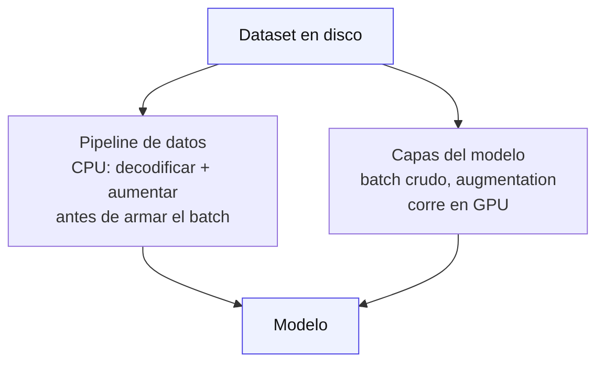

- **Como parte del pipeline de datos** (`ImageDataGenerator` histórico de Keras, o transforms de `torchvision`): la transformación se aplica en CPU al leer cada imagen, antes de que llegue al modelo.
- **Como capas dentro del modelo** (`tf.keras.layers.RandomFlip`, `RandomRotation`, etc., o `torch.nn.Sequential` con transforms de `torchvision.transforms.v2` aplicados dentro del `forward`): la transformación se ejecuta en GPU junto con el resto del forward pass, lo que suele ser más rápido porque evita el cuello de botella de CPU.

```python
# Keras: augmentation como capas del modelo
from tensorflow import keras

aumento = keras.Sequential([
    keras.layers.RandomFlip('horizontal'),
    keras.layers.RandomRotation(0.1),
    keras.layers.RandomZoom(0.1),
])

modelo = keras.Sequential([
    aumento,                 # solo activa en modo entrenamiento
    base,
    keras.layers.GlobalAveragePooling2D(),
    keras.layers.Dense(n_clases, activation='softmax'),
])
```

```python
# PyTorch / torchvision — el equivalente conceptual, en el pipeline de datos
from torchvision import transforms

transform_train = transforms.Compose([
    transforms.RandomHorizontalFlip(),
    transforms.RandomRotation(10),
    transforms.RandomResizedCrop(224, scale=(0.9, 1.0)),
    transforms.ToTensor(),
])

transform_test = transforms.Compose([
    transforms.Resize(224),
    transforms.ToTensor(),                # sin augmentation
])
```

**Por qué solo se aplica a `train`.** El objetivo de augmentation es que el modelo generalice mejor, no que el conjunto de validación/test sea más difícil de acertar. Evaluar con imágenes rotadas o recortadas mide una tarea distinta a la real y hace que la métrica de test deje de ser comparable entre corridas. Tanto las capas de Keras (`RandomFlip` y compañía) como los módulos de `torchvision` respetan esto de forma distinta: las capas de Keras se desactivan solas en `model.evaluate()`/`model.predict()` porque saben si están en modo entrenamiento o inferencia (igual que `Dropout`, capítulo 36); en PyTorch no hay nada automático — es responsabilidad de quien escribe el código definir `transform_train` y `transform_test` por separado y aplicar cada uno al `Dataset` que corresponde.

### 48. Redes recurrentes (RNNs)

Una CNN explota la estructura **espacial** —píxeles vecinos tienen que ver entre sí—. Una **RNN** explota la estructura **temporal**: cada paso de una secuencia depende de los anteriores. Las dos son formas de meterle al modelo una suposición sobre la forma de los datos, en lugar de tratar todo como un vector plano.

**La idea central es el estado oculto.** La red mantiene un vector `h` que se pasa de un paso al siguiente, así que la salida no depende solo de la entrada actual sino de todo lo visto antes. Eso le permite procesar secuencias de **largo variable** con la misma cantidad de pesos.

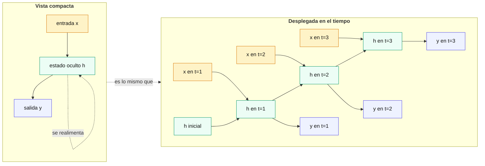

Las dos vistas son el mismo objeto: la compacta tiene un bucle, la desplegada lo estira en el tiempo. **Los pesos son los mismos en todos los pasos** — no hay un juego de parámetros por instante.

Las ecuaciones de la celda básica:

```
a_t = V·h_{t-1} + U·x_t + b        # combina el estado previo con la entrada actual
h_t = tanh(a_t)                    # nuevo estado oculto
o_t = softmax(c + W·h_t)           # salida
```

**Por qué `tanh` y no ReLU.** El estado oculto se realimenta en cada paso, así que se multiplica por los mismos pesos una y otra vez. Con una activación no acotada como ReLU los valores pueden **explotar** al cabo de varios pasos; `tanh` los mantiene en (−1, 1).

**El problema que define el tema.** Al retropropagar a través de muchos pasos temporales, el gradiente se multiplica una vez por paso — el mismo mecanismo del cap. 37, ahora en el eje del tiempo. Con derivadas menores a 1 el gradiente **se apaga** antes de llegar a los primeros pasos, así que la red no aprende dependencias largas: no relaciona el final de un párrafo con su comienzo.

#### Los cuatro tipos, según la forma de entrada y salida

Lo que hace versátil a la arquitectura es que la secuencia puede estar en la entrada, en la salida, o en las dos:

| Tipo | Forma | Ejemplo |
|---|---|---|
| **Uno a uno** | una entrada, una salida | no es realmente recurrente: es una red común |
| **Uno a muchos** | una entrada, secuencia de salida | describir una imagen con una frase (*image captioning*) |
| **Muchos a uno** | secuencia de entrada, una salida | clasificar el sentimiento de una reseña |
| **Muchos a muchos, mismo largo** | secuencia a secuencia alineada | etiquetar cada palabra de una oración |
| **Muchos a muchos, distinto largo** | secuencia a secuencia libre | traducción automática |

El último caso —cuando la entrada y la salida tienen largos distintos— necesita una estructura **encoder-decoder**: una red lee toda la secuencia y la comprime en un vector, otra la genera desde ahí. Es lo que desarrolla la Clase 22 del programa, y el punto de partida de los Transformadores.

#### La activación y el problema de la escala

Además de `tanh` en el estado oculto, la salida usa **softmax** cuando hay que elegir entre clases. Y como el estado se realimenta, existe el problema simétrico al gradiente desvaneciente: el **gradiente explosivo**, cuando los valores crecen sin control. La solución habitual es el ***gradient clipping***: recortar el gradiente cuando su norma supera un umbral, antes de aplicar la actualización.

Eso es exactamente lo que viene a resolver la **GRU**, que es el capítulo siguiente.

### 49. GRU: unidades recurrentes con compuertas

La RNN simple tiene un problema estructural: **en cada paso reescribe el estado oculto por completo**. Al retropropagar, el gradiente se multiplica una vez por paso y se apaga antes de llegar lejos, así que la red no aprende dependencias largas (cap. 46).

La **GRU** (*Gated Recurrent Unit*) lo resuelve con una idea simple: en lugar de reescribir el estado entero, dejar que la red **decida cuánto conservar y cuánto actualizar**.

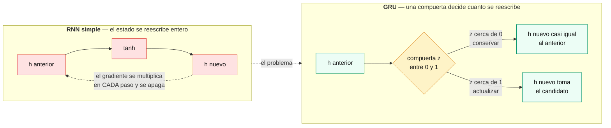

#### Qué es una compuerta

Una **compuerta** es un vector de valores entre 0 y 1, producido por una **sigmoide**, que se multiplica elemento a elemento con otro vector. Funciona como una válvula: en 0 no deja pasar nada, en 1 deja pasar todo, y en el medio filtra parcialmente.

Lo importante es que **esos valores se aprenden**. La red aprende *cuándo* conviene recordar y cuándo olvidar, en lugar de tener una regla fija.

La GRU tiene dos:

| Compuerta | Símbolo | Qué decide |
|---|---|---|
| **Reinicio** (*reset*) | `r` | cuánto del pasado **ignorar** al calcular el candidato de estado nuevo |
| **Actualización** (*update*) | `z` | cuánto del estado viejo **conservar** frente al candidato nuevo |

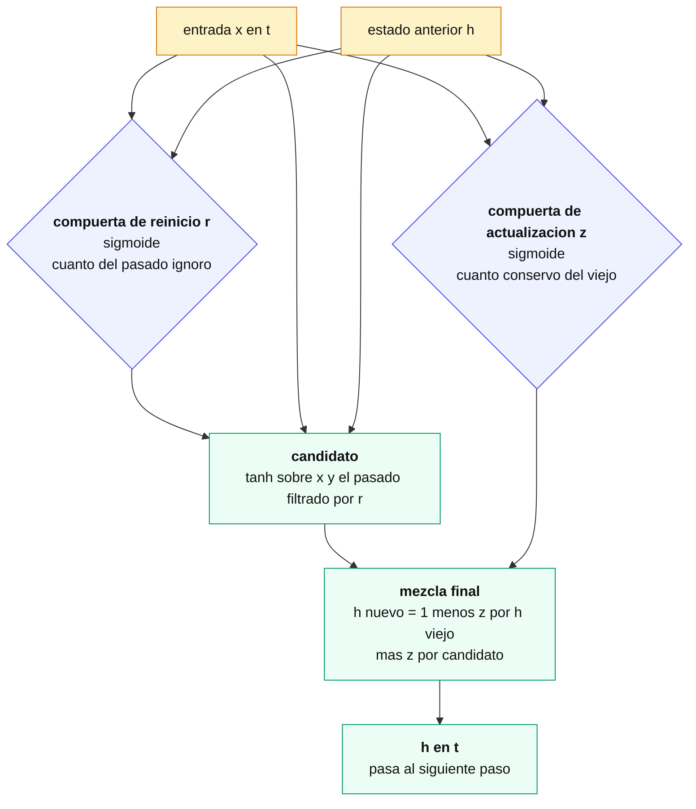

Las ecuaciones, en el orden en que se calculan:

```
r_t = σ(W_r · [h_{t-1}, x_t])            # cuanto del pasado ignoro
z_t = σ(W_z · [h_{t-1}, x_t])            # cuanto conservo
h̃_t = tanh(W · [r_t * h_{t-1}, x_t])     # candidato, con el pasado ya filtrado por r
h_t = (1 − z_t) * h_{t-1} + z_t * h̃_t    # mezcla final
```

La última línea es el corazón del mecanismo. Si `z_t ≈ 0`, el estado nuevo es **casi idéntico** al anterior: la información se conserva intacta a través del paso. Si `z_t ≈ 1`, se reemplaza por el candidato.

#### Por qué esto arregla el gradiente

Cuando `z_t` es chico, `h_t ≈ h_{t-1}`, y esa relación de casi-identidad crea un **camino directo** para que el gradiente fluya hacia atrás **sin multiplicarse por derivadas menores a uno en cada paso**. La red puede aprender a dejar esa vía abierta durante muchos pasos y así conectar el final de una secuencia con su comienzo.

Es la misma idea que las **conexiones residuales** de las redes profundas: dar al gradiente una ruta que lo saltee todo.

#### GRU frente a LSTM

| | **GRU** | **LSTM** |
|---|---|---|
| Compuertas | 2 (reinicio, actualización) | 3 (olvido, entrada, salida) |
| Estado | solo `h` | `h` **más** un estado de celda `c` separado |
| Parámetros | menos | más (~33% más) |
| Velocidad | entrena más rápido | más lenta |
| Rendimiento | equivalente en la mayoría de los casos | suele ganar en secuencias muy largas |

No hay un ganador universal. La recomendación práctica es **empezar por GRU** —menos parámetros, entrena más rápido— y probar LSTM si las dependencias son muy largas.

```python
import torch.nn as nn

gru = nn.GRU(input_size=10, hidden_size=64, num_layers=2, batch_first=True)
lstm = nn.LSTM(input_size=10, hidden_size=64, num_layers=2, batch_first=True)

# En Keras es igual de directo
# layers.GRU(64, return_sequences=True)
# layers.LSTM(64)
```

> **Nota (inconsistencia en el material):** la tabla de ecuaciones de la slide del curso **omite el `r_t` multiplicando a `h_{t-1}`** dentro del cálculo del candidato, aunque el diagrama de la misma slide sí lo muestra. Sin esa multiplicación, la compuerta de reinicio no cumpliría ninguna función. La versión correcta es la de arriba. La slide además escribe `x̄_t` con barra en la ecuación de `z_t`, que parece un error tipográfico.

### 50. LSTM: memoria a largo plazo

La **LSTM** (*Long Short-Term Memory*) ataca el mismo problema que la GRU —el gradiente que se apaga al retropropagar en el tiempo— con más maquinaria. Es **anterior**: la propusieron Hochreiter y Schmidhuber en **1997**, casi veinte años antes que la GRU (2014), aunque el curso la presente después.

**Su diferencia estructural es tener dos estados separados**, donde la GRU tiene uno:

| Estado | Rol |
|---|---|
| **`c`** — estado de celda | la **memoria de largo plazo**. Fluye a lo largo de la secuencia con modificaciones mínimas |
| **`h`** — estado oculto | lo que la celda **expone hacia afuera** en cada paso |

El estado de celda es lo que le da el nombre a la red. Funciona como una **cinta transportadora**: la información puede viajar muchos pasos casi sin tocarse, y por esa vía el gradiente llega hasta el principio de la secuencia sin apagarse. Es el mismo mecanismo que en GRU logra la compuerta de actualización cuando `z` es chico (cap. 47), pero con un canal dedicado.

#### Las tres compuertas

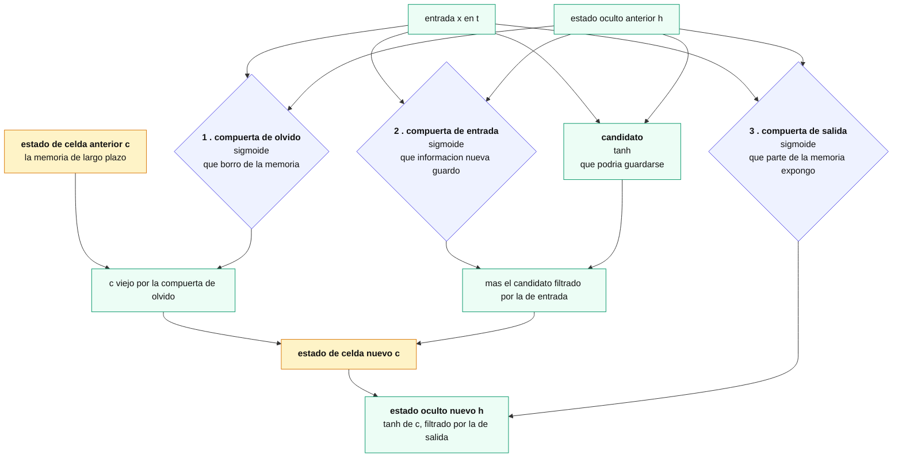

| Compuerta | Decide |
|---|---|
| **Olvido** (*forget*) | qué se **borra** del estado de celda |
| **Entrada** (*input*) | qué información nueva se **guarda** |
| **Salida** (*output*) | qué parte del estado de celda se **expone** como estado oculto |

Las tres son sigmoides, o sea vectores entre 0 y 1 que se multiplican elemento a elemento, y sus valores **se aprenden**. La red aprende cuándo conviene recordar, cuándo olvidar y cuánto mostrar.

Las ecuaciones, en el orden en que se calculan:

```
f_t = σ(W_f · [h_{t-1}, x_t])        # olvido
i_t = σ(W_i · [h_{t-1}, x_t])        # entrada
g_t = tanh(W_g · [h_{t-1}, x_t])     # candidato
o_t = σ(W_o · [h_{t-1}, x_t])        # salida

c_t = f_t * c_{t-1} + i_t * g_t      # la memoria: se borra un poco y se agrega un poco
h_t = o_t * tanh(c_t)                # lo que se expone
```

La línea de `c_t` es el corazón: **el estado viejo se multiplica por la compuerta de olvido y se le suma el candidato filtrado por la de entrada**. Si `f_t ≈ 1` e `i_t ≈ 0`, la memoria pasa intacta.

#### Las tres celdas, lado a lado

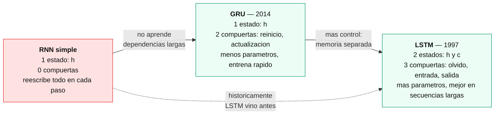

| | RNN simple | GRU | LSTM |
|---|---|---|---|
| Estados | `h` | `h` | **`h` y `c`** |
| Compuertas | ninguna | 2 | 3 |
| Parámetros | pocos | intermedio | más (~33% sobre GRU) |
| Dependencias largas | no aprende | bien | **mejor** |
| Velocidad | la más rápida | rápida | la más lenta |

**Cuál elegir.** En la práctica GRU y LSTM rinden parecido en la mayoría de las tareas. La recomendación es empezar por **GRU** —menos parámetros, entrena más rápido— y probar LSTM si las secuencias son muy largas o el resultado no alcanza.

> **Nota (inconsistencia del material):** el diagrama de la slide numera las compuertas (2), (1), (3) sin seguir el orden espacial ni el de cómputo, y la lista de ecuaciones las presenta en un cuarto orden distinto. Las fórmulas en sí son correctas — a diferencia de la slide de GRU, donde faltaba un término.

### 51. RNNs en la práctica: trabajar con texto

Los notebooks de las Clases 18 y 19 resuelven el mismo problema —clasificar el sentimiento de reseñas de IMDb— en los dos frameworks, y traen los tres pasos propios del texto que no aparecían con tablas ni imágenes.

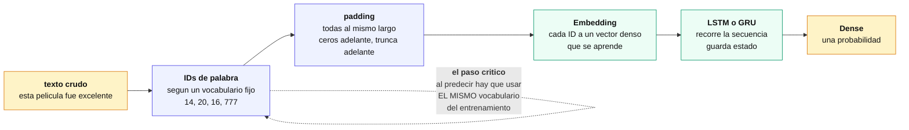

#### 1. De texto a números

Una red no procesa palabras: procesa números. Hace falta un **vocabulario** que asigne un entero a cada palabra, típicamente **ordenado por frecuencia** y recortado a las N más comunes.

IMDb viene con eso resuelto: `load_data(num_words=10000)` devuelve las reseñas ya como listas de enteros.

> **El detalle que rompe todo:** ese vocabulario es **parte del modelo**. Al predecir sobre texto nuevo hay que usar exactamente el mismo, o los números que entran significan otras palabras.

#### 2. Padding: emparejar los largos

Las secuencias tienen largos distintos y la red necesita entradas uniformes. `pad_sequences(maxlen=N)` rellena las cortas y trunca las largas — por defecto **por adelante** en ambos casos.

Que el relleno vaya adelante no es casual: así lo último que la red procesa es el final real del texto, no una fila de ceros.

**`maxlen` es un hiperparámetro con consecuencias grandes.** Truncar a 50 tokens conserva solo las últimas 50 palabras de cada reseña.

> **Nota (verificado en los notebooks del curso):** las dos versiones del mismo problema difieren en `max_len` — **1.000** en TensorFlow contra **50** en PyTorch — y sus exactitudes son **86,64%** y **74,65%**. Los doce puntos salen mayormente de ese recorte, no del framework. (El notebook de PyTorch además tiene el output de una sola época pese a pedir 20 en el código.)

#### 3. Embeddings

La capa **`Embedding`** convierte cada ID en un **vector denso** que se aprende durante el entrenamiento. Es la alternativa al *one-hot*: con 10.000 palabras, one-hot da vectores de 10.000 posiciones casi todas en cero; un embedding de 128 dimensiones las representa con 128 números que además **codifican similitud** — palabras que aparecen en contextos parecidos terminan cerca en ese espacio.

```python
# Keras
model.add(Embedding(10000, 128))
model.add(LSTM(128))                       # return_sequences=False: solo el estado final
model.add(Dense(1, activation='sigmoid'))

# PyTorch
self.embedding = nn.Embedding(vocab_size, 100)
self.lstm = nn.LSTM(100, 128, num_layers=2, batch_first=True)
# ...
lstm_out, (hidden, cell) = self.lstm(embedded)
hidden = hidden[-1, :, :]                  # el estado de la ultima capa apilada
```

**Dos detalles de PyTorch que cuestan:** `batch_first=True` cambia el orden de las dimensiones a `(lote, tiempo, features)` —el default es `(tiempo, lote, features)`—, y la LSTM devuelve **los dos estados** (`hidden` y `cell`), a diferencia de una GRU que devuelve uno solo.

#### El error silencioso que hay que conocer

> **Nota (verificado ejecutando el recurso de clase):** el notebook de TensorFlow, al predecir sobre frases nuevas, crea un **`Tokenizer` nuevo ajustado solo con esas frases** en lugar de usar el vocabulario de IMDb. El resultado: al modelo le entran los IDs `[1, 2, 3, 4]` donde correspondería `[14, 20, 16, 777]`. La palabra *"fantastic"* es el **4** para el tokenizer nuevo y el **777** para el modelo.
>
> Dos de las tres predicciones salen invertidas —dice que *"worst mistake of my life"* es positiva— **en un modelo con 86,6% de exactitud**. Y no lanza ninguna excepción: corre, imprime con formato prolijo y cuatro decimales, y todo parece funcionar.

Es el mismo patrón que persistir un modelo sin su escalador (cap. 38), y deja una regla general:

**Toda transformación aprendida de los datos —tokenizer, escalador, encoder, vocabulario— es parte del modelo. Se guarda con él y se reusa idéntica al predecir.**

### 52. Procesamiento de lenguaje natural

El **PLN** es la rama del aprendizaje automático que busca que las computadoras comprendan y manipulen el lenguaje humano. Es uno de los campos que más se desarrolló en los últimos años, y el cap. 49 ya mostró su pieza central: los **embeddings**.

Antes de los embeddings hay un paso previo que decide mucho: **cómo se parte el texto**.

#### Tokenización: las tres estrategias

| Estrategia | Vocabulario | Secuencias | Problema |
|---|---|---|---|
| **Por palabra** | enorme (100.000+) | cortas | toda palabra no vista es `<UNK>`; "correr" y "corriendo" son símbolos sin relación |
| **Por carácter** | mínimo (~100) | larguísimas | el modelo tiene que aprender qué es una palabra desde cero |
| **Por subpalabra** | intermedio (~30.000) | intermedias | — |

La **subpalabra** es lo que usan todos los modelos modernos. Algoritmos como **BPE** (*Byte Pair Encoding*) y **WordPiece** parten de caracteres y van fusionando los pares más frecuentes hasta llegar al tamaño de vocabulario deseado. El resultado: las palabras comunes quedan enteras y las raras se parten en piezas conocidas — `tokenización` puede quedar como `token` + `##ización`.

Eso resuelve el problema del **fuera de vocabulario** (OOV): ya no hace falta un `<UNK>` que descarta información, porque cualquier palabra nueva se puede armar con piezas.

#### Embeddings: estáticos y contextuales

Un **embedding** es un vector denso que representa una palabra, y la distancia entre vectores captura similitud de significado.

| Tipo | Ejemplos | Característica |
|---|---|---|
| **Estáticos** | Word2Vec, GloVe | una palabra, **un** vector, siempre el mismo |
| **Contextuales** | BERT, GPT | una palabra, **un vector distinto según el contexto** |

La diferencia se ve en una frase: en *"el banco de la plaza"* y *"el banco me cobró comisión"*, un embedding estático le da a "banco" exactamente el mismo vector. Uno contextual le da dos vectores distintos, porque mira las palabras que la rodean.

Esa es, en una línea, la razón de ser de los Transformadores.

### 53. Seq2Seq y el problema del cuello de botella

Una RNN sola no resuelve el caso donde **la entrada y la salida tienen largos distintos** — traducir una frase de 8 palabras a uno de 12, por ejemplo. Es el cuarto tipo de RNN del cap. 46, y necesita una estructura propia.

**Seq2Seq** la resuelve con dos redes:

- El **encoder** lee toda la entrada y la comprime en un **vector de contexto**.
- El **decoder** genera la salida a partir de ese vector, token por token.

```
h_t = f(x_t, h_{t-1})              # encoder: acumula la entrada
s_t = g(y_{t-1}, s_{t-1}, C)       # decoder: genera usando el contexto C
```

Durante el entrenamiento se usa **teacher forcing**: en lugar de alimentar al decoder con lo que él mismo predijo —que al principio es ruido—, se le da la palabra correcta del ejemplo. Acelera la convergencia, a costa de una diferencia entre cómo se entrena y cómo se usa después.

#### El cuello de botella

**Todo lo que el decoder sabe de la entrada está en un único vector de tamaño fijo.** Con una frase de cinco palabras alcanza; con un párrafo de cincuenta, no. La información del principio se diluye antes de llegar al final.

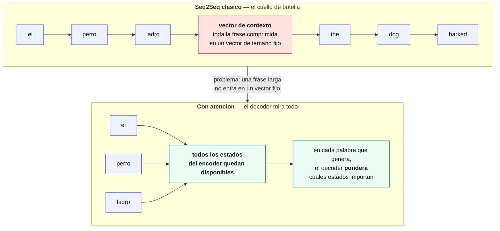

### 54. Mecanismos de atención

La **atención** elimina ese cuello de botella con una idea directa: en vez de comprimir todo en un vector, **conservar todos los estados del encoder** y dejar que el decoder decida, en cada palabra que genera, cuáles mirar.

El mecanismo, en tres pasos:

1. **Scores** — se compara el estado actual del decoder contra cada estado del encoder.
2. **Softmax** — esos scores se normalizan en pesos que suman 1.
3. **Contexto dinámico** — se promedian los estados del encoder ponderados por esos pesos.

La diferencia con seq2seq es que ahora el contexto **cambia en cada paso** de la generación: al traducir "gato" el modelo mira la palabra "cat"; al traducir "negro", mira "black".

**Y hay un beneficio extra: interpretabilidad.** Los pesos de atención se pueden graficar, y muestran a qué parte de la entrada miró el modelo para producir cada parte de la salida. Es una ventana poco común en deep learning, donde casi todo es opaco.

### 55. Transformadores

El paso siguiente fue radical: **si la atención resuelve el problema, ¿hace falta la recurrencia?** La respuesta —el paper *Attention is All You Need*, 2017— fue que no.

#### Autoatención: Q, K y V

En lugar de que el decoder atienda al encoder, en la **autoatención** cada token de una secuencia atiende a **todos los tokens de esa misma secuencia**, incluido él mismo. De cada token se derivan tres vectores:

| | Nombre | Analogía de búsqueda |
|---|---|---|
| **Q** | *Query* | lo que este token **pregunta** |
| **K** | *Key* | lo que cada token **ofrece** como etiqueta |
| **V** | *Value* | la **información** que aporta si resulta relevante |

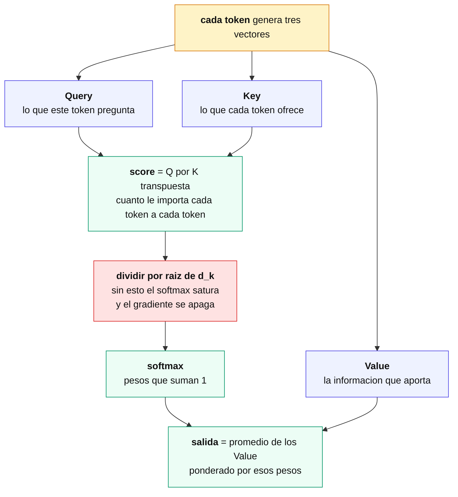

La fórmula completa:

```
Atención(Q, K, V) = softmax( Q·Kᵀ / √d_k ) · V
```

> **Por qué se divide por `√d_k`.** Sin esa división, con dimensiones grandes el producto punto `Q·Kᵀ` da valores de magnitud creciente. El softmax de valores grandes **satura**: concentra casi todo el peso en un único token y deja gradientes prácticamente nulos para el resto. Es el mismo problema de saturación de la sigmoide del cap. 32, en otro contexto. La raíz de `d_k` normaliza esa escala.

#### Múltiples cabezas

Una sola atención aprende **un** tipo de relación. La **atención multi-cabeza** corre varias en paralelo, cada una con sus propias matrices Q/K/V, y concatena los resultados.

Cada cabeza termina especializándose: una sigue relaciones sintácticas, otra correferencias, otra proximidad posicional. **Es exactamente la misma idea que los múltiples filtros de una capa convolucional** (cap. 44): en vez de un detector, muchos, cada uno atento a algo distinto.

#### Codificación posicional

Acá aparece el precio de haber eliminado la recurrencia. Una RNN conoce el orden porque procesa token por token; **la autoatención es invariante a permutaciones** — para ella, "el perro mordió al hombre" y "el hombre mordió al perro" son el mismo conjunto.

La solución es **sumar al embedding de cada palabra un vector que codifica su posición**. El paper usa senos y cosenos de distintas frecuencias; BERT y GPT usan posiciones aprendidas. Las dos funcionan.

#### Residuales y normalización

Cada sub-capa va envuelta en el patrón **`Add & Normalize`**:

```
salida = LayerNorm( entrada + SubCapa(entrada) )
```

La **conexión residual** (`entrada + ...`) le da al gradiente un camino directo que saltea la sub-capa, y es lo que permite apilar seis o doce bloques sin que se pierda. **Es el mismo mecanismo que el estado de celda de la LSTM** (cap. 48) y que la compuerta de actualización de la GRU cuando deja pasar el estado casi intacto.

`LayerNorm` normaliza cada vector de token por separado y estabiliza el entrenamiento.

#### El decoder

Genera la salida **token a token** (autorregresivamente), con dos diferencias respecto del encoder:

- **Atención enmascarada**: al predecir la palabra *i* no puede mirar las posiciones posteriores, porque en inferencia todavía no existen. La máscara lo fuerza durante el entrenamiento.
- **Atención cruzada**: una segunda capa de atención donde las Q vienen del decoder y las K/V del **encoder**. Es la atención del cap. 52, ahora como una pieza más dentro de la arquitectura.

#### La ventaja decisiva: paralelismo

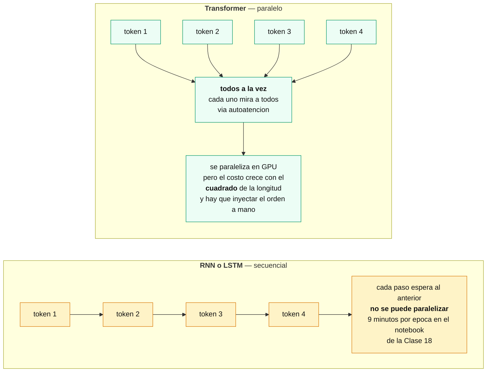

Una LSTM **no puede paralelizar** el recorrido temporal: el paso *t* necesita el estado del *t−1*. El Transformer procesa todos los tokens a la vez, lo que aprovecha la GPU por completo. Es lo que hizo posible entrenar modelos de miles de millones de parámetros.

A cambio paga dos cosas: **el costo de la atención crece con el cuadrado de la longitud** —cada token se compara con todos— y hay que inyectar el orden a mano.

> **Nota (verificado en los notebooks del curso, todos sobre IMDb):**
>
> | Clase | Arquitectura | `maxlen` | Épocas | Exactitud |
> |---|---|---|---|---|
> | 18 | LSTM (Keras) | 1.000 | 10 | **86,64%** |
> | 19 | LSTM (PyTorch) | 50 | 1 | 74,65% |
> | 25 | **Transformer** | 250 | 100 | **82,84%** |
>
> El Transformer queda **por debajo** de la LSTM, y no por la arquitectura: entrenó 100 épocas sin *early stopping* y se sobreajustó hasta exactitud **1,0000** en entrenamiento con pérdida 0,0000079, mientras la de validación subía de 0,29 a **3,08**. Su mejor época fue la **primera**. Cortando ahí habría dado ~88,6%, el mejor de los tres, en dos minutos en lugar de dos horas.
>
> **Una arquitectura mejor, mal entrenada, rinde menos que una más simple bien entrenada.**

### 56. Autoencoders

> Esta es la Clase 27 del curso, la primera del **Módulo 6 — Autoencoders y Modelos Generativos**, que cierra el bloque de contenidos nuevos del programa. Fuente: [Autoencoders - P1](<07-fundamentos-de-deep-learning/teoria/Autoencoders - P1.md>) y [Autoencoders - P2](<07-fundamentos-de-deep-learning/teoria/Autoencoders - P2.md>).

Todo lo visto hasta acá en el bloque de deep learning —CNNs, RNNs, Transformadores— resuelve tareas **supervisadas**: hay una etiqueta objetivo distinta de la entrada (una clase, la palabra siguiente, una traducción). Los **autoencoders** son la puerta de entrada al **aprendizaje no supervisado** dentro de deep learning: no hay etiqueta, solo datos de entrada, y el objetivo es aprender a reconstruirlos a sí mismos.

#### Encoder, cuello de botella, decoder

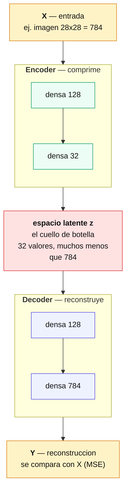

- **Encoder**: comprime la entrada `X` hasta el **espacio latente** — un vector de **variables latentes** de dimensión mucho menor que `X`.
- **Espacio latente**: el **cuello de botella** de la arquitectura.
- **Decoder**: descomprime esa representación en una reconstrucción `Y`, del mismo tamaño que `X`.

En la práctica, encoder y decoder suelen ser redes "espejadas": si el encoder reduce dimensiones capa a capa (784 → 128 → 32), el decoder hace el camino inverso (32 → 128 → 784) para devolver una salida del mismo tamaño que la entrada.

> **Nota (por qué el cuello de botella es lo que hace que esto funcione):** si la red pudiera copiar la entrada a la salida sin comprimirla —por ejemplo, con una capa latente del mismo tamaño que `X` y sin ninguna otra restricción—, la tarea de reconstrucción sería trivial: aprendería la función identidad y no capturaría ninguna estructura útil de los datos. Al forzar el paso por una representación **más chica**, la red no tiene margen para copiar: tiene que descartar redundancia y quedarse solo con la información que le alcanza para reconstruir lo esencial. Esa restricción de capacidad es la que obliga a aprender algo, no una consecuencia accidental de la arquitectura.

#### Entrenamiento: la reconstrucción como target

El autoencoder se entrena **de forma auto-supervisada**: no hace falta ninguna etiqueta externa, porque el propio `X` cumple el doble rol de entrada y de target. La función de pérdida típica es el **error cuadrático medio (MSE)** entre `X` y su reconstrucción `Y`:

```
L(X, Y) = mean((X - Y)²)
```

Es el mismo truco de autosupervisión que hace posible el preentrenamiento de los LLMs del capítulo siguiente: la señal de entrenamiento sale de los datos mismos, sin anotación humana.

#### Relación con PCA

Un autoencoder **lineal** (sin funciones de activación no lineales, encoder y decoder son una única transformación lineal cada uno) entrenado con MSE **converge al mismo subespacio que PCA** (cap. 23): ambos buscan la proyección de menor dimensión que minimiza el error de reconstrucción, y para ese problema la solución óptima es el subespacio generado por las componentes principales.

> **Nota (verificado empíricamente):** con datos sintéticos de 10 dimensiones generados a partir de 3 factores latentes, un PCA a 3 componentes y un autoencoder lineal de 3 unidades en el espacio latente (sin sesgo, sin activaciones, entrenado con Adam y MSE) llegan al mismo error de reconstrucción (≈6,7×10⁻⁵ en ambos casos), y los ángulos entre el subespacio de PCA y el subespacio aprendido por el autoencoder quedan cerca de cero (0,16, 0,05 y 0,02 radianes) tras suficientes épocas de entrenamiento. Con pocas épocas el autoencoder todavía no convergió al mismo subespacio (los ángulos daban más de 0,6 radianes), lo que confirma que la equivalencia es un resultado asintótico del entrenamiento, no algo que valga en cualquier punto intermedio.

La diferencia práctica es que un autoencoder **no lineal** (con activaciones como ReLU entre encoder y decoder) puede aprender una reducción de dimensionalidad no lineal, algo que PCA —por ser estrictamente una proyección lineal— no puede capturar.

#### Variantes: regularizaciones del autoencoder clásico

El material presenta cuatro variantes. Conviene separarlas en dos grupos, porque no son alternativas equivalentes entre sí:

| Tipo | Qué hace | Sigue mapeando a un punto fijo del espacio latente |
|---|---|---|
| **Undercomplete** (el clásico) | El espacio latente tiene menos dimensiones que la entrada; es la restricción de capacidad ya descripta arriba. | sí |
| **Sparse** (disperso) | Agrega una **regularización L1** sobre las activaciones del espacio latente, para que solo unas pocas neuronas estén activas por entrada. Favorece representaciones más interpretables. | sí |
| **Contractivo** | Penaliza que la representación latente cambie mucho ante perturbaciones chicas de la entrada, para lograr una representación más estable y robusta. | sí |
| **Denoising** | Recibe una entrada **corrompida a propósito** (ruido agregado) y se entrena para reconstruir la entrada **original, sin ruido**. Evita el sobreajuste y sirve para limpiar imágenes o audio ruidosos. | sí |
| **Variacional (VAE)** | Aprende una **distribución de probabilidad** (media y varianza) sobre el espacio latente, en vez de un punto fijo. | **no** |

Las primeras tres (sparse, contractivo, denoising) son **regularizaciones** sobre el autoencoder clásico: cambian qué tan buena o robusta es la representación latente, pero cada entrada se sigue mapeando a un vector fijo, igual que en el autoencoder undercomplete. El **VAE** es distinto en su naturaleza: en vez de un vector, aprende los parámetros de una distribución, y eso es lo que habilita **generar** datos nuevos. De las cinco, **solo el VAE es un modelo generativo** en sentido estricto — los demás reconstruyen o limpian una entrada dada, no producen muestras que no vieron.

#### El autoencoder variacional (VAE)

Si el encoder de un VAE devolviera directamente un punto del espacio latente, no habría forma de **muestrear** puntos nuevos de manera controlada: no se sabría qué región del espacio latente corresponde a datos plausibles. La solución es que el encoder, para cada entrada, devuelva los parámetros de una distribución normal —una media `μ` y una desviación estándar `σ`— en lugar de un vector fijo:

```
encoder(X) → (μ, σ)
z ~ N(μ, σ²)          # se muestrea un punto de esa distribución
decoder(z) → Y
```

**El problema del muestreo.** La operación `z ~ N(μ, σ²)` es un muestreo aleatorio, y el descenso de gradiente no puede retropropagar a través de una operación aleatoria: no hay gradiente que decir "si μ hubiera sido un poco distinto, z habría cambiado así". El **truco de reparametrización** rodea esto separando la aleatoriedad de los parámetros aprendibles:

```
ε ~ N(0, 1)            # el ruido aleatorio, fuera del grafo de cómputo
z = μ + σ * ε          # z sigue siendo aleatorio, pero μ y σ reciben gradiente
```

Con `z` expresado así, `μ` y `σ` quedan conectados a `z` por una operación determinística (suma y producto), así que el gradiente sí puede fluir hacia el encoder. El ruido `ε` es el único punto aleatorio del cálculo, y no depende de ningún parámetro que haya que entrenar.

**La función de pérdida tiene dos términos:**

```
L = error_reconstruccion(X, Y) + KL(N(μ, σ²) || N(0, 1))
```

- El **error de reconstrucción** (MSE o entropía cruzada binaria, según el tipo de dato) empuja a que `Y` se parezca a `X`, igual que en el autoencoder clásico.
- La **divergencia KL** empuja a que la distribución que aprende el encoder para cada entrada se parezca a una normal estándar `N(0, 1)`. Sin este término, el modelo podría aprender distribuciones muy angostas y separadas entre sí para cada entrada —básicamente memorizando puntos, como el autoencoder clásico— y el espacio latente tendría "huecos" que no corresponden a ningún dato real. Al acercar todas las distribuciones a una normal estándar compartida, el espacio latente queda **continuo**: cualquier punto muestreado de `N(0, 1)` cae en una zona donde el decoder aprendió a generar algo razonable, y eso es lo que permite generar datos nuevos y no solo reconstruir los vistos.

Los dos términos compiten: el de reconstrucción quiere distribuciones angostas y bien ajustadas a cada entrada; el KL quiere que todas se parezcan a la misma normal estándar. El balance entre ambos es lo que determina qué tan bien reconstruye contra qué tan bien genera.

#### Aplicaciones

1. **Reducción de dimensionalidad**: el análogo no lineal de PCA, para visualizar o preprocesar datos de alta dimensión.
2. **Detección de anomalías**: entrenado solo con datos "normales", una entrada anómala se reconstruye peor —mayor error de reconstrucción—, y ese error sirve como señal de anomalía.
3. **Eliminación de ruido** (*denoising*): la aplicación directa de la variante denoising, para limpiar imágenes o audio.
4. **Pre-entrenamiento**: las capas del encoder, ya entrenadas para capturar la estructura de los datos sin supervisión, pueden reutilizarse como punto de partida de una red supervisada —la misma lógica de transfer learning del cap. 46, pero partiendo de un modelo propio en lugar de uno preentrenado en un dataset público.
5. **Generación de datos**: exclusiva del VAE — muestrear puntos del espacio latente aprendido y generar imágenes, audio u otro dato nuevo.

#### Un autoencoder simple, en código

```python
# Keras — autoencoder undercomplete para MNIST (28x28 = 784)
from tensorflow import keras
from tensorflow.keras import layers

dim_entrada = 784
dim_latente = 32

entrada = keras.Input(shape=(dim_entrada,))
codificado = layers.Dense(128, activation='relu')(entrada)
codificado = layers.Dense(dim_latente, activation='relu')(codificado)

decodificado = layers.Dense(128, activation='relu')(codificado)
decodificado = layers.Dense(dim_entrada, activation='sigmoid')(decodificado)

autoencoder = keras.Model(entrada, decodificado)
autoencoder.compile(optimizer='adam', loss='mse')
# autoencoder.fit(X_train, X_train, epochs=20, batch_size=256, validation_data=(X_test, X_test))
# el target es la propia entrada: no hace falta ninguna etiqueta
```

```python
# PyTorch — el mismo autoencoder
import torch
import torch.nn as nn

class Autoencoder(nn.Module):
    def __init__(self, dim_entrada=784, dim_latente=32):
        super().__init__()
        self.encoder = nn.Sequential(
            nn.Linear(dim_entrada, 128), nn.ReLU(),
            nn.Linear(128, dim_latente), nn.ReLU(),
        )
        self.decoder = nn.Sequential(
            nn.Linear(dim_latente, 128), nn.ReLU(),
            nn.Linear(128, dim_entrada), nn.Sigmoid(),
        )

    def forward(self, x):
        z = self.encoder(x)
        return self.decoder(z)

modelo = Autoencoder()
criterio = nn.MSELoss()
optimizador = torch.optim.Adam(modelo.parameters(), lr=1e-3)

# for x_batch in dataloader:
#     reconstruccion = modelo(x_batch)
#     loss = criterio(reconstruccion, x_batch)   # x_batch es a la vez entrada y target
#     optimizador.zero_grad()
#     loss.backward()
#     optimizador.step()
```

> **Nota (verificado corriendo el código):** la clase `Autoencoder` de arriba, con `dim_entrada=784` y `dim_latente=32`, corre un `forward` y un `backward` completos sobre un lote de 8 muestras aleatorias sin errores — la arquitectura y las formas de los tensores son consistentes.

### 57. Redes Adversarias Generativas (GANs)

> Esta es la Clase 28 del curso, la segunda del **Módulo 6 — Autoencoders y Modelos Generativos**, y con ella se cierra el bloque de contenidos nuevos del programa. Fuente: [Redes Adversarias Generativas (GANs)](<07-fundamentos-de-deep-learning/teoria/Redes Adversarias Generativas (GANs).md>). Continúa del capítulo anterior.

El VAE del capítulo anterior resuelve la generación de datos optimizando **una única función de pérdida**: reconstrucción más divergencia KL. Las **GAN** (*Generative Adversarial Networks*, Redes Adversarias Generativas) plantean el problema de otra forma — en vez de una pérdida fija, entrenan **dos redes enfrentadas** en un juego, y es la competencia entre ambas la que empuja a que los datos generados se vuelvan realistas.

#### Generador y discriminador: la intuición del juego

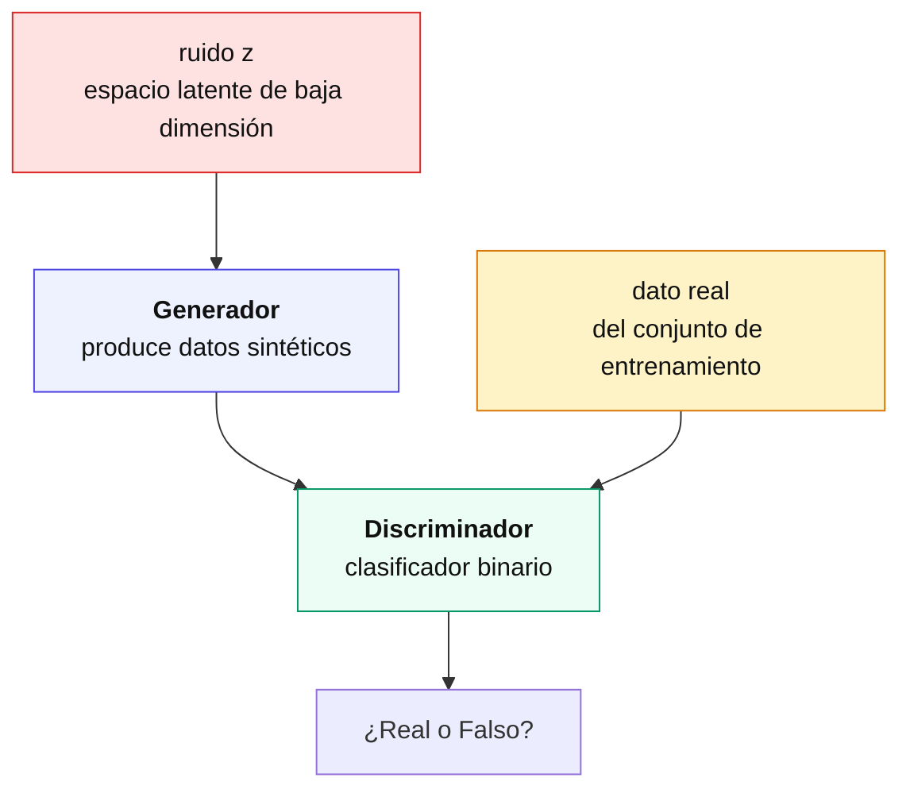

- **Generador (`G`)**: toma un vector de ruido aleatorio del espacio latente y produce un dato sintético (una imagen, por ejemplo).
- **Discriminador (`D`)**: un clasificador binario que recibe una muestra —real o generada— y decide si es real o falsa.

Las dos redes se entrenan **a la vez**, pero con objetivos opuestos: el generador intenta engañar al discriminador, y el discriminador intenta no dejarse engañar. Ambas mejoran empujadas por el progreso de la otra — de ahí "adversarias".

> **Por qué esto produce datos realistas.** El discriminador actúa como una función de pérdida **aprendida y cambiante**, en vez de una métrica fija como el MSE del autoencoder. En lugar de decirle al generador "así de lejos estás del dato real" con una distancia numérica, le da una señal binaria (te descubrí / no te descubrí) que se vuelve cada vez más exigente a medida que el propio discriminador mejora distinguiendo lo real de lo falso. El generador se ve forzado a producir muestras cada vez más convincentes para seguir pasando una evaluación cada vez más estricta.

A diferencia del VAE, la GAN **no tiene encoder**: no hay forma directa de averiguar qué vector latente `z` corresponde a un dato real dado. Solo genera hacia adelante, a partir de ruido.

#### El juego minimax

El entrenamiento de una GAN se formula como un juego de suma cero entre `D` y `G`, con la siguiente función de valor:

```
min_G max_D  V(D, G) = E[log D(x)] + E[log(1 - D(G(z)))]
```

donde `x` es una muestra real, `z` es ruido del espacio latente, `G(z)` es la muestra generada, y `D(·)` es la probabilidad que asigna el discriminador de que su entrada sea real.

- El **discriminador** quiere **maximizar** `V`: que `D(x)` esté cerca de 1 (acierta con lo real) y que `D(G(z))` esté cerca de 0 (acierta con lo falso).
- El **generador** quiere **minimizar** `V`: quiere que `D(G(z))` esté cerca de 1, es decir, que el discriminador confunda su salida con un dato real.

En el equilibrio teórico de este juego, el generador reproduce tan bien la distribución real de los datos que el discriminador ya no puede distinguir mejor que al azar (`D(x) = 0,5` para cualquier entrada).

**Por qué se usa la pérdida no saturante.** Con la formulación de arriba, el generador tendría que **minimizar** `log(1 - D(G(z)))`. Al principio del entrenamiento el generador es malo y el discriminador lo rechaza con confianza (`D(G(z))` cerca de 0) — y justo ahí la función `log(1 - D(G(z)))` tiene **gradiente casi plano**: el generador recibe una señal débil justo cuando más la necesita (**saturación del gradiente**). En la práctica se entrena al generador para **maximizar** `log(D(G(z)))` en su lugar — la **pérdida no saturante**. El punto de equilibrio teórico no cambia, pero el gradiente es mucho más fuerte cuando `D(G(z))` está cerca de 0, que es exactamente la situación típica del arranque del entrenamiento. Es el ajuste que usa la implementación práctica de casi cualquier GAN.

#### Entrenamiento alternado

Cada iteración de entrenamiento tiene dos pasos separados:

1. **Paso del discriminador**: se le muestra un lote de datos reales y un lote generados por `G` (con los pesos de `G` congelados). Se actualizan solo los pesos de `D`.
2. **Paso del generador**: se generan nuevas muestras con `G` y se le pide la predicción a `D` (con los pesos de `D` congelados). Se actualizan solo los pesos de `G`, con la pérdida no saturante de arriba.

El discriminador tiene que estar **congelado** mientras se entrena el generador porque el gradiente de la pérdida necesita fluir hacia atrás *a través* de `D` (para saber en qué dirección mover a `G`), pero sin que ese mismo paso también actualice los pesos de `D` — si `D` se moviera al mismo tiempo, el generador estaría persiguiendo un objetivo que cambia con cada paso, y el juego dejaría de tener un adversario estable contra el cual medirse en esa iteración.

#### Modos de falla

Al ser un juego entre dos redes que se entrenan simultáneamente —y no la optimización de una única función convexa—, el entrenamiento de una GAN falla de formas sin equivalente en el entrenamiento supervisado:

- **Mode collapse (colapso de modos)**: el generador descubre que un puñado de muestras (o una sola) engañan sistemáticamente al discriminador, y deja de explorar el resto de la diversidad del conjunto de entrenamiento. Produce siempre variaciones de lo mismo, en vez de cubrir la distribución real completa.
- **Inestabilidad de entrenamiento**: como `G` y `D` se actualizan uno en función del otro, es fácil entrar en una dinámica oscilante donde ninguno converge: el discriminador mejora, el generador se adapta, el discriminador vuelve a mejorar contra ese nuevo generador, y así sin estabilizarse. Las pérdidas de ambas redes oscilan en vez de bajar de forma monótona.
- **No convergencia / desequilibrio discriminador-generador**: si el discriminador se vuelve demasiado bueno demasiado rápido, rechaza con total confianza cualquier muestra generada (`D(G(z))` cerca de 0 de forma sostenida) y reaparece la saturación del gradiente: el generador deja de recibir señal útil y el entrenamiento se estanca.

Qué se hace al respecto, en la práctica: `learning rate` bajo y `beta_1=0,5` en Adam (en vez del default 0,9, que puede hacer oscilar el entrenamiento adversarial), `Dropout` en el discriminador para no dejarlo aprender demasiado rápido, *label smoothing* en las etiquetas reales (0,9 en vez de 1) para que el discriminador no se vuelva excesivamente confiado, y —el punto que el notebook de la clase demuestra por accidente— **suficiente variedad de datos de entrenamiento**, sin la cual el mode collapse es prácticamente garantizado.

#### VAE vs. GAN: dos familias generativas distintas

El VAE (cap. 56) y la GAN son las dos familias clásicas de modelos generativos que se enseñan antes de los modelos de difusión. Ambas aprenden a producir datos nuevos, pero por mecanismos muy distintos:

| | VAE | GAN |
|---|---|---|
| **Objetivo de entrenamiento** | Una única función de pérdida (reconstrucción + KL) | Un juego entre dos redes, sin pérdida única |
| **Distribución latente** | Explícita: `N(μ, σ²)` aprendida por el encoder | Implícita: solo el ruido de entrada del generador |
| **Encoder** | Sí — permite inferir el `z` de un dato real dado | No — solo genera hacia adelante, desde ruido |
| **Verosimilitud de los datos** | Explícita (vía el término de reconstrucción) | Implícita (no hay una densidad de probabilidad de los datos que el modelo optimice directamente) |
| **Calidad típica de las muestras** | Tienden a ser borrosas — el MSE promedia soluciones plausibles | Tienden a ser nítidas — el discriminador castiga el promediado |
| **Estabilidad de entrenamiento** | Estable — es descenso de gradiente sobre una pérdida convexa por partes | Inestable — sujeta a mode collapse, oscilación y no convergencia |

Ninguna domina a la otra: son dos formas distintas de resolver "generar datos nuevos", con trade-offs opuestos entre estabilidad de entrenamiento y nitidez de las muestras.

#### Aplicaciones

1. **Generación de nuevos ejemplos para conjuntos de datos**: datos sintéticos adicionales, lo bastante realistas como para complementar el conjunto de entrenamiento original.
2. **Generación de imágenes realistas**: producir imágenes que parecen tomadas del mundo real (ej. **StyleGAN**).
3. **Superresolución de imágenes**: mejorar la calidad de una imagen de baja resolución sin perder detalle (ej. **SRGAN**).
4. **Traducción de texto a imagen**: crear imágenes a partir de descripciones textuales.

> **Nota:** el material del curso cita **DALL-E** como ejemplo de GAN para la aplicación de texto a imagen. Es impreciso: DALL-E 2 y posteriores son modelos de **difusión**, y el DALL-E original era un **transformador autoregresivo** — ninguno de los dos es una GAN. La aplicación (texto a imagen) es correcta; el linaje arquitectónico citado, no.

#### Práctica: los bugs medidos del notebook del curso

El notebook de la clase (`OD_RN2_ESP_M06_S30`) entrena una GAN simple —MLPs sin convolución, `100 → 256 → 512 → 1024 → 784` para el generador y el camino inverso para el discriminador— sobre MNIST. Es el recurso con más bugs reales de todo el módulo, y vale la pena documentarlos porque son un ejemplo directo de la regla de este manual sobre **verificar midiendo, no confiar en que el código "se ve bien"**.

**Bug 1 — el dataset recortado a 128 imágenes causa mode collapse real.** La celda de datos aplica `X_train = X_train[:128]`, que recorta el set de entrenamiento de 60.000 imágenes a apenas 128. Corriendo el entrenamiento completo tal cual está escrito (100 épocas), a partir de la época 25 el generador produce trazos reconocibles como dígitos, pero con **colapso de modo fuerte y medido**: casi todo lo generado son variantes de "1" y "7", nunca la variedad 0-9 de MNIST real. Es el ejemplo de manual de mode collapse causado por falta de datos — con 128 ejemplos la red no tiene margen para aprender diez modos distintos.

**Bug 2 — el bucle interno ata los lotes por época al tamaño de lote, no a la cantidad de datos.** El entrenamiento usa `for _ in range(batch_size):` en vez de `for _ in range(n_imagenes // batch_size):`. El número de lotes procesados por época queda fijo en `batch_size` (16), sin importar cuántas imágenes tenga el dataset. Medido directamente: con `batch_size=16`, cada época procesa siempre `16 × 16 = 256` imágenes reales (con reemplazo) — sea que el dataset tenga 128 imágenes o 60.000 completas.

**Los dos bugs se compensan entre sí, y por eso pasan desapercibidos.** Si el bug 2 no existiera, entrenar con 128 imágenes también sería obviamente insuficiente (128 imágenes por época durante 100 épocas). Y si el bug 1 no existiera, el bug 2 seguiría limitando cada época a 256 imágenes con reemplazo — un pool chico igual, aunque el dataset completo tenga 60.000. El resultado observado (mode collapse hacia "1" y "7") es consistente con ambos bugs actuando juntos: 256 muestras con reemplazo de un pool de apenas 128 cubren ese pool completo casi dos veces por época, así que en la práctica la red nunca ve más que esas 128 imágenes, sin importar cuántas épocas corran.

**Lo que se verificó y estaba bien** — los sospechosos habituales en cualquier GAN, confirmados midiendo en vez de asumidos:

- El `tanh` de la capa de salida del generador sí coincide con la normalización de los datos a `[-1, 1]`: generando imágenes con el modelo ya entrenado, la salida cae en ese rango (aproximadamente `[-0,9; 0,9]`).
- El congelamiento del discriminador en el modelo combinado (`discriminator.trainable = False` antes de compilar `gan`) sí funciona en la versión de Keras usada (2.21): comparando los pesos del discriminador antes y después de un `gan.train_on_batch(...)`, no cambian. En versiones viejas de Keras este patrón tiene una trampa conocida (cambiar `.trainable` después de compilar no siempre se refleja sin recompilar), pero acá no se manifestó.
- El *label smoothing* a 0,9 en las etiquetas reales del discriminador es deliberado, no un error de tipeo — es la técnica estándar para evitar que el discriminador se vuelva demasiado confiado.

La lección general: **`success=true` no implica resultado útil**. El notebook corre sin errores, entrena sin excepciones y produce imágenes — pero sin correrlo completo y sin comparar los pesos antes/después de cada paso, ninguno de los dos bugs reales se habría detectado, y las partes que sí estaban bien (`tanh`, congelamiento, label smoothing) se habrían quedado como sospecha en vez de verificación.

#### GAN simple, en código

```python
# Keras — GAN mínima para MNIST (28x28 = 784), MLPs sin convolución
from tensorflow.keras.layers import Dense, Dropout, Input, LeakyReLU
from tensorflow.keras.models import Model, Sequential
from tensorflow.keras.optimizers import Adam

def adam_optimizer():
    return Adam(learning_rate=0.0002, beta_1=0.5)  # config recomendada por DCGAN (Radford et al., 2015)

def create_generator():
    generator = Sequential()
    generator.add(Dense(units=256, input_dim=100))
    generator.add(LeakyReLU(0.2))
    generator.add(Dense(units=512))
    generator.add(LeakyReLU(0.2))
    generator.add(Dense(units=1024))
    generator.add(LeakyReLU(0.2))
    generator.add(Dense(units=784, activation='tanh'))  # rango [-1,1], igual que los datos normalizados
    generator.compile(loss='binary_crossentropy', optimizer=adam_optimizer())
    return generator

def create_discriminator():
    discriminator = Sequential()
    discriminator.add(Dense(units=1024, input_dim=784))
    discriminator.add(LeakyReLU(0.2))
    discriminator.add(Dropout(0.3))  # frena al discriminador para no desbalancear el juego
    discriminator.add(Dense(units=512))
    discriminator.add(LeakyReLU(0.2))
    discriminator.add(Dropout(0.3))
    discriminator.add(Dense(units=256))
    discriminator.add(LeakyReLU(0.2))
    discriminator.add(Dense(units=1, activation='sigmoid'))
    discriminator.compile(loss='binary_crossentropy', optimizer=adam_optimizer())
    return discriminator

def create_gan(discriminator, generator):
    discriminator.trainable = False  # congelado antes de compilar el combinado
    gan_input = Input(shape=(100,))
    x = generator(gan_input)
    gan_output = discriminator(x)
    gan = Model(inputs=gan_input, outputs=gan_output)
    gan.compile(loss='binary_crossentropy', optimizer=adam_optimizer())
    return gan

g, d = create_generator(), create_discriminator()
gan = create_gan(d, g)

def training(epochs, batch_size, n_imagenes):
    n_lotes = n_imagenes // batch_size  # corrección del bug 2: lotes por época según el dataset, no el batch_size
    for e in range(1, epochs + 1):
        for _ in range(n_lotes):
            # paso del discriminador
            noise = np.random.normal(0, 1, [batch_size, 100])
            generated_images = g.predict(noise)
            image_batch = X_train[np.random.randint(0, X_train.shape[0], size=batch_size)]
            X = np.concatenate([image_batch, generated_images])
            y_dis = np.zeros(2 * batch_size)
            y_dis[:batch_size] = 0.9  # label smoothing deliberado

            d.trainable = True
            d.train_on_batch(X, y_dis)

            # paso del generador — discriminador congelado
            noise = np.random.normal(0, 1, [batch_size, 100])
            y_gen = np.ones(batch_size)
            d.trainable = False
            gan.train_on_batch(noise, y_gen)
```

### 58. De los Transformadores a los LLMs

> **Nota:** este capítulo **no forma parte del programa del curso**, que termina en autoencoders y modelos generativos. Se agrega porque es la continuación directa del cap. 53 y porque es lo que hoy se encuentra en el trabajo real. Fuente principal: la documentación de [IBM Think](https://www.ibm.com/mx-es/think/topics/large-language-models).

Un **LLM** (*Large Language Model*) no es una arquitectura nueva: es **el Transformer del capítulo anterior, escalado**. Lo que cambió fue la magnitud —miles de millones de parámetros, corpus de billones de tokens— y el descubrimiento de que a partir de cierta escala aparecen capacidades que no estaban programadas.

En el fondo sigue siendo una **máquina predictiva**: genera texto **token por token**, eligiendo cada vez el siguiente según los patrones aprendidos. Todo lo demás es consecuencia de hacer eso muy bien y a escala enorme.

#### Las tres fases de entrenamiento

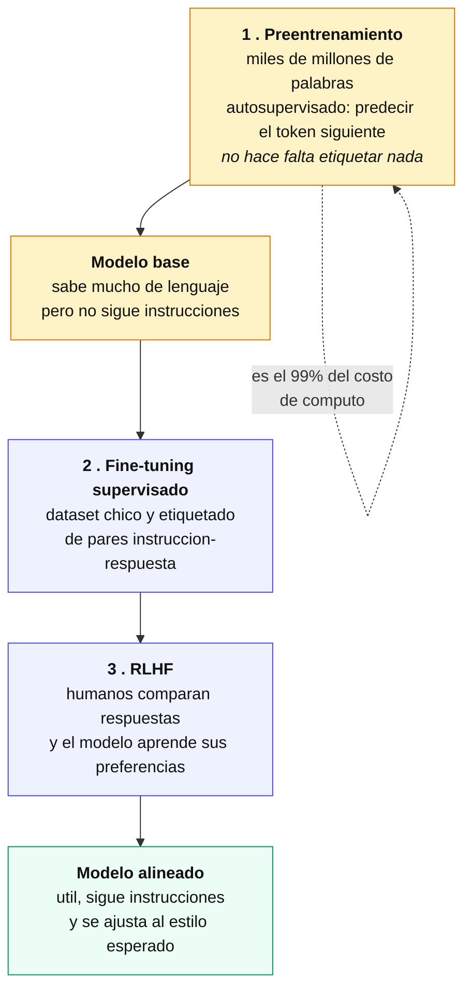

**1. Preentrenamiento.** Es donde se va prácticamente todo el costo de cómputo. El modelo lee miles de millones de palabras y aprende a predecir el token siguiente.

Lo notable es que es **autosupervisado**: no hace falta etiquetar nada. El texto es a la vez la entrada y la etiqueta — dada la frase "el gato se subió al", la respuesta correcta "techo" ya está en el propio corpus. Eso es lo que permitió entrenar con todo internet, algo imposible si hubiera hecho falta anotación humana.

Es el mismo truco que hace funcionar a los autoencoders del capítulo anterior: la señal de entrenamiento sale de los datos mismos.

**2. Fine-tuning supervisado.** El modelo base sabe mucho de lenguaje pero **no sigue instrucciones**: si se le escribe una pregunta, es tan probable que la continúe con otra pregunta como que la responda. Acá se lo entrena con un dataset chico de pares instrucción-respuesta (*instruction tuning*) para que aprenda el formato de diálogo.

**3. RLHF** (*Reinforcement Learning from Human Feedback*). Personas comparan respuestas del modelo y marcan cuál prefieren. Con esas comparaciones se entrena un modelo de recompensa, y con él se ajusta el LLM. Es la fase de **alineación**: no le agrega conocimiento, le ajusta el comportamiento y el estilo.

#### Las tres familias, según qué mitad del Transformer usan

| Familia | Usa | Ejemplos | Fuerte en |
|---|---|---|---|
| **Solo encoder** | la mitad izquierda | BERT | **comprensión**: clasificar, extraer entidades, buscar |
| **Solo decoder** | la mitad derecha, con atención enmascarada | GPT, Llama | **generación**: escribir, conversar, completar |
| **Encoder-decoder** | las dos | T5, BART | **transformación**: traducir, resumir |

La distinción se entiende directo desde el cap. 53: el **encoder** ve toda la secuencia de una vez y por eso sirve para comprender; el **decoder** tiene atención enmascarada —no puede mirar el futuro— y por eso sirve para generar.

#### Las limitaciones, que son estructurales

| Limitación | Por qué ocurre |
|---|---|
| **Alucinaciones** | El modelo optimiza *plausibilidad*, no *verdad*. Genera el token más probable, y una afirmación falsa bien construida es estadísticamente plausible. No "sabe" que no sabe. |
| **Sesgo** | Aprende de texto humano, con sus prejuicios incluidos, y puede amplificarlos. |
| **Costo** | El preentrenamiento consume una cantidad enorme de energía y cómputo. |
| **Corte de conocimiento** | Solo sabe lo que había en su corpus hasta una fecha. |

La primera es la más importante de entender: **las alucinaciones no son un bug que se pueda parchear**, son consecuencia directa de cómo funciona el modelo. Por eso la mitigación no es "arreglar el modelo" sino darle acceso a fuentes verificables — que es de lo que trata la sección siguiente.

#### RAG: darle fuentes al modelo

**RAG** (*Retrieval-Augmented Generation*) ataca el corte de conocimiento y las alucinaciones sin tocar el modelo: antes de responder, **busca información relevante** en una base propia y se la pasa como contexto.

```mermaid
flowchart LR
    Q["<b>pregunta del usuario</b>"] --> EMB["se convierte en embedding"]
    EMB --> BUS["<b>busqueda semantica</b><br/>en la base vectorial"]
    DOC["documentos propios<br/>manuales, politicas, tickets"] -.->|"indexados una vez<br/>como embeddings"| BUS
    BUS --> FRAG["fragmentos relevantes"]
    FRAG --> PROMPT["<b>prompt aumentado</b><br/>pregunta mas contexto recuperado"]
    Q --> PROMPT
    PROMPT --> LLM["<b>el LLM responde</b><br/>usando ese contexto"]
    LLM --> R["respuesta con fuentes<br/>y datos actualizados"]
    classDef u fill:#fef3c7,stroke:#d97706,color:#111
    classDef p fill:#eef2ff,stroke:#4f46e5,color:#111
    classDef f fill:#ecfdf5,stroke:#059669,color:#111
    class Q,R u
    class EMB,BUS,FRAG,PROMPT p
    class DOC,LLM f
```

La pieza que lo hace posible son los **embeddings** del cap. 50, ahora aplicados a documentos enteros: cada fragmento se convierte en un vector y se guarda en una **base vectorial**. Cuando llega una pregunta, se vectoriza y se buscan los fragmentos más cercanos — es **búsqueda semántica**, por significado y no por coincidencia de palabras.

**RAG contra fine-tuning**, que resuelven cosas distintas y suelen confundirse:

| | **Fine-tuning** | **RAG** |
|---|---|---|
| Qué cambia | los **parámetros** del modelo | el **contexto** que recibe |
| Para qué sirve | enseñarle un **formato**, un estilo, una tarea | darle **información** que no tiene |
| Actualizar datos | hay que reentrenar | se actualiza la base, listo |
| Costo | alto | bajo |
| Trazabilidad | ninguna | se puede citar la fuente |

La regla práctica: **si el problema es que el modelo no sabe algo, RAG. Si es que no sabe comportarse como querés, fine-tuning.** Son complementarios, no alternativos.

#### Qué del manual se recicla acá

Nada de esto es una ruptura con lo anterior:

- **Tokenización y embeddings** (cap. 50) son la entrada de todo LLM, y los embeddings son además el motor de la búsqueda en RAG.
- **La arquitectura Transformer** (cap. 53) es literalmente el modelo.
- **Sobreajuste y regularización** (caps. 7 y 15) siguen aplicando en el fine-tuning, donde el dataset es chico.
- **El principio del cap. 49** —toda transformación aprendida es parte del modelo— vale igual: el tokenizador de un LLM va con el modelo.
