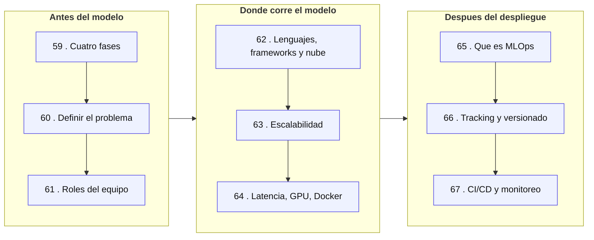
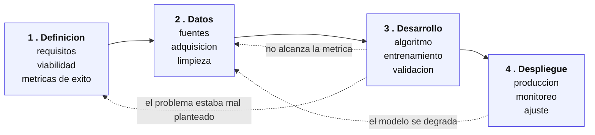
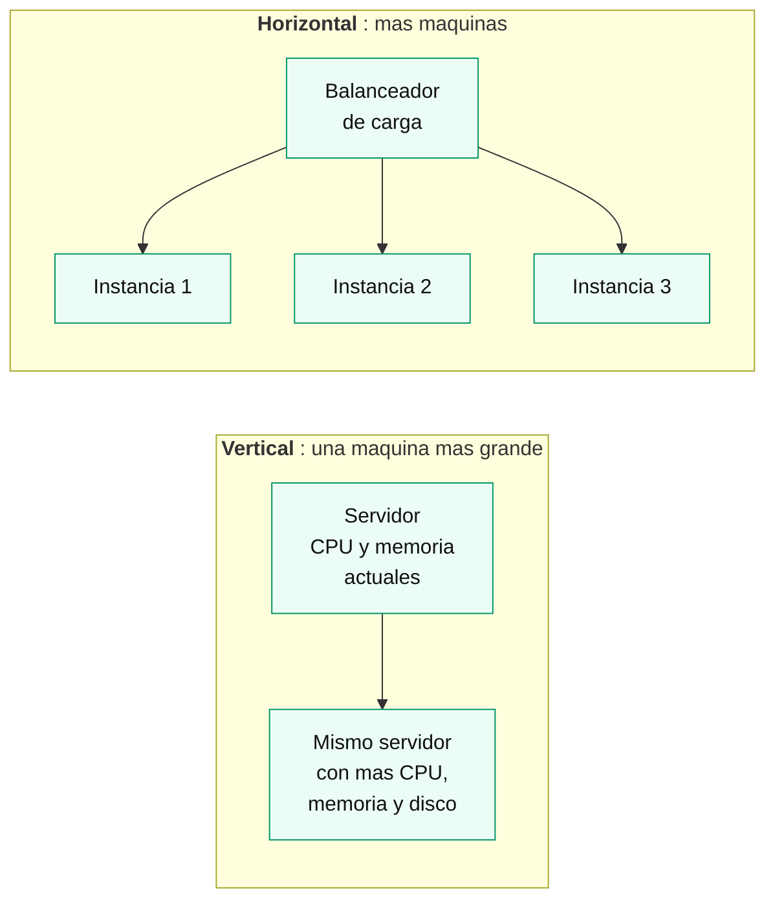
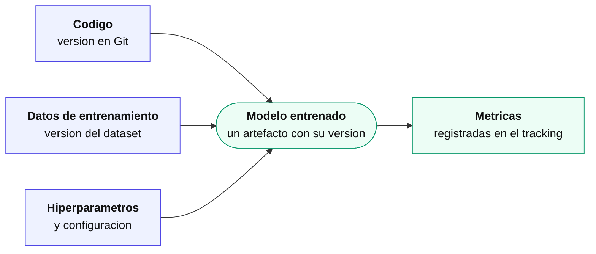
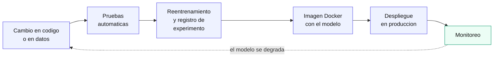

[Índice](README.md) · [← Anterior](09-referencia-tecnica.md)

# Parte X — Gestión de proyectos de IA y MLOps

Las partes anteriores enseñan a **construir** un modelo: prepararlo, evaluarlo, mejorarlo. Esta parte trata de lo que rodea al modelo y decide si el proyecto llega a producción o se queda en un notebook: cómo se define el problema, quién forma el equipo, dónde corre el modelo, cómo aguanta la carga y cómo se mantiene una vez publicado. Es la única parte sin código; es de criterio y de organización. Requiere la [Parte I](01-fundamentos.md), sobre todo el [capítulo 4](01-fundamentos.md#4-el-ciclo-de-vida-de-un-proyecto-de-ml) (ciclo de vida de un proyecto de ML) y la [Parte II](02-como-se-evalua-un-modelo.md) (métricas). No vuelve a explicar machine learning, redes neuronales ni los frameworks: para eso están las [Partes VII](07-redes-neuronales.md) y [IX](08-deep-learning-con-frameworks.md).

> **Sobre el material de origen.** Los apuntes del módulo son muy escuetos en varios puntos: la definición del problema, los roles, el despliegue y MLOps se resumen en pocas slides. Donde el capítulo agrega explicación que las slides no traen, queda marcado como **(ampliación)**.

### Mapa de la parte

Los capítulos siguen el recorrido de un proyecto: primero se decide qué construir y con quién, después dónde y cómo corre, y por último cómo se sostiene en el tiempo.

### 59. Las cuatro fases de un proyecto de IA

El [capítulo 4](01-fundamentos.md#4-el-ciclo-de-vida-de-un-proyecto-de-ml) describió el ciclo de vida desde el lado del modelo. Acá se lo mira desde el lado del **proyecto**: qué se hace en cada fase, qué entrega y quién espera esa entrega. El material divide el trabajo en cuatro fases.

| Fase | Qué se hace | Pasos clave |
|---|---|---|
| **1. Definición del problema** | Entender qué se quiere resolver y qué requisitos tiene el sistema | Recolección de requisitos, análisis de viabilidad, definición de métricas de éxito |
| **2. Recopilación de datos** | Conseguir datos suficientes y de buena calidad | Identificar fuentes, adquirir los datos relevantes, limpiar (eliminar nulos, corregir inconsistencias) |
| **3. Desarrollo y entrenamiento** | Elegir algoritmos, entrenarlos y validarlos | Selección del algoritmo, entrenamiento con datos de entrenamiento, validación (por ejemplo, validación cruzada); el material ilustra un split de 80 % entrenamiento y 20 % test |
| **4. Despliegue y monitoreo** | Poner el modelo en producción y vigilarlo | Implementar en producción, configurar monitoreo para detectar fallos o desvíos, ajustar el modelo |

Las fases 2 y 3 son las que ya conocés de las Partes I a VII. Las fases 1 y 4 son las que esta parte desarrolla: la 1 en los capítulos 60 y 61, la 4 en los capítulos 62 a 67.

Las flechas punteadas importan tanto como las sólidas: el proyecto **no es lineal**. Un resultado flojo en la fase 3 suele mandar de vuelta a conseguir mejores datos, o incluso a reformular el problema. Y un modelo ya desplegado vuelve a la fase 2 cuando los datos del mundo real dejan de parecerse a los de entrenamiento.

**Integración con metodologías ágiles.** El material agrega una capa transversal: las metodologías ágiles, que promueven entrega incremental y continua, ciclos cortos, colaboración constante con los interesados y adaptación al cambio. Cita tres:

- **Scrum:** sprints cortos para diseñar, entrenar y ajustar modelos, con revisiones y retrospectivas al cerrar cada uno para evaluar resultados y corregir el rumbo.
- **Kanban:** el mismo objetivo de trabajo organizado y en equipo, pero con control visual mediante tableros.
- **Extreme Programming (XP):** el material solo lo nombra como ejemplo, sin desarrollarlo.

**Por qué las fases encajan con ciclos cortos (ampliación).** Como entrenar es experimental y su resultado no se conoce de antemano, planificar todo el proyecto de punta a punta antes de empezar suele fallar. Dividir el trabajo en iteraciones cortas permite descubrir temprano si los datos alcanzan o si la métrica objetivo es realista, en vez de enterarse al final.

### 60. Definir el problema y los objetivos

Es la fase que más proyectos hunde, y el motivo es simple: **un error acá se paga en todas las fases siguientes**. Un modelo excelente para el problema equivocado es un modelo inútil, y ninguna técnica de las Partes III a IX lo arregla.

> **(Ampliación.)** El material de la clase solo enumera este tema en cuatro puntos (fases críticas, identificación del problema, formulación de objetivos y un ejemplo de transfer learning) y remite el desarrollo a videos. Lo que sigue ordena esos puntos y los explica.

**Identificar si el problema es apto para IA.** No todo problema lo es. Tres preguntas filtran la mayoría de los casos:

| Pregunta | Qué se busca |
|---|---|
| ¿Hay datos históricos suficientes y relevantes? | Sin datos no hay aprendizaje |
| ¿Existe un patrón aprendible? | Si el fenómeno es puramente aleatorio, ningún modelo predice nada |
| ¿Se justifica el costo frente a alternativas más simples? | A veces alcanza con reglas de negocio o una heurística |

Esas preguntas son el *análisis de viabilidad* de la fase 1.

**Traducir una necesidad de negocio en una tarea de ML.** El negocio no pide "un clasificador": pide, por ejemplo, reducir pérdidas por fraude o atender más rápido. Traducir es elegir qué se predice y qué tipo de problema resulta. Los tipos ya se vieron en el [capítulo 3](01-fundamentos.md#3-tipos-de-aprendizaje): si la salida es una categoría es clasificación, si es un número es regresión, si no hay etiqueta es agrupamiento. Los ejemplos del material sirven de guía: detección de fraudes y recomendaciones de productos son aplicaciones de ML; conducción autónoma y diagnóstico médico por imagen, de deep learning.

**Fijar los criterios de éxito antes de entrenar.** La definición de métricas de éxito es un paso de la fase 1, no de la 3. Conviene dejar por escrito, antes de abrir un notebook:

- **Qué métrica se usa** y por qué es la adecuada al costo real de los errores (la [Parte II](02-como-se-evalua-un-modelo.md) explica cuándo conviene recall, precisión, F1 o un error de regresión).
- **Qué valor alcanza** para considerar que el proyecto funcionó.
- **Contra qué se compara**, por ejemplo la solución actual o una regla simple. *(Ampliación.)*

Sin esto, el proyecto no tiene cómo terminar: siempre se puede mejorar un poco más el modelo.

**Objetivos claros y específicos.** El material insiste en la formulación de objetivos "clara y específica". Un objetivo vago ("usar IA para mejorar la atención") no se puede medir; uno específico sí ("clasificar los reclamos entrantes para derivarlos al área correcta").

**Ejemplo: transfer learning en visión por computadora.** El caso que el material elige para practicar es un proyecto de transfer learning con fotografía y arte, recorrido de punta a punta desde la negociación con el cliente hasta la entrega. La técnica en sí se explica en el [capítulo 46](08-deep-learning-con-frameworks.md#46-transfer-learning-reutilizar-una-red-ya-entrenada). Lo que interesa acá es el planteo: se parte de un pedido de un cliente, se lo convierte en tarea y se justifica por qué conviene reutilizar una red ya entrenada en vez de entrenar desde cero.

### 61. Los roles de un equipo de IA

Un proyecto de IA no lo hace una persona. El material define tres roles clave:

| Rol | Qué hace | Habilidades que requiere (ampliación) |
|---|---|---|
| **Data Scientist** | Analiza los datos y desarrolla los modelos predictivos | Estadística, machine learning, programación |
| **Ingeniero de Datos** | Construye y mantiene la infraestructura de datos y asegura su calidad y disponibilidad | Gestión de datos, herramientas de ETL, programación |
| **Desarrollador de Software** | Integra los modelos en aplicaciones concretas y asegura su despliegue y escalabilidad | Programación, integración de sistemas |

La asignación de habilidades por rol es una ampliación: el material separa las habilidades técnicas de las blandas, pero no las reparte rol por rol.

**Habilidades técnicas y blandas.** Las técnicas son estadística, machine learning, programación, gestión de datos y herramientas de ETL, según el rol. Las blandas son pensamiento crítico para problemas complejos, comunicación para traducir conceptos técnicos a quien no es técnico, colaboración interdisciplinaria, adaptabilidad y curiosidad por seguir aprendiendo. En un equipo con perfiles tan distintos, las blandas pesan tanto como las técnicas.

**ETL (ampliación).** Es la sigla de *Extract, Transform, Load*: extraer datos de una o más fuentes (bases, APIs, archivos), transformarlos (limpieza, normalización, agregación) y cargarlos en un destino listo para análisis o entrenamiento. Es el trabajo típico del ingeniero de datos y el paso previo a cualquier modelado.

**Cómo se comunican.** El flujo natural es una cadena: el ingeniero de datos deja los datos disponibles y confiables, el data scientist entrena a partir de ellos, y el desarrollador integra el modelo resultante en una aplicación. El material propone sostener esa comunicación con tres tipos de herramientas y algunas prácticas:

| Necesidad | Herramientas del material |
|---|---|
| Gestión de proyectos | Trello, Asana |
| Mensajería y videoconferencia | Slack, Microsoft Teams |
| Código compartido | GitHub |

Como técnicas complementarias cita las reuniones regulares de sincronización, las metodologías ágiles del capítulo 59 y las revisiones de código. *(Ampliación.)* La revisión de código sirve además para transferir conocimiento entre perfiles distintos, por ejemplo cuando el data scientist revisa el código del ingeniero de datos.

**Roles que el material no menciona (ampliación).** En equipos más grandes suelen aparecer además un **MLOps Engineer**, responsable de la infraestructura de despliegue y monitoreo de los modelos (el tema de los capítulos 65 a 67), y un **Product Manager de IA**, que traduce necesidades de negocio en requisitos técnicos (el trabajo del capítulo 60). En equipos chicos, esas funciones las absorben los tres roles anteriores.

**El rol de Recursos Humanos.** El material agrega que desde RR. HH. es clave definir los roles con claridad, promover la colaboración entre ellos y fomentar un entorno de aprendizaje continuo.

**Una advertencia (ampliación).** El material propone, como ejercicio, usar IA para asistir en la selección de personal. Es un terreno con riesgo conocido de **sesgo algorítmico**: un modelo entrenado con decisiones históricas sesgadas reproduce ese sesgo. Es un tema de gestión del proyecto, no solo técnico: tiene también implicancias éticas y legales.

### 62. Dónde corre un modelo

Elegir con qué se construye y dónde se ejecuta el modelo es parte de la fase 3, y se decide con tres capas: el lenguaje, los frameworks y la plataforma.

**Lenguajes.**

- **Python:** el lenguaje predominante en IA, con bibliotecas como NumPy, pandas y scikit-learn.
- **R:** se usa sobre todo para análisis estadístico y visualización de datos. El material lo muestra también con **Shiny**, que permite armar aplicaciones web interactivas en R, útil para prototipar paneles sin un frontend aparte.

**Frameworks.** TensorFlow, Keras y PyTorch ya se desarrollaron en la [Parte IX](08-deep-learning-con-frameworks.md), con la misma red escrita en los dos para compararlos. No se repiten acá. La decisión de gestión es otra: el framework elegido condiciona el equipo y el modo de despliegue.

**Las tres plataformas en la nube.** El material dedica una slide a cada una:

| Plataforma | Qué ofrece según el material |
|---|---|
| **Google Cloud AI** (2017) | Herramientas para desarrollar, entrenar y desplegar modelos sobre la infraestructura escalable de Google. Incluye **AutoML**, para crear modelos personalizados sin conocimientos avanzados, y **AI Platform**, para gestionar el ciclo de vida completo |
| **AWS SageMaker** (2017, Amazon Web Services) | Servicio totalmente administrado para construir, entrenar y desplegar modelos, con herramientas integradas para preparar datos, elegir algoritmos, ajustar modelos y ponerlos en producción |
| **Azure Machine Learning** (2015, Microsoft) | Entorno integral con soporte para múltiples lenguajes y frameworks, que cubre todo el ciclo de vida desde la preparación de datos hasta el despliegue |

Las tres cubren el mismo recorrido: preparar datos, entrenar, desplegar y gestionar el ciclo de vida.

**Cómo elegir (ampliación).** El material las presenta como equivalentes y no recomienda cuándo usar cada una. En la práctica la elección suele depender de qué proveedor de nube ya usa la organización más que de diferencias técnicas profundas entre las tres.

### 63. Escalabilidad horizontal y vertical

**Escalabilidad** es la capacidad de un sistema de manejar más carga de trabajo o más volumen de datos sin perder eficiencia. El ejemplo del material: un asistente virtual que responde bien con una persona preguntando, y que sigue respondiendo igual de rápido cuando 1.000 preguntan a la vez, es escalable.

**Escalabilidad y rendimiento no son lo mismo (ampliación).** La escalabilidad trata de *crecer sin degradarse*; el rendimiento, de *qué tan rápido y eficiente es el sistema en un punto dado*. Un sistema puede rendir muy bien con poca carga y escalar mal, o al revés. El material justifica ambos por su efecto en el negocio: un modelo que no escala se vuelve lento ante más datos y arruina la experiencia del usuario; uno con buen rendimiento reduce los tiempos de espera y acerca el proyecto a sus objetivos.

Hay dos estrategias clásicas:

| Tipo | Qué es | Ejemplo del material |
|---|---|---|
| **Horizontal** | Agregar más instancias o servidores para repartir la carga | Un motor de recomendación de productos ejecutándose en varios servidores para atender más usuarios a la vez |
| **Vertical** | Mejorar la capacidad de las instancias existentes: más memoria, CPU, almacenamiento | Actualizar un servidor que procesa imágenes médicas para que analice más rápido |

**Cuándo conviene cada una (ampliación).** El material no compara las estrategias, y la comparación es lo que permite decidir:

| | Vertical | Horizontal |
|---|---|---|
| **Techo** | Físico: hay un máximo de CPU y memoria para una sola máquina | Sin techo práctico: se siguen sumando instancias |
| **Tolerancia a fallas** | Punto único de falla: si cae el servidor, cae todo | Si cae una instancia, las otras siguen respondiendo |
| **Complejidad** | Baja: el sistema no cambia | Mayor: requiere balanceo de carga y, muchas veces, que el sistema sea *stateless* (sin estado guardado en la memoria de un servidor puntual) |

Regla práctica: la vertical es la salida simple mientras la carga cabe en una máquina; la horizontal es lo que hay que diseñar cuando la carga la supera o cuando no se tolera que todo dependa de un solo servidor.

**Uso de recursos en la nube.** El material propone aprovechar la nube (AWS, Azure y Google Cloud, los mismos del capítulo 62) para escalar de forma flexible, combinando agregar instancias según la demanda (horizontal) y mejorar las existentes (vertical), de forma automática. Las dos ventajas que señala:

- **Flexibilidad:** los recursos se ajustan dinámicamente a la carga.
- **Costos eficientes:** se paga solo por los recursos que se usan.

**Auto-scaling (ampliación).** El nombre técnico del ajuste dinámico y automático es *auto-scaling* (autoescalado): según reglas configuradas, por ejemplo "uso de CPU por encima del 70 %", el sistema agrega o quita instancias sin intervención manual. El material no entra en cómo se llama o se configura en cada proveedor, y este apunte tampoco.

### 64. Rendimiento: latencia, GPU y contenedores

**Latencia** es el tiempo que tarda un modelo en producir un resultado después de recibir una entrada. Es la medida de rendimiento central de esta parte, y la que el usuario percibe como "lento" o "rápido".

**Tres técnicas para reducirla** (del material):

- **Optimización del código:** mejorar su eficiencia eliminando operaciones innecesarias o complejas.
- **Hardware especializado:** aceleradores como GPU o TPU para que los cálculos sean más rápidos.
- **Ajuste de hiperparámetros:** variables que controlan el comportamiento del modelo, como la tasa de aprendizaje o el número de capas de una red.

La conclusión del material agrega dos más, sin slide propia: **caché de resultados** y **preprocesamiento eficiente**.

**Caché de resultados (ampliación).** Consiste en guardar la salida del modelo para una entrada ya procesada, y si esa misma entrada vuelve a pedirse, devolver lo guardado sin volver a correr el modelo. Baja la latencia a costa de memoria, y con un riesgo: servir una respuesta desactualizada si el modelo se reentrena.

**GPU contra CPU.** El material los compara por tipo de carga:

| Hardware | Para qué sirve |
|---|---|
| **GPU** | Tareas con procesamiento paralelo intensivo, como el entrenamiento de redes profundas |
| **CPU** | Cargas secuenciales y tareas más ligeras |

El motivo por el que las GPU dominan el deep learning ya se vio en la [Parte IX](08-deep-learning-con-frameworks.md): las redes se reducen a operaciones matriciales masivas que se pueden ejecutar en paralelo.

**GPU y TPU (ampliación).** El material nombra las dos sin diferenciarlas. Una GPU es un procesador optimizado para operaciones matriciales paralelas, por eso sirve tanto para gráficos como para entrenar redes. Una TPU es un chip diseñado por Google específicamente para las operaciones de tensores del deep learning: más eficiente en ese caso puntual, menos flexible para otras cargas.

**Balance de carga dinámico.** Distribuir las tareas entre varias GPU o CPU para que ningún recurso se sobrecargue. Es el mismo balanceador del diagrama de escalabilidad horizontal, aplicado ahora al hardware de cómputo.

**Contenedores y Docker.** El material propone virtualización y contenedores, nombrando **Docker**, para aislar aplicaciones y aprovechar al máximo el hardware disponible.

> **(Ampliación.)** Docker es una plataforma de contenedores: empaqueta una aplicación junto con todas sus dependencias (librerías, versión de Python, variables de entorno) en una unidad portable que corre igual en cualquier máquina que tenga Docker. Evita el clásico "en mi máquina funciona". Para un modelo es especialmente útil: se mueve el modelo entrenado con su entorno exacto de librerías, de la laptop de desarrollo al servidor de producción, sin sorpresas de compatibilidad.

El material nombra Docker de pasada, pero su papel es más amplio: reaparece en los capítulos 65 y 67 como parte de MLOps.

### 65. Qué es MLOps

> **(Ampliación.)** El material de origen **no define** MLOps: su única slide de contenido remite el desarrollo a un notebook práctico. La definición y las secciones de este y los dos capítulos siguientes son ampliación, salvo lo que se indica como del material.

**MLOps** (*Machine Learning Operations*) es la aplicación de las prácticas de **DevOps** (integración y despliegue continuo, automatización, monitoreo) al ciclo de vida de los modelos de machine learning.

**El problema que resuelve.** Entrenar un modelo en un notebook es una fracción del trabajo. Un modelo en producción necesita, además:

- versionado de datos y de modelo,
- pipelines de entrenamiento reproducibles,
- pruebas automatizadas,
- despliegue controlado,
- monitoreo de su desempeño en producción,
- un proceso claro de **reentrenamiento** cuando el modelo se degrada (*model drift*).

Sin eso, el modelo que funcionó una vez no se puede reproducir, no se sabe cuándo falla y no se sabe cómo reemplazarlo.

**En qué se diferencia de DevOps.** Comparten la idea de automatizar y vigilar, pero en DevOps lo que cambia entre versiones es el **código**; en MLOps cambian tres cosas a la vez:

| | DevOps | MLOps |
|---|---|---|
| **Qué se versiona** | Código | Código, datos de entrenamiento y modelos entrenados |
| **Qué puede romperse** | El software deja de funcionar | El software funciona perfecto pero el modelo predice cada vez peor |
| **Cuándo hay que reaccionar** | Cuando hay un cambio de código | Cuando hay un cambio de código, de datos o cuando el modelo se degrada |

Por eso el monitoreo de MLOps vigila dos clases de salud (se desarrolla en el capítulo 67): la de la infraestructura y la del modelo.

**Los tres pilares que cita el material.** La conclusión del material menciona seguimiento detallado de experimentos, ajuste de hiperparámetros y control de versiones, y los vincula con la mejora continua del modelo en producción. Son, efectivamente, tres de los pilares de MLOps:

- **Seguimiento de experimentos:** registrar qué configuración produjo cada modelo y con qué resultado (capítulo 66).
- **Ajuste de hiperparámetros:** ya presentado como técnica de rendimiento en el capítulo 64; en MLOps se automatiza y se registra dentro del seguimiento de experimentos.
- **Control de versiones:** no solo del código, sino también de datos y modelos (capítulo 66).

Cierra el cuadro un cuarto elemento, que el material nombra de forma general como "ciclo de vida del modelo": el despliegue robusto y el mantenimiento continuo, que son el tema del capítulo 67.

### 66. Experiment tracking y versionado de modelos

**Experiment tracking** (seguimiento de experimentos) es registrar de forma sistemática, en cada corrida de entrenamiento, qué datos, qué hiperparámetros y qué código se usaron y qué métricas resultaron. Sirve para dos cosas: **comparar** corridas y **reproducir** la mejor.

El problema que ataca es conocido por quien entrenó modelos con las Partes V y VII: se prueban decenas de combinaciones de hiperparámetros ([capítulo 15](05-complejidad-del-modelo-y-seleccion.md#15-regularización-ridge-lasso-y-elastic-net), [capítulo 35](07-redes-neuronales.md#35-optimización-y-descenso-de-gradiente)) y, sin registro, a las dos semanas nadie recuerda cuál dio el mejor resultado ni con qué configuración.

**Las dos herramientas.**

| Herramienta | Rol |
|---|---|
| **Weights & Biases (W&B, o `wandb`)** | Plataforma de tracking. Registra automáticamente hiperparámetros, métricas y artefactos (modelos, gráficos) de cada corrida y permite compararlas en un panel. Es la única herramienta que el material nombra y recomienda |
| **MLflow** | Alternativa, a menudo de código abierto y autohospedable, para lo mismo: tracking de experimentos y registro y versionado de modelos. El material la nombra en la fase de despliegue como herramienta de gestión del ciclo de vida |

> **(Ampliación.)** Ambas cubren el mismo terreno y no se usan juntas por necesidad. El material no explica el rol de MLflow en detalle; la descripción de arriba es la general de la herramienta.

**Por qué versionar un modelo no es lo mismo que versionar código.** Con Git, el mismo código siempre produce el mismo programa. Con un modelo, **el mismo código con datos distintos produce un modelo distinto**. Por eso, para poder reproducir un modelo hay que fijar al menos tres cosas, no una:

Además, un modelo entrenado es un **artefacto**: un archivo binario (como los de la [persistencia del capítulo 38](07-redes-neuronales.md#38-persistencia-de-modelos)) que no se puede comparar línea a línea como un diff de código. Lo que permite decidir entre dos versiones son las métricas registradas. *(Ampliación.)* Con el registro completo se puede responder, por ejemplo, cuál es la versión que está hoy en producción, con qué datos se entrenó y si hay una anterior a la cual volver.

### 67. CI/CD y monitoreo en producción

**CI/CD** significa integración continua y despliegue continuo: automatizar el camino que va de un cambio (de código o de datos) a un modelo corriendo en producción. En MLOps, cada vez que hay cambios se disparan automáticamente pasos como reentrenar el modelo, correr pruebas y desplegarlo.

**Las herramientas de CI/CD.**

| Herramienta | Rol |
|---|---|
| **Jenkins** | Servidor de automatización de CI/CD autohospedado. Dispara los pasos del pipeline ante cada cambio |
| **GitHub Actions** | Equivalente integrado en GitHub: los flujos se definen como archivos de configuración dentro del propio repositorio, sin mantener un servidor aparte |
| **Docker** | Empaqueta el modelo con su entorno (capítulo 64). Es habitual que el pipeline termine construyendo una imagen Docker con el modelo listo para desplegar |

> **(Ampliación.)** Ni el material ni las slides desarrollan Jenkins ni GitHub Actions; el programa del módulo los nombra como objetivo. Las descripciones son las generales de cada herramienta.

El último arco cierra el ciclo: el monitoreo es lo que detecta la degradación y vuelve a disparar el pipeline.

**Monitoreo en producción.** La fase 4 del capítulo 59 pedía configurar monitoreo para detectar fallos o desvíos. Las dos herramientas que cita el material:

| Herramienta | Rol |
|---|---|
| **Prometheus** | Recolecta métricas a lo largo del tiempo (series temporales): cuántas solicitudes recibe el modelo, cuánto tarda en responder, cuánta memoria usa |
| **Grafana** | Visualiza esas métricas en tableros y configura alertas, por ejemplo avisar si la latencia supera un umbral |

Son complementarias, no alternativas: una mide y la otra muestra. Grafana se conecta a Prometheus u otras fuentes.

**Qué se monitorea de un modelo que ya está sirviendo (ampliación).** Prometheus y Grafana no son específicas de ML: son el stack estándar de monitoreo de infraestructura. En MLOps hay que vigilar **dos clases de salud**, y una no implica la otra:

| Clase | Qué se mide | Ejemplos |
|---|---|---|
| **Salud de la infraestructura** | Que el servicio responda bien | Latencia (capítulo 64), uso de CPU y memoria, cantidad de solicitudes, errores |
| **Salud del modelo** | Que las predicciones sigan siendo buenas | Precisión, distribución de las predicciones a lo largo del tiempo para detectar *model drift* |

Un modelo puede responder rápido y sin errores y, al mismo tiempo, predecir cada vez peor porque el mundo real cambió respecto de los datos con los que se entrenó. La infraestructura está sana y el modelo no. Un tablero que solo mira la primera clase da una falsa tranquilidad. Cuando la segunda se degrada, la respuesta es el reentrenamiento: se vuelve a la fase 2 del capítulo 59 y el pipeline de CI/CD se encarga del resto.
